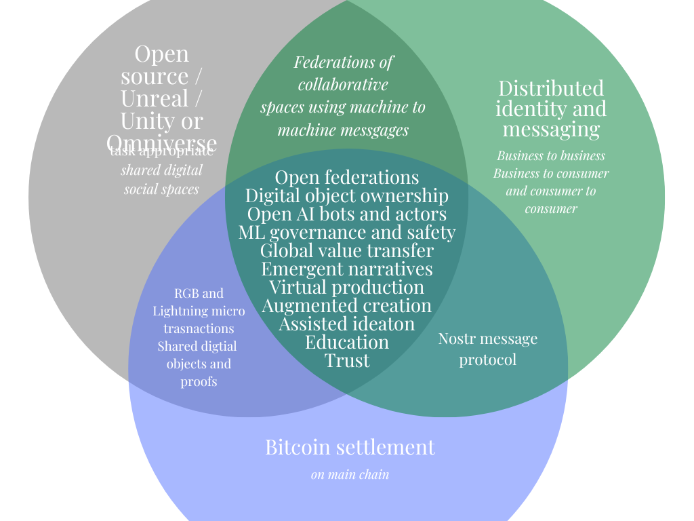
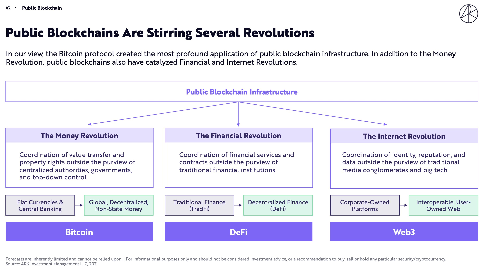
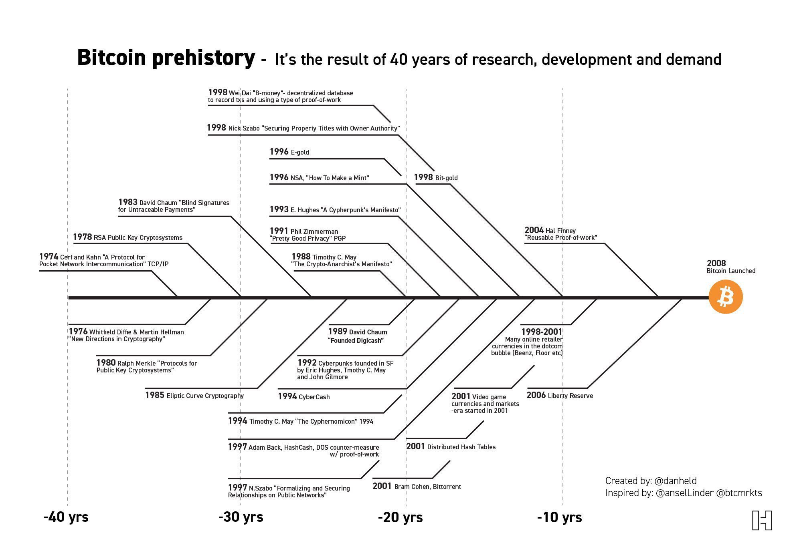
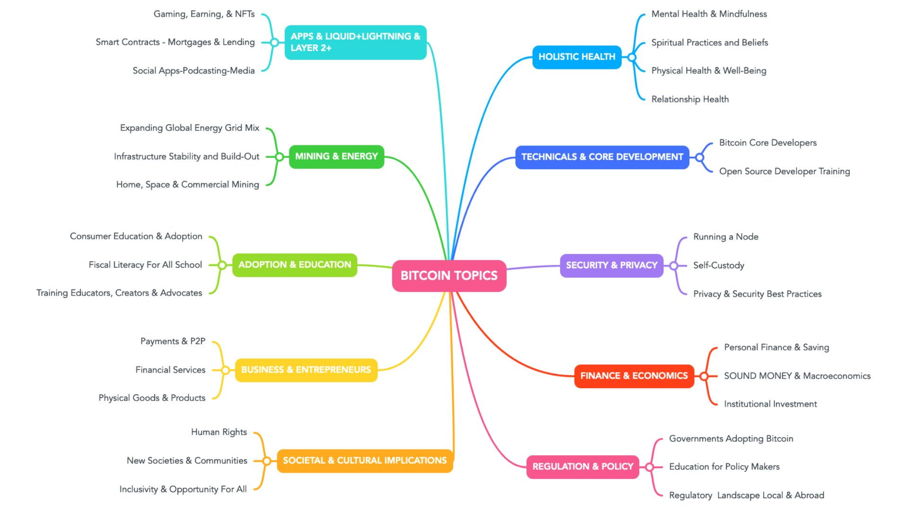
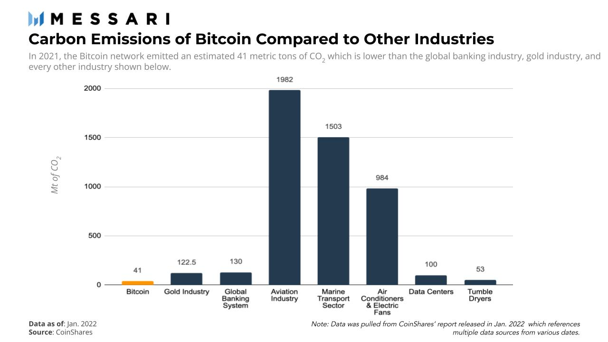
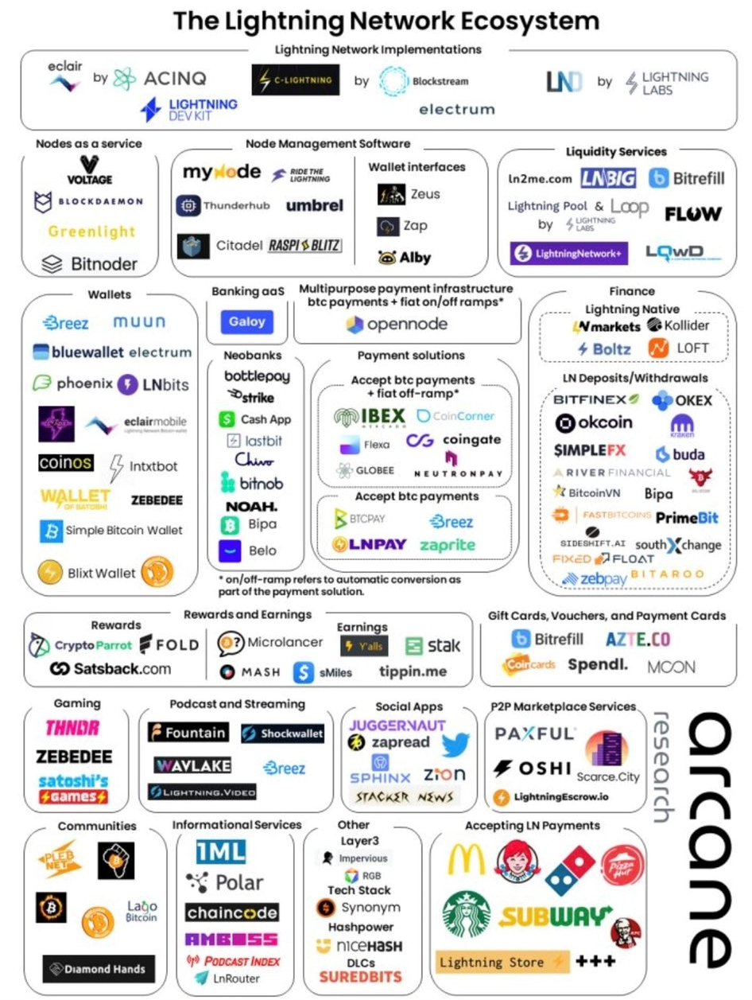
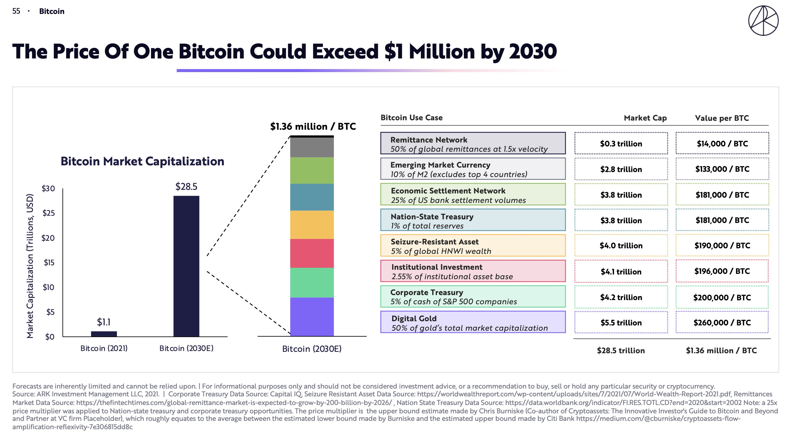
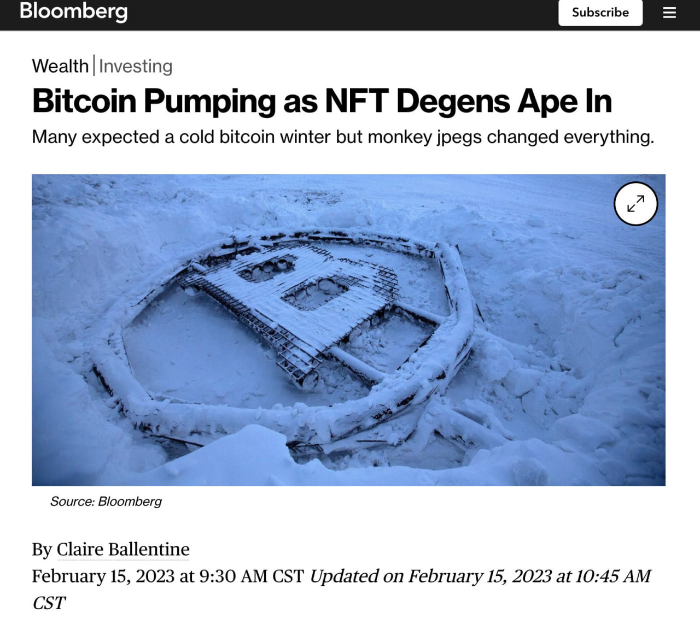

State of the art
================

Introduction
------------

### Overview

As human beings, we have always relied on certain social constructs to
guide our interactions and transactions with one another. Money and
trust are two such constructs that have played a vital role in shaping
our societies, and the way we live our lives. However, the digital age
has brought with it new challenges that are testing the foundations of
these social norms.

In a world where we are increasingly connected through the internet and
able to communicate with people from all corners of the globe, the
concept of money and trust is changing. Gone are the days of the village
structure in which we evolved, where personal relationships and
face-to-face interactions were ubiquitous. Now, we are faced with the
prospect of working and interacting one another, and also with
artificial intelligence actors that seem subjectively real, all while
navigating the complexities of a global mixed reality.

This transition to a more efficient and interconnected world has the
potential to bring about great benefits, but it also presents us with an
enormous challenge. The chaotic and intangible mix of value, trust,
socialisation, generative art, and AI chat actors, is not yet well
understood, and it will take time for us to adapt to this new way of
living and interacting with one another.

We initially wanted to explore exciting new developments in the
transmission of value, and trust, in ‘digital society’. The problem is
that each of these topics alone are enormously complex, and the
intersections seem to be more so. We have been researching the current
state-of-the-art, and the emerging consensus narrative, to try to figure
out how the collision of these technologies might serve our virtual
production workflows (Figure
<a href="#fig:vprobot" data-reference-type="ref" data-reference="fig:vprobot">7.7</a>).
As we worked on this research the Cambrian explosion of generative AI
added an incredibly important new strand to our investigation.

Over the course of a couple of years the focus of the work has
developed, and refined. Our tool-kit, as it stands, supports inclusive
human creativity and economic exchange, especially for emerging markets
and especially perhaps [Africa](https://www.afrobitcoin.org/). There is
a huge proportion of human creativity currently excluded from media
production pipelines due to gatekeepers of knowledge, access to identity
proofs, and financial infrastructure that is taken for granted in the
richer nations. This inclusion will be accomplished for the most part
through integration of open source machine learning and AI tools, but
this field quite new, and that part of the work is under developed.

<figure>
<figcaption>In camera VFX virtual production</figcaption>
</figure>

#### Why just business to business

Trust and safety (T&S) is crucially important for building ethical and
inclusive online communities, the landscape is fraught with complex
tradeoffs and challenges that make direct involvement difficult for
independent researchers and developers like us. As summarized in a
recent [Atlantic Council
report](https://www.atlanticcouncil.org/in-depth-research-reports/report/scaling-trust/),
T&S operates in a high-stakes environment driven by commercial
incentives that often conflict with safety objectives. Practitioners
face threats of trauma, burnout, and retaliation when enforcing
policies. The field itself lacks established standards, struggles to
quantify impact, and relies heavily on the judgement of private
companies.

-   Trust and safety (T&S) emerged as a field to govern risks in online
    communities. It became crucial as user-generated content platforms
    scaled.

-   The emergence of a professionalized T&S field creates opportunities
    for collaboration and innovation. But knowledge sharing, tooling,
    talent pipelines, and metrics need improvement. T&S practitioners,
    especially content moderators, face high risk of trauma. Their
    wellbeing requires urgent attention.

-   Systemic gaps exist around measuring T&S value, regulation’s impact
    on incentives, and the role of venture capital. Market failures
    drive under-investment.

-   Adjacent fields like academia, civil society, and media provide
    crucial external expertise but lack formal inclusion in T&S.

-   The gaming industry offers useful insights but has its own major T&S
    challenges.

-   Known harms will spread to new technologies, requiring adaptive
    solutions and proactive design.

-   Systemic gaps exist around measurement, regulation, and investment.
    Creative initiatives needed to realign incentives.

-   Philanthropy and government can help address systemic gaps through
    strategic programs and incentives.

-   T&S must balance competing goals like:

    -   Protecting rights vs mitigating harms

    -   Efficiency vs accuracy in enforcement

    -   Reviewer wellbeing vs review needs

    -   Centralized vs decentralized moderation

    -   Growth vs safety investments

    -   Internal process vs external expertise

    -   Reactive enforcement vs proactive design

As independent researchers focused on decentralized and generative
technologies, we believe the greatest value we can provide is advancing
capabilities that empower users and diversify governance models.
Directly mediating harms involves subjective tradeoffs we are not
comfortable imposing on others. Our goal is to expand possibilities for
human flourishing, while avoiding direct content moderation that
restricts expression based on our own limited perspectives. We aim to
enable solutions, not dictate them. As the report advocates, addressing
T&S issues requires a broad coalition encompassing civil society,
government, academia, and industry. We can make a positive contribution
through technology R&D, while leaving nuanced governance decisions to
more representative institutions. There are many valid ways to build a
more trustworthy web; given our background and values, we have chosen to
focus on expanding generativity rather than regulating spaces.

### Introduction

This book is a high level view of technologies and their potential
within the developing digital society narrative, focusing around the
transmission of value within and across immersive global networks, with
a further focus on the Bitcoin monetary network.

Cybersecurity is top of the list of concerns in the [EU digital society
strategy](https://digital-strategy.ec.europa.eu/en/policies), just ahead
of digital inclusion, so we started out with security best practices in
mind, and we tried to end the investigation with inclusion. We aimed to
support small and especially developing companies in our sector, giving
them a foot in the door on a global stage, without their costs
spiralling.

Fortunately, we discovered a wealth of carefully crafted open source
tools which can support this. [Open source
software](https://opensource.org/osd) is software that is available with
source code that can be modified and distributed by anyone. The model
extended into other creative works through things like the [Creative
Commons](https://creativecommons.org/licenses/) licenses, which is
itself an [‘open
standard’](https://open-stand.org/about-us/principles/). We will return
to these themes throughout the book, and both this text and the
supporting code are open source. This means that anyone can access, use,
and modify the source code for their own purposes. Open source software
is often developed and maintained by a community of volunteers. This
approach to software development allows for more collaboration and
innovation, as well as greater transparency and security. Many popular
software programs, such as the Linux operating system and the Apache web
server, are open source.

We have tried to assemble the tools we found, cogently, to deliver an
open source kit for experimentation, to curious technically individuals
and groups, and we have applied our own security knowledge on top of an
already first class set of tools. It’s certainly not production ready,
but it’s good enough to commit small amounts of money into, and
collaboration is welcomed.

Whilst researching, it seemed that every door we opened was full of
interesting and useful treats. What was supposed to be a short technical
paper quickly became a 400-page book, and a deployable virtual machine
stack, with a dozen different open source components in it.

This book supports the software stack, which supports anyone who thinks
this material might be useful. Below is a précis of the chapters of the
book, which will hopefully give an insight into what “this stuff” is.
The reader can decide to download the book and the system “How To”
guide. All of it can be contributed to on GitHub, all of it will be
developed forward, and none of it is really finished yet.

Chapter 1 starts with an introduction to the book which is about value
transmission, with distributed trust, in global digital society and
mixed reality systems.

Next is a summary of Web3, as it stands right now. Web3 is a complex
term that is cropping up far more in the technical press, so we wanted
explain what it might mean. It’s still pretty confusing. There are a
bunch of legacy explanations which are Web3.0 (note the ‘0’ there), but
these are withering on the vine. Then there’s the new VC funded, super
hyped, and potentially useless Web3 incarnations, which again cover a
slew of intersecting technologies. Note they dropped the zero to reboot
the brand! This doesn’t mean there’s nothing to see here. The
astonishing amount of [money and developer
talent](https://mirror.xyz/tr3butor.eth/AlZPMq_syymAoi8M1VVb2xES9Twj1OeetJbEE7EWhiw),
and the clear market hunger for things like NFTs (non-fungible tokens)
suggest that there’s a future for Web3, it’s just really unclear if this
is inherently valuable or just hype.

In the next chapter we took a look at blockchain, which is very
intersectional with Web3. Even on its own this is a complex emergent set
of disciplines. The blockchain chapter was especially interesting to
research. It turns out there’s a itlot of ways to get this technology
wrong. Even very appealing options on paper, turn out to have very shaky
foundations. There are valuable things here, but given the complexity
and scope, we decided to focus on the most promising of the technology
stacks; the Bitcoin network.

Even Bitcoin isn’t just Bitcoin any more. It’s a swarm of open source
tools which can (in theory) accomplish a great many things. These are
illustrated well in Figure
<a href="#fig:ecosystemmap" data-reference-type="ref" data-reference="fig:ecosystemmap">[fig:ecosystemmap]</a>.

These newer, ancillary elements to Bitcoin, are emergent right now. Some
of them won’t be around until next year, and it’s questionable whether
they will even work out. With that said we aren’t convinced by the value
proposition of of Ethereum, and there’s enough Bitcoin tooling for us to
cherry pick useful components. We map those forward into our metaverse
product.

The next chapter is about Money. In expanding our research on Bitcoin,
we found that it’s impossible to think about the tech without opening up
a whole line of questions about money itself. This is fine because we
set out to look at global value transfer for business. It’s not a
trivial subject though, and this section tries to overview why value and
Bitcoin are so enmeshed, then what other options there might be in the
end (because Bitcoin has kicked off a whole slew of global adoption
outside of itself). Chapter five extends this look at global money
systems and examines corruption, governance, and opportunities for
digital society to affect change and equality.

The distributed identity management, and trust chapter follows. Identity
management is important for digital society and potentially crucial to
metaverse applications which have a value transaction layer. It’s not an
easy section to write about, because there’s a lot of research, it’s not
our field, and finding the value and the right target audience has been
very difficult. It’s by no means clear that blockchain is the right tool
for this component, and newer cryptographic products are emerging. We
select an exciting emergent protocol called Nostr which we believe can
help us knit together many elements of digital society.

In chapter 7 we take another look at NFTs. It’s impossible to ignore
this stuff now. It’s fundamentally a bit broken, but there are probably
use cases, and the money and development attention it’s getting are
incredible. We try to navigate our hypothetical virtual production
partners through this as best we can.

We’re actually pretty excited about future versions of ‘digital assets’,
based around Bitcoin, because that allows us to keep just one software
stack, minimising the threat surface. We’ve mapped that forward into the
open source tools that we recommend.

Chapter 8 is a big one for us as it’s our research area prior to opening
up the Bitcoin box(es). Metaverse, or at least one of the current
definitions of metaverse, is just social interaction in mixed reality
(VR/AR/XR). We’ve been studying that for decades, so this section is
more academic and tries to boil down what we think is most important.
The choices we made here guided us toward the selection of free and open
source metaverse software.

We also take a look at the other definitions of ‘metaverse’ which are
doing the rounds on the web, try to unpick which is which, and what they
are for, and attempt to weave back together the best of both. This ends
up looking a bit like the Venn in Figure
<a href="#fig:landscapevenn" data-reference-type="ref" data-reference="fig:landscapevenn">[fig:landscapevenn]</a>,
where we have transmission of provable identity, non-fungible tokens
bearing value or data, distributed files, actual money (including
micropayments) and a social layer based on our best knowledge about
mixed reality. In the end we abandon the word metaverse and settle on
‘digital society’ as our preferred term.

Chapter 9 is a work in progress and looks at how the recent explosion in
generative art, and machine learning language models might help drive
equality and equity of access globally. Past this stage in the book we
get into the murky and half developed tail end, where we’re interfacing
with our design choices, and the stack which can be deployed into the
cloud.

#### The view of big business and governments

As adoption of these technologies increases it will be necessary for
people, and AI actors, to pass economic value between themselves. These
‘goods and services’ interactions, within the digital and virtual social
spaces should be underpinned by a trust system, which scales globally
and presents low friction. Current secure international payment rails
are poorly suited to such interactions; indeed it is likely with legacy
systems, that parties would be forced to leave the metaverse
application, and instead navigate their banking applications to exchange
value with overseas entities in a secure fashion. This might conceivably
take several days.

Fortunately, the whole landscape of money and [value transfer is
changing](https://www.omfif.org/futureofpayments2021/). Huge global
financial players are entering the space. HSBC have [just
bought](https://sandboxgame.medium.com/hsbc-to-become-the-first-global-financial-services-provider-to-enter-the-sandbox-c066e4f48163)
metaverse ‘land’ in The Sandbox, JP Morgan have [opened a
‘lounge’](https://www.forbes.com/sites/ronshevlin/2022/02/16/jpmorgan-opens-a-bank-branch-in-the-metaverse-but-its-not-for-what-you-think-its-for/?sh=2fbd1e90158d)
in another. The worlds largest hedge fund Bridgewater is stepping into
[acquisition of digital
assets](https://uk.finance.yahoo.com/news/bitcoin-latest-price-crypto-ray-dalio-bridgewater-investment-fund-ethereum-094946686.html),
and the world’s largest pension fund manager Blackrock [partnered with
crypto behemoth
Coinbase](https://blog.coinbase.com/coinbase-selected-by-blackrock-provide-aladdin-clients-access-to-crypto-trading-and-custody-via-b9e7144f313d)
and is adding these assets to their management engine (which manages
tens of trillions of dollars). America’s oldest bank [BNY
Mellon](https://www.bnymellon.com/emea/en/about-us/newsroom/press-release/bny-mellon-launches-new-digital-asset-custody-platform-130305.html),
and even the Nasdaq stock exchange are [offering service to
institutional
clients](https://www.nasdaq.com/articles/nasdaq-to-launch-institutional-bitcoin-crypto-custody-services%3A-report),
and Fidelity asset management are about to add [Bitcoin to their pension
plans](https://www.wsj.com/articles/fidelity-weighs-bitcoin-trading-on-brokerage-platform-11663008698),
and they have asserted their view that Bitcoin is [different, and more
meaningful](https://www.fidelitydigitalassets.com/sites/default/files/documents/bitcoin-first.pdf)
than the rest of the industry. Fidelity are also offering a [dedicated
metaverse tradable fund](), and considering more direct product
offerings through their retail investment engine. [Citigroup have a
minisite](https://www.citivelocity.com/citigps/metaverse-and-money/)
dedicated to “Metaverse and Money”. The front page of Goldman Sachs
recently says it all (Figure
<a href="#fig:goldmanFront" data-reference-type="ref" data-reference="fig:goldmanFront">1.2</a>).

<figure>
<figcaption>The landing page of global 
financial giant Goldman Sachs shows the hype.</figcaption>
</figure>

In Gartners [2022 hype cycle
report](https://www.itp.net/emergent-tech/gartner-says-nfts-metaverse-web3-will-expand-immersive-experiences)
one of their three “trend themes” says: it“The future of digital
experience is immersive. A collection of emerging technologies supports
such experiences through dynamic virtual representations, environments
and ecosystems of customers and people, as well as new modes of user
engagement. With these technologies, individuals can control their own
identities and data and experience virtual ecosystems that can be
integrated with digital currencies. These technologies help reach
customers in new ways to strengthen or open new revenue streams. The
technologies to watch that deliver evolving and expanding immersive
experiences are metaverse, non-fungible tokens (NFTs), super apps and
Web3, decentralized identity, digital humans, digital twin of the
customer and internal talent marketplaces.”

Of their recent investments KPMG global said: it“We’ve invested in a
strong cryptoassets practice and we will continue to enhance and build
on our capabilities across Decentralized Finance (DeFi), Non-Fungible
Tokens (NFTs) and the Metaverse, to name a few”. This is not to say that
all fund managers are so positive. PGIM who manage over a trillion
pounds globally have come out very strongly against the technology, with
a [slew of
reports](https://www.pgim.com/megatrends/cryptocurrency-investing/bitcoin?)
to warn off investors (Figure
<a href="#fig:pgim" data-reference-type="ref" data-reference="fig:pgim">1.3</a>).

<figure>
<figcaption>PGIM cite ‘digiconomist’, a prominent critic.</figcaption>
</figure>

It’s possible that for such huge organisations it makes better business
sense to take a punt on hype bubbles like this, than to do a proper due
diligence with a team of internal staff who understand their business.
These endorsements should be taken with a large pinch of salt. As [Alex
Johnson
says](https://newsletter.fintechtakes.com/p/metaverse-branches?s=r):
it“At some point in the future, it’s possible that the digital worlds
being built today will have aggregated sufficient user attention and
engagement that financial services companies will need to invest in the
metaverse as an acquisition and customer service channel. But we’re not
there yet. Until the metaverse is a little less empty, resist the
temptation to colonize it with branches and billboards.”

Meanwhile, Meta (ex Facebook) are launching their own [META Web3 and
metaverse](https://archive.ph/coyp2) token after abandoning Libre, their
global cryptocurrency. Libre became Diem, then was quietly acquired by
Silvergate bank, who likely integrated it into their SEN settlement
network. Following the collase of Silvergate the bank was sold on
without the SEN network, marking an ignominious end to the technology
which possibly started the the rush to central bank digital currencies.
[Google have formed a strategic
partnership](https://www.coinbase.com/blog/announcing-coinbase-google-cloud)
with Coinbase, and [recently
blogged](https://blog.youtube/inside-youtube/innovations-for-2022-at-youtube/):
it“Web3 also opens up new opportunities for creators. We believe new
technologies like blockchain and NFTs can allow creators to build deeper
relationships with their fans. Together, they’ll be able to collaborate
on new projects and make money in ways not previously possible. For
example, giving a verifiable way for fans to own unique videos, photos,
art, and even experiences from their favourite creators could be a
compelling prospect for creators and their audiences. There’s a lot to
consider in making sure we approach these new technologies responsibly,
but we think there’s incredible potential as well. Finally, we couldn’t
have a piece about innovation without touching on the metaverse! We’re
thinking big about how to make viewing more immersive. ”

It’s already the case that the recent bubble of [hype is
dwindling](https://www.forbes.com/sites/paultassi/2022/03/10/interest-in-nfts-and-the-metaverse-is-falling-fast/?),
but the enormous investment into teams and startups will potentially
bear fruit in the next couple of years, and this perhaps has
implications for small and medium-sized enterprises.

It’s fortunate timing for this book that the UK government has signalled
enthusiasm for so called ‘stablecoins’ at the same time that the Bitcoin
network is being upgraded to transmit these GBP equivalent tokens
around. This gives us a very good idea what it is we can build into our
application stack. In the UK the government has stated it’s ambition to
be a [global cryptoasset technology
hub](https://www.gov.uk/government/news/government-sets-out-plan-to-make-uk-a-global-cryptoasset-technology-hub),
and announced, then scrapped plans for the Royal Mint to issue a
(novelty) NFT. Fuller, Economic Secretary to the Treasury [said in a
speech](https://drive.google.com/file/d/19ZYKLeT-ds3TueTpqSM22MUqB4gmN_Pl/view):
it“We want to become the country of choice for those looking to create,
innovate and build in the crypto space \[...\] By making this country a
hospitable place for crypto technologies, we can attract investment,
generate new jobs, benefit from tax revenues, create a wave of ground
breaking new products and services, and bridge the current position of
UK financial services into a new era.”

Their outline plans for [‘robust
regulation’](https://www.gov.uk/government/news/uk-sets-out-plans-to-regulate-crypto-and-protect-consumers)
were published after these seemingly supportive moves, and with the
public consultation drawing to a close they have signalled their
willingness to differentiate from Europe [within a
year](https://www.cnbc.com/2023/04/18/britain-could-see-crypto-regulation-in-12-months-lawmaker-says.html).
Like the assertion by major global businesses it is too early to tell
how ‘sticky’ these claims are. Indeed the findings of a recent treasury
committee looking at the sector suggest that there is much work to do,
with [85% of
companies](https://committees.parliament.uk/committee/158/treasury-committee/news/175634/treasury-committee-85-of-crypto-firms-failed-to-meet-minimum-standards-according-to-fca/)
failing to comply with itexisting law. The UK legal system is clear in
it’s view that all crypto assets [are
‘property’](https://blockchain.bakermckenzie.com/2020/02/03/uk-court-confirms-bitcoins-status-as-property/).

A Law Commission consultation on “digital assets” [has proposed a new
**third category** of
property](https://s3-eu-west-2.amazonaws.com/lawcom-prod-storage-11jsxou24uy7q/uploads/2022/07/Digital-Assets-Summary-Paper-Law-Commission-1.pdf):
it

-   it is composed of data represented in an electronic medium,
    including in the form of computer code, electronic, digital or
    analogue signals;

-   it exists independently of persons and exists independently of the
    legal system;

-   it is rivalrous such that use by one prejudices the ability of
    others;

Consensus seems to be that this is a thorough paper, and demonstrates
strong knowledge of digital assets by the authors.

Gartner’s [hype cycle](https://en.wikipedia.org/wiki/Gartner_hype_cycle)
2022 features [Web3, distributed identity, NFTs, and
Metaverse](https://www.gartner.com/en/articles/what-s-new-in-the-2022-gartner-hype-cycle-for-emerging-technologies)
and can be seen in Figure
<a href="#fig:gartners" data-reference-type="ref" data-reference="fig:gartners">1.4</a>.

<figure>
<figcaption>The Gartners Hype Cycle for 2022.</figcaption>
</figure>

### Summary

With all this attention it seems timely to explore the potential of
recent technologies, which can address collaborative mixed reality
interactions in itbusiness to business (B2B), itbusiness to customer
(B2C), and the newer C2C (social commerce; itcreator to consumer,
customer to customer, consumer to consumer[@jones2008trust]).

This book seeks to overview and explain the available open source
technologies. It supports an open source [github
repository](https://github.com/flossverse/product) which enables SMEs to
access these emergent platforms and ecosystems. It aims to build toward
a minimum viable product for trust minimised transfer of value within a
social immersive space, but also across all internet connected devices.

Referencing is in two styles; academic works and books are numeric,
while opinion pieces, gray statistics, and pertinent news articles are
hyperlinked from the text. This hybrid style yields about twice the
citation density of a normal PhD thesis, which is a lot. For this reason
the normal blue hyperlink colour was eschewed in favour of a more
aesthetic “gray”.

Decentralisation & The Web
--------------------------

### Semantic web

The “semantic web” definition of Web3.0 has been somewhat overhauled by
other innovations in decentralised internet technologies, now evolving
toward the slightly different Web3 moniker. Tim Berners Lee (of WWW
fame) first mentioned the semantic web in 1999.[@semanticWeb]

“I have a dream for the Web \[in which computers\] become capable of
analyzing all the data on the Web – the content, links, and transactions
between people and computers. A "Semantic Web", which makes this
possible, has yet to emerge, but when it does, the day-to-day mechanisms
of trade, bureaucracy and our daily lives will be handled by machines
talking to machines. The "intelligent agents" people have touted for
ages will finally materialize.”

Attention developed around three core themes, ubiquitous availability
and searchability of data, intelligent search assistants, and highly
available end points such as phones, and ‘internet of things’ devices.
This is certainly manifesting in home devices, but few people think of
this as a Web3 revolution.

Since ratification of the standards by the [World Wide Web (W3C)
consortium](https://www.w3.org/standards/semanticweb/) it seems that
their imperative toward decentralisation has become lost. Instead, it
can be seen that Facebook, Amazon, Google, and Apple have a harmful
oligopoly on users data.[@costigan2018world] This is at odds with
Berners-Lee’s vision, and he has recently [spoken out about this
discrepancy](https://thenextweb.com/news/web-inventor-tim-berners-lee-screw-web3-my-decentralized-internet-doesnt-need-blockchain/),
and attempted to [refocus the
media](https://www.cnbc.com/2022/11/04/web-inventor-tim-berners-lee-wants-us-to-ignore-web3.html)
onto Web3.0.

It is worth taking a look at his software implementation called
[Solid](https://solidproject.org), which is far more mindful of the
sovereignty of user data.

“Solid is an exciting new project led by Prof. Tim Berners-Lee, inventor
of the World Wide Web, taking place at MIT. The project aims to
radically change the way Web applications work today, resulting in true
data ownership as well as improved privacy. Solid (derived from "social
linked data") is a proposed set of conventions and tools for building
decentralized social applications based on Linked Data principles. Solid
is modular and extensible and it relies as much as possible on existing
W3C standards and protocols.”

Excitement around this kind of differentiated trust model, hinted at in
ubiquitous availability of data (and implemented explicitly in Solid),
has led to exploration of different paths by cryptographers, and this
will be described later. For instance, one of the main developers of
Solid, [Carvelho](https://github.com/melvincarvalho/), is now a leading
developer and propotent of Nostr, another very interesting option which
will be described later. This technology space is prolific, but still
comparatively young and small.

### Spatial web

“The Spatial Web”, a blurring of the boundaries between digital and
geospatial physical objects, seems to have developed from the strands in
the original W3C scope around devices in the real world. It has been
concentrating around AR and VR but is being marketed and amplified with
the same references to availability of data (See Figure
<a href="#fig:deloitteSpatial" data-reference-type="ref" data-reference="fig:deloitteSpatial">2.1</a>
from a Deloitte accounting report). This too is finding little traction
in practice, though obviously the component technologies continue to
enjoy rapid development. Nonetheless, this interpretation of Web3
becomes valuable when examining Metaverse later.

[Deloitte Spatial Web
Overview](https://www2.deloitte.com/us/en/insights/topics/digital-transformation/web-3-0-technologies-in-business.html)
Reused with permission.

### Web3

More recently Web3 is [being
touted](https://trends.google.com/trends/explore?date=all&q=web3) as a
way to connect content creators directly to content consumers, without
centralised companies acting as gatekeepers of the data. It implies that
all users have a cryptographic key management system, to which they
attach metadata, that they make requirements of peers with whom they
communicate, and that they maintain trust ‘scores’ with peers.

It seems likely that this new model is less driven by a market need, and
more by the high availability of tools which allow this to happen (the
ecosystems described later). Add to this a social response to the
[collapse in trust of companies such as
Facebook](https://finance.yahoo.com/news/meta-facebook-worst-company-of-the-year-yahoo-finance-165345819.html)
and other [social media
platforms](https://reb00ted.org/tech/20220727-end-of-social-networking/)[@torok2017cascading]
(Figure
<a href="#fig:trustbarometer" data-reference-type="ref" data-reference="fig:trustbarometer">2.2</a>).
There is perhaps a wish by consumers to pass more of the economic
incentive to content creators, without the ‘rent seeking’ layer afforded
by businesses, and a healthy dose of mania driven market speculation.
[Edelman’s latest trust
report](https://www.edelman.co.uk/sites/g/files/aatuss301/files/2022-01/2022%20Edelman%20Trust%20Barometer_UK.pdf)
is shocking, finding that trust in all institutions has slumped recently
to all time lows, and their global survey found that: it“Nearly 6 in 10
say their default tendency is to distrust something until they see
evidence it is trustworthy. Another 64% say it’s now to a point where
people are incapable of having constructive and civil debates about
issues they disagree on. When distrust is the default – we lack the
ability to debate or collaborate.”

<figure>
<figcaption><a href="https://www.edelman.com/trust/2020-trust-barometer">Edelman 2020 trust barometer</a> [rights requested]</figcaption>
</figure>

#### Emerging consensus

The recent hype cycle ignored the legacy definitions described above and
instead focusing almost exclusively on Ethereum based peer-to-peer
projects. It can be seen that the description is somewhat in the eye of
the beholder.

It’s possible to frame this Ethereum Web3 as a hugely complex and
inefficient digital rights management system (DRM). DRM is something
that users of the internet are increasingly familiar and comfortable
with. It’s somewhat debatable whether decentralising this is worthwhile.
The thesis of the developers of the technology seems to be that without
it, control of ‘value’ will accrete over time, to one or more hegemonic
controlling entities. It’s a strong argument, but there is a
[substantial counter
argument](https://moxie.org/2022/01/07/web3-first-impressions.html)
emerging that users just don’t want this stuff. The nervousness of
legislators in the USA to the attempt by Facebook/Meta to enter this
peer-to-peer value transmission space is telling in terms of the
perception of who is driving Web3.

Throughout 2022 there was much furore on the internet over what Web3
might be, and who it ‘serves’. Enthusiasts feel that products such as
[Sign-In with
Ethereum](https://blog.spruceid.com/sign-in-with-ethereum-is-a-game-changer-part-1/)
(EIP-4361) might give users choice over their data sovereignty, and a
meme to this effect is seen in Figure
<a href="#fig:web1web2web3" data-reference-type="ref" data-reference="fig:web1web2web3">2.3</a>.
In practice though users are expecting to use badly written, buggy,
economically vulnerable ‘crypto’ wallets to log into websites. The
quality of this wallet software is improving of late with the so called
“wallet wars” seeing commerce grade offerings from Coinbase and shares
platform ‘Robinhood’. These two companies alone have over 100 million
users. It’s likely that these wallets will evolve to offer the full
spectrum of Web3 functionality. With that said it doesn’t seem to make
much sense yet on the face of it. There are in fact examples of the
technology completely failing at censorship resistance. Popular ‘Web3’
browser extension Metamask and NFT platform Opensea have both [recently
banned
countries](https://www.forbes.com/sites/stevenehrlich/2022/03/03/iranian-venezuela-users-abruptly-dropped-from-major-crypto-platforms-as-russian-sanctions-grow/?sh=22bcabc470b0)
in response to global sanction pressure. This failure to meaningfully
decentralise will be explored further in the distributed identity
section.

<figure>
<figcaption>A meme showing differing approached to logging in on a website.</figcaption>
</figure>

Of their 2022 [‘Big Ideas’
report](https://research.ark-invest.com/thank-you-big-ideas-2022?submissionGuid=0937b1ae-9e11-4b46-ae03-6cd8d2f8301b),
ARK investment LLC (who manage a $50B tech investment) [said the
following](https://www.ark-bigideas.com/2022/en/pages/download) (Figure
<a href="#fig:ARKWeb3" data-reference-type="ref" data-reference="fig:ARKWeb3">2.4</a>),
which connects some of the dots already mentioned, and leads us into the
next section which is Blockchain and Bitcoin:

it

“While many (with heavily vested interests) want to define all things
blockchain as web3 we believe that web3 is best understood as just 1 of
3 revolutions that the innovation of bitcoin has catalyzed.

-   The Money Revolution

-   The Financial Revolution

-   The Internet Revolution”

<figure>
<figcaption><a href="https://twitter.com/wintonARK/status/1486143239753060353">ARK slide on Web3.</a> Rights requested</figcaption>
</figure>

This new hyped push for Web3 is being driven by enormous venture capital
investment. A16Z are a [major
player](https://a16z.com/2022/01/07/9b-to-build-the-future/) in this new
landscape and have released their [ten
principles](https://a16z.com/2022/01/07/how-to-build-a-better-internet-10-principles-for-world-leaders-shaping-the-future-of-web3/)
for emergent Web3. Note here that A16Z are (like so many others)
probably a [house of
cards](https://twitter.com/coryklippsten/status/1592242420137148416).

-   Establish a clear vision to foster decentralized digital
    infrastructure

-   Embrace multi-stakeholder approaches to governance and regulation

-   Create targeted, risk-calibrated oversight regimes for different
    web3 activities

-   Foster innovation with composability, open source code, and the
    power of open communities

-   Broaden access to the economic benefits of the innovation economy

-   Unlock the potential of DAOs

-   Deploy web3 to further sustainability goals

-   Embrace the role of well-regulated stablecoins in financial
    inclusion and innovation

-   Collaborate with other nations to harmonize standards and regulatory
    frameworks

-   Provide clear, fair tax rules for the reporting of digital assets,
    and leverage technical solutions for tax compliance

This list seems targeted toward the coming regulatory landscape, and
could be considered at odds with the original tenants of an organically
emergent, decentralised internet. Indeed principles such as ‘furthering
sustainability goals’ seem downright incongruous. The community they
claim to wish to support here are openly critical of these major
institutional players and their motives, with even more pointed
criticisms [coming from outside of the
Web3](https://www.profgalloway.com/web3/). This book and lab steer well
clear of these companies and their applications.

Dante Disparte, chief strategy officer of ‘Circle’ venture capital, said
in testimony to a US senate hearing; that Web 1 was ‘read’, Web 2 was
‘read write’, and that Web 3 will ‘read write own’. The important
takeaway here is not so much this oft quoted elevator pitch for Web3,
but the fact that legislative bodies now consider this technology a
force which they need to be aware of and [potentially contend
with](https://a16z.com/2021/12/17/prediction-for-the-new-year-a-web3-midterm/).

Jeremy Allaire, again of Circle’, talks about the recent legislative
order in the USA as follows: it“this is a watershed moment for crypto,
digital assets, and Web 3, akin to the 1996/1997 whole of government
wakeup to the commercial internet. The U.S. seems to be taking on the
reality that digital assets represent one of the most significant
technologies and infrastructures for the 21st century; it’s rewarding to
see this from the WH after so many of us have been making the case for
9+ years.”

We will see in the following chapters that participation in this new
Web3 is contingent on owning cryptocurrencies. [It’s
estimated](https://www.finder.com/uk/cryptocurrency-statistics) that
about 6% of people in the UK own some cryptocurrency, with skews to both
younger demographics, and smaller holdings. The legislative landscape in
the UK is comparatively strict with
[questionable](https://uk.news.yahoo.com/perverse-impacts-anti-money-laundering-144239343.html)
“know your customer / anti money laundering” (KYC/AML) data collection
[mandated in
law](https://www.gov.uk/guidance/money-laundering-regulations-your-responsibilities).
Users of UK exchanges must provide a great deal of personal financial
information, and undertake to prove that the wallets they are
withdrawing to are their own. From the perspective of the UK SME it
seems this seriously limits the potential audience for new products.
Europe meanwhile has recently voted through even more restrictive
regulation, applying the “[transfer of funds
regulation](https://www.europarl.europa.eu/legislative-train/theme-an-economy-that-works-for-people/file-revision-of-the-regulation-on-transfers-of-funds)”
to all transactions coming out of exchanges, enforcing a database of all
addresses between companies, and reporting transactions above 1000 Euros
to authorities. They have narrowly avoided enforcing KYC on all
transfers to private wallets, but have capped transactions at 1000
Euros. The recent [“Markets in Crypto Assets
(MiCA)](https://www.consilium.europa.eu/en/press/press-releases/2022/06/30/digital-finance-agreement-reached-on-european-crypto-assets-regulation-mica/)
legislation imposes overheads that may make it harder for smaller
businesses in the sector to operate within the EU, but is has been
cautiously welcomed by established players (Figure
<a href="#fig:pitchbook" data-reference-type="ref" data-reference="fig:pitchbook">2.5</a>,
who have been hungry for clarity. It is certainly far short of the ‘ban’
seen in China, and the regulation be enforcement in the USA.

<figure>
<figcaption><a href="https://twitter.com/paddi_hansen/status/1655883224726241281">“Regulatory clarity attracts capital &amp; entrepreneurs from around the world.”</a></figcaption>
</figure>

-   European Parliament approved EU’s crypto assets framework, MiCA

-   Enforcement clock starts in June, with 12-18 months for rules to
    kick in

-   MiCA offers license tailored to crypto asset services and stablecoin
    issuers

-   Regulation refrains from covering decentralized finance or
    non-fungible tokens

-   Stablecoin issuer rules boost consumer confidence, potentially
    increasing institutional comfort

-   Transfer of Funds regulation passed, imposing stronger surveillance
    and identification requirements for crypto operators

-   Regulations described as world-first and end of Wild West era for
    crypto assets

-   MiCA represents a crucial step forward for crypto industry,
    providing comprehensive set of rules

-   Crypto firms must be licensed by the EU and comply with money
    laundering and terrorism finance safeguards to serve EU customers

-   Concerns about weakened privacy due to reporting standards in the
    name of customer safety and national security

-   Binance CEO supports MiCA, calling it a pragmatic solution

-   EU’s MiCA could become a global template for international companies

-   UK, now outside the EU, is setting similar stablecoin and crypto
    asset service rules

Germany is bringing forward legislation allowing the ‘tokenisation’ of
legacy instruments such as stocks, though it’s far from clear what the
value of this would be, except perhaps lowering risk for custodians. It
seems that this EU position has prompted the UK government to seize the
potential competitive advantage offered, and there will be more on this
later. Japan meanwhile has gone so far as to [make an
announcement](https://cointelegraph.com/news/japanese-prime-minister-says-gov-t-investment-in-digital-transformation-will-include-metaverse-nfts)
about supporting the technologies at a national level.

It’s a complex evolving narrative, and clearly contradictions are
common. Right now there seems little appeal for stepping into Web3. Into
the confusion, this book advances a narrow take, and toolset, which
might extract some value from the technologies, while maintaining a low
barrier to entry.

### Example applications

It’s handy here to get a feel for what this looks like. These aren’t
things that this book wishes to contribute to, or even have a firm
opinion on, they’re just representative of current activity in the
decentralised web space.

#### Veilid - A Peer-to-Peer Privacy Mesh Project

Veilid is an open-source, mobile-first, networked application framework
for building decentralized apps with networking, distributed data
storage, and built-in IP privacy without reliance on external services.

-   **Platforms**: Runs on Linux, Mac, Windows, Android, iOS, and in
    browsers via WASM. Bindings available in Rust, Dart, and other
    languages.

-   **Protocols**: Supports UDP, TCP, WebSockets. DNS only used briefly
    during bootstrap.

-   **Encryption**: Uses Ed25519, XChaCha20, BLAKE3 for end-to-end
    encryption and authentication.

-   **Storage**: Distributed hash table for data records close to node
    keys. Popular data replicated.

-   **Routing**: Nodes help each other connect. Routing based on node
    IDs. Private routing over encrypted hops.

-   **Goals**: Enable decentralized apps without reliance on centralized
    corporate systems.

Key features include strong cryptography, ability to run on a variety of
platforms, distributed and replicated data storage, and private routing
to provide IP privacy. The decentralized design aims to avoid issues
with centralized and corporate controlled systems.

#### Podcasting2.0

[Podcasting
2.0](https://medium.com/@everywheretrip/an-introduction-to-podcasting-2-0-3c4f61ea17f4)
leverages [RSS](https://www.rssboard.org/rss-specification) (the
original dissemination system for podcasts) and the Bitcoin Lightning
network, to enable so-called ‘[value for
value](https://www.youtube.com/watch?v=NO1aDZ6L4NQ&t=1123s)’
broadcasting. Subscribers use one of a variety of apps to stream
micro-transactions of Bitcoin directly to the content creators as they
listen to the podcast. No intermediate business takes a cut. Some
variation on this model exists, such as John Carvalho’s crowd funded
podcast “The Biz” which progressively unlocks more minutes for everyone
based on [crowd funded donations](https://thebiz.pro/about#crowdwall).

#### Crowd funding

At time of writing a [crowd funding
initiative](https://www.constitutiondao.com/) based around a digital
decentralised construct called a DAO (explained later in detail)
[managed to raise $46 million dollars to bid for a copy of the US
constitution](https://www.coindesk.com/business/2021/12/06/daos-and-the-next-crowdfunding-gold-rush/)
at Southerbys auction house. The attempt narrowly failed, but the press
[heralded this new era of “Web3” economic
might](https://www.coindesk.com/business/2021/12/09/what-kickstarter-going-decentralized-means-for-web-3/).
This model might be the only use for DAOs and is likely just a way to
avoid regulatory scrutiny. There is more detail on DAOs later.

#### Distributed exchanges

There are dozens of decentralised exchanges deployed on various
blockchains. These platforms allow users to trade back and forth between
various tokens (including ‘normal money’ stablecoins) and charge a fee
for doing so. They operate within the logic of the smart
contracts,[@szabo1997formalizing] within the distributed blockchains.
This makes them extremely hard to ban, and as a result they operate in a
legal grey area. At the extreme end of this is “distributed apps”
(dApps) and “Decentralised Finance” (DeFi) which allows users access to
complex financial instruments without legal or privacy constraints. DeFi
will be touched on briefly later.

This is a huge area, and of only limited interest to the topics expanded
in this book. It’s perhaps worth noting
[BitcoinDEX](https://bitcoin-dex.net/about/index.html), which runs in
JavaScript in a web browser. It is effectively uncensorable, [auditable
by the user](https://bitcoin-dex.net/tokens.js), and has no counter
party risk since it operates entirely in the Bitcoin network. It is
clearly an early prototype but manages this complex feature without the
more expressive logic of more ‘modern’ public blockchains.

#### NFT marketplaces

NFT markets are far more centralised services which match ‘owners’ of
digital assets with potential buyers. The concept is a staple of the
more recent interpretation of Web3, even though in practice these seem
to be centralised concerns. [Opensea](https://opensea.io/) claims to be
the largest decentralised NFT marketplace, but they have the ability to
[remove listings](https://thedefiant.io/sad-frogs-delisted-opensea/) in
response to legal challenges. This seems to fly in the face of Web3
principles. NFTs are currently a [deeply
flawed](https://tante.cc/2021/12/17/the-third-web/) technology but seem
likely to persist and will be covered later.

#### Non blockchain webs of trust

New products like Slashtags and Nostr (covered later) use a web of trust
decentralised peer-to-peer (ish) model which assigns metadata and trust
scores to ‘any’ data and connection, with a security model rooted in the
Bitcoin cryptographic ‘keys’ but crucially not the bitcoin network. This
makes it interoperable with bitcoin but not reliant upon it. In
principle this allows users to build complex networks of inherited trust
bi-directionally with their networks over time. Every connection to a
peer can be a new schema, with individual metadata managed by the user.
These are new and have low adoption at this time. The user controls the
source of the data and can allow them to be used by centralised
services. This flips the authentication and data management paradigm of
web around, putting the user in charge of their data. This is a familiar
concept to the DID/SSI communities (described later) but with
significant investment. As Slashtags and Nostr use keys as endpoints
they act as a web of naming and routing, bypassing the existing web
infrastructure of DNS. It is likely very complex to use in practice and
will be revisited later. Slashtags is being paired with the [Hypercore
protocol](https://hypercore-protocol.org/) for peer-to-peer data
sharing, more specifically the ‘hole punching’ capability of the
hypercore system which ensures connections through
firewalls[@ford2005peer]. The first application by the affiliated
Hyperdivision team is an open source peer-to-peer live video streaming
app called [Dazaar](https://dazaar.com/). Once again, it’s not clear yet
who wants or needs this bit-torrent style service.

#### Distributed DNS applications

There are many perceived problems with having centralised authorities
for overseeing the database which translates between human readable
internet names and the underlying machine-readable address notation. The
databases which manage this globally are already somewhat distributed,
and this distributed trust model is managed through a cryptographic
chain of trust called DNSSEC which is capped by a somewhat [bizarre key
ceremony](https://www.iana.org/dnssec/ceremonies) seen in Figure
<a href="#fig:dnssec" data-reference-type="ref" data-reference="fig:dnssec">2.6</a>.
The authority around naming is centralised in ICANN.

<figure>
<figcaption><a href="https://www.internetsociety.org/blog/2016/10/watch-live-today-dnssec-root-ksk-ceremony-at-1700-utc/">DNSSEC ceremony in a faraday cage</a></figcaption>
</figure>

There has been talk for many years about ‘properly’ distributing this
database using decentralised/blockchain
technologies[@karaarslan2018blockchain]. The nature of this problem
means that it either moves from control by ICANN, or it does not, and so
far it has not, but there are many attempted, and somewhat mature
attempts, at this difficult problem. Of these
[Namecoin](https://www.namecoin.org/) is the most prominent, and is a
fork of Bitcoin. The ubiquity of Bitcoin in such systems is perhaps
becoming apparent.

#### Impervious browser

It might be that the future of Web3 comes in the guise of integrated
suites such as the proposed [Impervious web
browser](https://newsletter.impervious.ai/impervious-browser-functionality-overview/).
They say that “without centralized intermediaries” it features:

-   Zoom, without Zoom.

-   Google Docs, without Google.

-   Medium, without Medium.

-   WhatsApp, without WhatsApp.

-   Payments, without banks.

-   Identity, without the state.

This is obviously leading marketing hype, and they’re already late for
their release deadline, but what they’re talking about here is an
integration of the components mentioned in this book. If they can get
critical mass around this browser then perhaps the Web3 market can be
kickstarted. CEO Chase Perkins has [recently
presented](https://www.youtube.com/watch?v=2J8v-TMygK8) on this.

### Web 4.0

The EU has released it’s [positional
thinking](https://ec.europa.eu/commission/presscorner/detail/en/ip_23_3718)
on Web 4. This has come pretty much out of nowhere but seems highly
relevant to us if it sticks. From the text: Here is the bullet point
list in LaTeX:

-   **Empowering people and reinforcing skills** to foster awareness,
    access to trustworthy information and build a talent pool of virtual
    world specialists. By the end of 2023, the Commission will promote
    the guiding principles for virtual worlds, put forward by the
    Citizens’ Panel; and will develop guidance for the general public
    thanks to a ‘Citizen toolbox’ by the first quarter of 2024. As
    specialists on virtual worlds are essential, the Commission will
    work with Member States to set up a talent pipeline and will support
    skills development, including for women and girls, through projects
    funded by the Digital Europe Programme, and for creators of digital
    content through the Creative Europe programme.

-   **Business: supporting a European Web 4.0 industrial ecosystem** to
    scale up excellence and address fragmentation. Currently, there is
    no EU ecosystem bringing together the different players of the value
    chain of virtual worlds and Web 4.0. The Commission has proposed a
    candidate Partnership on Virtual Worlds under Horizon Europe,
    possibly starting 2025, to foster excellence in research and develop
    an industrial and technological roadmap for virtual worlds. To
    foster innovation, the Commission will also support EU creators and
    media companies to test new creation tools, bring together
    developers and industrial users, and work with Member States to
    develop regulatory sandboxes for Web 4.0 and virtual worlds.

-   **Government: supporting societal progress and virtual public
    services** to leverage the opportunities virtual worlds can offer.
    The EU is already investing in major initiatives, such as
    Destination Earth (DestinE), Local Digital Twins for smart
    communities, or the European Digital Twin of the Ocean to allow
    researchers to advance science, industries to develop precision
    applications and public authorities to make informed public-policy
    decisions. The Commission is launching two new public flagships:
    “CitiVerse”, an immersive urban environment that can be used for
    city planning and management; and a European Virtual Human Twin,
    which will replicate the human body to support clinical decisions
    and personal treatment.

-   **Shaping global standards for open and interoperable virtual worlds
    and Web 4.0,** ensuring that they will not be dominated by a few big
    players. The Commission will engage with internet governance
    stakeholders around the world and will promote Web 4.0 standards in
    line with the EU’s vision and values.

### The common thread

One feature which persists throughout all of these interpretations of
Web3 is the need for decentralised trust. According to [Nathaniel
Whittemore](https://www.coindesk.com/podcasts/the-breakdown-with-nlw/yesterdays-hearing-was-cryptos-most-positive-interaction-with-the-us-government-ever/),
a journalist for Coindesk, “The Web3 moniker positions this industry in
opposition to big tech”. Alternatively the [many
detractors](https://cryptocriticscorner.com/) of the technology think it
simply provides avenues for incumbents to experiment with new [models of
control and
monetisation](https://www.cigionline.org/articles/amid-the-hype-over-web3-informed-skepticism-is-critical/),
[increasing systemic
risk](https://newsletters.theatlantic.com/galaxy-brain/624cb2ebdc551a00208c1524/crypto-bubble-web3-decentralized-finance/)
at no cost to themselves.

Overall then, perhaps the space is hype, and is certainly [rife with
scams](https://web3isgoinggreat.com/). Fully 24% of projects in 2022 are
[estimated to be
built](https://blog.chainalysis.com/reports/2022-crypto-pump-and-dump-schemes/)
as ‘pump and dump’ scams. The degree to which it even accomplishes
decentralised trust is highly debatable, and meanwhile the limited
numbers of Web3 and supporting crypto companies display lamentable cyber
security practice themselves, creating [honeypots of personal
data](https://www.coindesk.com/tag/data-breaches/) from users of the
ecosystem.

With that said the component parts necessary to deliver on the promise
**do** exist. If there is to be no central controlling party(s) as in
the Web 2 model then nothing can happen without a cryptographically
secure underpinning, allowing digital data to be passed around without a
prior arrangement.

The following chapter will describe how much has been done by computer
scientists over the past decades to support that. From this base layer
we also get the potential for secure and trust minimised identity
management. This nascent field of distributed identity management is
explained later. From distributed trust models we can see ‘trustless’
transmission of economic value. The ability to send value from one
person to another person or service without a third party.

This whole area is ‘crypto’, which is increasingly seeping into the
human consciousness, and saw an astonishing $30B of [capital investment
in 2021](https://docsend.com/view/nrvsuae85a4dx3jz) alone. At time of
writing the industry is an [over 1
trillion](https://www.coingecko.com/en) dollar market.

All the new crypto technologies circling the Web3 narrative are bound
tightly together, but there is currently very little meaningful value to
be seen.

The rest of this book will focus on the trust and value transfer
elements of this shift in internet technologies, and attempt to build a
case for it’s use in decentralised, open source, collaborative mixed
reality applications.

DLT, Blockchain, and Bitcoin
----------------------------

Distributed ledger technology (DLT) is a data structure distributed
across multiple managing stakeholders. A subset of DLT is blockchain,
which is a less efficient, immutable data structure with a slightly
different trust model. Rauchs et al. of the Cambridge Centre for
Alternative Finance provide a detailed taxonomy and conceptual
framework.[@rauchs2018distributed] It can be seen in their paper that
the definitions are somewhat unclear in literature.

DLT, and especially blockchain, are rapidly gaining ground in the public
imagination, within financial technology companies (FinTech), and in the
broader corporate world.

The technology and the global legislative response are somewhat
immature, and misapplications of both technologies are commonplace.

Distributed trust models emerged from cryptography research in the 1970s
when Merkle, Diffie, and Hellman at Stanford worked out how to [send
messages
online](https://medium.com/swlh/understanding-ec-diffie-hellman-9c07be338d4a)
without a trusted third party.[@diffie1976new; @merkle1978secure]

Soon after the 1980s saw the emergence of the cypherpunk activist
movement, as a reaction to the emerging surveillance
state,[@burnham1983rise; @chaum1985security] a topic which is expanded
for this moment in a later chapter. These early computer scientists in
the USA saw the intersectionality between information, computation,
economics, and personal freedom.[@lavoie1990prefatory] Online discussion
in the early nineties foresaw the emergence of trans-national digital
markets, what would become the WWW.[@salinCosts; @cypherPunkMailList]
The issues of privacy and the exchange of digital value (digital /
ecash) were of foremost importance within these discussions and while
privacy was within reach thanks to [“public/private key
pairs”](https://www.openpgp.org/about/history/), ecash proved to be a
more difficult problem.

Adam Back’s 1997 ‘hashcash’[@back2002hashcash] paved the way for later
work by implementing the concept of what would become ‘proof of
work.’[@dwork1992pricing; @jakobsson1999proofs] This was built upon by
Dai,[@dai1998b] Szabo,[@szabo1997formalizing]
Finney,[@callas1998openpgp] and Nakamoto amongst others. In all it took
16 years of collaboration on the mailing lists (and dozens of failed
attempts) to attack the problem of trust-minimised, distributed, digital
cash. The culmination of these attempts was Bitcoin.[@Nakamoto2008] This
is illustrated by Dan Held in Figure
<a href="#fig:prehistory" data-reference-type="ref" data-reference="fig:prehistory">3.1</a>.
This is now a wider ecosystem of technologies and societal challenges
(Figure
<a href="#fig:bitcointopics" data-reference-type="ref" data-reference="fig:bitcointopics">3.2</a>).

<figure>
<figcaption>Dan Held: <a href="https://www.danheld.com/blog/2019/1/6/planting-bitcoinsoil-34">Bitcoin prehistory</a> used with permission.</figcaption>
</figure>

<figure>
<figcaption><a href="https://twitter.com/djvalerieblove/status/1514703620272394243/photo/1">Bitcoin Topics</a> used with permission @djvalerieblove.</figcaption>
</figure>

There is enormous complexity and scope, as seen in Figure
<a href="#fig:venn" data-reference-type="ref" data-reference="fig:venn">[fig:venn]</a>,
and yet genuinely useful products are elusive.

It is surprisingly hard to pin down a simple explanation for the
features which define a blockchain. These “key takeaway” [from
Investopedia](https://www.investopedia.com/terms/b/blockchain.asp) are a
neat summary however.

it

-   Blockchain is a specific type of database.

-   It differs from a typical database in the way it stores information;
    blockchains store data in blocks that are then chained together.

-   As new data comes in it is entered into a fresh block. Once the
    block is [filled with data](https://bits.monospace.live/) it is
    chained onto the previous block, which makes the data chained
    together in chronological order.

-   Different types of information can be stored on a blockchain but the
    most common use so far has been as a ledger for transactions.

-   In Bitcoin’s case, blockchain is used in a decentralized way so that
    no single person or group has control—rather, all users collectively
    retain control.

-   Decentralized blockchains are “append only”. In effect this means
    that the data entered becomes irreversible over time. For Bitcoin,
    this means that simple economic transactions are permanently
    recorded and viewable to anyone.

In principle blockchains provide a **differentiated trust model**. With
a properly distributed system a blockchain can be considered
“trust-minimised”, though certainly not risk minimised. This is
important for some, but not all people. There is not much emboldening of
text within this book. If you start to question the whole reason for
this ‘global technology revolution’ then it always comes back to those
three words. Put more crispy it’s been hiding in plain sight since 20008
as ‘Magic Internet Money’. Perhaps the lack of a trusted third party,
and the potential for instant final settlement will be most important
for machine to machine (AI) systems, and that is the primary focus of
this book.

It can be argued that the whole concept of distributed cryptographic
blockchains is [somewhat
strained](https://www.trailofbits.com/reports/Unintended_Centralities_in_Distributed_Ledgers.pdf),
as the vast majority of the technology offerings are not distributed,
and worse, meaningful distribution may indeed be practically impossible
without a trusted third party.[@kwon2019impossibility] “There are many
scenarios where [traditional
databases](https://calpaterson.com/blockchain.html) should be used
instead”[@casino2019systematic].

### What’s this for sorry?

The proponents of blockchains argue, that in an era when data breaches
and corporate financial insolvency intersect with a collapse in trust of
institutions, it is perhaps useful to have an alternative model for
storage of data, and value. That seems like a lot of effort for a
questionable gain. It’s far more likely it’s simply speculation.

While writing this book the questions of ‘what is this itreally for and
how can it possibly be worth it’, came up again and again. In truth it’s
a very difficult question, without a clear enough answer. It’s beyond
the scope of this book to figure this out properly, but references to
advantages and disadvantages will be made throughout.

It seems that the engineers who created Bitcoin wanted very much to
solve a technical problem they saw with money (from their understanding
of it), and the transmission of money digitally. As the scale and scope
have increased so has the [narrative
evolved](https://medium.com/@nic__carter/visions-of-bitcoin-4b7b7cbcd24c)
as seen in Figure
<a href="#fig:Evolving" data-reference-type="ref" data-reference="fig:Evolving">[fig:Evolving]</a>,
but it’s never really kept pace with the level of the questions posed.

image

A cost benefit analysis that excludes speculative gains seems to fail
for pretty much all of blockchain/DLT. Bitcoin is more subtle as it
possibly itcan circumvent the legacy financial systems. This still
leaves huge questions. To quote others in the space, is Bitcoin now the
iceberg or the life raft?

For the most developed defence of the technology as it stands in from a
Western perspective, in this moment, Gladstein ([and
others](https://www.financialinclusion.tech/)) offer a vision for the
asset class, in the 87% of the world he says don’t have access to the
technology infrastructure benefits enjoyed by the developed
west[@gladsteincheck2022] (Figure
<a href="#fig:walledworld" data-reference-type="ref" data-reference="fig:walledworld">[fig:walledworld]</a>).

He points to Block and Wakefield Research’s report which finds those
living under financially oppressive regimes are the most optimistic
about the technology as in Figure
<a href="#fig:optimism" data-reference-type="ref" data-reference="fig:optimism">[fig:optimism]</a>.
This argument is suggestive of huge and untapped markets for services
which may be accessible to developed nations through
telepresence/metaverse interfaces, and which may increase equity of
access to opportunity elsewhere. To put some figures against this:

-   Nigeria has the highest number of crypto owners in the world in 2022
    with 45% of its population owning or using cryptocurrency.

-   Thailand occupies the second space with 44% of its population
    reported to be using or owning cryptocurrency.

-   Turkey has 40% of its population owning and using cryptocurrency in
    2022, equal to over 33 million people.

-   Argentina occupies the fourth position with an ownership and usage
    rate of 35% in 2022, representing almost 16 million people.

-   United Arab Emirates has 34% of the population owning or using
    cryptocurrency in 2022, representing almost 10 million people.

-   Philippines is ranked sixth with a 29% adoption rate.

Gladstein’s is a carefully developed and well researched book, but is
[written from the western
perspective](https://bitcoinmagazine.com/culture/imf-world-bank-repress-poor-countries)
of (just) Bitcoin ‘being the raft’. Later in this book we will consider
if it might be the iceberg, but this is not the domain expertise we
offer in this book. It is crucial to note that Gladstein has vociferous
detractors within Africa. It seems entirely possible he’s another
grifter as suggested by Kimani: it“Gladstein is a charlatan who makes
his living by selling the image of a global south that is corrupt,
entirely lacking in rational thinking and needing a saviour, like him to
swoop in and save us from our floundering selves. He exploits on tired
and unproven stereotypes, cherry picks data while ignoring mountains of
evidence that disprove him. Because he knows that as the perceived
“morally superior” “right thinking” western superior coming to save, he
will mostly go unchallenged. It’s a grift, an old grift that many like
him have turned into an industry. Where they earn tax free income by
selling a delusion and fetish to their western audience who need to
think the global south is a failure of the human experience. He is
trying to set himself up as some gate keeper and king maker in the
Global South. He knows that the next phase of growth is. So he wants to
make sure that westerners looking to invest in the global south see him
as some “expert” and ask for his unfounded opinions. People like him run
global morality extortion rings. How so? Simple: By purporting to know
and be the keeper of global south morality, he will use his words to
bless or curse your business, well, unless you make a generous donation
to his foundation. These are scare tactics employed by charlatans to run
tax-evading PR entities, thinly veiled as “human rights” organisations.
If you are not on his side, he will slander you and your organisation.
If you ensure you promote him and his ambitions, he anoints you as the
good guy! He is trying to play the role that the Vatican and other
corrupt religious organisations played in the 1800. Turning morality
into a commodity that can be purchased from his market place: We decide
who is good and who is bad and who can do business and who can’t. For a
“donation”. He is not the first and he will not be the last. It’s a
growing industry, driven by shrewd westerners who know that they can
sell racial stereotypes back home, but as long as they claim they are
the one’s helping or saving the coloured peoples from themselves.”

[Raoul Pal of
RealVision](https://dailyhodl.com/2022/05/04/crypto-winter-unlikely-as-astonishing-user-growth-dwarfs-internet-adoption-rate-macro-guru-raoul-pal/)
says: itCrypto adoption is now massively outperforming the internet.
It’s been growing at about 165% a year versus 85% for the internet for
the same period of time now. According to analytics company Chainalysis;
growth is fastest in the Middle east and North Africa (Figure
<a href="#fig:grow" data-reference-type="ref" data-reference="fig:grow">[fig:grow]</a>).

Thanks to a natural fit with strong encryption, and innate resistance to
censorship by external parties, these systems do lend themselves well to
‘borderless’ applications, and are somewhat resistant to global
regulation (for good or ill). Given the rates of adoption seen in
Figures
<a href="#fig:grow" data-reference-type="ref" data-reference="fig:grow">[fig:grow]</a>,
<a href="#fig:ownership" data-reference-type="ref" data-reference="fig:ownership">[fig:ownership]</a>,
<a href="#fig:userFigures" data-reference-type="ref" data-reference="fig:userFigures">[fig:userFigures]</a>,
and
<a href="#fig:euroInvest" data-reference-type="ref" data-reference="fig:euroInvest">[fig:euroInvest]</a>
it seems that this stuff is coming regardless of their usefulness to the
developed world. If we are to take this as a given then we can perhaps
logically infer that finding a use case for the technology is important,
somewhat irrespective of other arguments.

#### Machine to machine communication

A financial instrument which can pass rapidly from computer to computer,
AI agent to AI agent, and bounce around ‘in the cloud’ doing real work
and activity is where Bitcoin may possibly being to add real global
utility. This is such a new field, and better left for the AI section at
the end. This seed of an idea provides us a lever to explore for digital
society around the asset, and this will be the focus.

image

### A panoply of tech

Within DLT/blockchain there seem to be as many opinions on the value of
the technology as there are implementations. A host of well engineered
open source code repositories makes the cost of adoption relatively low.

There are thousands of different ‘chains’ and many more tokens which
represent value on them. A majority of these are code forks of earlier
projects. Most [are defunct](https://99bitcoins.com/deadcoins/) yet
still have some residual ‘value’ locked up in them as a function of
their ‘distributed’ tokens.

Because the space is comparatively new, subject to [scant
regulation](https://www.esma.europa.eu/press-news/consultations/call-evidence-dlt-pilot-regime),
and often open source, it is possible to clone a github, change a few
lines of code, and front it with a website in order to create ‘scams’,
and this happens frequently.[@golumbia2020cryptocurrency]

The following sections give an overview of the major strands of the
technology. First is Ethereum, mainly to discount it’s use for our
needs, and move on to more appealing options.

### Ethereum

Ethereum[@buterin2013ethereum] is the second most
[secure](https://www.crypto51.app/) public blockchain ([by about
50%](https://howmanyconfs.com/))[@sayeed2019assessing], and second most
valuable by [market capitalisation](https://coinmarketcap.com/) (though
this comparison is somewhat stretched). It is the natural connection
from Web3 to the rest of the book, so it will be considered first.

It is touted as ‘programmable money’. It, unlike bitcoin, is
([nearly](https://hackernoon.com/turing-completeness-and-the-ethereum-blockchain-c5a93b865c1a))
Turing complete,[@petzold2008annotated] able to run a [virtual
machine](https://ethereum.org/en/developers/docs/evm/) within the
distributed network (albeit slowly), and can therefore process complex
transactional contracts in the settlement of value. This has given rise
to the new field of ‘distributed finance’, or DeFi (described later),
alongside many interesting trust-minimised immutable ledger public
database ideas.

There are trade-offs and problems with Ethereum (Eth/Ether) which
currently increase the ‘participation floor’ and make the network far
less suitable for entry level business-to-business use. The ledger
itself being a computational engine, with write only properties, is
enormous. Specialist cloud hardware is required to run a full node (copy
of the ledger), and partial nodes are the norm. Many partial nodes are
run by one specialist cloud provider
([Infura](https://consensys.net/blog/news/why-infura-is-the-secret-weapon-of-ethereum-infrastructure/)),
which has recently been forced to [exclude
Venezuela](https://finance.yahoo.com/news/metamask-infura-block-certain-areas-173749914.html)
from the network. Network validators are [refusing to
process](https://mevwatch.info) addresses on an [OFAC sanction
list](https://home.treasury.gov/policy-issues/office-of-foreign-assets-control-sanctions-programs-and-information).
A staggering 58% runs on [Amazon AWS
servers](https://ethernodes.org/networkType/Hosting). Critics of the
project point to these vulnerabilities to outside influence as an
existential threat to the aims of the technology. If it can be censured,
then what advantage is there over the
[founders](https://protos.com/consensys-lawsuit-jpmorgan-owns-critical-ethereum-infrastructure/)
simply running a high speed database to the same purpose?

This is a function of the so called ‘scalability
trilema,’[@hafid2020scaling] in which it seems that only two features
from the list of decentralization, scalability or security can be chosen
for blockchains.[@bonneau2015sok]

Moreover the network is [centrally
controlled](https://bitcoinmagazine.com/technical/ethereum-is-coercive-bitcoin-is-not)
by its creator and the ‘miners’. There is a strong case to answer that
Eth is [neither
distributed](https://blog.mollywhite.net/blockchains-are-not-what-they-say/),
nor trustless, and in fact therefore fails to be differentiated from a
DLT, undermining some of it’s claims. The history of Ethereum is a
fascinating case study in human greed. By the time the whitepaper had
it’s first limited release, Bitcoin (covered next) had already passed
$1000 per token. This led to the creators ambitions for a ‘fair release’
of tokens being voted down by powerful funders, leading to the explosion
of similarly structured ‘pre-mined’ coins in the ICO craze, which
followed on the Ethereum network. Laura Shin is possibly the most
experienced journalist and author in the space and has covered this
crazy era in her book ‘The Cryptopians.’[@cryptopians] It’s a tough read
for the newcomer though, perhaps finish this primer first!

With that said there are many talented developers doing interesting work
on the platform, and innovation is fast paced. It is entirely normal for
technology projects to launch their distributed ledger idea on and
within the Ethereum network. These generate tradable ‘ERC-20’ tokens,
which can accrue value or demonstrate smart contract utility (based on
the [Solidity](https://soliditylang.org/) programming language). Because
the value locked and generated in the Ethereum platform comes not just
from the ETH token, but all the ERC technologies built upon it, there
are hundreds of billions of pounds ‘within’ the network. All of these
projects, and indeed the core technology of Ethereum are subject to
exploits and vulnerabilities and tens of billions of pounds have been
lost.[@chen2020survey] Most of this money is pure market speculation (as
is the case across blockchains). Many analysts cannot see this as
anything but a speculative bubble, with all the predictable crash yet to
come. This can be seen in the context of other bubbles in Figure
<a href="#fig:etherbubble" data-reference-type="ref" data-reference="fig:etherbubble">3.3</a>.
It seems that most of the projects in crypto more generally, but
certainly with ETH and the NFTs within it are a new kind of social
gambling, where online communities can reinforce groupthink around their
speculative choices. This idea that Ethereum is not a commodity, but
rather a security, built around promises of returns, is finding recent
favour in law. New York attorney general James has alleged that Ether is
a security in [court
proceedings](https://www.docdroid.net/Myyp0yz/kucoin-pdf#page=11), which
could have enormous consequences, potentially reversing the momentum the
asset had been enjoying as a commodity. Jason Lowery of MIT and US Space
Force [lays
out](https://twitter.com/JasonPLowery/status/1572275617344757760) a very
clear thesis on the difference between Natamoto consensus and most of
what followed as part of his PhD.[@Lowery2023] His explanation here is
proximal to why we focus on Bitcoin, and dismiss ‘proof of stake’
models, though Lowery himself has very serious detractors such as
Voskuil who has been working on these problems for a long
time[@voskuil2020cryptoeconomics]

it“The innovation behind PoW is precisely the fact that it **doesn’t**
rely exclusively on software (an abstraction) to keep the ledger
systemically secure, but instead incorporates real-world physics (watts)
to impose real-world physical constraints on people/computers who run
it. Stake is an abstraction. It is an imaginary way to describe the
complex emergent behaviour of a bunch of general-purpose state machines.
The state machines may physically exist, but the way you choose to
visualize the complex emergent behaviour of those machines is imaginary.
Satoshi didn’t couple control authority over ledger to abstract,
imaginary things like ‘stake’ or ‘coin’ precisely because these things
don’t physically exist. If they don’t physically exist, they are
incapable of imposing real-world physical costs on people seeking
control of ledger. The real-world physical cost of controlling the
ledger is what keeps control over the ledger decentralized. It is too
physically expensive (in watts) to gain and maintain centralized control
over the BTC ledger. In proof of stake, there is no physical cost of
gaining centralized control. Why? Because stake doesn’t physically
exist. So all it takes to gain centralized control is majority stake.
And once you have it (which, because of math, some combination of people
already do), you have it forever.

With all this said most of the [couple of million
people](https://www.statista.com/statistics/1266322/nft-user-number/)
who have used NFTs use Ethereum, and if this market of creators and
consumers is to be brought into a mixed reality space then they will
need a way to bring their objects with them.

<figure>
<figcaption>Ethereum is thought to look like a speculative bubble. Rights requested</figcaption>
</figure>

Such is the level of nefarious activity on these networks (within
Ethereum) that they have a poor reputation, and are difficult to audit,
launch, and maintain. The overriding problem of using a blockchain for
utility applications (rather than just as money) is that people can, and
will, simply lie for criminal purpose when entering data into the
ledger. It is far more likely that Ethereum is simply a speculative
bubble than any of the claims for utility being born out. Add to that
[Morgan Stanleys recent
assertion](https://advisor.morganstanley.com/daron.edwards/documents/field/d/da/daron-edwards/Cryptocurrency_201__What_is_Ethereum_.pdf)
that Ethereum is itself threatened by newer contender chains and it’s
future becomes unclear. The report correctly identifies that “High
transaction fees create scalability problems and threaten user demand.
High costs make Ethereum too expensive for small-value transactions.”.
It is this high cost of use that most excludes the ERC-20 networks from
our consideration.

#### Gas fees

Ethereum has a significant barrier to entry because of high fees to use
the network. The system is Turing complete; able to programatically
replicate any other computational system. This includes endless loops in
code, so it is trivial to lock up the computational bandwidth of the
whole system, in a smart contract commitment, through a web wallet.

To mitigate this existential ‘denial of service attack’ the ‘gas’ system
demands that users spend some of their locked up value to operate on the
network. In this way a transaction loop would quickly erode the
available gas and stop looping. As the popularity of the system has
grown, so too have the gas fees. It can [sometimes
cost](https://twitter.com/Blockworks_/status/1521071340517830657) over
£10,000 to do a single transaction, though it is typically a few tens of
pounds. Appallingly if the user pitches their mining fee offer too low,
then the money gets spent anyway! [A website](https://fees.wtf/#/) just
plucks random Ethereum addresses out of the aether to show you the level
of this expense for participants. People can even [buy
NFTs](https://opensea.io/collection/fees-wtf-nft?search[sortAscending]=false&search[sortBy]=PRICE)
of the worst examples of these, as ‘tokens’, wasting more money. This is
a huge problem for potential uses of the network.

#### Ether ultra hard money narrative

Part of the challenge Ethereum faces is wrapped up with it’s complex
token emission schedule. This is the rate at which tokens are generated
and ‘burnt’ or destroyed in the network. The total supply of tokens is
uncertain, and both emission and burn schedules are regularly tinkered
with by the project. The changes to the rate at which ETH are generated
can be seen in Figure
<a href="#fig:ethemission" data-reference-type="ref" data-reference="fig:ethemission">3.4</a>.

<figure>
<figcaption>The rate of token generation has changed unpredictably over time. Rights requested</figcaption>
</figure>

In addition, a recent upgrade (EIP-1559) results in tokens now being
burnt at a higher rate than they are produced, deliberately leading to a
diminishing supply. In theory this increases the value of each ETH on
the network at around 1% per year. It’s very complex, with impacts on
transaction fees, waiting time, and consensus security, as examined by
Liu at al..[@liu2022empirical] Additionally, there is now talk (by
[Butlerin](https://time.com/6158182/vitalik-buterin-ethereum-profile/),
the creator of Ethereum) of extending this burn mechanism [further into
the network](https://ethresear.ch/t/multidimensional-eip-1559/11651).

Ethereum was designed from the beginning to move to a ‘proof of stake’
model where token holders underpin network consensus through complex
automated voting systems based upon their token holding. This is now
called [Ethereum Consensus
Layer](https://blog.ethereum.org/2022/01/24/the-great-eth2-renaming/).
This recent ‘Merge’ upgrade has reduced the carbon footprint of the
network, a laudable thing, though it seems the GPUs and datacentres have
just gone on to be elsewhere. It has not lowered the cost to users nor
improved performance. As part of the switching roadmap users were asked
to lock up 32ETH tokens each (a substantial allocation of capital). In
total there are around 14 million of these tokens, and it is those users
who now control the network. This money is likely stuck on the network
until at least 2024, a significant delay wen compared to the original
promises.

This means that proof of stake has problems in that the majority owners
‘decide’ the truth of the chain to a degree, and must by design have the
ability to over-ride prior consensus choices. Remember that these users
are now trapped in their positions. Four major entities now control the
rules of the chain, and have already agreed to censor certain banned
addressees. Proof of stake is probably inherently
broken.[@poelstra2015stake] This has
[f](https://notes.ethereum.org/@djrtwo/risks-of-lsd)or malicious actors
who have sufficient control of the existing history of the chain,
[thought to be](https://twitter.com/MTorgin/status/1521433474820890624)
in the region of $50M.[@mackinga2022twap] Like much of the rest of
‘crypto’ the proposed changes will concentrate decisions and economic
rewards in the hands of major players, early investors, and incumbents.
This is a far cry from the stated aims of the technology. The move to
proof of stake has recently earned it the [MIT breakthrough technology
award](https://www.technologyreview.com/2022/02/23/1044960/proof-of-stake-cryptocurrency/),
despite not being complete (validators cannot yet sell their voting
stakes). It’s clearly a technology which is designed to innovate at the
expense of predictability. This might work out very well for the
platform, but right now the barrier to participation (in gas fees) is so
high that we do not intend for Ethereum to be in scope as a method for
value transfer within metaverses.

#### Inherent Weaknesses

Ethereum faces a unique dilemma, often overshadowed by its technological
capabilities. Unlike Bitcoin (BTC), which has solidified its role as a
stable and reliable store of value, Ethereum’s value proposition is more
complex and, ultimately, paradoxical. The following points elaborate on
this conundrum:

-   **Lack of Monetary Certainty:** Ethereum’s mutable supply schedule
    and governance model introduce a level of uncertainty not found in
    Bitcoin.

-   **Equity-like Characteristics:** Ethereum acts more like a share in
    a semi-decentralized corporation than a straightforward asset,
    deriving its value from expected future transaction fees.

These attributes lead to a value paradox that is two-fold:

-   **Fee Dilemma:** High transaction fees, while beneficial for
    Ethereum’s perceived value, deter usage and drive decentralized
    finance (DeFi) applications to other platforms.

-   **Scalability Trap:** Attempts to scale the platform and lower fees
    would, counterintuitively, reduce Ethereum’s intrinsic value by
    decreasing its future cash flows.

This presents a catch-22 situation where Ethereum’s value is
fundamentally limited by its own economic model. If the asset’s value
drops significantly, it could undermine the security of the entire
platform, making it less reliable for settling large transactions.

In the long run, this creates a feedback loop that could, theoretically,
push Ethereum’s value towards zero. This issue casts a shadow over
Ethereum’s long-term viability, presenting a challenge that goes beyond
mere technical scalability.

### Bitcoin

The first blockchain was the Bitcoin network,[@Nakamoto2008] some two
decades after Haber et al. first described the idea.[@haber1990time]
Prior to Bitcoin these structures were called
‘timechains.’[@nakamoto2018] It can be considered a triple entry book
keeping system,[@ijiri1986framework; @faccia2019accounting] the first of
it’s kind, integrating a ‘provable’ timestamp with a transaction ledger,
solving the “double spend
problem.”[@chohan2021double; @perez2019double; @grunspan2018double] Some
see this as the first major innovation in ledger technology since double
entry was codified in Venice in fourteen seventy
five[@sangster2015earliest].

It was created pseudonomously by an individual or group calling
themselves ‘Satoshi Nakamoto’ in 2009, as a direct response to the
perceived mishandling of the 2008 global financial
crisis,[@nakamoto2018] with the stated aim of challenging the status
quo, with an
[uncensorable](https://world.hey.com/dhh/i-was-wrong-we-need-crypto-587ccb03)
technology, to create a money which could not be [debased by inflation
policy](http://p2pfoundation.ning.com/forum/topics/bitcoin-open-source),
and outside of the [politically
captured](https://www.coindesk.com/layer2/2022/05/04/matt-taibbi-paypals-deplatforming-and-the-case-for-crypto/)
fintech incumbents. It’s interesting to note that the narrative around
the use case for Bitcoin has [shifted over it’s
lifetime](https://uncommoncore.co/visions-of-bitcoin-how-major-bitcoin-narratives-changed-over-time/).

The [“genesis block”](https://en.bitcoin.it/wiki/Genesis_block) which
was hard coded at the beginning of the ‘chain’ contains text from The
Times newpaper detailing the second bank bailout.

There will only ever be ([just short
of](https://blog.amberdata.io/why-the-bitcoin-supply-will-never-reach-21-million))
21 million bitcoins issued, of which around 19 million have already been
minted, and around 4 million lost forever. This ‘hard money’ absolute
scarcity is a strong component of the Bitcoin meme landscape. These are
basically arbitrary figures though; a combination of the issuance
schedule, and an [‘educated
guess’](https://plan99.net/~mike/satoshi-emails/thread1.html) by
Nakamoto:[@nakamoto2018]

it”My choice for the number of coins and distribution schedule was an
educated guess. It was a difficult choice, because once the network is
going it’s locked in and we’re stuck with it. I wanted to pick something
that would make prices similar to existing currencies, but without
knowing the future, that’s very hard. I ended up picking something in
the middle. If Bitcoin remains a small niche, it’ll be worth less per
unit than existing currencies. If you imagine it being used for some
fraction of world commerce, then there’s only going to be 21 million
coins for the whole world, so it would be worth much more per unit.”

Digital scarcity is incredibly important and is explained well by
software engineer Hillibrand in a podcast (this text is paraphased:
it“Digital scarcity is an interesting concept that was well explained by
German economist Guido Hülsmann in his book “The Ethics of Money
Production,”[@hulsmann2008ethics] published in 2007. Hülsmann stated
that an economic good that is defined entirely in terms of bits and
bytes is unlikely ever to be produced spontaneously on a free market,
and at the time, he was right. However, the emergence of Bitcoin would
soon prove that digital scarcity could indeed be achieved. Hülsmann
noted that an economic good must be scarce and rivalrous, meaning there
is a potential for conflict over who can utilize the resource. For
example, air is abundant but still considered scarce as its availability
can be limited in specific situations, leading to conflicts over its
use. The concept of digital scarcity is built on the idea that
information, which is fundamentally not scarce, can be made scarce
through specific mechanisms. Bitcoin, for instance, addresses the
double-spending problem, where a digital token could be spent more than
once, by establishing a decentralized network that prevents the same
coin from being used in multiple transactions. Nakamoto devised a system
that allows users to establish scarcity and rivalrousness in cyberspace
without relying on a single trusted third party. Instead of relying on a
central authority, like a government, to determine the validity of
transactions, Bitcoin relies on a network of computers known as “full
nodes” that verify and enforce a set of rules. This decentralized system
enables the creation of digital goods that are both scarce and
rivalrous, which was previously thought to be impossible.”

In theory there is no [barrier to
access](https://www.forbes.com/sites/peterizzo/2021/09/29/against-cryptocurrency-the-ethical-argument-for-bitcoin-maximalism/?),
and [equality of
opportunity](https://www.coindesk.com/layer2/2022/02/16/why-bitcoin-is-a-tool-for-social-justice/)
to accumulate and save over long periods. This is not true of chains and
tokens since, which lock up some of their value for seed investors to
cash out later. None of the blockchains since are decentralised in the
same way.[@selvam2021blockchain] Bitcoin was probably a [singular
event](https://danhedl.medium.com/bitcoins-distribution-was-fair-e2ef7bbbc892).

Each Bitcoin can be divided into 100 million satoshis (sats), so anyone
buying into Bitcoin can buy a thousandth of a pound, assuming they can
find someone willing to transact that with them.

Satoshi Nakamoto (the name of the publishing entity) [disappeared from
the
forums](https://bitcoinmagazine.com/technical/what-happened-when-bitcoin-creator-satoshi-nakamoto-disappeared)
forever in 2010. Bitcoin has the marks of cypherpunks and anarcho
capitalism. The IMF has recently conceded that the Bitcoin [poses a
risk](https://blogs.imf.org/2022/01/11/crypto-prices-move-more-in-sync-with-stocks-posing-new-risks/)
to the traditional financial systems, so it could be argued that it is
succeeding in this original aim.

Although there were some earlier experiments (hashcash, b-money etc),
Bitcoin is the first viably decentralised ‘cryptocurrency’; the network
is used to [store economic
value](https://www.aier.org/article/why-does-bitcoin-have-value/)
because it is judged to be secure and trusted. It is a singular event in
that it became established at scale, such that it could be seen to be a
fully distributed system, without a controlling entity. This is the
differentiated trust model previously mentioned. This relative security
is the specific unique selling point of the network. It is many times
more secure than all the networks which came after based on a like for
like comparison of [transaction
‘confirmations’](https://howmanyconfs.com/). This network effect of
Bitcoin is a compounding feature, attracting value through the security
of the system. It is deliberately more conservative and feature poor,
preferring instead to [add to it’s feature set](https://bips.xyz/)
slowly, preserving the integrity of the value invested in it over the
last decade. At time of writing it is a [top
quartile](https://fiatmarketcap.com/) largest global currency and has
settled over $13 trillion Dollars in 2021, though Makarov et al. contest
this, citing network overheads, and speculation.[@makarov2021blockchain]
Institution grade ‘exchange tradable funds’ which allow investment in
Bitcoin are available throughout the world, and the native asset can be
bought by the public easily through apps in all but a handful of
countries as seen in Figure
<a href="#fig:settled2021" data-reference-type="ref" data-reference="fig:settled2021">3.5</a>.

<figure>
<figcaption><a href="https://twitter.com/glxyresearch/status/1469039427028664320?">Growth in settlement</a> value on the Bitcoin network (Forbes).</figcaption>
</figure>

Only around 7 transactions per second can be settled on Bitcoin. The
native protocol does not scale well, and this is an inherent trade-off
as described by Croman et al. in their positioning paper on public
blockchains.[@croman2016scaling] Over time, competition for the limited
transaction bandwidth drives up the price to use the network. This
effectively prices out small transactions, even locking up some value
below what is a termed the ’[dust
limit](https://github.com/bitcoin/bitcoin/blob/v0.10.0rc3/src/primitives/transaction.h#L137)’
of unspent transactions too small to ever move
again.[@delgado2018analysis]

Bitcoin has developed quickly, with a [faster
adoption](https://phemex.com/blogs/crypto-bitcoin-s-curve-adoption-curve)
than even the internet itself. It is already a mature ecosystem, with
[enterprise grade software](https://www.fortris.com/) stacks, and is
seeing adoption as a [corporate treasury
asset](https://bitcointreasuries.net/).

Adoption by civil authorities is increasing, and legislators the world
over are being forced to [adopt a
position](https://www.politico.com/news/2022/01/16/bitcoin-crashes-the-midterms-527126).
California has an [explicitly Web 3 and blockchain executive
order](https://www.gov.ca.gov/2022/05/04/governor-newsom-signs-blockchain-executive-order-to-spur-responsible-web3-innovation-grow-jobs-and-protect-consumers/)
to invetigate and support opportunities. Many city treasuries have
[added
it](https://www.bloomberg.com/news/articles/2022-01-14/rio-de-janeiro-wants-to-become-brazil-s-cryptocurrency-capital)
to their balance sheet. Honduras [has
launched](https://www.reuters.com/world/americas/honduras-launches-bitcoin-valley-tourist-town-santa-lucia-2022-07-29/)
“Bitcoin Valley” as a tourist initiative, and the Swiss city of Lugano
is launching a [huge
initiative](https://twitter.com/Stadicus3000/status/1499656424422526977)
alongside Tether. It is already legal tender in the country of El
Salvador[@oxford2021salvador] and the [Central African
Republic](https://finance.yahoo.com/news/central-african-republic-passes-bill-180910797.html?),
and will be soon in [Madeira and Roatán
island](https://www.forbes.com/sites/ninabambysheva/2022/04/07/two-new-territories-are-adopting-bitcoin/?sh=7f014ed2499a).
This means it itmust be accepted as a means of payment, with uncertain
global political legal consequences.[@katterbauer2022impact] In places
such as Panama it simply has legal status and itcan be accepted without
double taxation.

Global asset manager “Fidelity” wrote the following in their [2021
trends
report](https://www.fidelitydigitalassets.com/articles/2021-trends-impact).
it“We also think there is very high stakes game theory at play here,
whereby if Bitcoin adoption increases, the countries that secure some
bitcoin today will be better off competitively than their peers.
Therefore, even if other countries do not believe in the investment
thesis or adoption of bitcoin, they will be forced to acquire some as a
form of insurance. In other words, a small cost can be paid today as a
hedge compared to a potentially much larger cost years in the future. We
therefore wouldn’t be surprised to see other sovereign nation states
acquire bitcoin in 2022 and perhaps even see a central bank make an
acquisition.”

#### The Bitcoin Network Software

There isn’t a single GitHub which can be considered the final arbiter of
the development direction, because it is a distributed community effort
with some [500
developers](https://decrypt.co/66740/who-are-the-fastest-growing-developer-communities-in-crypto)
out of a wider ‘crypto’ pool of around 9000 contributors (the vast
majority are spread across disparate Ethereum and some Solana projects).
[Development and innovation
continues](https://bitcoinops.org/en/newsletters/2021/12/22/) but there
is an emphasis on careful iteration to avoid damage to the network.
Visualisation of code commitments to the various open source software
repositories can be seen at [Bitpaint youtube
channel](https://www.youtube.com/channel/UC4DT4qudqogkmbqVAQy8eFg/videos)
and in Figure
<a href="#fig:gource" data-reference-type="ref" data-reference="fig:gource">[fig:gource]</a>.

[Bitcoin core](https://github.com/bitcoin/) is the main historical
effort (with around a dozen major contributors guiding the direction),
but there are alternatives ([LibBitcoin in
C++](https://github.com/libbitcoin/libbitcoin-node/wiki), [BTCD in
Go](https://github.com/btcsuite/btcd), and [BitcoinJ in
Java](https://bitcoinj.github.io/getting-started)), and as innovation on
layer one slows, attention is shifting to codebases which interact with
the base layer asset. Much more on these later.

#### Mining and Energy concerns

##### Mining process overview

Bitcoin mining is the process of adding public transactions into the
ledger, in return for two economic rewards, paid in Bitcoin. These are
the mining fee, and the block reward. The transactions which are added
into the next ‘block’ of the chain are selected preferentially based on
the fee they offer, which is up to the user trying to get their
transaction into the chain. This can be within the next 10 minutes (next
block), or a gamble out toward ’never’ depending how competitive the
network is at any time. Miners try to find a sufficiently low result
from a cryptographic hash function[@rogaway2004cryptographic](a random
process), and upon finding it, they can take their pre-prepared ‘block’
of transactions sourced from their local queue (mempool), and add it
into the chain, for confirmation by other miners. In return they take
all the fees within that mined block, and whatever the block reward is
at the time. When the network started the block reward was 50 Bitcoin,
but has [halved](https://ma.ttias.be/dissecting-code-bitcoin-halving/)
repeatedly every 210,000 blocks (four years) and now stands at 6.25 BTC.
The rate of mining is kept roughly at one block every 10 minutes, by a
difficulty adjustment every 2016 blocks (2 weeks). This in a complex
interdependent mechanism and is explained very well in [this
article](https://bitcoinmagazine.com/technical/how-mining-protects-the-bitcoin-network).
These components are explained in slightly more detail later.

##### Energy & policy response

Bitcoin uses a staggering amount of energy to secure the blockchain
(Figure
<a href="#fig:top500" data-reference-type="ref" data-reference="fig:top500">[fig:top500]</a>),
and this [has climate
repercussions](https://www.edmundconway.com/bitcoin-money-and-the-planet/).
A simple back of the envelope use of the [IEA total energy
supply](https://www.iea.org/reports/key-world-energy-statistics-2021/supply),
and the [Cambridge Bitcoin energy use](https://ccaf.io/cbeci/index)
estimate puts the network at [around
0.1%](https://www.wolframalpha.com/input?i=153+terawatt+hours+as+percentage+of+%28600+exa+joules+as+terrawatt+hours%29+)
of global energy use.

image

It is an [industrial
scale](https://www.ruetir.com/2022/03/18/riot-whinstone-the-bitcoin-farm-with-100000-computers-that-uses-excess-energy-from-an-oil-platform-to-mine-cryptocurrencies-ruetir/)
global business with ‘mining companies’ investing [hundreds of millions
of
pounds](https://ir.marathondh.com/news-events/press-releases/detail/1272/marathon-digital-holdings-bitcoin-mining-fleet-to-reach)
at a time in specialist
[ASIC](https://en.wikipedia.org/wiki/Application-specific_integrated_circuit)
mining hardware and facilities. The latest purpose designed Intel chip
[touts](https://www.intel.com/content/www/us/en/newsroom/opinion/thoughts-blockchain-custom-compute-group.html#gs.pd9ofu)
both Web3 and metaverse applications. This is “proof of work”, and is
essential to the technology, and is still thought by some to be the
[best available option](https://www.truthcoin.info/blog/pow-cheapest/).
The [Cambridge Bitcoin Energy Consumption
Index](https://ccaf.io/cbeci/index) monitors this energy usage. Their
[2022
report](https://www.jbs.cam.ac.uk/insight/2022/bitcoin-mining-new-data-reveal-a-surprising-resurgence/)
sees American mining leading globally. Even they have had a [terrible
time
recently](https://compassmining.io/education/the-worst-of-bitcoin-mining-in-2022/)
with many companies either failing or looking likely to.

At the end of 2022 it is thought to be the case that the only profitable
miners are the large scale companies who are also providing load
balancing services to energy companies. This is unusual in the history
of mining, and the situation will likely change over time. This is not
to say that all mining is, or should be, so concentrated. Anyone running
the hashing algorithm can [get
lucky](https://twitter.com/ckpooldev/status/1485585814419812356) and
claim the block reward. PoW ties the value of the ‘money’ component of
Bitcoin directly to energy production. This is not a new idea. Henry
Ford proposed an intimate tie between energy and money to create a
separation of powers from government, as can be seen in Figure
<a href="#fig:energyNYT" data-reference-type="ref" data-reference="fig:energyNYT">3.6</a>. 

<figure>
<figcaption><a href="https://www.nytimes.com/1921/12/06/archives/mr-fords-energy-dollar.html">Intimate tie between energy and money, Henry Ford</a></figcaption>
</figure>

The potential ecological footprint of the network has always been a
concern; Hal Finney himself was [thinking about this
issue](https://twitter.com/halfin/status/1153096538) with a mature
Bitcoin network as early as 2009, and [a
debate](https://satoshi.nakamotoinstitute.org/posts/bitcointalk/threads/167/#35)
on the Bitcoin mailing lists called the mining process
“thermodynamically perverse”. The most cited negative analysis on the
matter by Mora et al sees Bitcoin mining alone warming the planet above
2 degrees.[@mora2018bitcoin]

[Proponents of the technology](https://electricmoney.org/) say that the
balance shifted dramatically in 2021 with China outright banning the
technology; this has forced the bulk of the energy use [toward the
USA](https://docs.google.com/spreadsheets/d/1E7489rM7Q62oXwk1f4NUlMvok9noAbpYfTynY2VTyww/edit#gid=0),
and away from ‘dirty coal’ as seen in Figure
<a href="#fig:miningshare" data-reference-type="ref" data-reference="fig:miningshare">3.7</a>.

<figure>
<figcaption>Hash rate <a href="https://ccaf.io/cbeci/ining_map">suddenly migrates</a> from China [Reuse rights requested]</figcaption>
</figure>

Some adherents [have proposed
mitigations](https://docs.google.com/document/d/1N2N-5jY00cmteoY_puWI9oosM1foa4EQqsO1FFfIFR4/edit).[@cross2021greening]
As a worked example of [Cross and Bailey’s
proposal](https://docs.google.com/spreadsheets/d/15e_a-D3x4fv3tglEzFmQ6TLQx0fZe6-iKO9Fc9SyISQ/edit#gid=0)
a retail investor owning 1 BTC would have to buy around 700 shares of
‘CleanSpark’ mining company (CLSK) to make their [holding completely
neutral](https://docs.google.com/spreadsheets/d/1r32T8p_PHTP8S781u7PhPSwehLx2VcJTaJJKesMswD0/edit#gid=0).
Some more strident voices suggest that [‘ending financialisation’
through use of
Bitcoin](https://medium.com/@magusperivallon/a-financial-hail-mary-for-the-climate-an-argument-for-bitcoin-adoption-9c58e707d0)
may be net positive for the environment at a macro
level.[@bitcoinisvenice] Indeed it may [provide a
route](https://www.newsweek.com/bitcoin-mining-americas-most-misunderstood-industry-opinion-1669892)
to support [electrifying
everything](https://mobile.twitter.com/DSBatten/status/1514072998881665027)
through deployment of [flexible demand
load](https://lancium.com/solutions/). This enables a kind of
[‘financial
battery’](https://medium.com/@theendoftheworldpartyparty/deep-bitcarbonization-c8f483716ff7)
that can soak up excess capacity from overbuilt renewables (something
which needs to be done). Money saving uses like [drying
wood](https://www.theguardian.com/technology/2022/feb/09/can-bitcoin-be-sustainable-inside-the-norwegian-mine-that-also-dries-wood),
and even heating greenhouses ([ironically
tulips](https://www.euronews.com/next/2022/12/14/a-bitcoin-miner-and-tulip-grower-team-up-to-reduce-costs))
show the use case of the technology as a universal subsidy in heating
applications.

Some projects are using the financial incentive of Bitcoin to enable
trials of new infrastructure. For instance; Bhutan in the Himalayas has
been quietly (or secretly!) mining Bitocin for years and plans a [$500M
fund](https://www.straitstimes.com/business/bhutan-plans-a-500-million-fund-for-crypto-mining-in-the-himalayas)
to expand specifically Bitcoin mining. Makai Ocean engineering have
partnered with Oceanbit Hawaii to trail [‘ocean thermal energy
conversion’](https://en.wikipedia.org/wiki/Ocean_thermal_energy_conversion)
as a possible power source for the Islands. Local subsidy initiatives
may begin to [drive this kind of
adoption](https://fortune.com/2022/08/14/bitcoin-has-plunged-but-texas-miners-are-flush-with-profits-thanks-to-an-unusual-arrangement-the-state-is-paying-them-not-to-mine/)
as seems to be [happening in
Texas](https://braiins.com/blog/bitcoin-mining-the-grid-generators)[@griffith2021electrify; @ercotimpact2021; @Menati2022]
and [New
Hampshire](https://www.governor.nh.gov/sites/g/files/ehbemt336/files/inline-documents/sonh/cryptocurrencie-report.pdf).
Brad Jones, [interim CEO of the Texas grid
said](https://www.youtube.com/watch?v=gKnRfDeFgr0):

it“As we get more renewable generation, in particular wind \[which\] is
operating at night ... we have to find a home for it, otherwise we have
to turn the wind down. It’s such a great resource we shouldn’t turn it
down. Bitcoin mining or what some call crypto has found a way to come
into our markets and take some of that wind in off-peak periods. Then
when we get to peak period times they are very quick to remove
themselves from the market as prices increases The fact that we can turn
down whenever we need the power for other customers is fantastic. We can
use that crypto currency to soak up that excess generation when there’s
a lot of that, and find a home for more solar and more wind to come to
our grid. Then they reduce consumption when we need that power for other
customers. So it’s a great balancing act. Most other datacenters \[such
as\] Microsoft or Amazon have other customers to serve every other day,
so they can’t just turn off. But these crypto customers can. If the cost
of energy gets too high they can remove themselves from the market. They
are also helpful if we lose a generator. They can quickly respond to
that frequency disruption and allow us to balance our grid.”  
Flexible load balancing is entering the [mainstream news
cycle](https://www.forbes.com/sites/jemmagreen/2023/01/27/why-no-one-saw-the-success-of-demand-response-coming/?)
as and is gaining traction in legislative bodies. This [“global energy
market
revolution”](https://www.citadel21.com/bitcoin-is-the-first-global-market-for-electricity-and-will-unleash-renewables)
is explained by Tabatabai of Modo Energy. Incredibly Bitcoin mining in
Texas is now making the grid both more reliable and cheaper for
consumers. In the UK we have similar problems because wind power is not
evenly distributed, and moving it around is complex and expensive, and
the whole system needs smoothing out with [gas
plants](https://archy.deberker.com/the-uk-is-wasting-a-lot-of-wind-power/).

There is growing interest and adoption of so called [“stranded energy
mining”](https://www.bloomberg.com/news/articles/2022-06-01/oman-backs-u-s-firm-mining-crypto-to-cut-natural-gas-flaring)
which cannot be effectively transmitted to consumers, and is thereby
sold at a huge discount while also [developing power
capacity](https://www.renewableenergyworld.com/wind-power/900mw-wind-farm-to-power-bitcoin-mining-operation/),
without the [usual
constraints](https://batcoinz.com/the-renewable-energy-cannot-happen-without-bitcoin-mining%ef%bf%bc/).[@bastian2021hedging]
One such example is [“Gridless” in
Kenya](https://gridlesscompute.com/news/), which seeks to harness
abundant green energy resources in rural areas with the hope of
kick-starting economic growth. This feature of the network first came to
popular attention in 2020 when Stevens, CEO of Stoneridge capital
included the following text in a letter to shareholders within their
[annual
report](https://www.stoneridgefunds.com/documents/AnnualReport.pdf?v=4):
it“Bitcoin mining is the only profitable use of energy in human history
that does not need to be located near human settlement to operate. The
long-term implications of this are world changing and hiding in plain
sight.”

In addition to new build it is possible to [re-purpose
historic](https://www.curbed.com/2021/07/crypto-currency-mining-old-power-plants.html)
infrastructure, and/or [reducing the
carbon](https://www.bloomberg.com/news/articles/2022-03-24/exxon-considers-taking-gas-to-bitcoin-pilot-to-four-countries)
(or [more
interestingly](https://batcoinz.com/quantifying-the-potential-impact-of-bitcoin-mining-on-global-methane-emissions-4/)
the methane) of existing and [abandoned
infrastructure](https://www.axios.com/2023/01/27/crypto-mining-advocate-green-abandoned-gas-wells).
Both the [World Economic
Forum](https://www.weforum.org/videos/this-start-up-catches-waste-methane-to-power-data-centres),
and UK’s Department for Energy [have expressed
interest](https://www.contractsfinder.service.gov.uk/Notice/a99aa482-c7d1-4ec4-82fe-5c4b16827a6d)
in this use case. Adam Wright of [Vespene
Energy](https://vespene.energy/) says: it“You could either mine Bitcoin
on one small landfill for a year, or you could plant 5 million trees and
let them grow for 10 years - both of those are going to have the same
environmental impact.”

<figure>
<figcaption><a href="https://twitter.com/DSBatten/status/1566735902617276416">Climate tech investor Daniel Batten asserts that methane capture could highly impactful</a></figcaption>
</figure>

Cheikosman, a policy analyst for the World Economic Forum (somewhat
surprisingly)
[wrote](https://www.weforum.org/agenda/2022/03/crypto-energy-consumption/?)
it“Crypto is becoming an essential part of developing a carbon-neutral
energy grid and has made it economically viable to invest in, develop
and build renewable energy power generation.” This is explored in detail
by Ibanez et al.[@ibanez2023sok]

The most cited example of building capacity before grid connection is El
Salvador’s ‘volcano mining’ proposal, which is supporting their national
power infrastructure plans. Uzbekistan seems to be promoting a [similar
model](https://www.reuters.com/business/finance/uzbekistan-legalises-solar-powered-crypto-mining-2022-05-04/)
with zero tax provided the Bitcoin mining companies build out their own
solar infrastructure. A more poignant example is the [Mechanicville
hydro plant in the
USA](https://www.timesunion.com/news/article/Mechanicville-hydro-plant-gets-new-life-16299115.php).
The refurbishment of this 123 year old power plant is being funded by
Bitcoin mining. This is the [“buyer of last
resort”](https://www.lynalden.com/bitcoin-energy/) model first [advanced
by Square Inc](https://squareup.com/us/en/press/bcei-white-paper).

Conversely it might be that vertical integration of Bitcoin mining
[within legacy fossil fuel
stations](https://bitcoinmagazine.com/business/oil-companies-partner-with-bitcoin-miners)
gives them a new lease of life. New York State has dealt with this kind
of threat by imposing a moratorium on new, fossil fuel powered mining
activity. On a global stage something as portable and industrial as
Bitcoin mining will have unintended impacts on fragile energy systems,
as has happened in [South
Ossetia](https://ceobs.org/environmental-governance-in-frozen-conflicts/)
and
[Kazakhstan](https://restofworld.org/2022/crypto-miners-fleeing-kazakhstan/)
(note [Russia has stepped into
this](https://thenewscrypto.com/kazakhstans-crypto-miners-to-acquire-electricity-from-russia/)
mess). Undeniably the [consensus
position](https://time.com/6193004/crypto-climate-impact-facts/) is that
it’s overall very negative, (with some caveats) and this will itprobably
persist. Perhaps though if it’s happening anyway, then finding utility
of the asset might mitigate the net harm.

More pragmatically, Baur and Oll found that it“Bitcoin investments can
be less carbon intensive than standard equity investments and thus
reduce the total carbon footprint of a portfolio.”[@baur2021bitcoin].
Perhaps of note for the near future is that KPMG whose investment was
mentioned in the introduction also matched their position in the space
with equivalent carbon offsets. This may provide an investment and
growth model for others.

The first US-based [nuclear-powered Bitcoin mining
facility](https://www.businesswire.com/news/home/20230305005096/en/TeraWulf-Announces-Energization-and-Rapid-Deployment-of-Mining-Operations-at-the-Nautilus-Facility-in-Pennsylvania)
has just opened in Pennsylvania. The facility has been completed by
Cumulus Data, a subsidiary of independent power producer Talon Energy.
Talon Energy owns the adjacent 2.5 GW Nuclear Power Plant and has been
dabbling in Bitcoin mining for some time, opening a zero carbon Bitcoin
mining facility in collaboration with Terawolf in August 2021. The new
facility will operate with a maximum capacity of 48 MW, drawing on
excess power from the nuclear plant. By locating the mining facility on
the combined 1200 acre campus, there is no intermediation by legacy
electric transmission and distribution utilities, as the mining is
directly connected to the power station. Cumulus Data is in the process
of building two additional 48 MW facilities and has identified 18
additional Talon Energy sites with potential to host data centres
directly connected to electricity generation infrastructure. In general,
there is a shift in attitudes towards nuclear in the US. The enormous
benefit to this model stems from the cots associated with scaling down
atomic power output to match grid requirements. By co-locating in this
way the reactor can work at highest efficiency all the time, and can
earn money from the generation of Bitcoin when the grid is unable to
accept the energy. It is increasingly possible to find excited talk
about funding smaller more pragmatic nuclear power plants using the cost
benefits of the Bitcoin mining model, though this remains untested.

The power commitment to the network is variously projected [to
increase](https://www.nature.com/articles/s41558-018-0321-8), or [level
off over
time](https://assets.website-files.com/614e11526f6630959fc98679/616df63a27a7ec339f5e6a80_NYDIG-BitcoinNetZero_SML.pdf).
The emission schedule of the code suggests that the energy usage will
decrease exponentially over time, and indeed many analysts feel that it
has peaked due to a combination of factors. It’s one of the maddening
unknowns of the technology how this will all pan out. The [industry now
argues](https://www.forbes.com/sites/martinrivers/2022/04/03/is-bitcoin-really-that-bad-for-the-environment/?sh=6a3203427143)
that economic pressures mean that most of the ‘hashrate’ is [generated
by renewable
energy](https://bitcoinminingcouncil.com/q4-bitcoin-mining-council-survey-confirms-sustainable-power-mix-and-technological-efficiency/)[@blandin20203rd].
As a recent example of this trend Telsa (Elon Musk), Block (Twitters
Jack Dorsey), and Blockstream (Adam Back) are teaming up to [mine with
solar
energy](https://www.cnbc.com/2022/04/08/tesla-block-blockstream-to-mine-bitcoin-off-solar-power-in-texas.html)
in Texas.

Paez and Cross [prepared a
paper](https://uploads-ssl.webflow.com/627aa615676bdd1d47ec97d4/62f41b9ce54e014f9869efa7_OSTP.docx.pdf)
for the White House Office of Science and Technology Policy, submitted
through the Bitcoin Policy Institute, which is a growing thinktank for
academics and industry leaders. Their summary points echo the assertions
made here, but they provide rich additional referencing for those who
wish to dig deeper into this:  
it

-   Bitcoin’s value—its economic value and promotion of American values
    and American national interests—must frame any discussion of its
    environmental impact.

-   Bitcoin’s value is inherently tied to its consensus mechanism: proof
    of work.

-   While bitcoin mining is energy-intensive, its energy use is often
    overestimated and improperly characterized as a function of
    transaction volume.

-   Due to bitcoin’s exponentially decreasing schedule of issuance,
    mining’s actual emissions are likely to peak at under 1% of global
    emissions, even if prices rise more than tenfold within the decade.

-   Mining’s profile as a consumer of energy is unique: extremely
    cost-sensitive, and invariant across times and locations.

-   Bitcoin mining, as a buyer of first and last resort, incentivizes
    the buildout of renewable power production. As a controllable load
    resource (CLR) bitcoin mining also strengthens the grid, allowing it
    to reliably function at a high level of renewable penetration.

-   Mining’s energy use is increasingly non-rival, trending towards a
    diet of renewables andstranded, wasted energy resources such as
    flared methane.

[The debate](https://www.youtube.com/watch?v=6LP8G-oZnEs) whether this
consumption is ‘worth’ it is
[complex](https://www.utilitydive.com/news/bitcoin-mining-as-a-grid-resource-its-complicated/617896/)
and [rapidly
evolving](https://www.aei.org/technology-and-innovation/no-hearing-on-bitcoins-energy-use-is-complete-without-nic-carter/).
Useful examples of this are:

-   the [online
    pushback](https://www.zerohedge.com/crypto/questionable-ethics-anti-bitcoin-esg-junk-science)
    to an academic article by PhD candidate de Vries et
    al.[@de2022revisiting]

-   the assertion that the widely cited Mora er al. paper in
    Nature[@mora2018bitcoin] was based on an [undergraduate class
    discussion](https://twitter.com/NateHawaii/status/1460706785216450560),
    and has had an outsized effect on global policy.

-   a [paper from the Bitcoin Policy
    Institute](https://rebrand.ly/v8qq1sx),

-   and the industry [open letter to the
    EPA](https://bitcoinminingcouncil.com/wp-content/uploads/2022/05/Bitcoin_Letter_to_the_Environmental_Protection_Agency.pdf).

-   this well considered [Twitter
    thread](https://twitter.com/jyn_urso/status/1508899761319038983) by
    climate scientist Margot Paez.

It is somewhat confusing that positive views are coming only from
diverse and non-specialist voices in the community, and never the
academic community, but the shortcomings they point out in the
supposedly considered articles such as Mora et al[@mora2018bitcoin] are
easily verified. Academia seems [poorly
positioned](https://bitcoinmagazine.com/culture/bitcoin-could-never-be-invented-in-a-university)
to pivot to this subject, as an ethical bar has to be established before
research can commence, and the field is too new to make this an
affordable task. This stuff is existentially important to the whole
technology. Is a trillion dollar asset which [potentially
replaces](https://www.theheldreport.com/p/bitcoin-vs-gold) the money
utility of gold, but doesn’t need to be stored under guard in vaults
(Figure
<a href="#fig:goldmanVgold" data-reference-type="ref" data-reference="fig:goldmanVgold">3.9</a>),
worth the equivalent power consumption of clothes dryers in North
America? Probably not with the current level of adoption, but this is an
experiment in replacing global money. If that were to happen then
Bitcoin would be around 50 times more efficient than the current system
according to Khazzaka.[@khazzaka2022bitcoin] To be clear it’s not the
position of this book that replacing Fiat money is a good idea, but the
experiment is being run regardless. This is explored in it’s own chapter
later.

It seems possible that eight value propositions are therefore emerging:

-   Bitcoin the speculative asset (or greater fool
    bubble[@de1990positive]). Nations such as the USA, who own 30% of
    the asset have bid up the price of the tokens during a period of
    very cheap money, and this has led to a high valuation for the
    tokens, with a commensurately high network security through the hash
    rate (mining). This could be a speculative bubble, with the asset
    shifting to one of the other valuations below. There is more on this
    subject in the money section later.

-   Bitcoin the (human) monetary network, and ‘emerging market’ value
    transfer mechanism. This will be most useful for Africa (especially
    Nigeria), India, and South America. There is no sense of the “value”
    of this network at this time, but it’s the aspect we need for our
    collaborative mixed reality application. For this use the price must
    simply be high enough to ensure that mining viably secures the
    network. This security floor is unfortunately a ‘known unknown’. If
    a global Bitcoin monetary axis evolves (as in the Money chapter
    later) the network would certainly require a higher rate than
    currently, suggestive of a higher price of token to ensure
    mining.[@Wouters2022]

-   Bitcoin as an autonomous AI monetary network. In an era where AI
    actors perform tasks on behalf of humans in digital realms such as
    cyberspace, these AI actors will require a reliable and efficient
    means of transaction. AI agents can perform, transact and negotiate,
    and execute work contracts in near real-time. For this use, the
    primary requirement is not a high token price, but rather a high
    level of network security and scalability that can support an
    enormous volume of transactions. The Lightning Network of Bitcoin
    might be a starting point but the robustness of the system, against
    potential AI exploits, is yet to be confirmed. As AI systems become
    more complex and autonomous, there is an increasing need for
    decentralized AI governance mechanisms that can prevent the
    concentration of power and ensure ethical AI development and
    deployment. Bitcoin can serve as a basis for this, providing a
    decentralized, transparent, and immutable record of AI decisions and
    actions. Furthermore, Bitcoin’s proof-of-work consensus mechanism
    could potentially be adapted to enforce AI adherence to agreed-upon
    rules or norms. In this context, Bitcoin’s value extends beyond its
    token price and into its potential contributions to AI governance
    and ethics. This is Bitcoin as an AI economy.

-   Bitcoin as a hedge against future quantum computation. It has been
    argued that the advent of quantum computers could threaten the
    security of many existing cryptographic systems. Bitcoin’s
    open-source nature allows for the integration of post-quantum
    cryptographic algorithms, safeguarding it against quantum threats.
    In this sense, investment in Bitcoin might also be seen as an
    investment in a future-proof monetary network. This assertion
    depends on the assumption that Bitcoin’s protocol will adapt in time
    to incorporate such cryptographic advances before quantum computing
    becomes a real threat to its integrity. The practical implementation
    of these technologies might see a shift in the network’s dynamics -
    the hash rate, mining cost, and token value.

-   Bitcoin’s value in terms of ‘sunk opportunity cost’. This refers to
    the value that could have been generated if the resources invested
    in a particular activity had been utilised elsewhere. In the context
    of Bitcoin, this includes the investments made in mining equipment,
    power, facilities, and the hiring of skilled personnel to maintain
    the operations. The sunk opportunity cost of Bitcoin can be
    substantial. It can be argued that the value of Bitcoin must take
    this cost into consideration, as the resources could have been
    allocated to other productive sectors or
    investments.[@chiu2017economics] Of course, there remains the
    infamous sunk cost fallacy, which refers to the tendency of
    individuals or organizations to continue investing in a project or
    decision based on the amount of resources already spent, rather than
    evaluating the current and future value of the investment. This
    indeed tends to lead to a cyclical boom and bust dynamic in the
    industrial mining communities. The ultimate fallacy would occur if
    miners or investors continued to invest in mining equipment and
    operations solely because of the resources that have already been
    spent on them, and the asset simply crashes to nothing from here.
    It’s a shaky justification because it assumes the future is the same
    as the past.

-   Bitcoin as a flexible load in power distribution systems, and
    methane mitigation ‘asset’, and ‘subsidised heater’ for varied
    applications such as growing and drying. Again there is no price
    against this, but we can perhaps grossly estimate it at around half
    the current hash rate if 50% of the network is currently green
    energy. This would imply a price for the asset roughly where it is
    now (ie, not orders of magnitude higher or lower).

-   The 2023 global bank runs have awoken some companies to the risks of
    access to cash flows in a potential crisis.[@jiang2023monetary]
    Access to a small cache (in corporate treasury terms) of a highly
    liquid & tradable asset could allow continuity of payroll in a
    ‘24/7’ global context. This could avoid or at least mitigate the
    panic which ensues in companies when banks are forces to suddenly
    wind up their operations.

-   Amusingly [Ben Hunt
    suggests](https://www.epsilontheory.com/in-praise-of-bitcoin/) in an
    online article that the true value of Bitcoin can be couched in
    terms of it’s value simply as ‘art’. He posits that at this time the
    narrative is simply so seductive and powerful that people (being
    people) are choosing to value their involvement in the economics of
    the space as they might a work of art. It’s a fascinating idea, and
    intuitively, probably it’s right.

Goldman suggest growth opportunity and potential
demonetisation of gold?

Legislators globally, are [starting to
codify](https://www.lopp.net/bitcoin-information/legal.html) their
positions on proof of work as a technology (including Bitcoin). US
States are variously
[supporting](https://capitol.texas.gov/tlodocs/88R/billtext/html/HC00089I.htm)
or constricting the technology, according to [state
legislatures](https://www.ncsl.org/research/financial-services-and-commerce/cryptocurrency-2021-legislation.aspx).
Notably New York has [banned new carbon
intensive](https://www.nysenate.gov/legislation/bills/2021/A7389) mining
facilities for 2 years, while rust and farm belt states with energy
build-out problems are [providing
incentives](https://financialpost.com/fp-finance/cryptocurrency/texas-governor-abbott-turns-to-bitcoin-miners-to-bolster-the-grid-and-his-re-election)
and passing legislation to protect [mining
datacenters](https://www.arkleg.state.ar.us/Bills/Detail?id=hb1799). At
the federal level the white house has strongly signalled their concerns
about the sector [in a
report](https://www.whitehouse.gov/wp-content/uploads/2023/03/ERP-2023.pdf).
Many of the points in the report are fair, and true, and reflect things
said in this book (which pre-dates the report). It’s worth picking out
the conclusion of that section verbatim: it“Innovation in financial
services brings both risks and opportunities for the broader economy. It
can challenge business models and existing industries, but it cannot
challenge basic economic principles, such as what makes an asset
effective as money and the incentives that give rise to run risk.
Although the underlying technologies are a clever solution for the
problem of how to execute transactions without a trusted authority,
crypto assets currently do not offer widespread economic benefits. They
are largely speculative investment vehicles and are not an effective
alternative to fiat currency. Also, they are too risky at present to
function as payment instruments or to expand financial inclusion. Even
so, it is possible that their underlying technology may still find
productive uses in the future as companies and governments continue to
experiment with DLT. In the meantime, some crypto assets appear to be
here to stay, and they continue to cause risks for financial markets,
investors, and consumers. Much of the activity in the crypto asset space
is covered by existing regulations and regulators are expanding their
capabilities to bring a large number of new entities under compliance
(SEC 2022). Other parts of the crypto asset space require coordination
by various agencies and deliberations about how to address the risks
they pose (U.S. Department of the Treasury 2022a). Certain innovations,
such as FedNow and a potential U.S. CBDC, could help bring the U.S.
financial infrastructure into the digital era in a clear and simple way,
without the risks or irrational exuberance brought by crypto assets.
Hence, continued investments in the Nation’s financial infrastructure
have the potential to offer significant benefits to consumers and
businesses, but regulators must apply the lessons that civilization has
learned, and thus rely on economic principles, in regulating crypto
assets.”

Reading between the lines suggest that strong regulation is coming.
Indeed the [SEC is now
suing](https://www.sec.gov/Archives/edgar/data/1679788/000167978823000051/coin-20230322.htm)
the major tech company in the space, Coinbase, while closing a bank
servicing the sector, and signalling that stablecoins may be
unregistered securities in law. The report itself has no ‘teeth’ but is
likely a sign of things to come. There is purportedly $2.4B [entering
the regulation
ecosystems](https://docs.house.gov/meetings/AP/AP23/20230329/115576/HHRG-118-AP23-TTF-GenslerG-20230329.pdf)
to enhance regulatory oversight. In actual fact, because of the nature
of the federation of states it is likely that a variety of different
approaches in law will be taken across the geography and the sector
seems to have responded with a shrug. As an aside the report contains an
excellent taxonomy of digital assets from Hoffman (Figure
<a href="#fig:PresidentTaxonomy" data-reference-type="ref" data-reference="fig:PresidentTaxonomy">3.10</a>).

Taxonomy of digital assets Hoffman 2022 \[fig:PresidentTaxonomy\]

Conversely the recent “[Climate and energy
implications](https://www.whitehouse.gov/ostp/news-updates/2022/09/08/fact-sheet-climate-and-energy-implications-of-crypto-assets-in-the-united-states/)”
report is parts positive and parts negative about proof of work, and
leaves the door open to a legislative clampdown. This is most notable in
a [White House
proposal](https://www.whitehouse.gov/cea/written-materials/2023/05/02/cost-of-cryptomining-dame-tax/)
to tax Bitcoin mining at 30%, a plan which will destroy much of the US
based mining industry over the coming years. Carter provides a [detailed
response](https://medium.com/@nic__carter/comments-on-the-white-house-report-on-the-climate-implications-of-crypto-mining-8d65d30ec942)
to the tardy scientific analysis in the report. Perhaps most
interestingly it notes the potential of methane mitigation as mentioned
earlier. It is conceivable that methane mitigation alone could provide a
route forward for the technology. The report says: it“The crypto-asset
industry can potentially use stranded methane gas, which is the
principal component of natural gas, to generate electricity for mining.
Methane gas is produced during natural gas drilling and transmission,
and by oil wells, landfills, sewage treatment, and agricultural
processes. Methane is a potent GHG that can result in 27 to 30 times the
global warming potential of CO2 over a 100-year time frame, and is about
80 times as powerful as CO2 over a 20-year timeframe. Reducing methane
emissions can slow near-term climate warming, which is why the
Biden-Harris Administration released the U.S. methane emissions
reduction action plan in 2021. Venting and flaring methane at oil and
natural gas wells wastes 4% of global methane production. In 2021,
venting and flaring methane emitted the equivalent of 400 million metric
tons of CO2, representing about 0.7% of global GHG emissions. This
methane is vented or flared, because of the high cost of constructing
permanent pipelines or electricity transmission that could transport the
methane or its potential electricity generation from remote oil and gas
operations to end-users, or because of the high cost of installing
equipment on older landfills. Crypto-asset companies are now exploring
ways to use electricity generation from vented and flared methane at oil
and gas wells and at landfills. While the EPA and the Department of the
Interior have proposed new rules to reduce methane for oil and natural
gas operations, crypto-asset mining operations that capture vented
methane to produce electricity can yield positive results for the
climate, by converting the potent methane to CO2 during combustion.
Mining operations that replace existing methane flares would not likely
affect CO2 emissions, since this methane would otherwise be flared and
converted to CO2. Mining operations, though, could potentially be more
reliable and more efficient at converting methane to CO2. While such
operations can reduce wasted methane, another option is low-cost
recovery of methane using existing vapor capture technologies at oil and
gas wells, which can reduce global methane emissions up to 50% by 2030.”

The EU has just voted to add the whole of ‘crypto’, including PoW, to
the EU taxonomy for sustainable activities. This EU wide classification
system provides investors with guidance as to the sustainability of a
given technology, and can have a meaningful impact on the flows of
investment. With that said the report and addition of PoW is not slated
until 2025, and it is by no means clear what the analysis will be by
that point. Meanwhile they’re tightening controls of transactions, on
which there will be more detail later. For it’s part the European
Central Bank has come out [in favour of strong constraints]() on crypto
mining. They use the [widely
discredited](https://medium.com/crescofin/the-reports-of-bitcoin-environmental-damage-are-garbage-5a93d32c2d7)
“digiconimist” estimates to assert that mining operations are
[disproportionately damaging to the
environment](https://www.ecb.europa.eu/pub/financial-stability/macroprudential-bulletin/html/ecb.mpbu202207_3~d9614ea8e6.en.html).

We have seen that China has cracked down hard on the technology, banning
mining and pressuring holders of the assets. They have unwound this
somewhat, and based on past experience it seems that they will continue
to nuance their position as they seek adoption of their own digital
currency. As much as 20% of all mining activity is now suspected to take
place within China.

In India there has been confusion for years as more “local” law vies
with confusing central government signalling. It has variously been
banned and unbanned, and is now subject to punitive tax. The central
bank of India is [strongly in
favour](http://164.100.24.220/loksabhaquestions/annex/179/AS10.pdf) of a
complete ban. Ajay Seth, secretary of the Finance Ministry’s Department
of Economic Affairs recently said it“We have gone through a deep dive
consulting with not just the domestic and institutional stakeholders but
also organizations like IMF and World Bank.... Simultaneously we are
also beginning our work for some sort of a global regulation (to
determine) what role India can play... Whatever we do, even if we go to
the extreme form, the countries that have chosen to prohibit, they can’t
succeed unless there is a global consensus”

It feels like a global political response is just around the corner, but
reputable voices in the community suggest that it always feels this way.
There is more detail on this in Money chapter later in the book.

#### Technical overview

This section could be far more detailed, but this is pretty complex
stuff. Instead, there’s plenty of [books and
websites](https://github.com/bitcoinbook/bitcoinbook) that do a more
thorough job, if the reader is interested. Each subsection will include
a good external link where more depth can be found. This whistle stop
tour of the main components of the protocol should provide enough
grounding, but it’s not essential reading for non technical readers.

##### ECDSA / SHA256 / secp256k1

These technologies tend to use the same underpinning [elliptic curve
cryptography](https://curves.ulfheim.net/), and it makes sense to unpack
this here just once, only in the context of Bitcoin, as this will be the
main focus of our attention.

Public keys are a huge number used in conjunction with an algorithm to
encrypt data. This allows a remote party to interact with an actor on
the network whose private keys can decrypt that same data.

In Bitcoin the ECDSA algorithm is used on the
[secp256k1](https://en.bitcoin.it/wiki/Secp256k1) elliptic function to
create a trapdoor. This (essentially) one way mathematical operation was
originally the “discrete log problem” and part of the research in
cryptography by Diffie and Hellman.[@diffie1976new] This is what binds
the public and private keys in a key pair (the foundation of the whole
space).

In their mathematical construct a modulus operator creates an infinite
number of possible variations on operations which multiply enormous
exponential numbers together, in different orders, to create key pairs.
In order to reverse back through the ‘trapdoor’ a probably impossible
number of guesses would have to be applied.

Latterly, elliptic curves such as the secp256k1 curve used in Bitcoin
have substantially simplified the computation problems. Rather than
exponentials used by Diffie Helmman instead a repeated operation is
applied to an elliptic curve function, and this itself creates a
discrete log problem trapdoor in maths, far more efficiently. Figure
<a href="#fig:ECDSA" data-reference-type="ref" data-reference="fig:ECDSA">3.11</a>
suggests how this works.

This makes it easier, faster, and cheaper to provide secure key pairs on
basic computational resources. Elliptic curve solutions are not
[‘provably’ secure](https://safecurves.cr.yp.to/)[@gayoso2018secure] in
the same way as the Diffie-Hellman approach, and the security of this
system is very sensitive to the randomness which is applied to the
operation. Aficionados of Bitcoin use dice rolls or [even more
exotic](https://www.hackster.io/news/alex-waltz-s-quantum-random-number-generator-for-bitcoin-uses-radioactive-decay-and-a-raspberry-pi-25a75316220f)
means to add entropy (randomness) when creating keys. This really isn’t
necessary, the software does this well enough.

ECDSA has already been replaced by the more efficient Schnorr signature
method[@schnorr1989efficient] which uses the same mathematical curve so
is backward compatible. This will take some time for organic adoption,
and ECDSA will never be deprecated.

<figure>
<figcaption>Given a start point on the curve and a number of reflection operations it’s trivial to find a number at the end point, but impossible to find the number of <a href="https://github.com/bitcoinbook/bitcoinbook/blob/develop/ch04.asciidoc">hops</a> from the two end points alone. (CC Mastering Bitcoin second edition)</figcaption>
</figure>

##### Analysis of the underlying security

The evidence available paints a picture of strong and improving but not
ironclad cryptographic robustness.

-   Who is involved:

    -   Pieter Wuille, Gregory Maxwell, and Andrew Poelstra are some of
        the most prominent Bitcoin Core developers and cryptographers.
        Their extensive experience and contributions to Bitcoin speak to
        their credentials.

    -   Jonas Nick is a cryptography researcher who has published
        analyses of Bitcoin’s ECDSA signature scheme.

    -   Tim Ruffing, Pedro Moreno-Sanchez, and Yannick Seurin are
        cryptographers who have published academic papers analyzing and
        improving Bitcoin’s cryptographic constructions.

    -   Tadge Dryja is one of the original Lightning developers and an
        MIT DCI researcher focused on Bitcoin’s cryptography.

    -   Arvind Narayanan is a professor at Princeton who has published
        seminal works on Bitcoin and cryptocurrency cryptography.

    -   Aviv Zohar at the University of Jerusalem has helped identify
        [still
        extant](https://lists.linuxfoundation.org/pipermail/bitcoin-dev/2023-October/021999.html)
        vulnerabilities in the Lightning network.[@harris2020flood]

    -   There are likely many other credentialed cryptographers working
        on Bitcoin, but these are some of the most well-known examples.
        The common thread is a strong academic background in
        cryptography.

-   Where critical analysis is published:

    -   Many analyses have been published at top cryptography and
        security conferences like IEEE S&P, ACM CCS, Financial
        Cryptography, and Real World Crypto. These are generally highly
        regarded venues.

    -   Academic journals like Journal of Cryptography, Ledger, and
        Journal of Cryptographic Engineering have also published
        peer-reviewed papers. The impact factors are not as high as
        broader CS journals however.

    -   Bitcoin Improvement Proposals (BIPs) also undergo scrutiny by
        expert reviewers.

    -   There is still room for more peer review in top journals, but
        publication venue credibility is generally decent.

-   Test of time:

    -   Bitcoin has been live since 2009 and its core cryptographic
        protocols have stood the test of time so far, with no major
        breaks of ECDSA, SHA256, RIPEMD160, etc despite enormous
        incentives.

    -   That being said, 13 years is short in cryptography timescales.
        Continued analysis over decades is ideal.

    -   Some newer proposals like Taproot have undergone less time
        testing but build on proven constructions.

-   Academic acceptance:

    -   Acceptance has been increasing steadily, with a growing number
        of peer-reviewed academic papers, PhD dissertations, and
        university courses on Bitcoin cryptography.

    -   Funding remains limited but is increasing through organizations
        like Square Crypto that fund open source work.

    -   Controversy around Bitcoin’s social implications persists but
        its technical merit and cryptography seem to be gaining more
        mainstream academic respect.

##### Addresses & UTXOs

Ethereum has addresses which transactions flow in and out of. This is
synonymous to a bank account number and so makes intuitive sense to
users of banks. This is not the case in Bitcoin.

Bitcoin is a UTXO model blockchain. UTXO stands for unspent transaction
output, and these are ‘portions’ of Bitcoin created and destroyed as
value changes hands (through the action of cryptographic keys). They are
the basis of the evolving ledger. This process is described well by
Rajarshi Maitra in [this
post](https://medium.com/bitbees/what-the-heck-is-utxo-ca68f2651819).

it“Every Transaction input consists of a pointer and an unlocking key.
The pointer points back to a previous transaction output. And the key is
used to unlock the previous output it points to. Every time an output is
successfully unlocked by an input, it is marked inside the blockchain
database as ‘spent’. Thus you can think of a transaction as an abstract
“action” that defines unlocking some previous outputs, and creating new
outputs.  
These new outputs can again be referred by a new transaction input. A
UTXO or ‘Unspent Transaction Output’ is simply all those outputs, which
are yet to be unlocked by an input.  
Once an output is unlocked, imagine they are removed from circulating
supply and new outputs take their place. Thus the sum of the value of
unlocked outputs will be always equal to the sum of values of newly
created outputs (ignoring transaction fees for now) and the total
circulating supply of bitcoins remains constant.”

Fresh UTXOs are created as coinbase transactions, rewarded to miners who
successfully mine a block. These can be spent to multiple output as
normal. This is how the supply increases over time.

##### Bitcoin script and miniscript

A Bitcoin script is a short chunk of code written into each transaction
which gives conditions for the next UTXO transfer (spend). Bitcoin
script is a programming language invented by Satoshi Nakamoto as part of
the Bitcoin system. It’s a stack-based language, similar to reverse
Polish notation, used to encode transactions and specify the conditions
under which a Bitcoin address can be spent. Bitcoin script has 256 op
codes, some of which are deprecated or can cause the program to fail.

Miniscript is a higher-level language that makes it easier to write
robust Bitcoin smart contracts on chain. It smooths out the rough edges
of Bitcoin script and makes it more accessible for non-technical users
to understand and use. Miniscript provides a more intuitive way to
specify spending conditions, making it easier for users to create smart
contracts without needing to be an expert in programming languages like
Rust or C++. Miniscript takes the basket of 256 op codes in Bitcoin
script and simplifies them, making the most commonly used op codes more
accessible and usable for average users. The [limited scripting
language](https://bitcoin.sipa.be/miniscript/) and the features built
into wallets on top, allow for some clever additional options beside
receiving and spending. In fact, some of the more innovative features
such as discrete log contracts (detailed later) are quite powerful, and
can interact with the outside world. Scripts allow spends to be
contingent on multiple sets of authorising keys, time locks into the
future, or both.

Time locks can be either block height-based or wall time-based, but
Miniscript ensures that the user has to choose one or the other within a
single Bitcoin script. This is because some of the time lock opcodes
like "check lock time verify" (CLTV) and "op sequence verify" change
their behavior based on whether the code is four or five bytes long.
Miniscript removes these quirks by providing a unified and more
intuitive way to write smart contracts. An example of Miniscript’s
functionality is a decaying multi-sig where a five of five multi-sig can
be changed over time to a four or five multi-sig, or a three of five
multi-sig, in case one or two keys are lost. This provides the user with
more control and flexibility over their money and allows for
contingencies in case of loss events. Additionally, Miniscript enables
users to have [more control over their
funds](https://bitcoindevkit.org/bdk-cli/playground/) by setting rules
when money is put into a Bitcoin address, as well as allowing for
corporate governance situations. Miniscript can also be used for
inheritance planning, where a child’s key can be made to activate after
a certain number of blocks have passed, creating a "dead man switch"
functionality on the chain.

Overall, Miniscript enables users to have more control and flexibility
over their funds, making Bitcoin smart contracts more robust and secure,
but it’s important to note that this is new technology and not yet
integrated into user wallets.

##### Halving

As mentioned eariler, roughly every four year the ‘block reward’ given
to miners halves. This gives the issuances schedule of Bitcoin; [it’s
monetary
inflation](http://bashco.github.io/Bitcoin_Monetary_Inflation/). This
‘controlled supply’ feature was added to emulate the growth of physical
asset stocks through mining. It’s exhaustively [explained
elsewhere](https://en.bitcoin.it/wiki/Controlled_supply) and is somewhat
immaterial to our transactional use case in metaverse applications.

##### Difficulty adjustment

The difficult adjustment (also mentioned earlier) shifts the difficulty
of the mining algorithm globally to re-target one new block every 10
minutes. This means that adding a glut of new mining equipment will
increase the issuance of Bitcoins, in favour of the new mining entity,
for up to 2 weeks, at which point the difficulty increases, the schedule
resets, and the advantage to the new miner is diffused. Equally this
protects the network against significant loss of global mining hashrate,
as happened when China comprehensively banned mining. Again, this is
explained in [more detail](https://en.bitcoin.it/wiki/Difficulty)
elsewhere.

##### Bitcoin nodes 

The Bitcoin network can be considered a triumvirate of economic actors,
each with different incentives. These are:

-   Holders and users of the tokens, including exchanges and market
    makers, who make money speculating,
    [arbitraging](https://en.wikipedia.org/wiki/Arbitrage), and
    providing liquidity into the network. Increasingly this is also real
    ‘money’ users of BTC, earning and spending in pools of circular
    economic activity. Perversely Bitcoin as a money is the fringe use
    case at this time.

-   Miners, who profit from creation of new UTXOs, and receive payments
    for adding transactions to the chain. In return they secure the
    network by validating the other miners blocks according the rules
    enforced by the node operators.

-   Node operators, [who enforce the
    consensus](https://www.truthcoin.info/blog/measuring-decentralization/)
    rule-set, which the miners must abide by in order to propagate new
    transaction into the network. In return node operators optimise
    their trust minimisation, and help protect the network from changes
    which might undermine their speculation and use of the
    tokens.[@blocksizewars]

There are currently around [15,000 Bitcoin nodes](https://bitnodes.io/)
distributed across the world. Since IT engineer
[Stadicus](https://stadicus.com/) released his [Raspibolt
guide](https://raspibolt.org/backstory.html) in 2017 there has been an
explosion of small scale Bitcoin and Lightning node operators. Around
thirty thousand Raspberry Pi Lightning nodes (which are also by
definition Bitcoin nodes) run one of a big selection of [open source
distributions](https://github.com/bavarianledger/bitcoin-nodes). We will
build toward our own throughout the book.

##### Wallets, seeds, keys and BIP39

In all the cryptographic systems described in this book everything is
derived from a private key. This is an enormous number, and the input to
the trapdoor function described earlier. As usual, it’s beyond the scope
of this book to ‘rehash’ the detail. Prof Bill Buchanan OBE has a [great
post](https://medium.com/asecuritysite-when-bob-met-alice/can-i-derive-the-private-key-from-the-public-key-ba3609256ec)
on the basic version of this process.

In modern wallets, private keys (and so too their public keys), and
addresses, are generated hierarchically. This is all part of
[BIP-0032](https://github.com/bitcoin/bips/blob/master/bip-0032.mediawiki).
It starts with a single [monstrously
large](https://www.wolframalpha.com/input?i=2%5E512) number of up to 512
bits. From this are crafted Hierarchical Deterministic (HD) wallets,
which use ‘derivation paths’ to make a tree of public/private key pairs,
all seeded from this first number. This means that knowing the initial
number, and the derivation path applied to it (just another number),
wallets can search down the tree of derivations and find all the
possible addresses. In this way a whole group of active addresses
belonging to an entity can be held conveniently in one huge number (a
concatenation of the input and path). This is the seed. Seeds are even
more conveniently abstracted into a mnemonic called a seed phrase.
Anyone interacting with these systems will see a 12 word (128 bits of
entropy which is considered to be
[‘enough’](https://twitter.com/adam3us/status/1433375602808066049)) or
24 word (256 bit) seed phrase. That phrase accesses the whole of the
assets stored by that entity in the blockchain under it. A master key.
These seeds can be [generated by
hand](https://vault12.com/securemycrypto/cryptocurrency-security-how-to/dice-crypto-recovery-seed/)
with dice, remember it’s just a huge number and the onward cryptography
at play here.

An address in Bitcoin is derived from the public/private key pair. Again
this is a one way hash function. The public/private keys can’t be found
from the address. Addresses are really only a thing in wallets. They
contain the element necessary to interact with the UTXOs. Many UTXOs can
reside under an address, in that they just share the same keys. Wallets
and nodes can monitor the blockchain to see transactions that ‘belong’
to addresses owned by the wallet, then they can perform unlocking of
those funds to move them, through operations on the UTXOs via keys.

##### HD wallet encoding - ideas

The BIP39 standard is designed to create a human-readable and easily
portable format for Bitcoin and other cryptographic wallet seeds. By
representing these seeds as a series of colors in a 3D model, we add a
new dimension of portability, visual appeal, and potential applications.

-   **Easter Egg Hunts in Social Metaverses**: The color-based
    representation of BIP39 seeds opens up opportunities for creative
    and engaging experiences in metaverse environments. For instance,
    mnemonic seeds could be hidden within digital artifacts in the form
    of color sequences. These could be used as treasure hunts or easter
    eggs, potentially carrying real-world value in the form of Bitcoin
    or other cryptocurrencies. Recovery would mean some kind of sampling
    as in Fig
    <a href="#fig:HDwalletBlock" data-reference-type="ref" data-reference="fig:HDwalletBlock">3.12</a>
    and software.

-   **Provenance Encoding in Digital Art**: The mnemonic color-coding
    could be embedded within digital art pieces, effectively encoding
    the provenance of the artwork directly into its visual
    representation. This could add an extra layer of security and
    uniqueness to the art piece, and also serve as a novel way of
    proving ownership or creatorship.

-   **Steganographic Transfer of Funds**: By incorporating the
    color-encoded BIP39 seeds into various aspects of a metaverse or
    digital environment, they can serve as a form of steganography. This
    allows for the transfer of funds or sensitive information covertly
    within the visual and experiential components of the environment.

-   **Gamification of Cryptographic Keys**: Cryptographic keys are
    typically represented as long, random strings of characters that are
    hard to remember and not very user-friendly. Representing these keys
    as a sequence of colors could make them more approachable and
    memorable. This could also introduce an aspect of gamification into
    the world of identity and value, possibly increasing their appeal to
    a broader audience.

-   **Embedding in Physical Objects**: 3D printing technologies could be
    used to create physical representations of these 3D models (assuming
    some variance of the colour as the materials age), embedding BIP39
    seeds into tangible, physical objects. These could serve as novel
    physical wallets, gift items, or physical tokens representing
    digital assets.

While this encoding scheme opens up numerous creative opportunities, it
is important to be aware of potential security implications. The use of
mnemonic seeds in this way should be done with care and an understanding
of the risks involved.

The GitHub repository for this book [has some example
code](https://github.com/flossverse/bip39Geom) playing around with this
idea further, generating a color-based and a three-dimensional graphical
representation of nostr addresses. Each mnemonic word is mapped to a
unique color and a 3D model is created, in which each word of the
mnemonic is represented by a cube of the corresponding color arranged in
a circle.

-   **BIP39Colors**: A class that contains a list of BIP39 words and
    methods to convert a hexadecimal seed to RGB colors and mnemonic
    words.

-   **hex\_to\_rgb**: A static method within the BIP39Colors class that
    converts a hexadecimal color to an RGB color.

-   **seedToColors**: A static method within the BIP39Colors class that
    converts a seed (a string of hexadecimal characters) into colors and
    mnemonic words. This function first converts the seed into bytes,
    then divides these bytes into groups and converts each group into a
    position in the word list and a color.

-   **generate\_3d\_model**: A function that takes a list of colors as
    input, and generates a 3D model with cubes of these colors arranged
    in a circular formation.

-   **main**: The main function of the script, which takes a
    64-character hexadecimal string (a nostr ID) as an argument,
    converts it to colors and mnemonic words, and generates the 3D
    model.

The output of the program is a GLB file, which is a binary file format
representation of 3D models saved in the GL Transmission Format (glTF).
The file "model.glb" will be created in the same directory as the
script.

This is the nostr pubkey for flossverse, encoded
into the far larger HD wallet space (hence the muted colours) and then
displayed as blocks.

##### Custody

The topic of ‘custody’ of Bitcoin (addresses,UTXOs) can be confusing at
first. This is another area where there’s a lot of detail available, but
not all of it is appropriate because increased complexity increases
risk. Broadly though it’s important to remember that ownership of a UTXO
is passed around using signing keys, which are functions of wallets.
Wallets themselves don’t contain Bitcoin, they contain keys. The
simplest approach is a software wallet. This is an application on a
device, which stores the private keys, and manages signing of
transactions which go onto the blockchain. It’s beyond the scope of this
book to review or suggest software in detail, but
[Bluewallet](https://bluewallet.io/) on mobile devices, and [Sparrow
Wallet](https://sparrowwallet.com/) on desktop devices provide rich
basic functionality if a reader wishes to get started immediately. Note
that these software wallets send your extended public key (the path of
those keys) to the wallet providers server, for the monitoring of the
blockchain to happen on it’s behalf. They’re updated by the software
vendor, not the blockchain direct. To get this to ‘privacy best
practice’ commensurate with the aim of this book it’s necessary to run a
full node as detailed above, and connect the wallet software to that on
a secure or local connection.

So called [hardware
wallets](https://unchained.com/blog/best-bitcoin-hardware-wallets/)
should perhaps be termed signing devices. A [reddit
user](https://www.reddit.com/r/Bitcoin/comments/z27jg8/comment/ixfj0w4/?)
simplifies this concept very well: it“Your hardware wallet is a safe
that holds a key. Your bitcoin is in a mailbox that anyone can look at
or put more bitcoin into, but nobody can take the bitcoin out unless
they have the key stored in your safe. The 24 word seed phrase are the
instructions needed to cut a new key.”. Rather than store Bitcoin they
store the private key in a more secure way, in a device which interacts
with a computer or phone. More recently the hardware and associated
software of such devices are building in [much needed privacy
technology](https://content.trezor.io/coinjoin). Remember that all
transactions on the Bitcoin blockchain are public. Interestingly these
privacy technologies are subject to chain surveillance under the terms
of their agreements, and companies like [Chainalysis rightly draw
criticism](https://www.wired.com/story/bitcoin-fog-roman-sterlingov-blockchain-analysis/).

We prefer hardware signing devices which can scan in the seed each time
themselves as is the case with opensource
[“seedsigner”](https://seedsigner.com/), which also supports Nostr
delegation (Figure
<a href="#fig:seedsigner" data-reference-type="ref" data-reference="fig:seedsigner">3.13</a>).
This makes the device perfect for management of all of our proposed
metaverse keys.

<figure>
<figcaption>Seedsigner is an inexpensive open source project which scans the master seed in from a QR code to enable signing. One device can run a quorum based wallet (multisig) and manage Nostr identity.</figcaption>
</figure>

For higher security it’s possible to combine hardware and software
wallets (signing devices) to provide a quorum of signatures required to
move funds. More exotic still are [proposals like
“Fedimint”](https://fedimint.org/) which allows groups such as families
or villages to leverage their personal trust to co-manage Bitcoin. What
is not/rarely secure is leaving Bitcoin with a custodian such as an
exchange as they simply issue you with an IOU and may abscond. In
building toward a proposal for a product in this book it would be simple
for us to build a metaverse which users simply paid to use. This is the
norm up to now. Representative money would flow around in the metaverse
and be changed back like game money at some point. This is not what we
wish to promote, so everything will be a variation on “self-custody”,
minimising third party trust for users.

#### Upgrade roadmap

##### Taproot

‘Taproot’ is the most recent upgrade to the Bitcoin network. It was
first [described in
2018](https://lists.linuxfoundation.org/pipermail/bitcoin-dev/2018-January/015614.html)
on bitcoin-dev mailing list, and become
[BIP-0341](https://github.com/bitcoin/bips/blob/master/bip-0341.mediawiki)
in 2019. It brings improved scripting, smart contract capability,
privacy, and Schnorr signatures,[@schnorr1989efficient] which are a
maximally efficient signature verification method. The network will
always support older address types. It is rare to get such a large
update to the network, and deployment and upgrade was carefully managed
over several months under BIP-0008. Uptake will be slow as wallet
manufacturers and exchanges add the feature. It can be considered an
[upgrade in progress
(0.3%)](https://transactionfee.info/charts/transactions-spending-taproot/).
Aaron van Wirdum, a journalist and educator in the space describes
Taproot in detail in [an
article](https://bitcoinmagazine.com/technical/taproot-coming-what-it-and-how-it-will-benefit-bitcoin).

##### AnyPrevOut

[BIP-0118](https://anyprevout.xyz), is a
“[soft-fork](https://en.bitcoin.it/wiki/Softfork) that allows a
transaction to be signed without reference to any specific previous
output”. It enables “Eltoo, a protocol that fulfils Satoshi’s vision for
nSequence”

This is Lightning Network upgrade technology in the main. The Eltoo
[whitepaper](https://blockstream.com/eltoo.pdf) or this more [readable
explanation](https://fiatjaf.alhur.es/ffdfe772.html) from developer
fiatjaf go into detail.

##### CheckTemplateVerify

[BIP-0119](https://utxos.org/) is “a simple proposal to power the next
wave of Bitcoin adoption and applications. The underlying technology is
carefully engineered to be simple to understand, easy to use, and safe
to deploy”. At it’s most basic it is a constructed set of output hashes,
creating a Bitcoin address, which if used, can only be spent under
certain defined conditions. This is a feature called ‘covenants’. It
enables a feature called ‘vaults’ which provides [additional safety
features](https://github.com/jamesob/simple-ctv-vault/blob/7dd6c4ca25debb2140cdefb79b302c65d1b24937/README.md)
for custodians. There is currently [some debate about the activation
process](https://blog.bitmex.com/op_ctv-summer-softfork-shenanigans/),
and the feeling is that it won’t happen (soon).

##### Blind merge mining

BIP-0301 allows ‘other’ chains transactions to be mined into Bitcoin
blocks, and for miners to take the fees for those different chains,
without any additional work or thoughts by the miners. This is also a
prerequisite for Drivechains (mentioned later), and improve Spacechains.
In a way this can offer other chains the security model of the Bitcoin
network, while increasing fees to miners, which might be increasingly
important as the block subsidy falls. This is pretty fringe knowledge
[originally
proposed](https://bitcointalk.org/index.php?topic=1790.msg28696#msg28696)
by Satoshi, but has been refined since and is best explained by [Paul
Sztorc elsewhere](https://www.youtube.com/watch?v=xweFaw69EyA). It is
likely an important upgrade in light of the [security
budget](https://www.truthcoin.info/blog/security-budget/) of Bitcoin.

##### Simplicity scripting language

[Simplicity](https://blockstream.com/simplicity.pdf) is a proposed
contract scripting language which is [‘formally
provable’](https://coq.inria.fr/). This would provide a radical upgrade
to confidence in smart contract creation. It is [work in
progress](https://github.com/ElementsProject/simplicity/blob/pdf/Simplicity-TR.pdf),
and looks to be incredibly difficult to develop in, despite the name. It
is more akin to [assembly
language](https://en.wikipedia.org/wiki/Assembly_language). Development
has recently slowed, and the proposal requires a soft fork to Bitcoin.
The main reason to think it stands a chance of completion vs other
[similar
proposals](https://lists.linuxfoundation.org/pipermail/bitcoin-dev/2022-March/020036.html)
is the powerful backing of [Blockstream](https://blockstream.com/), one
of the main drivers of the Bitcoin ecosystem, run by Adam Back
(potential co-creator of Bitcoin).

##### Tail emission

It is conceivable though unlikely that Bitcoin will choose to remove the
21 million coin hard cap in the end. This would potentially result in a
stable and predictable supply, compensating for lost coins, and
reinvigorating the miner block reward. The Bitcoin narrative is **so**
invested in the ‘hard money’ thesis that is seems such a hard fork would
be contentious at least, and possibly existentially damaging. Peter
Todd, long time Bitcoin Core contributor things the idea has merit [and
has described it in a blog
post](https://petertodd.org/2022/surprisingly-tail-emission-is-not-inflationary).

##### Ossification

The Bitcoin code is aiming toward so called
[“ossification”](https://en.wikipedia.org/wiki/Protocol_ossification).
The complete cessation of development of the feature set. This would
provide higher confidence in the protocol moving forward, as long term
investors would be somewhat assured that the parameters of the
technology would not change, and potentially pressure on the developers
would reduce. There’s a push to get some or all of the features
described above in over the next few year before this happens. As ever
this is a controversial topic within the development community. Notably
Paul Sztorc, inventor of Drivechain [feels
strongly](https://www.truthcoin.info/blog/sc-vision/) that cessation of
innovation is a fundamental mistake, while also agreeing that
ossification is necessary.

### Extending the BTC ecosystem 

The following section are by no means an exhaustive view of development
on the Bitcoin network, but it does highlight some potentially useful
ideas for supporting collaborative mixed reality interactions, in a
useful timeframe.

#### Keet by holepunch

Tether and Bitfinex have released [Keet messenger](https://keet.io/)
which allows peer to peer video calling and file sharing. It will be BTC
and Tether enabled which allows transmission of value in a trust
minimised fashion. Non custodial Lightning is coming to the product
soon. It looks like an incredibly strong and interesting product suite
is emerging here. If possible we would like to integrate this open
source platform with our metaverse. It is built upon the same
[Hypercore](https://tether.to/en/tether-bitfinex-and-hypercore-launch-holepunch-a-platform-for-building-fully-encrypted-peer-to-peer-applications/)
“holepunch” technology used by Synonym.

#### Block & SpiralBTC

Block (formally the payment processor “Square” is now an umbrella
company for several smaller ’building block’ companies, all of which are
major players in the space. Block itself is now part of the [W3C web
consortium](https://www.w3.org/Consortium/Member/List), so they will be
driving a new era of standards in distributed identity and value
transfer. Like much of the industry lately they have either a [cloud
over their reputation](https://hindenburgresearch.com/block/), or else
are subject to a targetted opportunistic attack.

SpiralBTC, formally ‘Square Crypto’ (a subsidiary of Square) is funding
development in Bitcoin and Lightning. Their main internal product is the
[Lightning Development
Kit](https://spiral.xyz/blog/what-were-building-lightning-development-kit/)
(LDK). This promising open source library and API will allow developers
to add lightning functionality to apps and wallets. It is a useful
contender for our metaverse applications. They also fund external open
source development.

#### BTCPayServer

BTCPayServer is one of the recipients of a Spiral grant. It is a self
hosted Bitcoin and Lightning payment processor system which allows
merchants, online, and physical stores and businesses to integrate
Bitcoin into their accounting systems. It might seem that if one were to
use Bitcoin then a simple address published on a website might be
enough, but this is far from privacy best practice. Using a single
address creates a data point which allows external observers to tie all
interactions with a given point of sale to all of the customers, and
onward to all of their other transactions through the public ledger.
Since we seek to employ cyber security best practice will avoid [the
issues with address reuse](https://en.bitcoin.it/wiki/Address_reuse).
Each Bitcoin address should be used just once. This is fine as there’s
essentially an [unlimited
number](https://privacypros.io/btc-faq/how-many-btc-addresses) of
addresses.

In a metaverse application there is no website to interact with, but
fortunately BTCPayServer is completely open source and extensible, has a
strong support community, [and an
API](https://docs.btcpayserver.org/API/Greenfield/v1/#operation/Invoices_CreateInvoice)
which could be integrated with a virtual world application. BTCPayServer
supports the [main
three](https://docs.btcpayserver.org/LightningNetwork/) distributions of
Lightning but would potentially need extending in order to work with
newer technology like RGB or Omnibolt.

### Lightning (Layer 2)

Lightning was a 2016 proposal by Poon and Dryja,[@poon2016bitcoin] and
is a method for networks of channels of Bitcoin between parties, which
can transfer value. The main public network is a community driven
liquidity pool which enables scaling and speed improvements for the
Bitcoin network. It makes Bitcoin more like
money.[@divakaruni2022lightning] As with Bitcoin base chain there are
multiple standards and approaches, but within Lightning these are not
necessarily cross compatible with one another, resulting in several
Lightning networks. This is to our advantage as innovation is possible
within these smaller networks. It is mainly ‘powered’ by [thousands of
volunteers](https://plebnet.wiki/wiki/Main_Page) who invest in hardware
and lock up their Bitcoin in their nodes, to facilitate peer-to-peer
transactions. Zebka et al. found that although the network is “fairly
decentralised” it is more recently skewing to larger more established
nodes.[@zabka2022short] Though this is a grassroots technology the
nature of the design means it can likely be trusted for small scale
commercial applications.

The following text is from [John
Cantrell](https://medium.com/@johncantrell97?p=5cc72f2c664), an engineer
who works on Lightning.

it“The Lightning Network is a p2p network of payment channels. A payment
channel is a contract between two people where they commit funds using a
single onchain tx. Once the funds are committed they can make an
unlimited amount of instant & free payments over the channel. You can
think of it as a tab where each person tracks how much money they are
owed. Each time a payment is made over the channel both parties update
their record of how much money each person has. These updates all happen
off-chain and only the parties involved know about them. When it‘s time
to settle up the two parties can take the final balances of the channel
and create a channel closing transaction that will be broadcast on
chain. This closing transaction sends each party the final amounts they
are owed. This means for the cost of two on-chain transactions (the
opening and closing of the channel) two parties can transact an
unlimited number of times and the overall cost of each transaction
approaches zero with every additional transaction they make over the
channel. Payment channels are a great solution for two parties to
transact quickly and cheaply but what if we want to be able to send
money to anyone in the world quickly and cheaply? This is where the
Lightning Network comes into play, it‘s a p2p network of these payment
channels. This means if Alice has a payment channel with Bob and Bob has
a channel with Charlie that Alice can send a payment to Charlie with
Bob‘s help. This idea can be extended such that you can route a payment
over an arbitrary number of channels until you can reach the entire
world. Routing a payment over multiple channels uses a specific contract
called a Hash Time Locked Contract (HTLC). It introduces the ability for
Bob and any other nodes you route through to charge a small fee. These
fees are typically orders of magnitude smaller than onchain fees. This
all sounds great but what if someone tries to cheat? I thought the whole
point of Bitcoin was that we no longer had to trust anyone and it sure
sounds like there must be some trust in our channel partners to use the
Lightning Network? The contracts used in Lightning are built to prevent
fraud while requiring no trust. There is a built-in penalty mechanism
where if someone tries to cheat and is caught then they lose all of
their money. This does mean you need to be monitoring the chain for
fraud attempts.’’

Lightning is a key scaling innovation in the bitcoin network at this
time. It is seeing rapid development and adoption (Figure
<a href="#fig:lightningAdoption" data-reference-type="ref" data-reference="fig:lightningAdoption">3.14</a>).
The popular payment app “Cash App” integrates the technology allowing
lightning interactions for their 40M users, and ‘Lightning Strike’
services the USA, El Salvador, [large parts of
Africa](https://www.bloomberg.com/news/articles/2022-12-06/nigeria-limits-cash-transactions-to-push-enaira-and-other-payments),
and Argentina with zero exchange and transmission fees.

<figure>
<figcaption><a href="https://www.research.arcane.no/the-state-of-lightning">Arcane research lightning adoption overview</a>.</figcaption>
</figure>

It allows for unbound scaling of transactions (millions of transations
per second compared for instance to around 45,000 TPS in the VISA
settlement network). Transaction costs are incredibly low, and the
transaction speed virtually instantaneous.

The most popular lightning software is
[LND](https://github.com/lightningnetwork/lnd#readme) from Lightning
Labs or [C-Lightning](https://github.com/ElementsProject/lightning) from
Blockstream. The software can be run on top of any Bitcoin full node, in
a browser extension with a limited node, in a mobile app as a client or
a server, or a hybrid such as the Greenlight server [used by Breez
wallet](https://medium.com/breez-technology/get-ready-for-a-fresh-breez-multiple-apps-one-node-optimal-ux-519c4daf2536).
Different trust implications flow from these choices.

#### Lightning service providers

The model of the ‘LSP’ has been refined since it’s first introduction by
[Breez in
2019](https://medium.com/breez-technology/introducing-lightning-service-providers-fe9fb1665d5f).
At their core they provide the following services, at some expense to
the concept of decentalisation of the network.

-   Payment Channel Management: LSPs may offer users the ability to open
    and close payment channels on the Lightning Network, as well as
    manage the routing of payments through these channels.

-   Liquidity Provision: LSPs may provide liquidity to users on the
    Lightning Network, allowing them to make and receive payments even
    when they do not have sufficient funds in their own payment
    channels.

-   Node Hosting: LSPs may host Lightning Network nodes on behalf of
    users, providing them with access to the network without requiring
    them to maintain their own node.

-   Payment Processing: LSPs may offer payment processing services,
    allowing merchants to accept Lightning Network payments from
    customers.

-   Wallet Integration: LSPs may integrate Lightning Network
    functionality into Bitcoin wallets, making it easier for users to
    access the network and make payments.

There are multiple companies experimenting this space now, and it’s
unclear how useful the ideas are for our use cases at this time. It’s
notable that slashtags (mentioned later as a potential for digital
assets) are themselves an LSP, and that breez have now [introduced a
profit sharing
model](https://medium.com/breez-technology/the-breez-open-lsp-model-scaling-lightning-by-sharing-roi-with-3rd-party-lsps-e2ef6e31562e)
to assist the adoption.

#### Micropayments

Possibly the most important affordance of the Lightning network is the
concept of micropayments, and streaming micropayments. It is very simple
to transfer even [one satoshi](https://satsymbol.com/) on Lightning,
which is one hundred millionth of a bitcoin, and a small fraction of a
penny. This can be a single payment, for a very small goods or service,
or a recurring payment on any cadence. This enables streaming payments
for any service, or for remittance, or remuneration. These use cases
likely have enormous consequences which are just beginning to be
explored. Nostr users are seemingly have an enormous amount of fun
sending one another tiny amounts of money for free, in response to good
posts on the new social media and blog platforms designed around the
protocol. This can be seen in Figure
<a href="#fig:nostrzaps" data-reference-type="ref" data-reference="fig:nostrzaps">3.15</a>
and nostr will be described in more detail later. Integration of this
capability into metaverse applications will be explored later.

<figure>
<figcaption>Within weeks of launch thousands of people are pinging micropayments to one another</figcaption>
</figure>

#### BOLT12 and recurring payments

[BOLT12](https://bolt12.org/) is a new and developing ’standard’ which
simplifies and extends the capability of the network for recurring
payments, but can negotiate single payments too. The example keyring QR
code seen in Figure
<a href="#fig:bolt12keyring" data-reference-type="ref" data-reference="fig:bolt12keyring">3.16</a>
can be scanned to send single or recurring payments securely and
anonymously to the holder.

<figure>
<figcaption><a href="https://twitter.com/SeedMint21/status/1518934554840600579">A key fob with a Bolt12 QR code</a></figcaption>
</figure>

#### Cashu and Fedimint

##### Cashu

Cashu, an implementation of the e-cash mechanism, is an electronic cash
system that allows users to hold and transfer digital representations of
money on their devices. In this system, e-cash is a piece of electronic
data that represents a certain amount of money, such as satoshis in the
case of Bitcoin. Users can send e-cash to others through various
encrypted channels like Telegram or email.

The concept of e-cash relies on blind signatures, which ensure that
transactions cannot be correlated to specific users, providing a high
level of privacy. When a user wants to send e-cash, they send the data
representing the money to another user. The receiving user then sends
the e-cash to a server (or mint) to be recycled. This process ensures
that the e-cash cannot be double-spent. However, the server cannot
correlate the incoming e-cash to any specific user or transaction.

Cashu, as a protocol, enables the implementation of this e-cash
mechanism and facilitates interoperability among different Cashu
wallets. The system is designed to be private, with no user accounts or
wallets associated with any central authority. The e-cash is stored in
the user’s browser data, and can be backed up using a seed phrase,
similar to traditional cryptocurrency wallets.

In its current state, Cashu is in its early stages of development and is
primarily intended for experimentation. However, it has the potential to
enable a wide range of applications, such as streaming services, where
users could pay for content on a per-use basis without the need for an
account, and without the service provider being able to track their
usage. This would allow for greater privacy and flexibility in how
people interact with online services.

##### Fedimint

From the [blog
post](https://www.fedi.xyz/blog/introducing-fedi-the-global-bitcoin-adoption-technology)
on the Fedi App website; Fedimint is:

-   a form of community Bitcoin custody,

-   utilising federations (a byzantine fault tolerant multi-sig wallet
    technology similar to Blockstream’s Liquid network),

-   run collectively by groups of trusted community members we call
    “guardians”,

-   for and on behalf of their communities,

-   with privacy through Chaumian e-cash,

-   and with close integration with the Lightning Network

Obi Nwosu sees Fedimint as the third vital pillar of the Bitcoin
ecosystem. If Bitcoin is secure decentralised money, and Lightning is
decentralised payments, then he says [Fedimint is decentralised
custody](https://bitcoinmagazine.com/technical/fediment-evolution-of-bitcoin-custody)
of the Bitcoin asset. The excitement in the community is such that this
protocol is included in our metaverse stack later. With Fediment a clade
of users within the metaverse would have near perfect transactional
privacy within their group inside the metaverse.[@chaum1985security]
This could be a potentially huge group of users, and could include AI
actors in the scene. Transactions with the outside world could be
through lightning as already planned.

#### LNBits

LNBits is an open source, extensible, Lightning ‘source’ management
suite. It is self hosted, and can connect to a variety of Lightning
wallets, further abstracting the liquidity to provide additional
functionality to network users. Remember that all of these tools run
without a third party, on a £200 setup, hosted at home or within a
business. The best way to explore this is to describe itsome of the
plugins.

-   “[Accounts
    System](https://github.com/lnbits/lnbits-legend#lnbits-v03-beta-free-and-open-source-lightning-network-walletaccounts-system);
    Create multiple accounts/wallets. Run for yourself, friends/family,
    or the whole world!”

-   [Events
    plugin](https://github.com/lnbits/lnbits-legend/tree/quart/lnbits/extensions/events#events)
    allows QR code tickets to be created for an event, and for payments
    to be taken for the tickets.

-   [Jukebox](https://github.com/lnbits/lnbits-legend/tree/quart/lnbits/extensions/jukebox#jukebox)
    creates a Spotify based jukebox which can be deployed online or in
    physical locations.

-   [Livestream](https://github.com/lnbits/lnbits-legend/tree/quart/lnbits/extensions/livestream#dj-livestream)
    provides an interface for online live DJ sets to receive real-time
    Lightning tips, which can be split automatically in real-time with
    the music producer.

-   [TPoS](https://github.com/lnbits/lnbits-legend/tree/quart/lnbits/extensions/tpos#tpos),
    [LNURLPoS](https://github.com/arcbtc/LNURLPoS#lnurlpos) &
    [OfflineShop](https://github.com/lnbits/lnbits-legend/tree/quart/lnbits/extensions/watchonly#watch-only-wallet)
    support online [and offline](https://rapaygo.com/) point of sale
    (Figure
    <a href="#fig:LnBitsPoS" data-reference-type="ref" data-reference="fig:LnBitsPoS">3.17</a>).

-   [Paywall](https://github.com/lnbits/lnbits-legend/tree/quart/lnbits/extensions/paywall#paywall)
    creates web access control for content.

-   [LightningTipBot](https://github.com/LightningTipBot/LightningTipBot#lightningtipbot-)
    is a custodial Lightning wallet and tip handling bot within the
    popular on Telegram instant messenger service.

Two of the many [prebuilt](https://rapaygo.com/) and
[kit](https://github.com/arcbtc/LNURLPoS) options for Lightning ‘point
of sale’

Together these plugins are incredibly useful primitives which are likely
to be translatable to a multi party collaborative mixed reality
application. A proposal for building a more specific plugin along these
lines is detailed later.

bfLnBits is capable of backing every object in a metaverse scene as an
economic actor, with a key which is compatible with Nostr. This makes it
the best choice and it will likely form the core of the proposed
metaverse stack.

#### Mutiny web wallet

Mutiny Wallet, a new self-custodial lightning wallet, has launched in
open beta. It is web-based so requires no app download. Key features
include just-in-time channels via Voltage, separating on-chain and
Lightning balances, encrypted remote backups, and Nostr wallet
connections for social tips and subscriptions.

Mutiny aims to make lightning accessible to the billions of internet
users worldwide and provide features not possible on most custodial
wallets due to app store restrictions. It is our chosen user wallet for
our design.

#### Daric

Lightning isn’t the only solution to layer 2, as evidenced by
Daric.[@mirzaei2022daric] This is a complex and technical proposal which
claims to improve upon Lightning.

#### Ark

Ark is a privacy-focused off-chain protocol for bitcoin transactions.
Here’s how it compares to existing systems:

Ark vs. Chaumian eCash: Both ensure transaction anonymity, but unlike
eCash, Ark’s transactions are backed by real bitcoins, making them
immune to theft or inflation by the service providers.

Ark vs. Lightning: Similar to the Lightning network, Ark is a liquidity
network but without liquidity constraints or direct link between sender
and receiver. It uses significantly less on-chain footprint as it lacks
concepts of opening and closing channels.

Ark vs. On-chain: Ark is similar to on-chain wallets in terms of UX,
receiving payments asynchronously without introducing liquidity
constraints. However, users must "refresh" their coins regularly to
avoid service providers sweeping the funds.

Ark vs. Validity Rollups: Ark doesn’t require on-chain data per
transaction, providing higher throughput. Both need a soft-fork on the
base layer, but Ark doesn’t need a soft-fork for the interactive
version.

Ark service providers can, in theory, double-spend their transactions in
mempool. However, it’s counterproductive as recipients can use incoming
zero-conf vtxos to pay lightning invoices. If a double-spend occurs, a
future Ark extension can allow users to claim their previously redeemed
vtxos. This provides an inbound liquidity-like tradeoff without protocol
compromise.

### Liquid federation (layer 2)

Liquid is an implementation on Blockstream
[Elements](https://elementsproject.org/), and is itself part of the open
source development contribution of Blockstream, the company started by
Adam Back (of hashcash fame) and nearly a dozen other early cypherpunks
and luminaries.

The Liquid side chain network, and it’s own attendant Lightning layer 2,
is a fork of Bitcoin with different network parameters. In liquid the
user of the network ‘pegs’ into the Bitcoin network, swapping tokens out
from BTC to L-BTC (this can of course mean very small subunits of 1
Bitcoin). Once tokens have been ‘locked’ and swapped to Liquid the
different network parameters used in the fork allow a different
trust/performance trade-off. Liquid is fast on the L1 chain, cheaper to
use at this time, and more private. The consensus achieved on this side
chain network is faster because it is a far smaller group of node
operators. The next block to be written to the side chain is chosen by a
node operated by a member of a federation of dozens of major
contributors to the Bitcoin technology space. These ‘trusted’ nodes all
check one another’s security and network operations, meaning that the
network is as secure as the aggregate of the trust placed in half of the
membership at any one time. There are [still
dozens](https://bitcoinmagazine.com/business/bitcoin-liquid-network-gains-six-new-federation-members)
of major companies, development teams, and individual actors, with
significant reputational investment.

“Federation members contribute to the Liquid Network’s security, gain
voting rights in the board election and membership process, and provide
valuable input on the development of new features. Members also benefit
from the ability to perform a peg-out without a third party, allowing
their users to convert between L-BTC and BTC seamlessly within their
platform.”

Crucially for our purposes here Liquid allows tokenised asset transfer.
Anyone [can
issue](https://docs.blockstream.com/liquid/developer-guide/developer-guide-index.html#issued-assets)
an asset on Liquid. Such transfers of assets may be orders of magnitude
cheaper than on chain Bitcoin transactions, but still potentially orders
of magnitude more expensive than a simple Lightning transaction of value
on the Bitcoin network.

Blockstream plan to add arbitrary (user generated) token support to
their ‘Core Lightning’ implementation at some point. This would be a
very strong choice for specific use cases within an economically enabled
metaverse application. When participants wish to ‘cash out’ of the
Liquid network they must do this through one of the federation members
who activate the other side of the ‘two-way peg’, dispensing the
equivalent amount of Bitcoin. This is transparently handled through
Blockstream’s “green wallet”.

All of this has the advantage of a far lower energy footprint compared
to the main chain, but it’s not quite ready with a full suite of
affordances.

The Liquid network is being used as the underlying asset for a novel new
global financial product. El Salvador are working with Blockstream to
issue a nation state backed bond.

### Bitcoin Layer 3

Increasingly important features of modern blockchain implementations are
programmability through smart contracts, and issuance of arbitrary
tokens. Assigning a transaction to represent another thing like an
economic unit, energy unit, or real world object, and operating on those
abstractions within the chain logic. Chief among these use cases are
stablecoins such as Tether, which are pegged to national currencies and
described in the next section. Bitcoin has always supported very limited
contracts called scripts, and stablecoin issuance has existed in Bitcoin
since [Omni Layer](https://www.omnilayer.org/). Omni was the first
issuer of Tether, but more recently these important features have passed
to other layer one chains. This year is likely to see the [resurgence of
this
capability](https://www.hiro.so/blog/bitcoin-ecosystem-a-guide-to-programming-languages-for-bitcoin-smart-contracts)
on Bitcoin, which of course benefits from a better security model. Once
again, there is a stong assertion by some that [this isn’t even
possible](https://lists.linuxfoundation.org/pipermail/bitcoin-dev/2022-April/020227.html).
The debate is complex and unresolved.

In order to properly understand the use of Bitcoin based technologies in
metaverse applications it is necessary to examine what these newer
‘layer 3’ ideas might bring.

#### LNP/BP and RGB

[LNP/BP](https://giacomozucco.com/layers-before-bitcoin) is a non profit
standards organisation in Switzerland which contributes to open source
development of Bitcoin layer 3 solutions into the Lightning protocol,
and Bitcoin protocol (LNP/BP). One of the core product developments
within their work is the [‘RGB’ protocol](https://www.rgb.tech/), which
is somewhat of a meaningless name, evolved from “coloured coins” which
were an early tokenised asset system on the Bitcoin network. RGB
represents red, green, and blue. The proposal is built upon research by
[Todd](https://petertodd.org/2016/commitments-and-single-use-seals) and
[Zucco](https://giacomozucco.com/#intro). RGB is regarded as arcane
Bitcoin technology, even within the already rarefied Bitcoin developer
communities. Zucco provides the [following
explanation](https://bitcoinmagazine.com/culture/video-interview-giacomo-zucco-rgb-tokens-built-bitcoin):

it“When I want to send you a bitcoin, I will sign the transaction, I
will give the transaction only to you, you will be the only one
verifying, and then we’ll take a commitment to this transaction and that
I will give only the commitment to miners. Miners will basically build a
blockchain of commitments, but without the actual validation part. That
will be only left to you. And when you want to send the assets to
somebody else, you will pass your signature, plus my signature, plus the
previous signature, and so on.”

This is non-intuitive explanation of Todds ‘single-use-seals’, applied
to Bitcoin, with the purpose of underpinning arbitrary asset transfer
secured by the Bitcoin network. In this model the transacting parties
are the exclusive holders of the information about what the object they
are transferring actually represents. This primitive can (and has) been
expanded by the LNP/BP group into a concept called ‘client side
validation’. It’s appropriate to explain this concept several times from
different perspectives, because this is potentially a profoundly useful
technology for metaverse applications.

-   A promise is made to spend a multi output transaction in the future.
    This establishes the RGB relationships between the parties.

-   One of the pubkeys to be spent to is known by both parties.

-   The second output is unknown and is a combination of the hash of the
    state, and schema, from the operation which has been performed.

-   When the UTXO is spent the second spends pubkey can be processed
    against the shared data blob to validate the shared state in a two
    party consensus (sort this out, it’s nonsense).

-   This is now tethered to the main chain. Some tokens from the
    issuance have gone to the recipiant, and the remainder have gone
    back to the issuer. More tokens can be issued in the same way from
    this pool.

-   A token schema in the blob will show the agreed issuance and the
    history back to the genesis for the token holder.

-   The data blob contains the schema which is the key to RGB functions
    and the bulk of the work and innovation.

-   Each issuance must be verified on chain by the receiving party.

This leverages the single-use-seal concept to add in smart contracts,
and more advanced concepts to Bitcoin. Crucially, this is not
conceptually the same as the highly expressive ‘layer one’ chains which
offer this functionality within their chain logic. In those systems
there is a globally available shared consensus of ‘state’. In the LNP/BP
technologies the state data is owned, controlled, and stored by the
transacting parties. Bitcoin provides the crytographic external proof of
a state change in the event of a proof being required. This is an
elegant solution in that it takes up virtually no space on the
blockchain, is private by design, and is extensible to layer 2 protocols
like Lightning.

This expanding ecosystem of client side verified proposals is as
follows:

-   RGB smart contracts

-   RGB assets are fungible tokens on Bitcoin L1 and L2, and non
    fungible Bitcoin L1 (and somewhat on L2).

-   Bifrost is an
    [extension](https://github.com/LNP-BP/presentations/blob/master/Presentation slides/Bifrost.pdf)
    to the Lightning protocol, with it’s own Rust based node
    implementation, and backwards compatibility with other nodes in the
    network. This means it can transparently participate in normal
    Lightning routing behaviour with other peers. Crucially however it
    can also negotiate passing the additional data for token transfer
    between two or more contiguous Bifrost enabled parties. This can be
    considered an additional network liquidity problem on top of
    Lightning, and is the essence of the “Layer 3” moniker associated
    with LNP/BP. It will require a great number of such nodes to
    successfully launch token transfer on Lightning. As a byproduct of
    it’s more ‘protocol’ minded design decisions Bifrost can also act as
    a generic peer-to-peer data network, enabling features like Storm
    file storage and Prometheus.

-   [AluVM](https://www.aluvm.org/) is a RISC based virtual machine
    (programmable strictly in assembly) which can execute Turing
    complete complex logic, but only outputs a boolean result which is
    compliant with the rest of the client side validation system. In
    this way a true or false can be returned into Bitcoin based logic,
    but be arbitrarily complex within the execution by the contract
    parties.

-   Contractum is the proposed smart contract language which will
    compile the RGB20 contracts within AluVM (or other client side VMs)
    to provide accessible layer 3 smart contracts on Bitcoin. It is a
    very early proposal at this stage.

-   Internet2: “Tor/noise-protocol Internet apps based on Lightning
    secure messaging

-   Storm is a lightly specified escrow-based bitcoin data storage layer
    compliant with Lightning through Bifrost.

-   Prometheus is a lightly specified multiparty high-load computing
    framework.

Really, any compute problem can be considered applicable to client side
validation. In simplest terms a conventional computational problem is
solved, and the cryptographically verifiable proof of this action, is
made available to the stakeholders, on the Bitcoin ledger.

Less prosaically, at this stage of the project the more imminent
proposed affordances of LNP/BP are described in ‘schema’ [on the project
github](https://github.com/LNP-BP/LNPBPs). The most interesting to the
technically minded layperson are:

-   [RGB20](https://github.com/LNP-BP/LNPBPs/blob/master/lnpbp-0020.md)
    fungible assets. This could be stablecoins like dollar or pounds
    representation. Bitfinex exchange [have
    code](https://github.com/RGB-Tools/rgb-lightning-sample) which
    already works with RGB to transmit Tether stablecoins on testnet.
    This is a huge application area for Bitcoin, and similar to Omni,
    which will also be covered next.

-   [RGB21](https://github.com/LNP-BP/LNPBPs/blob/master/lnpbp-0021.md)
    for nonfungible tokens and ownership rights. In principle BiFrost
    allows these to be transferred over a the Lightning network,
    significantly lowering the barrier to entry for this whole
    technology. DIBA [have this technology working](https://diba.io/) on
    testnet.

-   [RGB22](https://github.com/LNP-BP/LNPBPs/issues/29) may provide a
    route to identity proofs. This is covered in detail later.

Federico Tenga is CEO of ‘Chainside’ and an educator and consultant in
the space. He has written an up-to-date
[“primer”](https://medium.com/@FedericoTenga/understanding-rgb-protocol-7dc7819d3059),
which is still extremely complex for the uninitiated, but does capture
how the RGB token transfer system works. That medium article also
touches on Taro, which is next.

##### DIBA and Bitcoin’s Unique Digital Assets

itDIBA is a pioneering digital asset marketplace, powered by the [RGB
Smart Contract Protocol](https://www.rgb.tech/). It permits the creation
and direct transaction of Unique Digital Assets (UDAs), akin to
Non-Fungible Tokens (NFTs), on Bitcoin without the necessity of other
tokens. UDAs are special digital assets linked to a Bitcoin UTXO
(unspent transaction output). These assets embody distinctive attributes
like ownership, transferability, and divisibility, and remain under the
full control and ownership of their creators.

Through DIBA, users can explore, purchase, and sell a vast array of
UDAs, taking advantage of the robustness and permanence of the Bitcoin
blockchain. DIBA’s innovation extends to the integration of a Lightning
layer 2 solution, aiming to facilitate faster and more affordable
transactions.

Assets minted via DIBA are bound to Bitcoin’s base layer with an
on-chain UTXO. They are subsequently stored on the Arweave permaweb
alongside a cryptographic hash, which, combined with a digital
signature, can validate their authenticity. The RGB Smart Contract
Protocol executes UDA transactions via BitMask, a wallet engineered by
the DIBA Team.

##### BitMask

itBitMask is a browser extension wallet birthed by DIBA, intended for
decentralized applications on Bitcoin. It grants access to Bitcoin
Finance, UDAs, and more, utilizing the RGB protocol. It delivers
comprehensive financial autonomy with its taproot-enabled Bitcoin and
Lightning Network wallet, establishing it as a gateway to DeepWeb3 on
Bitcoin. More details can be found on Bitmask.app.

##### DIBA’s Launch and Marketplace Timelines

DIBA has initiated an Open Marketplace for Beta testing as of April
2022, available on Bitcoin testnet. The full launch on Bitcoin mainnet
is expected to occur in the second or third quarter of 2022. Submissions
for the DIBA Curated Marketplace are currently open, allowing interested
individuals to apply as an Artist or a Curator.

These developments represent a substantial expansion of the capabilities
within the Bitcoin network and further attest to the potential of the
LNP/BP’s work. Notably, DIBA [has this technology
working](https://diba.io/) on testnet. The extensive application areas
for Bitcoin, such as the transmission of Tether stablecoins on testnet
by Bitfinex exchange [via
RGB](https://github.com/RGB-Tools/rgb-lightning-sample), emphasize the
potential impact of these advancements.

#### Taro / Taproot Assets

Taproot Assets is the new name for Lightning Labs ‘Taro’, a new
[initiative](https://lightning.engineering/posts/2022-4-5-taro-launch/)
to allow assets to transmit on the Lightning network. It is more similar
to RGB above than Omnibolt below. [They
say](https://docs.lightning.engineering/the-lightning-network/taproot-assets):
it“Taproot Assets is a new Taproot-powered protocol for issuing assets
on the bitcoin blockchain. Taproot Assets (formerly Taro) is a new
Taproot-powered protocol for issuing assets on the bitcoin blockchain
that can be transferred over the Lightning Network for instant, high
volume, low fee transactions.”

The project has clearly been [under
development](https://github.com/roasbeef/bips/tree/bip-taro) by the lead
developer at Lightning Labs for some years and seems both
[capable](https://lightninglabs.substack.com/p/bitcoinizing-the-dollar-and-the-world?s=r)
and mature, though they are obviously following the model of ‘co-opting’
open source ideas (from RGB) to garner venture capital funding. They
[credit
RGB](https://github.com/bitcoin/bips/pull/1298/commits/4daba8c373c777defb48136795382803c137502c)
in the github. More will doubtless be added to this section and it seems
a contender for our metaverse purposes, being less broadly ambitious
than RGB upon which it’s based, but perhaps more focused and
implemented. The key feature of Taro seems to be that only the first and
last hop in a multi-hop lightning transaction need to support Taro,
because of external data validation databases called “universes”. This
is an advance on the RGB proposal. The technical specs are now on the
[lightning labs web
pages](https://docs.lightning.engineering/the-lightning-network/taro),
and [code has been
released](https://lightning.engineering/posts/2022-9-28-taro-launch/).
The beta programme uses testnet. There are concerns that large amounts
of synthetic dollars on the protocol could be used to create ‘incentive’
for one Bitcoin hard fork or another, under the control of Tether.

#### ZeroSync

The recent zerosync paper offers a tantalising glimpse of a highly
compressed, performant, and private take on Bitcoin. It potentially
addresses Bitcoin’s scalability challenges using advanced cryptographic
techniques (SNARKs). It compresses the entire Bitcoin blockchain,
enabling instant verification and various innovative applications like
faster full nodes, trustless light clients, improved privacy, and secure
cross-chain bridges. Additionally, zkCoins is a protocol that enhances
privacy and throughput of arbitrary tokens, which could lead to more
private and scalable digital assets.

#### Spacechains

Spacechains is a
[proposal](https://medium.com/@RubenSomsen/21-million-bitcoins-to-rule-all-sidechains-the-perpetual-one-way-peg-96cb2f8ac302)
by Ruben Somsen. It is a way to provide the functionality of any
conceivable blockchain, by making it a sidechain to Bitcoin.

Like RGB described earlier it’s a single use seal, but which can be
closed by the highest bidder.

In a spacechain the Bitcoin tokens are destroyed in order to provably
create the new spacechains tokens at a 1:1 value. These new tokens only
have worth moving forward within the new chain ecosystem they represent,
as they cannot be changed back. They nontheless have the same security
guarantees as the bticoin main chain, though with a radically reduced
ecological footprint (x1000?), and higher performance. Each ‘block’ in
the new chain is a single bitcoin transaction. The high level features
are:

-   Outsource mining to BTC with only a single tx per block on the main
    chain.

-   One way peg, Bitcoin is burnt to create spacechain tokens.

-   Allows permissionless chain creation, without a speculative asset.

-   Fee bidding BMM is space efficient and incentive compatible. Miners
    just take the highest fees as normal.

-   Paul Sztorc raised the idea

-   It’s best with a soft fork but possible without

The concept is [explained fully](https://vimeo.com/703246895/d89aba6e56)
in a recent presentation at Advancing Bitcoin conference.

Developer Fiatjaf, a stalwart of the the lightning developer community
has a basic Spacechains based [asset trading
system](https://github.com/nbd-wtf/soma) which can be run already called
Soma, though it is limited to Signet, one of the local bitcoin testnets,
modified with AnyPrevOut described elsewhere in the book.

#### Statechains, drivechain, softchains

There are many [proposals for layer 2 scaling
solutions](https://gist.github.com/RubenSomsen/96505e99dc061d6af6b757ff74434e70)
for the bitcoin network. Ruben Somsen [describes Softchains,
Stateschains, and
Spacechains](https://gist.github.com/RubenSomsen/c9f0a92493e06b0e29acced61ca9f49a),
while [Drivechain is
described](https://www.drivechain.info/literature/index.html) by the
author Paul Sztorc on the project web pages and is split across
[BIP-0300](https://github.com/bitcoin/bips/blob/master/bip-0300.mediawiki)
for drivechain and
[BIP-0301](https://github.com/bitcoin/bips/blob/master/bip-0301.mediawiki)
for a “blind merge mining”, a soft fork which it’s unlikely to get. They
are all hypothetical with the exception of sidechains.

### Risks and mitigations

Looking across the whole sector, this paragraph from the Bank of
International Settlement (BIS) [sums everything
up](https://www.bis.org/publ/arpdf/ar2022e3.htm):

it“...it is now becoming clear that crypto and DeFi have deeper
structural limitations that prevent them from achieving the levels of
efficiency, stability or integrity required for an adequate monetary
system. In particular, the crypto universe lacks a nominal anchor, which
it tries to import, imperfectly, through stablecoins. It is also prone
to fragmentation, and its applications cannot scale without compromising
security, as shown by their congestion and exorbitant fees. Activity in
this parallel system is, instead, sustained by the influx of speculative
coin holders. Finally, there are serious concerns about the role of
unregulated intermediaries in the system. As they are deep-seated, these
structural shortcomings are unlikely to be amenable to technical fixes
alone. This is because they reflect the inherent limitations of a
decentralised system built on permissionless blockchains.”

This might seem like reason enough to stop here and wait for proper
digital currency (expanded later), but Bitcoin is here now, is likely
unstoppable in, and with mitigations in place might have uses if
developed properly. Perhaps surprising the same BIS is [allowing up to
2%](https://www.bis.org/press/p221216.htm) of bank reserves to be held
in crypto assets, including Bitcoin, [according to their June 2022 Basel
Committee on Banking Supervision
report](https://www.bis.org/bcbs/publ/d533.pdf), though the BIS chief
believe the [“battle” against
crypto](https://www.bloomberg.com/news/articles/2023-02-22/crypto-has-lost-battle-against-fiat-currency-bis-chief-agustin-carstens-says)
has already been won following the turmoil described in the next
section.

Lightning is still considered to be experimental and not completely
battle tested. There have been various attacks and a major double spend
attack may be possible,[@https://doi.org/10.48550/arxiv.2208.01908] but
there have been no major problems in the years it’s been running with
careful design choices and cybersecurity best practice it it likely a
production ready component of our planning.

#### Sociopaths **everywhere**

In the wake of the [rampant crime
spree](https://www.bloomberg.com/opinion/articles/2022-11-14/ftx-s-balance-sheet-was-bad)
by Sam Bankman-Freid and his top teams at Alameda research and the
Bahamas registered exchange ‘FTX’ the whole industry has suffered, and
will continue to suffer, seismic shocks. There is a chance the sector
will never recover, and that we have already seen the top of the hype
bubble. Fortunately this doesn’t diminish our use cases for these
technologies, as we were never planning to speculate with the asset, but
rather use the network.

#### Digital assets

For digital assets more generally it is useful to look at the recent
[“whole government executive
order”](https://www.whitehouse.gov/briefing-room/presidential-actions/2022/03/09/executive-order-on-ensuring-responsible-development-of-digital-assets/)
signed by President Biden early in 2022. It was mainly framed in terms
of “responsible innovation, and leadership” in the new space. The
resulting, “Comprehensive Framework for Responsible Development of
Digital Assets” is a product of multi agency collaboration and can be
seen as 9 reports and a summary document, and has been long anticipated.
The summary itself is neither particularly comprehensive nor a
framework, and mainly serves to identifies high level risks,
aspirations, and challenges, and strongly hints toward eventual
development of a “digital dollar” (CBDC, expanded later).

The risks section of the original executive order shows how legislators
are framing this, so it’s useful to break down here.

-   Consumer and business protections. This is likely to pertain to
    custodians and is much needed. Misselling is rife. Security presents
    a challenge.

-   Systemic risk, and market integrity are a concern. The legislators
    clearly worry about contagion risks from the sector.

-   Illicit finance (criminality and sanction busting etc) are a
    concern, but not particularly front and centre[@moser2013inquiry].
    Criminality in 2021 was a mere 0.15% of transactions according to
    Chainalysis, but this number varies year to year. There are claims
    that Iran have begun official overseas buying with cryptocurrencies,
    but again, the [numbers are
    small](https://finbold.com/iran-makes-the-first-ever-import-of-goods-using-cryptocurrency-worth-millions/).
    One of the better sections of the work is the US treasury
    department’s recently published ‘National Risk Assessments for Money
    Laundering, Terrorist Financing, and Proliferation Financing’. This
    is a comprehensive report and speaks to careful research across the
    space. It is broken into [three
    parts](https://home.treasury.gov/news/press-releases/jy0619).
    Perhaps surprisingly, while they do see activity in these areas,
    they do not rate the risk as very significant. Cash remains the main
    problem for illicit funding. There is some talk that the nature of
    public blockchain analysis allows greater oversight of these tools
    and that this is to the advantage of government and civil
    enforcement agencies.

-   Highlighting the need for international coordination suggests they
    are mindful of jurisdictional arbitrage. The partial regulatory
    capture of these technologies, where activity flows to globally more
    lenient legislative regimes, continues to be a concern. Many of the
    centralised exchanges for instance are located in tax havens such as
    Malta. As the world catches up with these products it is likely that
    this will be smoothed out.

-   Climate goals, diversity, equality and inclusion are mentioned. It
    seems that the “environment” aspect of ESG is more important then
    “social” and “governance” at this time.

-   Privacy and human rights are mentioned.

-   Energy policy is highlighted, including grid management and
    reliability, energy efficiency incentives and standards, and sources
    of energy supply.

The [latest summary
report](https://www.whitehouse.gov/briefing-room/statements-releases/2022/09/16/fact-sheet-white-house-releases-first-ever-comprehensive-framework-for-responsible-development-of-digital-assets/)
resulting from the above guidance actually adds little tangible meat to
the bones. This possibly reflects the complexity of these issues. The
recommendations seem to be broadly as follows, and are really a
copy/paste of the executive order.

-   Carry on doing research into central bank digital currencies, but
    there’s no particular rush.

-   Support development of better instant payment methods both at home
    and globally.

-   Ensure consumer and systemic protections.

-   More monitoring, civil and criminal prosecutions.

-   Issue more rules and clarity in response to risks (this is actually
    likely net positive as rules are currently unclear).

-   Improve global reporting on users (KYC/AML).

The government rhetoric to date in the USA can be seen to be converging
on an understanding of the technology, at different rates in different
parts of government. One thing that seems to shine through is their own
perception of their global leadership on legislation on these matters.
They seems to assume that what they decide will guide the world, and
this may be true through their KYC/AML pressures.

A recent proposed [bi-partisan bill in the
USA](https://bitcoinmagazine.com/business/heres-whats-in-senator-lummis-bitcoin-bill)
will likely help inform global law, though it is unlikely to pass
itself. It encourages the use of Bitcoin as a medium of exchange by
applying a tax exemption on transactions of less than $200. The issue of
whether an asset is a commodity (a raw material thing) or a security (a
promise) is left to a couple of major government agencies to unpick,
with corresponding reporting requirements. Crucially for this book these
nascent bills all regard both Bitcoin and Ethereum as sufficiently
decentralised to [qualify as
commodities](https://www.coincenter.org/a-new-senate-bill-focuses-on-cryptocurrency-exchanges-heres-what-developers-and-users-should-keep-an-eye-on/),
meaning they would enjoy more lenient oversight. Far more likely to pass
is the [proposed DCCPA
bill](https://www.agriculture.senate.gov/imo/media/doc/crypto_one-pager1.pdf)
which has senior lawmaker support and would see commodities in the space
regulated in such a way that trading of it could be halted in the USA.
In this line of policy, exchanges will be required to do far more
reporting, and would be penalised for trading against their customers.
DOAs and DeFi are the big potential losers. In a maddening twist the
Office of Government Ethics in the USA has banned anyone who owns
digital assets from working on the legislation. This is an exceptional
move and likely to result in poorly crafted laws in the first instance.

The most recent and troubling example is the US ban on any Ethereum
assets which have been through a “mixer service” [that obfuscates
history](https://www.coincenter.org/u-s-treasury-sanction-of-privacy-tools-places-sweeping-restrictions-on-all-americans/).
This is a huge constraint on the code and smart contract itself, not
just sanctions against individuals. It has [‘free
speech’](https://hoffmang9.github.io/free-speech/the-history-code-is-free-speech.html)
and constitutional implications.[@anderson2002free] More such actions
and [arrests of
developers](https://www.dw.com/en/dutch-investigators-say-developer-of-tornado-cash-arrested/a-62793823)
are feared. It has led to Circle (who issue the USDC stablecoin)
blacklisting every [address sanctioned by the US
government](https://home.treasury.gov/policy-issues/financial-sanctions/recent-actions/20220808).
Centrally issued digital assets are obviously neither uncensorable nor
permissionless. This intersects (again) with the whole question of what
decentralisation means and how effective it can be in it’s stated goal
of circumventing global policies.

#### Bitcoin specifically

In addition it’s useful for this document to focus more on the technical
challenges to the Bitcoin network.

-   The block reward is reduced every 4 years (epochs). This means a
    portion of the mining reward is trending to zero, and nobody knows
    what effect this will have on the incentives for [securing the
    network](https://www.truthcoin.info/blog/security-budget-ii-mm/)
    through proof of work.[@carlsten2016instability] It is increasingly
    [being
    discussed](https://cryptostackers.substack.com/p/bitcoin-is-not-a-store-of-value?sd=pf&s=r)
    as the major eventual problem for the network.

-   Stablecoins are a vital transitional technology (described later)
    but do not meaningfully exist yet on the Bitcoin network. This may
    change.

-   Bitcoin lacks privacy by design. All transactions are publicly
    viewable. This is a major drag to the concept of BTC as a money.
    Upgrade of the network is possible, and has indeed been achieved for
    a Bitcoin fork called Litecoin.[@fuchsbauer2019aggregate]

-   The Lightning network (described later) has terrible UX design at
    this time.

-   The basic ‘usability’ of the network is still poor in the main. Any
    problems which users experience demand a steep learning curve and
    risk loss of funds. There is obviously no technical support number
    people can call.

-   Only around one billion unspent transactions can be generated a year
    on the network. This means that it might become impossible for
    everyone on the planet to have their own Bitcoin address (with it’s
    associated underpinning UTXO).

-   Chip manufacture is concentrated in only a few companies and
    countries, as identified by [Matthew
    Pines](https://www.btcpolicy.org/authors/matthew-pines).

-   Potential constraints on monetary policy flexibility.

-   Future protocol changes.

-   Unanticipated effects on the domestic and international energy
    system.

-   Vulnerability to adversary attacks are [widely
    studied](https://braiins.com/blog/bitcoin-mining-attacks-explained)[@apostolaki2016hijacking; @apostolaki2017hijacking; @johnson2014game; @stinner2022proof],
    and still pretty much completely speculative because of the complex
    nature of the attack surface.

-   Mining tends toward economy of scale concentration. Many are already
    on their [own specialised network](https://bitcoinfibre.org/) to
    connect to one another.

-   Future hard forks. There will doubtless be pressure to fork the code
    to add inflation, or ESG mitigations, or to fix the UNIX clock issue
    in 2106. Each fork is a risk.

-   Other unknown, unanticipated risks given Bitcoin’s limited 13-year
    history.

-   There is a “non-zero” chance that Bitcoin is a complex government
    intelligence agency construct, [much like Crpto AG
    was](https://en.wikipedia.org/wiki/Crypto_AG) toward the end of the
    last century.[@dymydiuk2020rubicon]

Money in the real world
-----------------------

It is necessary here to briefly examine what money actually is in the
world outside of metaverses, so we can understand it in the context of a
virtual global space. In the previous section Bitcoin can be viewed in a
couple of different lights. As a self custody digital bearer asset it
can be viewed as ‘property’, like gold, i.e. not a liability on someone
else’s asset sheet. Indeed this has long been one of the assertions of
the community and it finds favour in law, [possible most ironically in
China](https://www.regulationasia.com/shanghai-court-says-bitcoin-is-protected-by-law-as-virtual-property/)
which of course banned mining. ‘Money’ though is a far more [slippery
concept](https://www.bankofengland.co.uk/knowledgebank/what-is-money) to
grasp. It seems very likely that Bitcoin is evolving as a “base money”,
and it’s important to define that, but there are many other kinds of
money within the online world which can potentially transfer value
within virtual social spaces.

### Defining money

Money is an economic good, that is generally accepted as a medium of
exchange. This simple and specific description doesn’t do justice to the
complexity of everything that humans consider to be money. Even the
Encyclopaedia Britannica strays from this immediately in their
definition:

it“money, a commodity accepted by general consent as a medium of
economic exchange. It is the medium in which prices and values are
expressed; as currency, it circulates anonymously from person to person
and country to country, thus facilitating trade, and it is the principal
measure of wealth.”.  
In which it can be seen that the principle measure of wealth might not
be money at all, but rather property, credit, etc. So are these things
money? Is a promise on a ledger money? The assertion at the top of this
section is challenged by different schools of economic thinking. Global
debt is around an order of magnitude larger than base money, and most
wealth is stored in illiquid land/built environment (some $300T), and
yet the system seems to work fine. The debt theory of money offered by
anthropologist David Graeber suggests that money is an abstraction of
barter, and thereby ‘credit’, but credit clearly pre-dates money, and
needs no barter, commodity, intermediary nor underlying
asset.[@homer1996history] This suggests that money is something slightly
different.

Money seems to have evolved for two principle purposes; trade outside of
a village context, and inheritance.[@szabo2002shelling] In doing this it
somewhat replaced and augmenting ‘credit’, which as said above, was a
promise between parties based on future actions, and likely as old as
rudimentary language itself. The anonymous Heavyside blog [powerfully
argues](https://heaviside.substack.com/p/the-forgotten-fourth-function-of)
that it is the relative stability of money over time which creates a
less discussed composite feature; that of ‘confidence’ in being able to
defer labour into money, basically credit again.

Money can be divided into two categories, which are fungible
(interchangeable) from the point of view of the users. Base money is
‘commodity’ money which is backed by assets, or tangible physical (or
digital) goods through the actions of a central bank ledger, and is
around $30-$40T. Everything else is ‘fiduciary
media.’[@selgin1996defense]

All fiduciary money is credit but not all credit is fiduciary money.
Nobody knows the extent of the global supply of fiduciary media. It
encapsulates all the new digital money platforms like PayPal, gift
cards, offshore accounts and all manner of other vehicles, and is
thought to be many [tens of trillions of
pounds](https://www.bis.org/publ/qtrpdf/r_qt2212h.pdf)[@borio2017fx].
This somewhat muddies the waters since money that is backed by
‘something’ blends away into money which cannot reasonably be assayed.
This in turn undermines the assertion that money is backed. It seems
that a combination of available raw materials and labour, central banks
and their associated political structures,[@barsky1987fisher] and global
markets drive the value of money up and down relative to “stuff” in the
shops. This manifests as ‘inflation’, which is ‘possibly’ the effect of
not pegging money to an asset such as silver, or gold as in the
past.[@hall2009inflation] While the gross drivers of inflation seems to
be accepted and understood, nobody [seems very
sure](https://www.dailymail.co.uk/news/article-10966165/Jerome-Powell-admits-understand-better-little-understand-inflation.html)
how the [various aspects
interact](https://www.bloomberg.com/opinion/articles/2022-08-19/this-economy-is-proving-too-complicated-for-economists).
Dickson White wrote in 1914 about hyperinflation in France due to
excessive money printing, and this driver and causal link persists as a
primary hypothesis for inflation and hyperinflation, a cautionary tale
especially today after the huge fiscal responses to the 2008 global
financial crisis and COVID.[@white1914fiat] It may be that central banks
actually have no decent response to global monetary pressures and are
overdue a paradigm shift, as [explained by Daniela
Gabor](https://www.ft.com/content/2d79d153-fffa-4441-b79f-0a808a51108f)
(Professor of economics and macrofinance at UWE Bristol):  
it“...last stage of a central banking paradigm, when it implodes under
the contradictions of its class politics? Under the financial capitalism
supercycle of the past decades, inflation-targeting central banks have
been outposts of (financial) capital in the state, guardians of a
distributional status-quo that destroyed workers’ collective power while
building safety nets for shadow banking.  
The limits of this institutional arrangement that concentrates (pricing)
power and profit in (a few) corporate hands are now plain to see. If the
climate and geopolitical of 2022 are omens of Isabel Schnabel’s Great
Volatility that most central banks and pundits expect for the near
future, then macro-financial stability requires new framework for
co-ordination between central banks and Treasuries that can support a
state more willing to, and capable of, disciplining capital.  
But such a framework would threaten the privileged position that central
banks have had in the macro-financial architecture and in our
macroeconomic models. The history of central banking teaches us that
policy paradigms die when they cannot offer a useful framework for
stabilising macroeconomic conditions, but never at the hands of central
bankers themselves.”

All this makes it [hard to
find](https://www.lynalden.com/what-is-money/) a universally accepted
and explicable definition of money. The best approach may be to look at
the properties of a thing which is asserted to be a money. In his book
‘A history of money’, Glyn Davies identifies “cognisability, utility,
portability, divisibility, indestructibility, stability of value, and
homogeneity.”[@davies2010history]

Stroukal examines Bitcoins’ likely value as a money from an Austrian
economics perspective and identifies “portability, storability,
divisibility, recognizability, homogeneity and
scarcity.”[@stroukal2018can]

A helpfully brief and useful [web page by Desjardins from
2015](http://money.visualcapitalist.com/infographic-the-properties-of-money/)
describes some properties and explains them in layman’s terms below:

-   Divisible: Can be divided into smaller units of value.

-   Fungible: One unit is viewed as interchangeable with another.

-   Portable: Individuals can carry money with them and transfer it to
    others.

-   Durable: An item must be able to withstand being used repeatedly.

-   Acceptable: Everyone must be able to use the money for transactions.

-   Uniform: All versions of the same denomination must have the same
    purchasing power.

-   Limited in Supply: The supply of money in circulation ensures values
    remain relatively constant.

#### The origins of money

Lyn Alden has written an excellent book which leads through the history
and mechanics of money as a technology[@Alden2023]

-   **Origins and Early Forms**

    -   Money originally emerged to solve issues with barter and the
        double coincidence of wants

    -   Early forms of money included commodities like shells, cocoa,
        salt, furs, feathers

    -   These served as money due to properties like portability,
        divisibility, durability, fungibility

    -   Social credit also played a role, enabling delayed settlement
        between known parties

-   **Precious Metals as Money**

    -   As societies advanced, precious metals like gold and silver
        emerged as the dominant monies

    -   They survived debasement from more technologically advanced
        societies

    -   This was due to their scarcity and difficulty to produce more
        even with modern techniques

-   **Layers Added to Enhance Metals as Money**

    -   Coinage added verifiability of weight and purity to raw metals

    -   This involved blending metals with authority of issuing
        institutions

    -   Legal tender laws mandated acceptance of certain coinages

-   **Emergence of Paper Money and Banking**

    -   Paper money initially emerged to enhance metals for long
        distance trade

    -   Evolved from bilateral credit channels to broadcast systems of
        bank notes

    -   Allowed easier transfer and divisibility without physically
        moving metals

-   **Credit Theory vs Commodity Theory of Money**

    -   Credit theory sees money as shared ledger, its value comes from
        authority

    -   Commodity theory sees money emerge naturally due to properties
        of commodities

    -   Debates center around role of state and intrinsic value of money

-   **Flaws of State Controlled Money**

    -   State controlled money allows non-transparent taxation via
        inflation/debasement

    -   Credit theory underestimates degradation of state controlled
        monetary systems

    -   Most state currencies have experienced high inflation or
        hyperinflation over time

    -   Incumbent currencies survive due to lack of convenient
        alternatives, not soundness

She argues that as societies advanced, precious metals like gold and
silver became the dominant monies. Unlike other commodities, precious
metals maintained their value even when more technologically advanced
societies attempted to debase them by mixing in other metals. This
durability was due to the metals’ scarcity and the difficulty of
acquiring more even with modern mining techniques.

To enhance the use of precious metals as money, layers were added on
top. The creation of coinage allowed the weight and purity of raw metals
to be verified. Coins also blended the intrinsic value of metals with
the authority of the institutions issuing them. Legal tender laws
mandated the acceptance of certain coinages for debt repayment.

The emergence of paper money and banking provided another layer of
enhancement. Paper banknotes initially facilitated long distance trade
by avoiding the need to physically move heavy metals. This evolved from
bilateral credit channels between specific parties to broadcast systems
where banknotes could circulate among many holders. Banknotes increased
transferability and divisibility of money without moving the underlying
metals.

Debates arose between the credit and commodity theories of money. The
credit theory views money as a shared ledger, with value derived from
the authority of the issuer. In contrast, the commodity theory sees
money emerge naturally due to the properties of the underlying
commodity. Disagreements still center on the role of the state and
whether money requires intrinsic value.

Alden thinks that over time, flaws became apparent in state controlled
monetary regimes. The ability to non-transparently tax through inflation
and currency debasement led to the degradation of monetary systems. Most
state currencies have experienced high inflation or hyperinflation. They
survive due to lack of alternatives rather than soundness.
Commodity-based monies constrained state overreach and lasted longer
before breaking down.

#### Understanding money creation

There are two main types of money in our current system: financial money
and real economy money. Financial money refers to bank reserves, which
are created by central banks through quantitative easing (QE). The
central bank buys bonds from banks and credits their reserve accounts
with new digital bank reserves. Bank reserves are an asset for
commercial banks. Reserves allow banks to settle transactions with each
other and meet liquidity requirements set by regulators. Importantly,
bank reserves do not directly translate into increased lending or
stimulus for the real economy. There is no direct channel for reserves
to enter the broader economy. The amount of reserves does not drive bank
lending. Real economy money refers to money that households and
businesses can use for transactions. This includes physical currency and
bank deposits. Real economy money is created through government deficits
and private sector credit expansion.

##### Government deficits drive money creation and inflation

When the government spends more than it taxes, it is creating net new
financial assets in the economy. Government deficits add net financial
wealth to the private sector. This increases private sector deposits and
spending capacity. When people then spend this new money, it stimulates
aggregate demand and economic activity. Several empirical examples
demonstrate how increasing government deficits leads to higher GDP
growth and inflation by injecting more money into the real economy.
Conversely, austerity policies that reduce deficits, like higher taxes
or less spending, destroy private sector financial assets and reduce
economic activity. Therefore, government deficits and surpluses have a
much more direct impact on the real economy compared to central bank
operations that alter the supply of bank reserves.

In their paper for the 2023 central bank meeting at Jackson Hole
Eichengreen and Arslanalp[@Eichengreen2023] argue that the 2008 global
financial crisis and COVID-19 pandemic have caused public debt levels to
balloon to unprecedented heights across advanced, emerging, and
developing economies, and that contrary to the calls of major financial
institutions, high public debts are unlikely to meaningfully decline in
the foreseeable future.

They say this is because the conventional options for debt reduction
like running large primary budget surpluses, relying on higher growth
rates, or using inflation to erode real debt burdens are politically and
economically infeasible today (though AI perhaps offers a slim
productivity ‘out’). At the same time, changes in the global financial
system like the rise of private creditors have made coordinated debt
restructuring more challenging. As a result, the world will have to
learn to live with persistently high public debts. This may be
manageable for major advanced countries like the US that benefit from
structural demand for their safe assets. But it poses greater risks for
emerging and developing economies that lack this advantage. Creative
solutions like GDP-indexed bonds, credit enhancements, and legal reforms
are needed to facilitate sustainable debt restructuring for weaker
countries weighed down by debt overhangs. Overall, the shift from bank
to bond financing and the changing composition of creditors have reduced
options for unwinding high public debts accumulated due to recent
crises. It’s a mess.

##### Private credit drives money creation and asset inflation

Private credit creation through bank lending also increases the money
supply by allowing households and businesses to purchase assets they
couldn’t otherwise afford. When banks create new loans, they are
simultaneously creating new purchasing power in the form of deposits for
the borrower, allowing asset purchases with new credit. This increases
broader money supply and spending capacity, but also creates an
offsetting debt liability owed back to the bank. Rapid private credit
growth risks fueling asset bubbles and financial instability if debts
can’t be repaid. This primarily benefits those who already own assets.
Private credit growth is more disciplined by market forces compared to
unchecked government deficits, but still risks inflating asset prices.

##### The risks of the current system and alternatives

The current elastic credit money system aims to prevent recessions by
constantly expanding credit. However, this artificial stability leads to
financial instability long-term. Alternatives like Bitcoin have a firm
supply anchor and cannot rapidly expand the money supply. This prevents
runaway credit growth and provides monetary discipline. However, Bitcoin
and hard money standards also provide less flexibility to respond to
economic crises by expanding credit. There are tradeoffs between
flexibility and discipline. Our current monetary system relies heavily
on expanding real economy purchasing power through government deficits
and private credit in order to drive economic growth. However, this
constant elasticity promotes financial instability and inequality over
the long-run, mainly because of shorter term political incentives. We
will see that potential alternatives like Bitcoin offer more stability
through monetary discipline, but sacrifice flexibility. It’s likely that
trading off a known flawed system for an unknown replacement is far too
risky, but with sufficient adoption there may be a ‘flight to safety’.
Bitcoin represents a serious risk if it compounds the worst elements and
outcomes of a mishandled cyclical credit based system.

#### Global currency interactions

The legacy moniker “third world” came from a division of the world along
economic lines.[@tomlinson2003third] At the time this was the
petrodollar / neo-institutional
hegemony,[@caballero2008financial; @spiro2019hidden] vs the economic
superpower of the soviet block, and then ‘the rest’; unaligned economic
powers.

This old framework has fallen away with the associated terminology, but
it’s useful to look at what money ‘is’ from a global viewpoint, because
all money is effectively trust in the liability held by some defined
counter party.

Right now the dollar system is still predominant, but it seems likely
that there are new axes forming, especially around the [Chinese
Yuan](https://www.wsj.com/articles/saudi-arabia-considers-accepting-yuan-instead-of-dollars-for-chinese-oil-sales-11647351541).
It’s clear that central banks have been aware of this potential
transition away from a global dollar / energy system. The Dollar has
potentially suffered from the radical expansion of the money supply over
the last 70 years or so under the private “Eurodollar”
system.[@grewal2020struggling] Macro markets commentator Peccatiello
[describes
this](https://themacrocompass.substack.com/p/usd-hidden-debt#details) as
follows: it“Our monetary and credit system is USD-centric: the lion
share of international debt, trade invoices, asset classes and FX volume
is settled or denominated in US Dollars. Funnily enough though, direct
access to $ liquidity is only available to entities located in the
United States but in a credit-based system the rest of the world also
has an incentive to leverage in US Dollars to boost or enhance their
global business models. That means European banks, Brazilian corporates
or Japanese insurance companies which want to do global business will
most likely get exposure to $-denominated assets and liabilities ($
debt) despite being domiciled outside the United States.”

Some policy makers have been looking back to the great economist John
Maynard Keynes’ ideas for a neutral basket of assets as a global
synthetic hedgemonic
currency[@carney2019growing; @piffaretti2009reshaping] which would
almost certainly consist partly of gold.[@stoeferle2018gold] Gold as a
utilitarian commodity trades at a premium because of it’s history as a
money, and like Bitcoin, there are [serious
consequences](https://www.newyorker.com/magazine/2023/02/27/the-dystopian-underworld-of-south-africas-illegal-gold-mines)
to it’s perceived value to humans.

Use of the dollar system has recently been shown more and more to be
contingent on adherence to US defined political principles. This is
evidenced most starkly by the seizure of Russian central bank [foreign
reserves](https://twitter.com/RussianEmbassy/status/1504530573527760909),
a new and untried projection of monetary power. Counter intuitively this
allowed Russia to demand sale of it’s natural resources in their native
Ruble, rapidly increasing the buying power of their currency. It seems
that the [‘currency
wars’](https://mronline.org/2022/04/16/russias-sergey-glazyev-introduces-the-new-global-financial-system/)
are accelerating. Putin (who to be clear, is a dictator and aggressor)
[recently
said](https://finance.yahoo.com/news/russia-calls-payment-system-based-135512758.html)
it“The technology of digital currencies and blockchains can be used to
create a new system of international settlements that will be much more
convenient, absolutely safe for its users and, most importantly, will
not depend on banks or interference by third countries”

The Chinese Yuan/Renminbi is potentially stepping in where the
petrodollar is now waning.[@mathews2018china] The effects of this
expansion of economic influence by China, through a potential
petro-Yuan, and the belt and road initiative,[@huang2016understanding]
are not yet felt, but the lines are fairly clearly defined and may be
felt over the coming decades. The Euro system is potentially even less
stable because of recent energy supply pressures, and [internal
tensions](https://www.fitchratings.com/research/sovereigns/energy-crisis-increases-fiscal-risks-to-western-europe-sovereigns-23-09-2022)
in the bond markets. Though it seems to be less
‘weaponised,’[@hudson2021destiny] it comes with it’s own restrictions
for use, especially through the International Monetary Fund (IMF). They
are opposed to global fragmentation and multi-polarity, seeing is as
disproportionately impacting emerging economies. They say in ther [2023
outlook
report](https://www.imf.org/en/Publications/WEO/Issues/2023/04/11/world-economic-outlook-april-2023?cid=bl-com-spring2023flagships-WEOEA2023001)
that the rise of geoeconomic fragmentation could cause shifts in foreign
direct investment (FDI), hitting emerging economies the hardest. They
feel that policymakers and companies are focusing on making supply
chains more resilient by moving production closer to home or to trusted
countries. As a result, FDI flows are becoming more concentrated within
blocs of aligned countries. It is likely true that emerging market and
developing economies are more vulnerable to FDI relocation, as they rely
more on flows from geopolitically distant countries, though this could
be viewed as a reduction in economic imperialism. Such economies may
face reduced access to capital and technological advancements. It is
into this gap that our work presenting AI collaborative tooling wishes
to step.

To give context to this it is useful to paraphrase Whittemore’s
[podcast](https://www.youtube.com/watch?v=LOqQSKbfRu4) which gave a high
level view of Gladsteins [critique of the
IMF](https://bitcoinmagazine.com/culture/imf-world-bank-repress-poor-countries):
it“The terms of the most recent IMF loans to Argentina; one that was
just finalized this year was that the country’s leadership had to try,
as part of their agreement, to discourage citizens from engaging in the
use of cryptocurrencies. The most recent deal was a 45 billion dollar
deal which is a restructuring of that 57 billion program that Alex
mentioned. The provision in question was called ‘strengthening Financial
resilience’, and says ‘to further Safeguard Financial stability we are
taking important to discourage the use of cryptocurrencies with a view
to preventing money laundering informality and disintermediation’. They
explicitly do not want citizens of that country to disintermediate. They
want them to have to go through the system that the IMF is
“restructuring”, meanwhile inflation this year is around 72 percent.
Last year it was 48 the year before 42 the year before that 53 percent
clearly something is not working. It’s not surprising to me then that
Argentina is an absolute hotbed for people who are involved in Bitcoin”

The new ‘third world’ who are excluded from the Dollar and/or Yuan poles
of the global economy might drift toward the ‘basket of assets’
discussed by Keynes and Carney above. As mentioned this will certainly
have a component of gold, and likely other commodity assets such as rare
metals. This is described at length by Hudson[@hudson2021destiny]. For
our purposes here it’s also possible that there would be a small ‘hedge’
allocation of Bitcoin or [even a global
axis](https://www.independent.co.uk/tech/bitcoin-el-salvador-crypto-btc-b2079881.html)
of ‘unaligned’ nations using the
asset.[@hendrickson2021value; @ferranti2022hedging] Block and Wakefield
research [found that in developed
nations](https://block.xyz/2022/btc-report.pdf) Bitcoin is treated as in
investment, while in less wealthy demographics there is interest in the
utility. This is evidenced in the early nation state adoption seen and
described to date, and the game theory incentive explained by Fidelity
in the introduction. It’s too early to tell if this ‘unaligned money’
could constitute a global economic pole, but it’s interesting that some
commentators are now even discussing this, and that [carbon neutrality
research](https://docs.google.com/document/d/1Ynl5bbdTqev-wbTAWQoeWdh1cJVf3ortuSjre9K9wGQ/edit)
is being undertaken specifically for this application.

##### Central Banks

1.  Central banks were established to be lenders of last resort,
    providing liquidity to commercial banks during financial crises to
    prevent bank runs and systemic crises. This remains a core function.

2.  Over time, many central banks have expanded their role as lender of
    last resort beyond just commercial banks to also support non-bank
    financial entities that face liquidity shortages in crises. Central
    banks have effectively become backstops for the broader financial
    system.

3.  Central banks control short-term interest rates through policy tools
    like adjusting benchmark rates (e.g. fed funds rate), reserve
    requirements, open market operations, etc. This allows them to
    influence longer-term rates and overall financial conditions.

4.  Central banks engage in quantitative easing and asset purchase
    programs to lower longer-term rates. They buy financial assets like
    government bonds and mortgages to inject liquidity and expand the
    money supply.

5.  As a result of asset purchases and liquidity programs, most major
    central banks have dramatically expanded their balance sheets and
    the monetary base since the 2008 financial crisis.

6.  Central banks earn income on assets purchased but also pay interest
    on reserves. Most remit profits back to national
    treasuries/governments after covering expenses. Some now face
    losses.

7.  While politically independent, central banks face pressure from
    politicians and the public. They have mandates like inflation
    targeting, financial stability, employment, etc. that shape policy.

8.  Central bank policies like QE and low rates for long periods are
    criticized for enabling fiscal deficits and debt levels to rise and
    inflating asset bubbles. But also defended as supporting growth.

9.  Extraordinary central bank actions during crises like COVID-19 have
    fueled high inflation worldwide. They face challenges normalizing
    policy and credibility issues.

10. As lenders of last resort with balance sheet expansion power,
    central banks have uniquely influential roles in national and global
    finance. Their policies have major economic and political impacts.

### International money transfer networks

Transferring money from one financial jurisdiction to another is itself
a global marketplace which has accreted over the entire course of human
history. It’s far less useful here to discuss the mythos of salt and
seashells as a mechanisms of international remittance and
taxation.[@gainsford2017salt; @goldberg2005famous] Suffice it to say
that there are dozens, if not hundreds, of cross border payment
companies who make their business from taking a percentage cut of an
international money transfer. There are also hundreds if not thousands
of banks who offer this service as part of their core business
portfolio. This section looks at some of the major players, and their
mechanism, to contextualise the more recent shifts brought about by
technology.

#### Swift, ISO 20022, and correspondence banking

Society for Worldwide Interbank Financial Communiactions (SWIFT) was
initially formed in 1973 between 239 banks across 15 countries. They
needed a way to improve handling of cross border payments. It is now the
global [standard](https://www.swift.com/standards) for financial message
exchange in over 200 countries, and has recently found itself under a
fresh spotlight, during the invasion of Ukraine. The system handles
around 40 million short, secure, code transmissions a day, which
represent crucial data about a transaction and the parties involved. It
is used by both banks and major financial institutions to speed up
settlement between themselves, on behalf of the clients and customers.
It replaced the Telex (wire transfer) system. The new incoming standard
to replace SWIFT is
[ISO20022](https://www.swift.com/standards/iso-20022) is a complex and
data rich arrangement. The SWIFT consortium are promoting this new
standard to their 11,000 plus global user base. A group of
‘crytocurrencies’ are heavily involved in the ISO20022 standard, and
there’s been experimentation with private permissioned distributed
ledger technologies. It’s somewhat unclear what value they bring, and
possible that the relationship of these public ledgers to international
bank to bank messaging is a marketing distraction. The Bank Of England
is [transitioning to the
system](https://www.bankofengland.co.uk/payment-and-settlement/rtgs-renewal-programme/consultation-on-a-new-messaging-standard-for-uk-payments-iso20022)
in June 2023. Note that SWIFT, ISO20022, and the associated tokens
within crypto are all themselves products which have a business model.
They are all intermediaries which will demand a mediating fee somewhere.
All of this proposed functionality could be replaced by central bank
digital currencies, which will be discussed later in the section.

#### FEDNOW

Seemingly in direct response to the pressures of cryptocurrencies The
USA is launching
[FEDNOW](https://www.federalreserve.gov/paymentsystems/fednow_about.htm).
This section will get revised.

#### SPFS and BRICS

While media outlets like the Financial Times are [seemingly
concerned](https://www.ft.com/content/f8f3b2cd-6690-4f26-b81e-e972751c8799)
about the proposal for a BRICS based currency, and a multi-polar
economic world (as we have suggested), [Nunn
opines](https://twitter.com/robfnunn/status/1641743274997055490)
Brazil’s reliance on China for inward investment and the impact of US
foreign policy. He highlights that Brazil has no choice but to trade
with China, who sets the rules. Nunn also points out the reluctance of
Brazilians to hold Chinese treasuries. He emphasizes the
misunderstanding of international currency usage and states that the
Euro-Dollar system, supported by currencies like the Pound and Yen,
dominates the market. Nunn argues that the possibility of the US dollar
losing reserve currency status is sensationalist nonsense. Meanwhile,
chief foreign policy advisor in Brazil has said: it“I think the two
countries can also have an important role in building a more multipolar
world, in which power is less centralized and there is no hegemony. I
think this is a very important aspect in which China and Brazil can play
important roles.”

#### VISA and Mastercard

Both major credit card companies are building out their “crypto”
capabilities. Mastercard have [launched a back end
platform](https://finance.yahoo.com/news/mastercard-crypto-secure-200559003.html)
to mitigate fraud when buying digital products with their cards. VISA
have announced a “[crypto business to business support
unit](https://investor.visa.com/news/news-details/2021/Visa-Introduces-Crypto-Advisory-Services-to-Help-Partners-Navigate-a-New-Era-of-Money-Movement/default.aspx)”.
They have also [published a white
paper](https://usa.visa.com/solutions/crypto/auto-payments-for-self-custodial-wallets.html)
to allow users to improve their experience.

#### Money transfer operators

[International Money Transfer Operators
analysis](https://www.toptal.com/finance/market-research-analysts/international-money-transfer)

western union etc, moneygram, transferwise,

#### Digital disruptive fintech

It seems that the neobank providers of digital banking apps are likely
to converge with native digital asset “wallets”. This is also the thesis
advanced by the Ark intestments Big Ideas paper.

CNN have a [useful
primer](https://money.cnn.com/infographic/technology/mobile-payment-comparison/index.html)
of the most prevalent mobile digital payment methods. This can be seen
in Figure
<a href="#fig:CNNmobile" data-reference-type="ref" data-reference="fig:CNNmobile">4.1</a>.

<figure>
<figcaption>Comparison of mobile based payment systems</figcaption>
</figure>

This comparison makes it pretty clear that Bitcoin is not ready as a
personal mobile payment system. That’s not to say that there isn’t a
place for the underlying technology in global payment processing. The
most interesting example of this is Strike, a product in the
international fintech arena. It is a ‘global’ money transmitter which
uses bank connections in local currencies, but a private version of the
Lightning network with settlement on the Bitcoin main chain. In practice
users connect the app to their bank and can send money to the bank
connected Strike app of another user instantly, and without a fee. This
is a far better product than those previously available. In principle
it’s open API allows many more applications to be integrated into the
Strike back end. Twitter already uses this for international tipping
(and remittance). It seems that this is a perfect contender for
supporting transactions in open metaverse applications, and that may be
true, but Strike is currently only available in three countries (USA, El
Salvador, Argentina).

Paypal, xoom, Strike, servicing smaller payments, cashapp, venmo,
revulot, Paypal especially is noteworthy for their recent Orwellian
gaffe suggesting in their terms and conditions that they would be able
to fine users $2500 for “disseminating informational”. They [quickly
walked this
back](https://www.yahoo.com/video/paypal-policy-permits-company-fine-143946902.html)
but this kind of private fintech action is highly suggestive of a need
for uncensorable money such as Bitcoin.

Apple has recently introduced a high-yield Savings account with an
impressive 4.15 % APY, far surpassing the national average of 0.35 %
APY. This development represents another milestone for the tech giant as
it progresses towards potentially becoming the world’s largest bank. The
Apple Savings account, established through a collaboration with Goldman
Sachs, offers numerous benefits, including an interest rate more than
ten times the national average, zero fees, no minimum deposit or balance
requirements, and an efficient, user-friendly interface. Additionally,
it provides FDIC insurance for balances up to $250,000. Although the
4.15 % APY is lower than returns from money market funds and 1 % below
the 3-Month Treasury Bill Yield of 5.2 %, most people may not be aware
of these alternatives. The key factors driving demand for Apple’s
offering are convenience and the strong brand trust it enjoys. With
products such as Apple Pay, Apple Cash, mPOS, Apple Card, Apple Pay
Later, and now Apple Savings, the company is strategically constructing
an Apple Finance empire poised to disrupt the traditional financial
services landscape.

#### Stablecoins

Stablecoins are ‘crypto like’ instruments which are ‘pegged’ at a 1:1
ratio with nationally issued Fiat currencies. In fact they usually
correspond to units of privately issued debt underwritten by a variety
of different assets. This is (depending on the issuing company’s model)
a [far more
risky](https://www.americanbanker.com/opinion/ststablecoins-are-backed-by-reserves-give-us-a-break)
unit of money than the nominal currency that they represent, but they
offer significant utility. They allow the user to self custody the
cryptographic bearer instrument representing the money themselves, as
with blockchain. This may afford the user less friction in that they can
transmit the instrument through the newer financial rails which are
emerging. Once again, this is likely a product most useful to [emerging
markets](https://www.cigionline.org/articles/the-future-of-fintech-is-unfolding-in-africa/?),
those living under oppressive regimes, currencies [suffering from high
inflation](https://www.bloomberg.com/news/articles/2022-07-03/argentines-seek-hedging-in-crypto-after-economy-minister-resigns),
and countries who rely on the dollar as their currency, and within
digitally native metaverse applications. These are itenormous global
uses though. The use in the west is prominently for ‘traders’ on
exchanges at this time. /par The caveat of such products is that such
‘units’ of money can be frozen by the issuer, and they are subject to
the third party risk of the issuer defaulting on the underlying
instrument, instantly wiping out the value.

Klages-Mundt et al. wrote a paper in 2020, which explains the details of
the different mechanisms and risks.

The following text paraphrases Spencer noon of on-chain analytics
company “OurNetwork”, who provides an [useful
summary](https://twitter.com/spencernoon/status/1524752048121466883) of
the paper. it

There are two major classes of stablecoins:

-   Custodial: entrusted by off-chain collateral assets like fiat
    dollars that sit in a bank. Requires trust in third party.

-   Non-custodial (aka decentralized): fully on-chain and backed by
    smart contracts & economics. No trusted parties.

In custodial stablecoins, custodians hold a combination of assets
(currencies, bonds, commodities, etc.) off-chain, allowing issuers
(possibly the same entity) to offer digital tokens of an reserve asset.
The top 2 custodial stablecoins today are USDT and USDC. There are 3
types of custodial stablecoins.

-   Reserve Fund: 100% reserve ratio. Each stablecoin is backed by a
    unit of the reserve asset held by the custodian. A useful example of
    this the [USDF banking
    consortium](https://www.americanbanker.com/news/bank-stablecoin-consortium-usdf-gets-a-ceo-grows-to-9-members).

-   Fractional Reserve Fund: The stablecoin is backed by a mix of both
    reserve assets and other capital assets.

-   Central Bank Digital Currency (CBDC): A digital form of central bank
    money that is widely available to the general public. CBDCs are in
    their nascency as today only 9 countries/territories have launched
    them, many of them small.

Custodial stablecoins have three major risks:

-   Counterparty Risk (fraud, theft, govt seizure, etc.)

-   Censorship Risk (operations blocked by regulators, etc.)

-   Economic Risk (off-chain assets go down in value)

Each can result in the stablecoin value going to zero.

It’s worth taking a look at these tokens individually, to get a feel for
the trade-offs, and figure out how they might be useful for us in our
proposed metaverse applications. It’s important to know that these
tokenised dollars and/or other currencies are issued on top of the
public blockchains we have been detailing throughout. Which tokens are
on what blockchains is constantly evolving, so it’s not really worth
enumerating specifics. In a metaverse application it would be necessary
to manage both the underlying public blockchain and the stablecoin
issued on top of it, making the interaction with the global financial
system perversely more not less complex. In the following list of a few
of the major coins, the first hyperlink is the whitepaper if it’s
available.

-   [USDC](https://f.hubspotusercontent30.net/hubfs/9304636/PDF/centre-whitepaper.pdf)
    is a dollar backed coin issued by a consortium of major players in
    the space, most notably Circle, and Coinbase. It’s has a better
    transparency record than tether but is still not backed 1:1 by
    actual dollars in reserve. It may or may not be a fractional reserve
    asset. It’s well positioned to take advantage of regulatory changes
    in the USA, and seems to be quietly lobbying to be the choice of a
    government endorsed digital dollar, at least a significant part of a
    central bank digital currency initiative. It’s too early to tell how
    this will work out, but it has [substantial ‘legacy finance
    backing’](https://www.forbes.com/sites/ninabambysheva/2022/04/13/blackrocks-newest-investment-paves-the-way-for-digital-assets-on-wall-street/?).
    It is the only stablecoin to increase slightly in value (depegging
    upward) in the wake of the UST implosion. This ‘flight to quality’
    shows the advantage of the work that CENTRE put into regulatory
    compliance. It runs on Ethereum, Algorand, Solana, Stellar, Tron,
    Hedera, Avalanche and Flow blockchains. At this time USDC may be
    [under speculative
    attack](https://twitter.com/Excellion/status/1567472488589963264) by
    Chinese exchange Binance, in favour of their own offering BUSD, and
    is losing market share.

-   Binance USD is the dollar equivalent token from global crypto
    exchange behemoth Binance. It’s released in partnership with Paxos,
    who have a strong record for compliance, and transparency. Paxos
    also offer USDP. Both these stablecoins claim to be 100% backed by
    dollars, or US treasuries. They are regulated under the more
    restrictive New York state financial services and have a monthly
    [attestation report](https://paxos.com/attestations/).

-   [MakerDAO Dai](https://makerdao.com/en/whitepaper#abstract) is an
    Ethereum based stablecoin and one of the older offerings. It’s been
    ‘governed’ by a DAO since 2014. ‘Excess collateral’, above the value
    of the dai-dollars to be minted, is voted upon before being
    committed to the systems’ cryptographic ‘vaults’ as a backing for
    the currency. These dai can then be used across the Ethereum
    network. Despite the problems with DAOs, and the problems with
    Ethereum, DAI is well liked by its community of users and has a
    healthy billion dollars of issuance. They may be [dangerously
    exposed](https://thedefiant.io/tornado-impact-makerdao-dai) to the
    new crackdown in the USA, and there is [internal
    talk](https://twitter.com/bantg/status/1557733094899138560) of
    pro-actively abandoning DAI altogether.

-   [TrueUSD](https://trueusd.com/pdf/TUSD_WhitePaper.pdf) claims to be
    fully backed by US dollars, held in escrow. It runs on the Ethereum
    blockchain. They have attestation reports [available on
    demand](https://real-time-attest.trustexplorer.io/truecurrencies)
    and claim fully insured deposits. It’s not quite that simple in that
    a portion of the backing is ‘cash equivalents’.

-   [Gemini
    GUSD](https://www.gemini.com/static/dollar/gemini-dollar-whitepaper.pdf)
    claim reserves are “held and maintained at State Street Bank and
    Trust Company and within a money market fund managed by Goldman
    Sachs Asset Management, invested only in U.S. Treasury obligations.”
    which seems pretty clear.

-   [TerraUSD](https://assets.website-files.com/611153e7af981472d8da199c/618b02d13e938ae1f8ad1e45_Terra_White_paper.pdf)
    (UST) **was** a newer and more experimental stablecoin, and one of a
    set of currency representations within the network. It worked in
    concert with the LUNA token on the Cosmos blockchain in order to
    keep it’s dollar stability. It was not backed in the same way as the
    other tokens, instead relying on an arbitrage mechanism using LUNA.
    In essence the protocol paid users to destroy LUNA and mint UST when
    the price was above one dollar, and vice versa. This theoretically
    maintained the dollar peg. There was much concern that this model of
    [‘algorithmic stable
    coin’](https://mirror.xyz/damsondao.eth/OVeBrmrfcWm7uKLlA2Q4W1XTVkFU3cMKfNWhgf7mQuM)
    is unstable.[@clements2021built] The developers of the Terra tried
    to address this concern by [buying enormous
    amounts](https://etherscan.io/address/0xad41bd1cf3fd753017ef5c0da8df31a3074ea1ea)
    of Bitcoin, which they quickly had to employ to address UST drifting
    downward from $1. This failed to address the ‘great depegging’, with
    LUNA crashing to essentially zero, destroying some $50B of capital.
    It will now likely act as a cautionary tale to other institutions
    considering Bitcoin as a ‘reserve asset’. An [earlier version of
    this
    book](https://github.com/GMCyberFoundry/Metaverse/blob/b06547bf290392d2ff02e5142dae7386d888a9de/Book/04_money.tex#L186)
    highlighted the specific variation of the risk which quickly
    manifested.

-   [Tether](https://tether.to/en/whitepaper/) is the largest of the
    stablecoins, with some $70B in circulation, and the third largest
    ‘crypto’. This has been a meteoric rise, attracting the ire and
    scrutiny of
    [regulators](https://www.cftc.gov/PressRoom/PressReleases/8450-21)
    and
    [investigators](https://www.bloomberg.com/news/features/2021-10-07/crypto-mystery-where-s-the-69-billion-backing-the-stablecoin-tether).
    There was considerable doubt that Tether had sufficient assets
    backing their synthetic dollars, but the market seems not to mind.
    Recently however they have transitioned to being backed by US
    treasury bills, a perfect asset for this use case. It’s resilience
    against ‘bank runs’ was tested in May 2022 when $9B was redeemed
    directly for dollars in a few days following the UST crash (more on
    this later). They are [shortly to
    launch](https://tether.to/en/tether-to-launch-gbpt-tether-tokens-pegged-to-the-british-pound-sterling/)
    a GBP version for the UK. It’s an important technology for this
    metaverse conversation because of intersections with Bitcoin through
    the Lightning network. Tether might actually provide everything
    needed. It’s only as safe as the trust invested in the central
    issuer though, and the leadership and history of the company [are
    questionable](https://www.wsj.com/articles/tether-ownership-and-company-weaknesses-revealed-in-documents-11675363340).
    It’s notable and somewhat ironic that it’s perhaps better and more
    transparently backed than most banks, and probably all novel fiat
    fintech products. We can employ the asset through the Taro
    technology described earlier but we would rather use something with
    higher regulatory assurances.

.

##### The evolving US position

In most regards the legislative front line is happening in the USA.
Treasury Secretary Yellen responded to the collapse of Terra/UST [saying
that](https://www.youtube.com/watch?v=kU0xYBRfgvU): it“A comprehensive
regulatory framework for US dollar stablecoins is needed”. She also said
that the stablecoin market is too small to pose systemic risk at this
time. This is clearly an evolving situation, but the incredible consumer
exposure to these risky products is likely to elicit a swift and
significant response, and the timing seems right for intervention. The
markets suggest that USDC will be the eventual winner.

Koning meanwhile has looked into the different [regulatory
approaches](http://jpkoning.blogspot.com/2021/08/stablecoin-regulatory-strategies.html)
used by various stablecoins.

-   The highly regulated New York state financial framework (Paxos,
    Gemini)

-   Piggyback off of a (Nevada) state-chartered trust \[TrueUSD, HUSD\]

-   Get dozens of money transmitter licenses \[USDC\]

-   Stay offshore \[Tether\]

[Proposed
legislation](https://www.americanbanker.com/news/toomey-unveils-stablecoin-bill-granting-occ-authority-for-payments-charter)
specific to the concept of stablecoins has been advanced by Sen Toomey.
There are many provisions in the bill, mostly pertaining to
convertibility and the ever present problem of attestation of the
‘backing’ of these products. Mention has already been made of the major
bill advanced by Sen. Lummis and Gillibrand. This bill also includes
significant provision around stablecoins. Lummis said it“Stablecoins
will have to be either FDIC insured or more than 100% backed by hard
assets.”. This is good news for this section of the digital asssets
space.

Crucially there is also more clarity on privacy. This is a huge threat
from digital money systems, and the USA is likely to lead. Remember
though that none of this is yet law.

Valkenburg, the lead researcher of a US think tank in digital assets
[says the
following](https://twitter.com/valkenburgh/status/1511783339065237521):
it“Stablecoin TRUST Act, is a discussion draft mostly about stablecoins,
but it also has important privacy protections for crypto users broadly:
it puts real limits on warrantless surveillance by narrowing what info
can be collected from third parties. Last summer we fought a provision
in the infrastructure bill that damaged the privacy of crypto users by
expanding the broker definition (who needs to report information about
transactions to the IRS) & crypto 6050I reporting (reports on business
transactions over $10,000). The winter before we fought and successfully
delayed a rushed proposal from the outgoing Trump administration to
mandate that exchanges collect information about persons who are not
their customers, who hold crypto at addresses in wallets they control
directly. the Stablecoin TRUST Act would stop these encroachments,
constrain the treasury from collecting any nonpublic information unless
they get a search warrant or collect only information voluntarily
provided to an exchange by a customer and for a legitimate business
purpose. If “voluntarily provided for a legitimate business purpose”
sounds familiar to you, that’s b/c it’s the constitutional standard
articulated by the Court in Carpenter describing LIMITED circumstances
where warrantless searches of customer data are ok.It’s the standard
we’ve advocated must also limit warrantless data collection at crypto
exchanges. If exchanges must collect information about non-customers,
that information is, by definition, not voluntarily provided for a
legitimate business purpose.”

The ongoing battle for control over emerging stablecoins by the CFTC and
the SEC [seems to be pushing](
https://www.reuters.com/legal/transactional/presidents-working-group-report-calls-stablecoin-regulation-2021-12-02/)
the American government into legislation. They have [published a draft
bill](https://docs.house.gov/meetings/BA/BA21/20230419/115753/BILLS-118pih-Toproviderequirementsforpaymentstablecoinissuersresearchonadigitaldollarandforotherpurposes.pdf)
and there have been some congressional hearings over the matter. At this
time the bill is nascent, and there are as yet no firm decisions, though
as seems typical in the USA there are hardening opinions along political
lines.

##### Paypal - The mainstream stablecoin

Paypal accomplish what Libra did not, and have launched a dollar
stablecoin into the aggressive regulatory landscape in the USA.

-   PayPal is launching a new ERC-20 stablecoin called PayPal USD
    (PYUSD) pegged 1:1 to the US dollar and issued by Paxos

-   It will be compatible with the Ethereum ecosystem and can be
    transferred between PayPal and Ethereum wallets

-   The stablecoin will support P2P payments, PayPal checkout
    integration, and convertibility to other cryptocurrencies

-   PayPal’s massive reach could drive significant crypto adoption if
    users take up the stablecoin

-   Regulatory comfort with PayPal’s stablecoin shows preference for
    tradfi over non-compliant crypto firms. This embrace by lawmakers
    signals a shift to encourage crypto innovation from compliant US
    firms, not "shady" crypto natives

-   Likely pressures Congress to finalize clear stablecoin regulation to
    enable innovation

-   Fits growing trend of tradfi firms like BlackRock entering crypto as
    regulation tightens

##### The evolving European and UK position

Societe Generale is a leading European financial services group, based
in France. Founded in 1864, it provides a wide range of services,
including retail banking, corporate and investment banking, asset
management, insurance, and financial solutions for both individual and
institutional clients. The bank operates globally, with a strong
presence in Europe, Africa, and the Middle East, as well as a growing
presence in the Americas and Asia-Pacific regions. Societe Generale is
recognized as one of the largest banks in Europe. They have announced a
[Euro based
stablecoin](https://www.sgforge.com/societe-generale-forge-launches-coinvertible-the-first-institutional-stablecoin-deployed-on-a-public-blockchain/)
initiative on the Ethereum blockchain, which has been met with howls of
derision from the crypto and Bitcoin communities, since every
transaction needs to be manually approved by the banking groups. In
addition there is code in the contracts allowing them (or any party with
access) to remotely [‘burn’ or revoke the
money](https://etherscan.io/address/0xf7790914dc335b20aa19d7c9c9171e14e278a134#code)
from a wallet. This is “decentralisation theatre”. The stablecoin is
available only for institutional clients only, ‘aiming to bridge the gap
between traditional capital markets and the digital assets ecosystem’.
It is likely that this project is too clunky and experimental to ever
see adoption.

As mentioned briefly in the introduction the UK has recently [signalled
an
enthusiasm](https://www.gov.uk/government/news/government-sets-out-plan-to-make-uk-a-global-cryptoasset-technology-hub)
for stablecoins as “means of payment”. This is a stark reversal of their
previous legislative momentum is possibly a response to the [tightening
of
rhetoric](https://www.coindesk.com/policy/2022/05/11/eu-commission-favors-ban-on-large-scale-stablecoins-document-shows/)
in Europe around such assets. The [Financial Services and Markets
Bill.](https://publications.parliament.uk/pa/bills/cbill/58-03/0146/220146.pdf)
became law in July 2022. An excerpt pertaining to stablecoins can be
seen in Figure
<a href="#fig:ukdigitalbill" data-reference-type="ref" data-reference="fig:ukdigitalbill">4.2</a>.

The U.K. Financial Conduct Authority’s chief executive, Nikhil Rathi,
outlined the FCA’s regulatory goals at the Peterson Institute for
International Economics: it“The U.S. and U.K. will deepen ties on
crypto-asset regulation and market developments — including in relation
to stablecoins and the exploration of central bank digital currencies.”

The timing seems right to explore the use of stablecoins in metaverse
applications up the list of choices.

<figure>
<figcaption>The UK signs into law regulation of digital representatives of value</figcaption>
</figure>

##### Stables in metaverse applications

It makes a **lot** of sense to consider stablecoin transfer as the money
in metaverses. USDC is furthest along this possible adoption curve.
Their partnership with global payment provider Stripe has [enabled
global dollar
transfer](https://stripe.com/blog/expanding-global-payouts-with-crypto)
within Twitter for users of their ‘Connect’ platform. This leverages the
Polygon chain (mentioned in the blockchain chapter). Many digital
wallets can be connected from the user end, with Metamask potentially
being the easiest to integrate. This has also been mentioned in the
book. The downside of this for our open platform is that none of these
elements are particularly open, or distributed, and the users of the
platform will still need to use an exchange to get the USDC to spend.
This approach makes it easier for the vendors and product providers in
the metaverse applications to accept USDC, but everything else is
actually harder.

### Central bank digital currencies

If 2022 was the year of the stablecoin then 2023 is likely to be the
year of the central bank digital currency (CBDC). CBDCs would likely not
exist without the 2019 catalyst of [Facebook
Libre](https://www.thetimes.co.uk/article/facebooks-libra-cryptocurrency-project-ends-in-failure-cxvnnc3kx)
crypto currency project, which is now
[cancelled](https://fortune.com/2022/07/01/meta-novi-crypto-payments-wallet-end-september-2022/)
and defunct, [pressure exerted on central
banks](https://www.theguardian.com/world/2021/jul/09/currency-and-control-why-china-wants-to-undermine-bitcoin)
by the concept of Bitcoin, and the stablecoins which emerged from the
technology.

It now seems plausible that the world is moving toward a plurality of
national and private digital currencies. Figure
<a href="#fig:CBDClikely" data-reference-type="ref" data-reference="fig:CBDClikely">4.3</a>
from the Bank for International Settlement, shows the growing acceptance
within central banks. Their 2022 annual economic report dedicates [a 42
page chapter](https://www.bis.org/publ/arpdf/ar2022e3.pdf) to the
subject. Hyun Song Shin, head of research at BIS said it“Our broad
conclusion is captured in the motto, ‘Anything that crypto can do, CBDCs
can do better.“

Bank of America analysts Shah and Moss think that CBDC’s [are
‘inevitable’]() by 2030, and believe that in the meantime stablecoins
will fill what they perceive to be this market gap.

This text from the [thinktank
VoxEU](https://voxeu.org/article/benefits-central-bank-digital-currency)
highlights the pressure on not to be [‘left
behind’](https://himes.house.gov/u-s-central-bank-digital-currency):
it“Given the rapid pace of innovations in payments technology and the
proliferation of virtual currencies such as bitcoin and ethereum, it
might not be prudent for central banks to be passive in their approach
to CBDC. If the central bank does not produce any form of digital
currency, there is a risk that it loses monetary control, with greater
potential for severe economic downturns. With this in mind, central
banks are moving expeditiously when they consider the adoption of CBDC.”
The Atlantic Council [have a
website](https://www.atlanticcouncil.org/cbdctracker/) which tracks
global adoption.

More than half of central banks [surveyed by the
BIS](https://www.bis.org/publ/bppdf/bispap125.htm) said they saw
issuance of a CBDC as possible.

CBDCs are wholly digital representations of national currencies, and as
such are centralised database entries, endorsed and potentially issued
by national governments. The [USA’s
whitepaper](https://www.federalreserve.gov/publications/files/money-and-payments-20220120.pdf)
shows the approach. This thinking seems to have emerged in part from the
‘Digital Dollar Project’, an Accenture funded think tank founded by ex
CFTC chairman Giancarlo.[@giancarlo2021cryptodad] Curiously only [The
Bahamas](https://www.sanddollar.bs/about) seem to have a successful
implementation, but it is a rapidly evolving space, and many nations are
now scrambling to [catch
up](https://twitter.com/GobiernoMX/status/1476376240873517061). A [post
on the LinkedIn
page](https://www.linkedin.com/feed/update/urn:li:activity:6980330210030145536/)
of the Bank of International Settlements highlights a research project
between 20 Asian banks which settles tens of millions of dollars using
CBDC tooling.

The following text is taken from the March 2021 Biden government
“executive order” on digital assets, and defines the current global
legislative position well.  
it“Sec. 4. Policy and Actions Related to United States Central Bank
Digital Currencies. (a) The policy of my Administration on a United
States CBDC is as follows:  
(i) Sovereign money is at the core of a well-functioning financial
system, macroeconomic stabilization policies, and economic growth. My
Administration places the highest urgency on research and development
efforts into the potential design and deployment options of a United
States CBDC. These efforts should include assessments of possible
benefits and risks for consumers, investors, and businesses; financial
stability and systemic risk; payment systems; national security; the
ability to exercise human rights; financial inclusion and equity; and
the actions required to launch a United States CBDC if doing so is
deemed to be in the national interest.  
(ii) My Administration sees merit in showcasing United States leadership
and participation in international fora related to CBDCs and in
multi‑country conversations and pilot projects involving CBDCs. Any
future dollar payment system should be designed in a way that is
consistent with United States priorities (as outlined in section 4(a)(i)
of this order) and democratic values, including privacy protections, and
that ensures the global financial system has appropriate transparency,
connectivity, and platform and architecture interoperability or
transferability, as appropriate.  
(iii) A United States CBDC may have the potential to support efficient
and low-cost transactions, particularly for cross‑border funds transfers
and payments, and to foster greater access to the financial system, with
fewer of the risks posed by private sector-administered digital assets.
A United States CBDC that is interoperable with CBDCs issued by other
monetary authorities could facilitate faster and lower-cost cross-border
payments and potentially boost economic growth, support the continued
centrality of the United States within the international financial
system, and help to protect the unique role that the dollar plays in
global finance. There are also, however, potential risks and downsides
to consider. We should prioritize timely assessments of potential
benefits and risks under various designs to ensure that the United
States remains a leader in the international financial system.”

In traditional nation state currencies the central banks [control the
amount](https://www.bankofengland.co.uk/markets/bank-of-england-market-operations-guide)
of currency in circulation by issuing debt to private banks, which is
then loaned out to individuals.[@wang2021central] The debt is
‘destroyed’ on the balance sheet to remove currency through the reverse
mechanism. They also facilitate government debt,[@filardo2012central]
and work (theoretically) outside of political control to adjust interest
rates, in order to manage growth and flows of money.

It is somewhat surprising that Powell, chair of the US Federal Reserve
has [recently
said](https://www.federalreserve.gov/newsevents/speech/powell20220617a.htm)
it“Rapid changes are taking place in the global monetary system that may
affect the international role of the dollar. A US central bank digital
currency is being examined to help the US dollar’s international
standing.”. This is a rapid evolution of the narrative, with
implications. It seems unlikely that the world would sacrifice the
traditional banking system in favour of centrally controlled money, but
many things which cannot be done with traditional nation state money
systems are possible with CBDCs, because they [remove the
middleman](https://voxeu.org/article/benefits-central-bank-digital-currency)
of private banking between the end user and the policy makers.

-   Negative interest rates are possible, such that all of the money can
    lose purchasing power over time, and at a rate dictated by policy.
    This “removal of the lower bound” has been discussed by economists
    over the last couple of decades as interest rate mechanisms have
    waned in efficacy. It is not possible in the current system, and
    instead money must be added through [quantitative
    easing](https://www.bankofengland.co.uk/monetary-policy/quantitative-easing),
    which disproportionately benefits some though Cantillon
    effects.[@cantillon1756essai; @bordo1983some]

-   Ubiquitous basic income is possible in that money can be issued
    directly from government to all approved citizens, transferring
    spending power directly from the government to the people. This also
    implies efficiency savings for social support mechanisms.

-   Asset freezing and confiscation are trivial if CBDCs can replace
    paper cash money completely, as a bearer asset. Criminals and global
    ‘bad actors’ could have their assets temporarily or permanently
    removed, centrally, by suspending the transferability of the digital
    tokens.

-   Targeted bailouts for vital institutions and industries are possible
    directly from central government policy makers. Currently private
    banks must be incentivised to make cheap loans available to sectors
    which require targeted assistance.

-   Financial surveillance of every user is possible. In this way a
    ‘panopticon of money’ can be enacted, and spending rulesets can be
    applied. For instance, social support money might only be spendable
    on food, and child support only on goods and services to support
    childcare. This is a very dystopian set of ideas. Eswar Prasad says
    “In authoritarian societies, central bank money in digital form
    could become an additional instrument of government control over
    citizens rather than just a convenient, safe, and stable medium of
    exchange[@prasad2021future].” This is possibly [already
    happening](https://twitter.com/WallStreetSilv/status/1581378124452753408)
    in China through integration of outstanding debt data with the
    social credit system.

-   It’s a virtually cost free medium of exchange, since there is no
    physical instrument which must be shipped, guarded, counted,
    assayed, and securely destroyed.

-   The counterfeiting risk is significantly reduced because of secure
    cryptographic underpinnings rather than paper or plastic anti
    counterfeiting technologies.

-   Global reach and control is instantly possible for the issuer. This
    is a big problem especially for a reserve currency such as the
    dollar. Two thirds of $100 bills are [thought
    to](https://www.federalreserve.gov/pubs/ifdp/2012/1058/default.htm)
    reside outside of the USA.

-   System level quantitative easing and credit subsidies are made far
    simpler and less wasteful when centrally dictated.

-   Transfer of liability and risk to the holder globally reduces the
    management costs for global deposits of a currency.

-   It may be possible to automate the stability of a currency through
    continuous adjustment of the ‘peg’ through algorithms or AI.

The UK had been signalled that it is not interested in developing a CBDC
stating that it seemed to be a [solution in search of a
problem](https://committees.parliament.uk/publications/8443/documents/85604/default/),
with the Lords economic affairs committee saying:it“The introduction of
a UK CBDC would have far-reaching consequences for households,
businesses, and the monetary system for decades to come and may pose
significant risks depending on how it is designed. These risks include
state surveillance of people’s spending choices, financial instability
as people convert bank deposits to CBDC during periods of economic
stress, an increase in central bank power without sufficient scrutiny,
and the creation of a centralised point of failure that would be a
target for hostile nation state or criminal actors.”

Since those initial statements however it seems that the previously
mentioned “fear of missing out” has forced legislators hand. The UK
Treasury and the Bank of England are now exploring the possibility of
launching a retail central bank digital currency (which they desperately
hope will not end up called ‘Britcoin’), judging that “it is likely a
digital pound will be needed in the future”. They have released a
[consultation
paper](https://www.gov.uk/government/news/hm-treasury-and-bank-of-england-consider-plans-for-a-digital-pound)
inviting public comment. The consultation is aimed at informing the
decision on whether to build the infrastructure for a digital pound,
with a pilot test not expected before 2025.

One of the key points raised in the proposal is the potential to cap
citizens’ CBDC holdings, with a range suggested between sterling 10,000
to sterling 20,000, to strike a balance between managing risks and
supporting the usability of the digital pound. This limit would allow
most UK wage earners to receive their salary in the form of a CBDC but
would still allow for competition with commercial banks. The digital
pound would not offer interest, enabling banks to offer competitive
deposit accounts.

They are once again clear about the risks, highlighting that banks
currently use deposits as a cheap source of funding for loans, and
without that flow, they may become more reliant on expensive wholesale
markets, driving up borrowing costs for users. In a severe scenario, a
bank run could undermine the capital base for the commercial banking
system.

The Bank of England has stated that it will not implement central bank
initiated programmable functions, but instead provide the necessary
infrastructure for the private sector to implement such features with
user consent. The digital pound is intended to have at least the same
level of privacy as a bank account and users would be able to make
choices about data use. This is scant comfort, as such features are
intrinsic to the technology, and we have seen time and again that if
legislative and economic bodies are given a hammer, they will eventually
find a nail to hit. Carlo, the director of ‘The Big Brother watch’
[pointed to](https://twitter.com/silkiecarlo/status/1622912736102346752)
2021 comments from John cunliff of the bank of England when he said
“There’s a whole range of things that programmable money could do like
giving the children pocket money but programming the money so it
couldn’t be used for sweets”. Again, this raises the potential for
government stimulus that has to be spent within a certain time or it
disappears. As an interesting side note here it’s thought that up to 14%
of American stimulus cheques went to buying crypto, most notably in less
well off families.[@bertomeu2023uncle] It’s easy to imagine that a CBDC
would be barred from such a thing.

The main motivation for issuing a CBDC is the assumption that there is
demand for a safe and stable way to use money online. A digital pound,
issued and backed by the Bank of England, could be a trusted,
accessible, and easy-to-use form of payment. The infrastructure would
allow firms to design innovative and user-friendly services. The civil
service is hiring a “Head of CBDC” as seen in Figure
<a href="#fig:treasury" data-reference-type="ref" data-reference="fig:treasury">4.4</a>.

<figure>
<figcaption>The UK is clearly making moves to staff a new department for CBDC.</figcaption>
</figure>

Meanwhile in Europe, ECB President [Christine
Legarde](https://www.ecb.europa.eu/press/pressconf/2022/html/ecb.is220310~1bc8c1b1ca.en.html#qa)
said: it“On your question concerning CBDC, you know my views on CBDC and
you know that I have pushed that project. Fabio Panetta is working hard
on that together with members in the entire Eurosystem with the
high-level taskforce that is working really hard on moving forward. But
in a way, I am really pleased that attention is now focussed on the role
that cryptos can play and the role that Central Bank Digital Currency
can have when they are implemented. We have a schedule, as you know. The
Governing Council decided back in October ’21 to launch a two-year
investigation phase, and it is at the end of that investigation phase
that the decision will definitely be made to launch the CBDCs and to
make it a reality. We can’t go wrong with that project. I am confident
that we will move ahead, but that’s going to be a decision of the
Governing Council. I think it’s an imperative to respond to what the
Europeans expect, and I think we have to be a little bit ahead of the
curve if we can on that front. If we can accelerate the work, I hope we
can accelerate the work. I will certainly support that and I was
delighted to see that in the United States there was an executive order
by President Biden to actually expect similar effort and focus and
progress on CBDC, cryptos. I think that it will take all the goodwill of
those who want to support sovereignty, who want to make sure that
monetary policy can be transmitted properly using our currency, will
endeavour.”

She has expanded on these points saying in a video interview that the
digital euro will be decided in October 2023. If passed, the current
paradigm of cash spending and transfers will become even more
restrictive. Lagarde justified the move by saying that she did not want
the EU to be ‘dependent on the currency of an unfriendly country’ or a
friendly currency activated by a private corporate entity’. She
identified Meta, Google, and Amazon.

India has expressed far more interest in the technology, and of course
their addressable market is huge! They have published a ‘[concept
note](https://twitter.com/RBI/status/1578329048446828544?)’ in which
they assert that a digital Rupee would be faster, cheaper, and easier to
maintain. The key difference in India’s situation is the large areas of
the rural population where mobile internet is more patchy. In such
situations a cash equivalent stablecoin token with cash finality which
can be transferred between mobile phone wallets itwithout an internet
connection is a huge boon. It seems very likely that India is moving to
react to the innovation threat posed by cryptocurrencies to their own
cash infrastructure. They are [piloting the
technology](https://www.reuters.com/article/idUSKBN2RQ0WO) already.
Similarly there seems to be a strong, and [predictably
illiberal](https://www.bloomberg.com/news/articles/2022-12-06/nigeria-limits-cash-transactions-to-push-enaira-and-other-payments)
push for transition to digital money in Nigeria. Again this is an
enormous number of people, and it is hard not to be suspicious of future
abuse of the system by governments.

In the USA this text from Congressman Tom Emmer shows how complex and
interesting this debate is becoming.it“Today, I introduced a bill
prohibiting the Fed from issuing a central bank digital currency
directly to individuals. Here’s why it matters: As other countries, like
China, develop CBDCs that fundamentally omit the benefits and
protections of cash, it is more important than ever to ensure the United
States’ digital currency policy protects financial privacy, maintains
the dollar’s dominance, and cultivates innovation.  
CBDCs that fail to adhere to these three basic principles could enable
an entity like the Federal Reserve to mobilize itself into a retail
bank, collect personally identifiable information on users, and track
their transactions indefinitely.  
Not only does this CBDC model raise “single point of failure” issues,
leaving Americans’ financial information vulnerable to attack, but it
could be used as a surveillance tool that Americans should never be
forced to tolerate from their own government.  
Requiring users to open an account at the Fed to access a United States
CBDC would put the Fed on an insidious path akin to China’s digital
authoritarianism.  
Any CBDC implemented by the Fed must be open, permissionless, and
private. This means that any digital dollar must be accessible to all,
transact on a blockchain that is transparent to all, and maintain the
privacy elements of cash.  
In order to maintain the dollar’s status as the world’s reserve currency
in a digital age, it is important that the United States lead with a
posture that prioritizes innovation and does not aim to compete with the
private sector.  
Simply put, we must prioritize blockchain technology with American
characteristics, rather than mimic China’s digital authoritarianism out
of fear.”

Most analysts now seem to think that there is little appetite to replace
established ’Western’ cash with CBDCs. Most significantly such products
would need the support of retail banks, and it is not in their interest
to service such a product. Their business model relies on using retail
deposits for providing loans, and it is these deposits, not cash itself
that would be the most addressable market for a CBDC. Banks don’t want
people to self custody money. In addition it exposes the whole banking
system to a higher risk of bank runs. Such a self custody, interest
bearing, central government backed asset would have significantly less
counterparty risk than even bank deposits, and at times of high systemic
stress it seems likely that money would flow to where it’s thought
safest, exposing the retail banks to runs. Fabio Panetta of the ECB
said: it“If we give access to a means of payment, which is relatively
limited, there are no transaction costs because you only need to have a
smartphone. There will be risks that people could use this possibility
to move, for example, their deposits of other banks or their money out
of financial intermediates.” - All of the proposed solutions to these
problems such as caps and negative interest penalties seem poorly
thought through. Held and Smolenski present a [detailed and rigorous
negative
critique](https://www.btcpolicy.org/articles/why-the-u-s-should-reject-central-bank-digital-currencies)
of the dystopian ramifications of the technology. In their conclusion
they point out that: it“Central bank digital currencies (CBDCs)
represent an extension of state control over economic life. CBDCs
provide governments with direct access to every transaction in that
currency conducted by any individual anywhere in the world. As
governments worldwide routinely share data with one another, individual
transaction data will quickly become known to any government in a
datasharing arrangement. Given the frequency with which government
databases are compromised, this arrangement virtually ensures that
anyone’s transaction data will eventually become available for global
perusal.”

#### Global Centralised Ledgers

Beyond even national CBDCs it is now possible to find discussion around
weaving these together at a supranational level. Indeed it seems that
competition is starting to emerge. The Bank for International
Settlements (BIS) and the International Monetary Fund (IMF) have both
presented plans to deploy global ledgers to support programmable Central
Bank Digital Currencies.

##### BIS proposal

The BIS proposed the concept of a Unified Electronic Ledger, which would
combine Central Bank Digital Currencies, tokenized money, and assets on
a single platform. This ledger would enable smart contract functionality
similar to Ethereum on a global scale. The BIS emphasized the benefits
of integrating different types of money and assets on a unified ledger,
such as reducing delays, uncertainties, and trade financing costs. They
also highlighted the importance of policy harmonization across
jurisdictions for the success of such a system.

##### The IMF’s Proposal

The IMF proposed a global CBDC platform that would facilitate
cross-border CBDC settlement. The stated aim is to enhance
interoperability, efficiency, and safety in cross-border payments, while
allowing individual nations to maintain capital controls and limits on
the flow of funds. The IMF envision a permissioned (closed, but
distributed) ledger, perhaps controlled by a platform operator (in the
manner of SWIFT), to ensure unique ownership descriptions and prevent
double spending. They emphasized the need for maintaining capital
controls during national financial crises.

##### The Bank of England’s Experiment

The Bank of England, in collaboration with the BIS Innovation Hub,
conducted a field test of CBDC technology known as Project Rosalind. The
test explored various CBDC use cases, including offline payments, retail
transactions, and micropayments. The test focused on a centralized
ledger hosted by the Bank of England and involved the development of API
functionalities for different scenarios. The BIS considered these
experiments informative for the ongoing discussions on CBDCs.

#### Risks and mitigations

The introduction of CBDCs could have a significant impact on both
individuals and the existing private financial sector.

For individuals, the risks of CBDCs include:

-   Privacy concerns: CBDCs could potentially be used to track and
    monitor individuals’ financial transactions, raising concerns about
    privacy and government surveillance.

-   Lack of anonymity: Unlike cash, CBDCs could be easily traced and
    linked to individuals, which may compromise their financial privacy
    and security.

-   Cybersecurity risks: CBDCs could be vulnerable to cyberattacks,
    which could lead to the loss of funds and personal information.

For the existing private financial sector, the risks of CBDCs include:

-   Competition: CBDCs could potentially compete with private sector
    financial institutions, which could lead to a decline in the use of
    traditional financial services.

-   Disruption: CBDCs could disrupt existing financial systems and
    business models, which could lead to a decline in profits and
    revenue for private sector financial institutions.

-   Regulation: The introduction of CBDCs could lead to increased
    regulation of the private financial sector, which could increase
    compliance costs and reduce profitability.

-   CBDCs could have implications on monetary policy, financial
    stability, and international relations. For example, it could change
    the way central banks conduct monetary policy, and it could also
    impact the global financial system and the role of the US dollar as
    a global reserve currency.

-   CBDCs could also bring about significant changes in the global
    payment system, which could have major implications for the
    financial industry, and for the private sector as well as for the
    central banks.

-   A single global ledger, especially one controlled by large
    international bodies like the BIS and IMF, could potentially lead to
    an unhealthy centralization of power. This could exacerbate existing
    imbalances in global financial control and further marginalize
    countries with less political and economic power.

-   A centralized ledger system would necessitate a high degree of
    technological dependence, which could leave countries vulnerable in
    the event of technological failure or cyber attacks.

-   A global ledger system would require a high level of
    standardization. This could limit the ability of individual nations
    to adapt their financial systems to local conditions and needs,
    potentially leading to a “one-size-fits-all” approach that might not
    be appropriate for all contexts.

-   There are concerns that the shift to digital currencies could leave
    behind those without access to necessarytechnology, contributing to
    financial exclusion rather than mitigating it.

In conclusion, the risks associated with CBDCs are significant and
multi-faceted. It is (hopefully) more likely that a blend of
stablecoins, private bank issued digital currency (with a yield
incentive) and perhaps some limited CBDC, alongside the new contender
Bitcoin, will present a new landscape of user choice. Different models
of trust, insurance, yields, acceptability, and potentially privacy,
will emerge.

Clearly a global, stable, wholly digital bearer asset in a native
currency would ostensibly be the ideal integration for money in a
metaverse application, but the whole concept seems deeply ‘wrong’, and
it is likely that a transition to such a technology would be complex and
painful. Either way, it is certainly not ready for consideration now.
It’s important that central banks and governments carefully consider
these risks before introducing CBDCs, but it’s not clear this is
happening. It is conceivable that by working closely with the private
sector policy makers could minimize any negative impacts, ensuring that
any new regulations are designed in a way that protects the rights and
privacy of individuals, while also promoting financial stability and
economic growth. Gerard, an incredibly staunch critic of itall things
crypto [points to woeful adoption and manifest
corruption](https://davidgerard.co.uk/blockchain/2023/02/28/news-blockchain-mep-eva-kaili-corruption-arrest-nigerian-cbdc-rewrite-bbc-blockchain-misadventures/)
in the attempts so far. We are not particularly hopeful either.

##### The Role of Tokenisation

Tokenisation represents a paradigm shift from traditional
cryptocurrencies. The concept was introduced and popularised by the
wider cypto movement, and it’s somewhat absurd claims around ‘tokenising
everything’. After this fab died down post the ‘initial coin offering’
craze of 2018 attention shifted elsewhere. Curiously however the ‘Office
of the Comptroller of the Currency’ and the BIS have been focusing on
resolving settlement issues within financial systems. It deviates from
the blockchain dependency, (correctly) and simply offers a more
streamlined approach to financial transactions. This innovation will
notably be explored in the OCC’s tokenisation symposium held on February
8th 2024, with an aspiration of integrating different types of money and
assets on a unified platform. The symposium, a public event featuring
keynotes from prominent figures in the financial world, will highlight
the burgeoning interest in tokenisation ([OCC Tokenization Symposium
Details](https://www.occ.gov/news-issuances/news-releases/2023/nr-occ-2023-18.html)).

##### Implications and Potential Risks

While tokenisation presents significant potential for improving
transaction efficiency and reducing risk, it is not without its
challenges. A key concern is the impact on the traditional financial
sector and the regulatory complexities it introduces. The integration of
diverse forms of digital assets on a unified platform necessitates
robust regulatory frameworks to ensure stability and prevent misuse.

In truth this, like the global push toward central bank digital
currency, seems inspired by but asymptotic to the concept of
cryptocurrencies. They are important technologies to consider as digital
society tooling evolved, but they remain curiously far behind the retail
technologies which spawned them. As the banking sector evolves with
technological advancements, the role of tokenisation and its interaction
with existing financial systems become increasingly crucial. The
potential for a more efficient, secure, and integrated global financial
system is evident, yet the path to achieving this is laden with
regulatory, technical, and ethical challenges. The success of
tokenisation initiatives will largely depend on the collaborative
efforts of regulatory bodies, financial institutions, and technology
experts to navigate these challenges effectively.

### Bitcoin as a money

Nwosu, cofounder of Coinfloor exchange in the UK, and cofounder of the
aforementioned Fedimint and says that a digital money needs the
following four characteristics:

-   that it be technically mature.

-   it should have strong community support and network effect. We have
    seen that this is more simply a feature of money itself.

-   that there should be regulatory clarity around the asset, a feature
    which even Bitcoin currently struggles with.

-   it should demonstrate a core use case of ‘store of value’ which
    sounds simple enough, but again is contestable because of the
    volatility of Bitcoin.

#### Spending it

Since this book seeks to examine transfer of value within a purely
digital environment it is necessary to ask the question of whether
Bitcoin is money. This short
[‘story’](https://bitcoin-zar.blogspot.com/2018/07/duality-excerpt-by-satoshi-nakomoto.html),
purportedly written by Nakamoto, is a fabulous look at the money values
of the technology, irrespective if it’s provenance. In it is the
following text: it“Here, for once, was this idea that you could generate
your own form of money. That’s the primary and sole reason, is because
it was related to this thing called money. It wasn’t about the
proficiency of the code or the novelty, it was because it had to do with
money. It centered around money. That is something people cared about.
After all, plenty of projects on Sourceforge at the time were just as
well coded, well maintained, if not better, by teams, and even if
someone else had created the blockchain before me, had it been used for
something else beyond currency, it probably would not have had much of
an outcome.

Again, irrespective of the author here, this point seems to ring true.
The memetic power of Bitcoin is in it’s proximity to ‘money’, and the
potential of the separation of money from the state.

It is beyond argument that the Bitcoin network is a rugged message
passing protocol which achieves a high degree of consensus about the
entries on it’s distributed database.

Ascribing monetary value to those database entries is a social consensus
problem, and this itself is a contested topic. The most useful ‘hot
take’ here is that Bitcoin behaves most like [a
‘property’](https://twitter.com/saylor/status/1395788419301773312),
while it’s network behaves far more like a monetary network which is
created and supported by the [value of the Bitcoin
tokens](https://saito.tech/an-response-to-paul-krugman-from-a-keynesian-bitcoiner/).

Jack Mallers, of Strike [presentation to the
IMF](https://www.youtube.com/watch?v=jb-45m9f76I) identified the
following challenges which he claims are solved by the bitcoin monetary
network.

-   Speed

-   Limited transparency and dependability

-   High cost

-   Lack of interoperability

-   Limited Coverage

-   Limited accessibility

He further identifies the attributes of the ideal global money.

-   Uncensorable

-   Unfreezable

-   Permissionless

-   Borderless

-   Liquid

-   Digital

Mallers has recently announced USA focused partnerships which leverage
his Strike product to enable spending Bitcoin, through Lightning, as
Dollars in much of the [point of
sale](https://www.ncr.com/point-of-sale-pos-systems) infrastructure in
the USA. This is a huge advance as it immediately enables the vendors
both online and at physical locations to either save 3% costs for card
processors, or else pass this on as a discount. Crucially for ‘Bitcoin
as a money’ it also allows the vendors to receive the payment **as**
Bitcoin, not Dollars. A possible further and highly significant feature
is that it might now be possible to divest of Bitcoin in the USA, buying
goods, without a capital gains tax implication. Mallers claims to have
legislative backing for this product, but the devil will likely be in
the detail. The likely mechanism for this product is that the EPOS
partner sends a Lighting request to Strike, which liquidates some of
their Bitcoin holding to a dollar denominated stablecoin, but in a tax
free jurisdiction such as El Salvador. This stablecoin will then be sent
to the EPOS handing partner such as NCR. Stablecoin to Dollar
transactions in the USA are much murkier and likely don’t cost anything
for these companies. This agent will then authorise the Dollar
denominated sale to the American digital till. Crucially nobody has a US
capital gains tax exposure in this chain, and all of the settlements
were near free, and instantaneous, with ‘cash finality’ for everyone
except the EPOS company. They are likely actually exposed to a small
risk here because uptake will be very low level. The novelty opportunity
will likely cover any potential exposure to stablecoin collapse. This is
a radical upgrade on the normal flow of divesting Bitcoin for American
users.

Using this open product to spend Bitcoin as Bitcoin to vendors might be
available through Shopify globally. Again, it’s too new to be sure.
Promisingly a [Deloitte
study](https://www2.deloitte.com/content/dam/Deloitte/us/Documents/technology/us-cons-merchant-getting-ready-for-crypto.pdf)
has found that 93% of businesses accepting Bitcoin have seen revenue and
brand perception improve, and 75% of USA sales execs plan to accept
digital assets at some point in the next 2 years. This ambition in the
US markets is likely to benefit from the proposed $200 tax exempt law
for purchasing goods and services with Bitcoin.

Of these recent developments in Lightning [Lyn Alden
says](https://twitter.com/LynAldenContact/status/1512188883101966351):
itSome people naturally dismiss \[strike\] because they don’t want to
spend their BTC; they want to save it. However, the more places that
accepted BTC at point of sale (on-chain or Lightning or otherwise), the
more permissionless the whole network is. This is because, if all you
can do with BTC is convert it back into fiat on a major exchange, then
it’s easy to isolate it, effectively blacklist addresses, etc. But if
you can directly spend it on goods and services across companies and
jurisdictions, it’s harder to isolate. There are now plenty of vendors
that make this easy for merchants to implement, and the merchant can
still receive dollars if they want (rather than BTC), or can decide
their % split. Since it’s an open network, anyone can build on it,
globally. And then when you add fiat-to-BTC-to-fiat payments over
Lightning, it gets even more interesting because it doesn’t necessarily
need to be a taxable event. Lightning wallets with a BTC balance and a
USD/stablecoin balance. Lower fees than Visa and others.

##### African adoption

Africa has one of the most fragmented banking, payment, and currency
systems in the world, which makes simple financial tasks like paying a
bill, sending money, or accepting money extremely difficult. Over half
of Africa does not have access to a bank account, so people hold and
save everything in cash, which is often stolen and loses value due to
inflation. It is also difficult to get money in and out of many African
countries because only about 40% of people have active internet access,
and must rely on financial institutions. Bitcoin is being used in Africa
as an alternative form of money that resolves these issues. It is being
taught in education centers in underdeveloped areas, giving children the
opportunity to learn about and use Bitcoin as a way to access financial
services that have been unavailable to them for generations. However,
the rest of the country may have difficulty implementing the use of
Bitcoin due to issues such as a lack of electricity and internet access,
as well as government policies that centralize power.

##### Bitcoin based FIAT

More interestingly for metaverse applications Mallers has opened this
section of the company to interact with the public Lightning network,
allowing people with a self hosted wallet or node to pay directly for
goods across America, settling immediately in Dollars, using their
Bitcoin, at zero cost. **This opens the possibility to buy from US based
(Dollar denominated) metaverse stores, using the capabilities of the
stack assembled at the end of the book**. The implications globally are
unclear at this time.

[Stablesats](https://stablesats.com/) is another approach which uses
exclusively lightning bitcoin but makes the value stable against the US
dollar using an algorithm. This is a very interesting option and will be
explored in detail at some point.

#### Saving with it

The Bitcoin community believes that [Bitcoin is the ultimate
money](https://svetski.medium.com/why-bitcoin-not-shitcoin-6cc826f4fa52),
a [‘store of
value’](https://www.coindesk.com/business/2022/01/07/jpmorgan-sees-more-crypto-adoption-in-2022-debates-bitcoins-status-as-store-of-value/),
chance to [separate money from
state](https://www.forbes.com/sites/leeorshimron/2020/06/30/bitcoin-is-the-separation-of-money-and-state/?sh=49294a8356db),
increase [equality of
opportunity](https://www.washingtonpost.com/national/locked-out-of-traditional-financial-industry-more-people-of-color-are-turning-to-cryptocurrency/2021/12/01/a21df3fa-37fe-11ec-9bc4-86107e7b0ab1_story.html)
and [ubiquity of
access](https://iai.tv/articles/the-rich-get-richer-the-poor-get-bitcoin-auid-1766),
while others view it as [‘rat
poison’](https://www.cnbc.com/2021/06/22/a-third-of-investors-think-bitcoin-is-rat-poison-jpmorgan-survey-says.html),
or a [fraudulent Ponzi
scheme](https://jacobinmag.com/2022/01/cryptocurrency-scam-blockchain-bitcoin-economy-decentralization).[@ponzi2021alden]
A notable exclusion from the negative rhetoric is Fidelity, the global
investment manager, who have always been positive and have [recently
said](https://www.fidelitydigitalassets.com/articles/bitcoin-first?sf253214177=1):
it“Bitcoin is best understood as a monetary good, and one of the primary
investment theses for bitcoin is as the store of value asset in an
increasingly digital world.”

The following paraphrases Eric Yakes, author of [‘The 7th
Property’](https://yakes.io/book/). Again, this is an Austrian economics
perspective, and like much economic theory the underlying premise [is
contested](https://medium.datadriveninvestor.com/do-you-understand-the-austrian-vs-keynesian-economic-debate-2f4b152c6a6b)[@maurel2012keynesian]:
it“Paper became money because it was superior to gold in terms of
divisibility and portability BUT it lacked scarcity. People reasoned
that we could benefit from the greater divisibility/portability of paper
money as long as it was redeemable in a form of money that was scarce.
This is when money needed to be “backed” by something.  
Since we changed money to paper money that wasn’t scarce, it needed to
be backed by something that was. Since the repeal of the gold standard,
politicians have retarded the meaning of the word because our money is
no longer backed by something scarce.  
So, what is bitcoin backed by? Nothing.  
Sound money, like gold, isn’t “backed”. Only money that lacks inherent
monetary properties must be backed by another money that maintains those
properties. The idea that our base layer money needs to be backed by
something is thinking from the era of paper money. Bitcoin does not
require backing, it has inherent monetary properties superior to any
other form of money that has ever existed.”

The 2022 ARK Big Ideas report again provides some useful market insight.
They posit that demand for the money features of Bitcoin could drive the
price of the capped supply tokens to around 1M pounds per Bitcoin as in
Figure
<a href="#fig:BitcoinShareOfMoney" data-reference-type="ref" data-reference="fig:BitcoinShareOfMoney">4.5</a>.
Take this with the usual pinch of salt, as Ark have been performing
notably badly lately with their predictions.

<figure>
<figcaption>Potential market exposure to Bitcoin as a money</figcaption>
</figure>

Perhaps more than any of these takes, it is worth considering the
current public perception of the technology as a money and store of
value. This [twitter
thread](https://twitter.com/saquon/status/1480738426236375041) from
professional sportsman Saquon Barkley, to his half million followers on
the platform, captures the mood. He is one of a handful of athletes now
being [paid directly](https://www.buybitcoinworldwide.com/athletes/) in
Bitcoin.

it“I want my career earnings to last generations. The average NFL career
is 3 years and inflation is real. Saving and preserving money over time
is hard, no matter who you are. In today’s world: How do we save? This
is why I believe in bitcoin. Almost all professional athletes make the
majority of their career earnings in their 20s. With a lack of
education, inaccessible tools, and inflation, a sad yet common reality
is many enter bankruptcy later on. We can do better. We need to improve
financial literacy. Bitcoin is a proven, safe, global, and open system
that allows anyone to save money. It is the most accessible asset we’ve
ever seen.”

This ubiquity of access is what probably most distinguishes Bitcoin.
Previously it could be argued that only the most wealthy could access
the ‘means’ to store their labour without loss of value over time
(through inflation). To be clear, inflation is an important part of the
money system, somewhat within the control of the central banks, and
approximate to taxation. It applies equally to all holders of the money
supply. Asserting that money should be replaced by a ‘hard asset’ such
as Bitcoin, in the place of the more controllable utility of money, is
likely both a fantasy, and wrong minded. This conflation of money and
property is a confusion caused by Bitcoin’s proximity to money, and it’s
‘money like’ network, and is extremely commonplace.

These narrative takes are all rooted in the popular idea that Bitcoin is
a ‘hedge against inflation’; an increasingly fragile take, as the price
plummets with global markets. The Bitcoin community seems somewhat
confused about the nature of money, which is predictable because we can
see in these sections that money is pretty confusing. Money is the
fluid, elastic,[@cagan1958demand] and thin ‘working credit’ layer on top
of historical human production, which provides transaction convenience,
and tools for credit. Value is effectively swapped in and out of this
layer through the actions of central banks, controlling inflation into
acceptable margins. Simplistically this is done through manipulation of
interest rates (the easiness of credit), quantitative easing (buying of
assets) and quantitative tightening (selling of assets). To give a quick
high level view of central bank activity we can use the PESTLE
framework:

-   Political:

    -   Government policies and regulations can impact central banks by
        influencing monetary policies.

    -   Political stability and government credibility can impact the
        confidence in central banks and currency.

-   Economic:

    -   Economic growth and inflation rates influence central bank
        decisions on monetary policy.

    -   The level of debt and balance of payments can impact a central
        bank’s ability to control monetary policy.

-   Sociocultural:

    -   Consumer behavior and demographics can influence demand for
        money and credit.

    -   Attitudes towards saving and borrowing can impact the economy
        and central bank decisions.

-   Technological:

    -   Technological advancements can change the way money is
        distributed and managed, such as the increasing use of digital
        currencies.

    -   Technology can also influence the accuracy of economic data,
        affecting the decisions of central banks.

-   Legal:

    -   Central banks are subject to laws and regulations, such as those
        related to banking and finance.

    -   Changes in laws and regulations can impact central bank policies
        and operations.

-   Environmental:

    -   Environmental factors, such as natural disasters, can affect the
        economy and central bank decisions.

    -   The focus on sustainability and reducing carbon emissions can
        impact the decisions of central banks.

Fiat money is primarily itnot a long term store of value, as Austrian
economists perhaps believe it should be. This function is left to
assets. The Austrian thesis of ‘hard money’ (which cannot be ‘debased’
by government action) seems somewhat naive when one considers that if
credit exists anywhere in the world (ie, the creation of paper money
through loans) then this would be used to buy up a hard money asset in
the long run, causing a scarcity crisis. This is what happened to gold
in the middle of the last century.

Fundamentally, Bitcoin isn’t money (in the traditional sense) because
it’s not an IOU, which money certainly is. It’s a bearer instrument,
novel asset class, with money like properties, as identified above. As
said again and again it functions most like a ‘property’ which can be
invested in by anyone, with all the attendant risks of that property
class to the holder. Lyn Alden says it sits [somewhere
between](https://www.lynalden.com/what-is-money/) a saving tool, and an
investment, acting as “programmable commodity money”.

[Andrew M. Bailey](https://andrewmbailey.com/) says it“in an ideal world
where governments honour the rights of citizens, they don’t spy, they
don’t prohibit transactions, they manage a sound money supply, and they
make sound decisions, the value of bitcoin is very low; we’re just not
in an ideal world”

Another potentially important differentiating affordance is censorship
resistance. There’s really nothing else like it for that one feature.
With that said Bitcoin is only a viable ‘money like thing’ when viewed
in the layers described in this book, [and
elsewhere](https://giacomozucco.com/layers-before-bitcoin)[@Bhatia2021].
The base chain layer is an apex secure store of value. Whatever layer 2
ultimately emerges is the transactional layer which could replace day to
day cash money, while the hypothetical layer 3 might be useful for
complex financial mechanisms and contracts operating automatically, and
also provides the opportunity for using the security model of the chain
to support other digital assets, including government currencies through
stablecoins. All these things have a natural home in borderless social
spaces.

### Risks (money, not technical)

Special thanks to economist Tim Millar for help with this section.

#### Risks to Bitcoin the money

##### Geopolitics

It can be seen that following the invasion of Ukraine by Russia, that
sanctions of various kinds were applied to the Russian economy. One of
these was the previously dicussed Swift international settlement
network. Another whole catagory was the removal of support by private
businesses domiciled outside of Russia and Ukraine, and pertinent here
is that VISA, Mastercard, Paypal, and Western Union all removed support
for their product rails. This means that while some cards and services
still work, and will likely work again through Chinese proxies in the
coming months, considerable disruption will be felt by Russian companies
and individuals. This is not to say that this disruption is necessarily
wrong, but it is clear now that all of these global financial transfer
products and services are contingent on political factors. The same
might be true of CBDC products if they gain traction globally. There is
certainly no reason why all money within a physically delineated border
could not be blocked or cancelled. This is not as true for Bitcoin at
this time.

However, with enough political will it is technically plausible to
incentivise miners with additional payments to exclude transactions from
geolocated wallets. This would be mitigated by Tor, and in a global
anonymous network it is very likely that a miner could be found at a
higher price for inclusion in the next block.

We have already seen much negative political positioning related to the
energy concerns in an earlier chapter. There are similar noises coming
from policy makers with regard to the money utility of the technology.
The United Nations [have made the following
recommendations](https://unctad.org/system/files/official-document/presspb2022d8_en.pdf):
it

“Developing countries may have less room to manoeuvre, yet the
regulation of cryptocurrencies is possible. The following policies,
among others, have the potential to curb the further spread of the risks
of cryptocurrencies and stablecoins:

-   Ensuring comprehensive financial regulation, through the following
    actions:

    -   Require the mandatory registration of crypto-exchanges and
        digital wallets and make the use of cryptocurrencies less
        attractive, for example by charging entry fees for
        crypto-exchanges and digital wallets and/or imposing financial
        transaction taxes on cryptocurrency trading;

    -   Ban regulated financial institutions from holding stablecoins
        and cryptocurrencies or offering related products to clients;

    -   Regulate decentralized finance (such finance may, in fact, not
        be fully decentralized, given its central management and
        ownership, which form an entry point for regulation);

-   Restricting or prohibiting the advertisement of crypto-exchanges and
    digital wallets in public spaces and on social media. This new type
    of virtual, and often disguised, advertisement requires policymakers
    to expand the scope of regulation beyond traditional media. This is
    an urgent need in terms of consumer protection in countries with low
    levels of financial literacy, as even limited exposure to
    cryptocurrencies may lead to significant losses;

-   Creating a public payment system to serve as a public good, such as
    a central bank digital currency. In the light of the regulatory and
    technological complexity of central bank digital currencies and the
    urgent need to provide safe, reliable and affordable payment
    systems, authorities could also examine other possibilities,
    including fast retail payment systems.

This is tough talk. We have seen that the IMF is willing to make their
loans contingent on such regulation, and are increasingly [talking about
banning](https://www.imf.org/en/News/Articles/2023/02/23/pr2351-imf-executive-board-discusses-elements-of-effective-policies-for-crypto-assets)
the technology. This global response to the technology is a significant
headwind, but like the internet itself, it’s very hard to actually stop
these products being used.

##### Capture by traditional finance

As the popularity of Bitcoin continues to grow, traditional financial
market incumbents have begun to take notice. In an effort to assert
their dominance and protect their interests, these incumbents have
turned to regulation and acquisition as means of capturing the growing
markets. This is most clear in the ’alt coin’ space where traditional
banks have leveraged their knowledge and marketing to transfer money
from retail investors into their own venture capital operations. This is
not to say that Bitcoin is immune from these harms.

One way that traditional financial market incumbents have sought to
capture the bitcoin market is through the use of regulatory frameworks.
By working with government agencies (as described in previous chapters),
to develop and implement regulations governing the use and trade of
cryptocurrencies, these incumbents are able to limit competition and
control the flow of capital into and out of the markets. They are also
able to “print paper bitcoin”, running a fractional reserve operation,
as happened in the FTX/Alameda fiasco.

We have already described how, in the United States, the Securities and
Exchange Commission (SEC) has implemented regulations governing the
issuance and trading of bitcoin-based securities. These regulations,
which require issuers of bitcoin-based securities to register with the
SEC and comply with a variety of reporting and disclosure requirements,
have effectively made it difficult for small and independent players to
enter the market.

Another way that traditional financial market incumbents have sought to
capture the bitcoin market is through the use of partnerships and
acquisitions. As the newer companies stumble and fail as a result of
poor risk management and over-leverage it seems that Wall Street
incumbents like Goldman Sax are [taking advantage of the
opportunity](https://www.reuters.com/technology/goldman-sachs-hunt-bargain-crypto-firms-after-ftx-fiasco-2022-12-06/)
at structural scale. By acquiring existing crypto companies, these
incumbents are able to gain access to the technology, expertise, and
customer base of these companies, giving them a significant advantage
over their competitors.

For example, in 2017, the Chicago Mercantile Exchange (CME) partnered
with the CBOE to launch bitcoin futures trading. This partnership
allowed the CME and CBOE to tap into the growing market for bitcoin
derivatives, while also providing a means for traditional financial
market participants to gain exposure to bitcoin without having to hold
the underlying asset. This is a crucial risk to the emerging technology
as ownership of the underlying asset (self custody) was supposed to be
the whole point of the technology. Ben Hunt of epsilon theory recently
said: it“..if you don’t see that the crypto quote-unquote industry has
become just as blindingly corrupt as the traditional Financial Services
industry it was supposed to replace well you’re just not paying
attention what made Bitcoin special is nearly lost and what remains is a
false and constructed narrative that exists in service to Wall Street in
Washington rather than in resistance; the Bitcoin narrative must be
renewed and that will change everything”

##### Liquidity Lottery

Because holders of BTC are disincentived to sell the asset (assuming
future gains) it is likely vulnerable to something [Kao called the
‘liquidity
lottery’](https://twitter.com/UrbanKaoboy/status/1526311908709502977).
This is a supply/demand mismatch which he thinks could spell the end of
the asset class in time. Macro analyst group
[‘Doomberg’](https://doomberg.substack.com/) believe that this
mispricing of the asset is the significant risk, and point out that if
Bitcoin is approached within the framework of government controlled
Fiat, then there is no [‘there
there’](https://en.wiktionary.org/wiki/there_is_no_there_there). Bitcoin
does not generate more fiat money within it’s ecosystem (as say an
energy extraction company would), and as such is very suggestive of the
features of a Ponzi. They have recently softened on this view, and are
now clear to separate Bitcoin from the wider ‘crypto’ world, which they
remain convinced are simply scams, wash trading magic beans without any
productivity. The value is dependent on finding the ‘greater fool’
mentioned near the start of the book. [Doomberg
assert](https://doomberg.substack.com/p/dollars-ex-machina) that the
price of the asset has been inflated by manipulation in the unregulated
stablecoin markets (specifically Tether), and in the event of a ‘run for
the exits’ there would be a serious repricing. This seems entirely
possible, and perhaps even likely, below an unknown threshold of
confidence. They are now asserting that if the manipulation and
mispricing could be ‘washed out’ of Bitcoin then it would present an
investment opportunity, and they estimate that price at around $3000. We
think that the combination of global speed of exchange of value,
generative AI, and bots which leverage the network to create value
within the ecosystem of the network, that this thesis does not stand
true, but there is no way to know for sure at this time.

##### Manipulation of price or the network

Bitcoin is still young and illiquid enough to be highly manipulable.
Imagine for instance if a major organisation or nation state wished to
accumulate a significant amount of the asset, but would prefer a lower
price.

There is an unknown level of exposure to risk from centralised mining.
If a few of the major mining pools were simultaneously infiltrated by a
nation state actor then it might be possible to engineer a ‘deep re-org’
of a large transaction. This would be dealt with quickly and almost
certainly be a transient attack, but the damage to the narrative might
be substantial. The proposed solution to this known vulnerability is
called [‘Stratum V2’](https://braiins.com/stratum-v2) in which the
transaction in the blocks would be organised by pool miners or their
delegates, with an increase in efficiency as a driving incentive. A
similar vulnerability exists in the centralisation at the level of
internet service providers.[@apostolaki2017hijacking] This or some other
flaw might lead to a selling cascade. Nobody knows just how vulnerable
to selling cascades Bitcoin might be against a really serious challenge
by an empowered actor, but it’s already high volatility is suggestive of
risk.

##### Rehypothecation

It’s vulnerable to rehypothecation (paper bitcoin managed by centralised
entities running a fractional reserve). It seems that Figure
<a href="#fig:talebturkey" data-reference-type="ref" data-reference="fig:talebturkey">4.6</a>
by Nassim Taleb is a cautionary tale.[@taleb2012antifragile]

<figure>
<figcaption>Nassim Taleb’s Turkey Problem</figcaption>
</figure>

##### Scale

Scalability is always going to be a problem for Bitcoin, for all the
reasons discussed in the blockchain chapter. There is no “ready to go”
solution (except perhaps federations) that could onboard the whole world
at this time because of the limited number of available UTXOs.

Finally, a lack of fungibility, and privacy by default in Bitcoin,
trends towards blacklists and over time this could seriously compromise
the use of the asset.

##### Centralisation of the money over time

In a medium term future it’s possible to imagine a smart enough
autonomous AI or ML actor managing to accrue Bitcoin through fast and
smart ‘decisions’. This could unreasonably centralise the asset, and it
would be impossible to claw this situation back. These constructs would
last for the lifetime of the chain unless constrained by timelock
multisigs for instance.

#### Bitcoin externalities

This section is the risks that Bitcoin poses to external money systems,
but it’s worth pointing out that a risk to wider society is clearly
italso a risk to Bitcoin itself.

##### Inherent volatility

One of the better public analysts of the asset, [sees the
price](https://twitter.com/davthewave/status/1072441941390974982/photo/1)
eventually fluctuating somewhere between  $700k and  $300k. Figure
<a href="#fig:davethewave" data-reference-type="ref" data-reference="fig:davethewave">4.7</a>.
This is not how a money is supposed to work.

[Cycle theory revisited blog
post](https://davethewave.substack.com/p/cycle-theory-revisited?s=r)
\[Image used with permission\]

Neither though is it the endless [“number go
up”](https://stephanlivera.com/episode/147/) that speculators have been
promised. The aims of the project have a cognitive dissonance right at
the core. The volatility trends toward:

##### Unfair distribution

By design the distribution of Bitcoin is likely ‘fair‘, in that everyone
has been able to access and secure the asset long term without
prejudice. Figure
<a href="#fig:btcdistribution" data-reference-type="ref" data-reference="fig:btcdistribution">4.8</a>
from Twitter user \@Geertjancap shows the distribution in 2021. Whether
this is judged to be fair if the asset jumps to 10 times it’s current
value, minting a new class of hyper rich holders, is another matter.

<figure>
<figcaption><a href="https://twitter.com/Geertjancap/status/1380972132990136322/photo/1">Bitcoin distribution is skewed to s few early holders, but it likely <strong>is</strong> fair.</a> [Image used with permission]</figcaption>
</figure>

This pressure to emulate the early winners leads to:

##### Endless HODL

It’s possible that there’s a problem with people not wanting to sell the
asset, because they are predisposed to a particular fervour promoted
within the community. This can be seen in the [glassnode
data](https://en.macromicro.me/charts/32355/bitcoin-supply-last-active-1plus-years-ago),
where the black line in Figure
<a href="#fig:notselling" data-reference-type="ref" data-reference="fig:notselling">4.9</a>
shows that the asset held for more than a year (illiquid) has increased
over the years.

<figure>
<figcaption>Supply of bitcoin that <a href="https://en.macromicro.me/charts/32355/bitcoin-supply-last-active-1plus-years-ago">hasn’t moved</a> for over 1 year</figcaption>
</figure>

There’s real recalcitrance about using the asset as a money, which
potentially negatively impacts the security model[@Wouters2022] and
leads to:

##### Reduction of funding source / liquidity in legacy finance

In the current financial system remuneration for labour performed in the
workforce is loaned into the money system, where it’s put to work
providing liquidity for creation of more opportunity. This system
actually works pretty well. The more of this deferred labour that’s
taken out of the legacy system, the less work can be done with what
remains. This isn’t to say that Bitcoin will cause a liquidity crisis,
but there is possibly a cost if the current trend continues. This isn’t
as bad as:

##### Bitcoin collapse system shock

In the event of an existential collapse of the Bitcoin network the
erasure of so much capital would certainly have a contagion effect on
the whole global financial system. It’s hard to imagine what such an
event could be, this being the nature of “black swans”. One cited
example is the unravelling of cryptography by quantum computing. Some
conspiracy theorists in the past have even speculated that Bitcoin is
itself a canary in the coal mine, engineered by the NSA to warn about
emergent quantum computing somewhere in the world. It’s all pretty silly
because without cryptography Bitcoin would be the least of humanities
problems. The risk of ‘something’ does exist though. The same
anti-fragile feature can’t be said about the technologies around
Bitcoin, which gives us:

##### Stablecoin collapse system shock

This is much more likely. Stablecoins are under regulated, centralised,
under collateralised, ponzo like structures, which could quite clearly
fall apart at any point. The contagion effects of this are unclear as
they’re not yet too significant. They’re a risk nontheless, and may be
an indicator of:

##### Tech for techs sake yielding unexpected outcomes

The whole question of what Bitcoin addresses, whether it’s been properly
thought about, what the end goals are, and what the risks are is
significant. It’s a computer science and engineering solutions gone
completely wild. It’s clearly got benefits and there’s clearly human
appetite for this technology, but it’s probably running ahead of the
knowledge base around it. This is most exemplified in:

##### No agreed measurable end goal

Bitcoin is a game theoretic juggernaut, where success of the network
breeds more success for the network. The was obviously a great design
choice for the computer scientists trying to solve the problem of a
secure, and scalable, electronic cash, which couldn’t be confiscated.
Ironically for a global consensus mechanism it seems that nobody wants
to discuss what constitutes a successful end point to this, and
especially not what ‘successful’ endpoints for the game theory which
have calamitous negative repercussions for wider society look
like.[@warren2023bitcoin] This might have implications for:

##### National security / actual warfare

There’s some national security implications for Bitcoin which are
discussed both in the
[fringes](https://twitter.com/JasonPLowery/status/1512775981693648897?)
and the [sector
media](https://www.coindesk.com/layer2/2022/04/04/why-bitcoin-mining-is-a-matter-of-national-security/).
Essentially, the industrial mining complexes which are more commonplace
now, are easily identifiable targets, and provide nations with both some
leverage over the global network, and a considerable source of income.
The IMF correctly identifies these facilities as a way for nation states
to [monetise their energy
reserves](https://www.imf.org/en/Publications/GFSR/Issues/2022/04/19/global-financial-stability-report-april-2022)
without the need for foreign markets, opening the door to sanction
avoidance. In the case of smaller and developing nation states who are
perhaps subject to financial penalties on the global stage for whatever
reason, these facilities start to look like legitimate targets for cyber
and conventional warfare. Lowry explain the potential strategic
importance of Bitcoin in Softwar,[@Lowery2023] though to be clear his
motives are unclear and his thesis is neither peer reviewed nor publicly
accessible. This ‘weaponisation’ of a neutral technology is already
manifest in:

##### Bitcoin as a culture war foil

Bitcoin’s online community skews very hard toward right wing
libertarianism. This isn’t to say there are no other voices, but they
are certainly outnumbered. This imbalance is almost certainly a product
of the ESG concerns around the technology. There has been a notable
increase in diversity of thought since the evolution of the energy
narrative, but it persists. This leads to a paucity of voices in policy
making circles, and in the USA a strong delineation between policy
makers along party lines. This kind of thing tends to be self
reinforcing, and it seems very possible that the global liberal left
will swing mainly against the technology, while the neoliberal right
will be attracted more to it. As tensions increase so it seems does the
online rhetoric. Even scientists now seem to agree that Bitcoin
investors are calculating psychopaths.[@martin2022dark] This leads to:

##### Self reinforcing monocultures

There are some powerful ‘pockets’ of fringe thinking within the [vocal,
online, Bitcoin
communities](https://pourteaux.substack.com/p/bitcoin-culture-burn-it-to-the-ground?).
The [most
palatable](https://www.forbes.com/sites/peterizzo/2022/07/04/bitcoin-maximalism-is-dead-long-live-bitcoin-maximalism/?)
of these are figures like [Michael
Saylor](https://www.saylor.org/about/), Elon Musk and Jack Dorsey, but
there’s whole subcultural intersections around antivax, anti-woke, anti
cancel culture, and fad diets. These are the so-called “[toxic
maximalists](https://blog.lopp.net/history-of-bitcoin-maximalism/)”.
There are a disproportionate number of adherents of the failed global
“neoliberal” economic experiment,[@va2010neoconservatism] and not a few
outright bigots. Lopp’s list linked above is an amusing roundup:

-   Carnivory

-   Laser eyes

-   Anti-woke

-   Weightlifting

-   Tradwife culture

-   Climate change denial

-   Overt Christian moralizing

-   “Have fun staying poor” retorts

-   Rejection of seed oils and sunscreen

-   Vaccine conspiracies, alt-health cure-alls

-   Contrarianism for the sake of contrarianism

-   Political populism and support of strongmen

-   “Fiat” criticism of contemporary art and architecture

As Lopp himself points out, it’s not that these things are necessarily
wrong or bad, but more that adherence to the set became a purity test
for the whole space. It might seem that this isn’t terribly important,
but Bitcoin viewed though the lens of these of these communities looks
pretty strange to the newcomer. The early adopters are just using their
wealth to leave the battlefield behind using:

##### Jurisdictional / legislative arbitrage

The reach of Bitcoin and it’s ability to undercut the global money
systems, delivering savings for those with a first mover advantage, and
the current paucity of agreed legislation has set up an interesting and
rare condition. Bitcoin encourages something called jurisdictional
arbitrage; the race to take advantage of the variance in national
approaches to the asset class. This section could perhaps be explored as
a list of opportunities, but from the viewpoint of our SME business use
case it’s far more likely that these destabilising ‘features’ are risks:

-   **Difference in ‘crypto’ profit models**. Countries and
    jurisdictions can apply different charges for use of trading
    platforms and capital gains tax enjoys huge variance. Some countries
    are now competing to offer zero tax as a way to attract valuable
    tech mind share.

-   **Income tax** is harder to monitor in a truly international
    context. This is variously pitched around the world. It’s hard to
    monitor this stuff and tax at source like with company employees
    wages, because it’s basically designed to be hard to monitor. This
    results in:

-   **Passport perks**. Countries are already selling residence and
    company rights against Bitcoin marketing. There’s a lot of new ways
    to buy passports and citizenship based on ‘inclusion’ in this
    community now. It’s a terrible look. The early adopters can live
    international jetsetter lifestyles and ca benefit from:

-   **Business subsidies** such as those appearing in Switzerland,
    [Hondoras](https://davisclute.medium.com/visiting-a-startup-city-in-honduras-73d9c026ee6d),
    El Salvador, Africa etc. This means a new divide is emerging since
    some countries are in instead applying:

-   **KYC/AML** rules which make onboarding into this technology harder.
    Currently there’s a trend toward globally capturing information
    about people buying these assets, but it’s effectively tech warfare
    now with engineers, rapidly producing tools to circumvent slow and
    varied legislation. The best example of this remains El Salvador,
    where Bitcoin is legal tender, and has perhaps kickstarted:

-   **Bond issuances**. El Salvador are having a [faltering
    start](https://www.ft.com/content/4fa63c8c-51f5-4512-b522-76dd75e62916)
    to their promised bond issuance. It might be that all of this is a
    harbinger of the rise of:

-   **The Network State** is a proposal by Srinivasan.[@Srinivasan2022]
    His is a transhumanist thesis which he describes: it“The fundamental
    concept behind the network state is to assemble a digital community
    and organize it to crowdfund physical territory. But that territory
    is not in one place — it’s spread around the world, fully
    decentralized, hooked together by the internet for a common cause,
    much like Google’s offices or Bitcoin’s miners. And because every
    citizen has opted in, it’s a model for 100% democracy rather than
    the minimum threshold of consent modeled by 51% democracies.”

##### Hyperbitcoinization

All of the above starts to look like convergence on something the crypto
community regularly describes to itself within it’s internal media.
Hyperbitcoinization is a term coined in 2014 by Daniel
Krawisz.[@krawisz2014hyperbitcoinization] It is the hypothetical rise of
Bitcoin to become the global reserve currency, and the demonetisation of
all other store of value assets. This seems unlikely but is hinted at in
a game theoretic analysis of both Bitcoin and current macro economics.
Again, Bitcoin is a likely very poor replacement for money. The ability
to monetise assets through banks, backed by law and contracts (the debt
based system), is a highly refined human concept, while Bitcoin is a
fusion of Austrian economics, and a computer science project. The
hyperbitcoinization idea finds it’s ultimate expression in Svalholm’s
“Everything Divided by 21 Million”, a hypothetical re-accounting of all
human production into the Bitcoin ledger.[@booth2022bitcoin]

Nobody is sure what a [regular deflationary
cycle](https://fredblog.stlouisfed.org/2022/07/inflation-and-deflation-with-a-fixed-money-supply/)
might do to global supply chains. Malherbe et al. point out the inherent
unsuitability of a deflationary asset such as Bitcoin as the global
reserve currency[@malherbe2019cryptocurrencies] and feel that perhaps
other cryptocurrencies might be more suitable for adoption by
governments. Interestingly this is the only paper to reference ‘Duality’
(the only thing purportedly written by Satoshi Nakamoto after they left
the project).

Writer and activist Cory Doctorow is [not a fan of
Bitcoin](https://onezero.medium.com/the-byzantine-premium-8411521db843).
He provides an excellent summary of what he sees as the [basic societal
mistake](https://doctorow.medium.com/finance-caused-the-fall-of-rome-fd091fa02973)
of the libertarian ideals around strong property rights and hard money.
In a hyperbitcoinised world where debt law would be enforced by
distributed code, it might be far harder to prevent the “fall of Rome”
scenario he describes. It is notable that he is also [strongly
opposed](https://pluralistic.net/2023/03/09/autocomplete-worshippers/#the-real-ai-was-the-corporations-that-we-fought-along-the-way)
to the current hype in AI and it’s possible this is just his stock in
trade.

Fulgur Ventures (a venture capital firm) provide a [blog post
series](https://medium.com/@fulgur.ventures/the-roads-to-hyperbitcoinization-part-1-27dc84d0e5e5)
about the route this might take. It’s important to note that Budish
suggested that the usefulness of Bitcoin (and blockchain) cannot exceed
the cost to attack it. The is highly suggestive that hyperbitcoinisation
is impossible.[@budish2018economic] It’s beyond the scope of this book
to look at the implications of all this.

### Is DeFi any use?

DeFi is decentralised finance, and might only exist because of partial
regulatory capture of Bitcoin. If peer-to-peer Bitcoin secured yield and
loans etc were allowed then it seems unlikely that the less secure and
more convoluted DeFi products would have found a footing. DeFi has been
commonplace over the last couple years, growing from [essentially zero
to $100B](https://a16zcrypto.com/state-of-crypto-report-a16z-2022/) over
the last two or three. It enables trading of value, loans, and interest
(yield) without onerous KYC. If Bitcoin’s ethos is to develop at a slow
and well checked rate, and Ethereum’s ethos is to move fast and break
things, then DeFi could best be described as throwing mud and hoping
some sticks. A counter to this comes from Ross Stevens, head of NYDig
[who says](https://nydig.com/on-impossible-things-before-breakfast)
it“The concept of decentralized finance is powerful, noble, and worthy
of a lifetime of focused effort.”. This may be true in principle, but
certainly isn’t the case as things stand.

According to a recent JPMorgan industry insider report, around 40% of
the locked value on the Ethereum network is DeFi products. It is
characterised by rapid innovation, huge yields for early adopters,
incredibly high risk, and a culture of speculation which leads to
products being discarded and/or forked into something else in the
pursuit of returns. Ethereum also allows miners of the blockchain to
cheat the system.[@piet2022extracting]

Much of the space is now using arcane gamification of traditional
financial tools, combined with memes, to promote what are essentially
pyramid schemes. Scams are very commonplace. Loss of funds though code
errors are perhaps even more prevalent.

The Bank for International Settlements have the stated aim of supporting
central banks monetary and financial stability. Their [2021 report on
DeFi](https://www.bis.org/publ/qtrpdf/r_qt2112b.pdf) noted the following
key problems.

-   ..a “decentralisation illusion” in DeFi due to the inescapable need
    for centralised governance and the tendency of blockchain consensus
    mechanisms to concentrate power. DeFi‘s inherent governance
    structures are the natural entry points for public policy.

-   DeFi’s vulnerabilities are severe because of high leverage,
    liquidity mismatches, built-in interconnectedness and the lack of
    shock-absorbing capacity.

These are two excellent and likely true points. European Parliament Vice
President [Eva Kaili made this same
point](https://cointelegraph.com/news/wef-2022-most-defi-protocols-aren-t-really-decentralized-says-european-parliament-vp?)
at the World Economic Forum, so clearly regulators are aware of the lack
of meaningful distribution in DeFi. In addition access to DeFi is
‘usually’ through web.0 centralised portals (websites) which are just as
vulnerable to legal takedown orders as any other centralised technology.
Given who the major investment players seem to be in this ‘new’
financial landscape it seems very likely that regulatory capture is
coming. The seemingly unironic trend towards CeDeFi ([centralised
decentralised
finance](https://www.nasdaq.com/articles/cedefi-what-it-is-and-why-it-matters))
illustrates this.

With this said, it is notable that in the wake of the FTX debacle and
unwinding of counter party risk across the whole extended ecosystem, it
is DeFi which seems to have fared best, suggesting there might be a
viable product here in the end. Circle and DeFi infrastructure lab
Uniswap have recently published a paper which asserts that use of the
technology could de-risk foreign exchange markets.[@Adams2023] It feels
regrettably close to the endless broken promises of ‘blockchain for
remittance’ which have circulated for a
decade.[@sood2019implementation; @bechtel2022future] They estimate that
it may be possible to cut the costs of cross border remittances by 80%
This is a big claim and time will tell.

There are more recent DeFi on Bitcoin contenders, but these are
vulnerable to the [same
attacks](https://bisq.community/t/trading-halted-until-v1-3-0-hotfix/9208)
and problems in the main.

There is likely no use for this technology for small and medium sized
companies on the international stage, at least until the proposed Forex
integrations appear. It is far more likely that reputation would be
damaged. It’s possible to [get
loans](https://www.coindesk.com/layer2/2022/07/20/the-credit-crunch-is-not-the-end-of-crypto-lending/)
(by extension business loans) out of such systems at relatively low
risks. The best ‘distributed’ example of this is probably [Lend, at
HODLHODL](https://lend.hodlhodl.com/), which is a peer-to-peer loan
marketplace. [Atomic
Finance](https://atomic.finance/blog/a-laypersons-guide-to-discreet-log-contracts-atomic-yield-series-part-3/)
leverages [discrete log contracts](https://adiabat.github.io/dlc.pdf)
amongst other more edge uses of Bitcoin, to provide financial services
without custody of the users’ Bitcoin. It is possible to make the
argument that between hodlhodl loans, taro asset issuance, boltz
exchange, and lightning escrow that all of the “classes” of DeFi smart
contract can be serviced already by Bitcoin alone, but this tech is
fringe at best.

Many more custodial options exist for loans (CASA, Nexo, Ledn, Abra
etc). These might not really fit the definition of DeFi at all. Many of
these centralised DeFi companies (CeDeFi) have imploded in the wake of
the Terra/Luna collapse since they were generating yield from one
another and ultimately Terra. The maxim seems to be that if you don’t
know how the system is monetised then you are likely the product. As
mentioned, DeFi itself weathered the recent market turmoil comparatively
well and it’s possible that as these products evolve they may be useful
to companies who have Bitcoin and stablecoins on their balance sheet
long term. Dan Held maintains an [online
spreadsheet](https://docs.google.com/spreadsheets/d/1ZoapTCl76wahFMeNISSx9UdC3QBx-zC_jY4Le1H5Sdg/htmlview#)
which compares these products.

Distributed Identity & Trust
----------------------------

For distributed Web3, and by extension metaverse applications to
flourish it is necessary to solve the identification
problem.[@king1966fisher] Without a [solution to
this](https://joshgans.medium.com/web3-isnt-going-to-work-without-identification-6aa776d674)
bots, scammers, and AI actors will reduce usefulness and usability of
and already quite arcane user experience.

This chapter is an oddity because most of traditional DID/SSI isn’t
really fit for purpose. Distributed self sovereign identity has a great
elevator pitch though. Individuals should be empowered through
technology to manage their own data, without manipulation or
exploitation by centralised corporate behemoths. In practice it’s a
staggeringly complex proposition which increases risk to the individual,
decreases convenience, and despite much work, does not even make much
sense in it’s own terms. Webs of trust are viable so this means Nostr,
[Marking](https://github.com/project-bitmark/marking/wiki#marking), or
Slashtags which will be discussed, but are early products.

### Applications of DID/SSI

Some of the likely, and discussed applications for DID/SSI are the more
inherently private and personally valuable sets of data an individual
might generate throughout their life. The theory is that subsets of such
data could then be digitally revealed by the individual when required,
and that cryptographic verification built into the system would
guarantee the veracity of the data to the receiving party. It is also
possible to make use of “zero-knowledge proof” such that assertions can
be made about about the contents of the data without revealing the data
itself. A good example of this an age verification challenge, where a
threshold age could be asserted without necessarily revealing the date
of birth. Other keystone uses of the technology are:

-   health documents history

-   qualifications and certifications

-   financial record and relationships with those of others

-   contacts, connections to other people and their appropriate data,
    including things like shared and personal calendars

It’s also possible to extend this key management ethos to all login
credentials, and all data currently stored on centralised servers. This
is the tension discussed in the chapter about Web3. Proponents think
that using something like a DID/SSI stack to manage encryption,
decryption and access to data within cloud services gives the user the
best of all worlds. They see simply logging in with a cryptographic
wallet, and using that same public/private key pair to manage the data
beyond as some kind of panacea. This is very complex stuff though, and
it seems very likely they just haven’t thought this through enough.

### Classic DID/SSI

Distributed identity / self sovereign identity has been extensively
researched for decades, with hundreds of peer reviewed papers, and
extensive support from the [world wide web
consortium](https://www.w3.org/TR/did-core/). The academic field now
seems quite ossified and has settled on a couple of hundred ‘schema’
which they feel underpin the next layer of development. It is a [complex
field](https://medium.com/decentralized-identity/overview-of-decentralized-identity-standards-f82efd9ab6c7),
and the language and diagrams are arcane and self referential as seen in
Figure
<a href="#fig:DID" data-reference-type="ref" data-reference="fig:DID">5.1</a>.

Part of the DID SSI specs

. Moreover the minimal implementation of such proposed systems hints at
a [federated model](https://www.w3.org/community/perma-id/) of
[centralised/federated
‘truth’](https://github.com/w3c/vc-data-model/issues/947#issuecomment-1276186406)
to enable persistence of identifiers over time.  
The major failing of the DID/SSI work to date is a lack of meaningful
use cases with incentives for adoption. This is clearly explained by
Lockwood[@lockwood2021exploring] who proposes that the pathway to
adoption of ‘classic’ DID/SSI requires an incentive over and above the
current identity management on the web. Being distributed is not enough.
Especially in the light of questionable assurances of this even being
true.  
Perhaps most concerning is this [recent
exchange](https://lists.w3.org/Archives/Public/public-credentials/2022Mar/thread.html)
on the mailing lists. Here, two long standing developers of DID say the
following:  
it“Not a single entity I know that’s doing production deployments has
actually vetted did:ion and found it to be production capable. This goes
for every DLT-based DID Method out there - even the one we’re working
on. I am highly sceptical of anyone that says that any DID Method is
ready for production usage at present.  
Agreed — as one of the proponents of DLTs (in particular permissionless
public ones) none are mature enough yet for production.”. It seems then
that we can rule out use of these technologies?

##### DID principles

The core principles of distributed identity are that there should be
persistent identifiers, like real world documents which assert identity,
but with extended use cases. These should be permanent, and resolvable
everywhere, forever. Underpinning this is cryptographically verifiable
and decentralised data, managed by the user, or their trusted proxy. As
primitives this makes them lifetime digital assets, that are portable,
and unconfiscatable, with no required reliance on a trusted third party.
By this stage in the book you should be familiar with these concepts,
but application of this fundamental mindset to all personal data and
digital interactions is a bigger reach even than money and value.

##### What’s in a DID document?

All classic DID is underpinned by a DID document what bootstrap the
services it’s connected to. It is made up of one or more public keys.
The documents can make use of services such as timestamps, cryptographic
signatures, proofs, delegations, and authorisations. They should contain
the minimum amount of information to accomplish the specific task
required of them.

### Federated social media trust

This section about newer technologies is perhaps best [summarised by
Jack
Dorsey](https://www.getrevue.co/profile/jackjack/issues/a-native-internet-protocol-for-social-media-1503112?via=twitter-card&client=DesktopWeb&element=issue-card),
ex CEO of twitter, paraphrased here:  
it

“I’ll start with the principles I’ve come to believe based on everything
I’ve learned and experienced through my past actions as a Twitter
co-founder and Lead:

-   Social media must be resilient to corporate and government control.

-   Only the original author may remove content they produce.

-   Moderation is best implemented by algorithmic choice.

The biggest mistake I made was continuing to invest in building tools
for us to manage the public conversation versus building tools for the
people using Twitter to easily manage it for themselves this burdened
the company with too much power and opened us to significant outside
pressure such as advertising budgets. I generally think companies have
become far too powerful. The only way I know of to truly live up to
these three principles is a free and open protocol for social media that
is not owned by a single company or group of companies and is resilient
to corporate and government influence the problem today is that we have
companies who own both the protocol and discovery of content which
ultimately puts one person in charge of what’s available and seen or not
this is by definition a single point of failure no matter how great the
person and over time will fracture the public conversation and may lead
to more control by governments and corporations around the world.

The following technologies were selected for this book long before
Dorsey wrote those words, but they itare the technologies in which he is
investing his time and money to further those 3 principles. Keybase is
an interesting example of how proofs ont he internet can lean upon one
another to provide a corpus of trusts. It provides a model of [importing
proofs](https://book.keybase.io/account#proofs) from various social
media sites. This allows importing of reputation into new ecosystems.

#### Lightning

It is possible to log into a website using only Lighting, as in [Stacker
News](https://stacker.news/login?callbackUrl=https://stacker.news/).

#### Web5, Bluesky, & Microsoft ION

Promisingly Jack Dorsey’s company TBD is working on a project [called
“Web5”](https://developer.tbd.website/projects/web5/). Details are scant
but the promise is decentralised and/or self hosted data and identity
running on Bitcoin, without recourse to a new token. it“Components
include decentralized identifiers (DIDs), decentralized web node (DWNs),
self-sovereign identity service (SSIS) and a self-sovereign identity
software development kit (ssi-sdk)”.

Web5 leverages the ION identity stack. All this looks to be exactly what
our metaverse system requires, but the complexity is likely to be quite
high as it is to be built on existing DID/SSI research which is pretty
complex and perhaps has problems.

They readily admit they [do not have a working
solution](https://atproto.com/guides/identity) at this time: it“At
present, none of the DID methods meet our standards fully. Many existing
DID networks are permissionless blockchains which achieve the above
goals but with relatively poor latency (ION takes roughly 20 minutes for
commitment finality). Therefore we have chosen to support did-web and a
temporary method we’ve created called did-placeholder. We expect this
situation to evolve as new solutions emerge.”

##### ION

While working at Microsoft on ION Daniel Buchner (now working at Square)
or Henry Tsai [said the
following](https://github.com/decentralized-identity/ion/blob/master/docs/Q-and-A.md),
which is worth quoting verbatim:

“While ledger-based consensus systems, on the surface, would seem to
provide the same general features as one another, there are a few key
differences that make some more suitable for critical applications, like
the decentralized identifiers of human beings. Some of these
considerations and features are:

-   The system must be open and permissionless, not a cabal of
    authorities who can exclude and remove participants.

-   The system must be well-tested, and proven secure against attack
    over a long enough duration to be confident in.

-   The system must produce a singular, independently verifiable record
    that is as immutable as possible, so that reversing the record the
    system produces is infeasible.

-   The system must be widely deployed, with nodes that span the globe,
    to ensure the record is persisted.

-   The system must be self-incentivized, so that nodes continue to
    operate, process, and secure the record over time. The value from
    operation must come from the system directly, because outside
    incentive reliance is itself a vector for attack.

-   The cost to attack the system through any game theoretically
    available means must be high enough that it is infeasible to
    attempt, and even if an ultra-capitalized attacker did, it would
    require a weaponized mobilization of force and resources that would
    be obvious, with options for mitigation.

    The outcome:

-   Number 1 eliminates private and permissioned ledgers

-   Number 2 eliminates just about all other ledgers and blockchains,
    simply because they are inadequately tested

-   For the metrics detailed in 3-6, Bitcoin is so far beyond all other
    options, it isn’t even close - Bitcoin is the most secure option by
    an absurdly large margin.”

On the surface then it might seem that the choice is Bitcoin again, and
indeed that the open source Microsoft ION stack is a natural choice, but
it’s complex to run, the interactions with the blockchain have a cost
implication which can’t be surmounted without every user owning some
Bitcoin, and as we have seen, there is no formal validation of this
system. In addition (in the current implementation) an identity proof
does not need to be published to be valid, just timestamped. In this way
an identity can be stolen and used years later to claim later chains of
proof. It seems that it might be somewhat useful ‘at scale’ and is worth
additional monitoring and investigation, especially given it’s
integration into TBD - Web5.

#### Slashtags

Slashtags is a distributed identity open method being developed by
Bitfinex and Tether under the Synonym suite. It’s origins date back to
2011 and was initially seeded through academia, and government
innovation grants to build on the concepts of BitTorrent, and later
[DAT](https://dat-ecosystem.org/timeline.html). This eventually became
the Hypercore protocol, with an additional rebranding to Holepunch in
2021. It is essentially this system, a mobile app UX, and Bitcoin
integration which forms the Synonym/Slashtags stack. There is a lot of
historical investment, new focus, and promising product design in the
Synonym ecosystem which is forming about the this ‘web of trust’
distributed data system. The suite will rely on Pear Credits to enable
Tether dollars to be passed around within the system. This may foster
adoption in emerging markets. The critical path nature of the Tether
integration, and the complex intermingling of Synonym, Hypercore,
Bitfinex, Tether, and Pear credits are potentially red flags, and though
the technology stack is quite interesting only Pear Credit are really
useful to our design.

#### CivKit

CivKit, short for Civilization Kit, is an upcoming white paper from
[Commerceblock](https://www.commerceblock.com/), discussing a
decentralized and unstoppable free market solution based on Bitcoin. The
project aims to build on top of Bitcoin to create an environment where
anyone can trade anything with anyone else.

Phase one focuses on creating a marketplace built on top of Nostr, an
interoperable communication protocol. This allows different services
like Paxful, HODL HODL, or Nostr app to communicate and operate across
each other.

Phase two aims to develop a mobile-friendly lightning wallet and
decentralized IDs (Know Your Peer) to replace centralized KYC (Know Your
Customer). This will provide a more secure and private environment for
traders.

CivKit is intended to be an open-source decentralized toolkit that
various brands and platforms can build on top of. The goal is to
facilitate peer-to-peer trading and encourage a more circular economy
where people earn and spend Bitcoin rather than buying and selling it.
While details are sparse it seems possible that this technology can be
integrated into our systems.

#### Nostr

Nostr \[pronounced no-star\] is a [decentralized open
protocol](https://www.nostr.how/) that aims to improve the social media
experience by addressing issues of censorship and data collection. The
protocol operates by allowing users to post and view notes on servers
called relays, and view and post these notes through apps called
clients. The open nature of the protocol allows for competition and a
free flow of information, as users can choose to use different relays or
clients if they are censored. This is because the protocol is
decentralized and controlled by no one.

The decentralized nature of Nostr means that there is no central
authority that can control the flow of information. This is achieved
through the use of relays and clients, which are run by different
individuals or entities. Users have the freedom to choose which relays
and clients they want to use, and as a result, their feeds are populated
with content from the people they choose to follow. If a relay or client
tries to censor a user, they can simply switch to a different one. This
is a major advantage over traditional centralized social media platforms
where one entity holds all the control over the flow of information and
can censor or manipulate the content that users see.

Nostr is also not beholden to shareholders or investors. This means that
the protocol can make decisions that prioritize the well-being and
quality of discourse for users, rather than solely focusing on profit.
This is in contrast to traditional social media networks like Twitter,
Facebook, and TikTok, which are driven by the need to collect data on
users and sell ads to generate revenue. In these centralized platforms,
users’ data is collected, analyzed and sold to the highest bidder, often
without the user’s knowledge or consent. Nostr, on the other hand,
allows users to have more control over their data and the ability to
monetize their content.

Nostr also tightly integrates Bitcoin Lightning to support the protocol.
This will hopefully enable secure transmission of value alongside the
information and interactions on the platform. It also gives users the
ability to monetise their content.

This potential step-change improvement to the social media experience
for everyday people addresses issues of censorship and data collection.

Nostr is “The simplest open protocol that is able to create a
censorship-resistant global "social" network once and for all.”
according to it’s [github page](https://github.com/fiatjaf/nostr). More
than that it’s a client side validated proof of who a user is
interacting with, hence being in this identity section. To be clear,
it’s not a completely peer to peer system in that it uses (very dumb)
relay servers, but this gives it some of the best characteristics of
both paradigms. This has the following advantages for our metaverse
application;

-   it’s lightweight, with minimal network overhead and complexity

-   it’s real-time using websockets

-   anyone can run a relay server, so one can be run in the deployment
    in the final section of the book.

-   Each of the client peers connecting to the metaverse can be a relay
    and able to pass messages and proofs to the other clients without
    the metaverse server seeing the data or being online

-   it’s open-source

-   it is itself [Turing
    Complete](https://snort.social/e/note1evkdgcg0dw8ckyqsqhnk4wy55h7w97twjf8etcq2tr9sv5urlszqjc9p6v)
    and therefore able to execute any code within it’s message protocol

-   there are multiple usable libraries and tools

-   it’s under active development with an excellent team. The lead,
    ‘Fiatjaf’ is one of the most [prolific
    developers](https://github.com/fiatjaf) in the lightning space.

-   it’s based on the same underlying cryptographic technology we are
    using elsewhere, indeed with it’s use of Bitcoin keys the identity
    system is global

-   it provides the identity proof that we need to validate users and
    objects into a virtual space

-   it enables message passing

-   it scales to be a social network as required

-   it need not rely on anything outside of a relay hosted on the
    metaverse server

-   it can be scaled to provide one to many bulletin board style
    applications within the metaverse

-   we can use it in private, group, and public modes as required

-   it integrates with the torrent network allowing storage and external
    referencing of arbitrary data

-   it can easily operate outside of the walled garden of the metaverse,
    extending the reach of the messages

[Nostr is incredibly
promising](https://www.forbes.com/sites/rogerhuang/2022/12/29/nostr-is-the-decentralized-protocol-that-might-replace-elon-musks-twitter/),
and integrating these relays in the metaverse servers and clients of the
proposed technology stack in this book might allow us globally provable
identity, with privacy by design. It can provide message passing. If all
entities in the collaborative mixed reality scenegraphs are also Nostr
key pairs then schema can be applied consistently with the economic
layer using the same key system as Bitcoin. Nostr has just received a
substantial grant from Dorsey. It is core to the design later in the
book. A curated list of projects and libraries is [available on
github](https://github.com/aljazceru/awesome-nostr).

Luke Childs [says](https://github.com/nostr-protocol/nips/issues/154):
it“Nostr makes a good candidate to be used as a very simple DID layer.
Having "Login with Nostr" auth on websites solves a lot of problems in a
very elegant way, and Nostr’s main use case as a social network protocol
makes it highly suited to be used as your main identity proving key.
Compare "Login with Nostr" to similar "Login with Lightning"
(LNURL-auth) specs to see some easy and obvious advantages:  
Remote signer vs local signer  
Login with Lightning requires access to remote keys, login with Nostr
requires access to local keys ideally stored in a browser extension. Due
to the way Lightning works you can only really have one instance. You
need all your client devices linked to a single Lightning node, this
means most clients will be connecting to the signer remotely. Now if
your Lightning node goes down or you lose your connection you also can’t
auth with any service. This could cause circular dependencies where you
lose the connection to your Lightning node so you can’t auth with the
services you need to access to debug the issue with your Lightning node
like your hosting provider or VPN account. You could technically solve
this by replicating your LN keys to other client devices only to be used
for local auth signing but that introduces other risks.  
Unique identifier vs identity  
A Lightning node is not really an identity but a unique identifier. It
just tells you the person that auths is the same random person that
authed last time, it doesn’t tell you who they are. A nostr pubkey is an
identity. It tells you who they are, what their name is, what they look
like, who they know, how you can pay them, how you can message them.  
This is much more useful as an identity layer for an application. The
application can show their profile picture, username, send secure cross
platform push notifications via NIP-04 encrypted Nostr DMs, etc.  
Consistent identity across services  
Lightning pubkeys are sensitive private information and can leak
confidential financial information, Nostr pubkeys are safe to share with
anyone. LNURL-auth adds extra steps to solve this by creating derived
subkeys for identities that are unique to each service you auth with.
This does not seem ideal, it seems the default case is that an identity
is something that you do want to follow you across all your accounts.
Nostr based auth behaves more appropriate in this regard. In the rare
case you need to achieve privacy and separation between certain services
you can still do that by using use a throwaway Nostr key for those
services.  
User relationships across services Since authing with Nostr shares a
real social identity with the service, they can also see your Nostr
social graph. This could be useful for connecting you to people you
already know on the new service.  
Low cost identity  
Ideally identities should be easy to create but hard to build up
reputation to limit spam while avoiding excluding people from the
network. It’s not clear that it will be cost effective / scalable for
everyone to run their own Lightning node so tying individual identity to
a single Lightning node pubkey is problematic. Nostr keys are easy to
create and hard reputation can be earned via PoW/DNS or building a
strong social graph.”  
Figure
<a href="#fig:starhistory" data-reference-type="ref" data-reference="fig:starhistory">5.2</a>
shows that the adoption is potentially tremendously fast.

<figure>
<figcaption>An illustration of the enthusiasm for Nostr compared to traditional DID based on GitHub ‘stars’.</figcaption>
</figure>

This provides a web interface into the metaverse providing:

-   simple cryptographic identity assurance

-   private peer to peer chat

-   group chats and channels

-   email to private message relay

-   links into media on web hosts

The pace of development on Nostr is dizzying. Peer to peer video and
audio will allow us to link metaverse instances, between peers, through
applications such as [Monstr](https://monstr.app/).

It’s notable that Nostr has it’s own inexpensive [hardware signing
device](https://github.com/lnbits/nostr-signing-device) to protect
identity in situations where this might be necessary.  
bfThe proposed integration of Nostr social media and messaging, a
lightning layer with digital objects such as Fedimint, Zerosync or RGB,
AI agents, Vircadia, and federated Bitcoin is the core value proposition
of this book. This work pre-dates [Meta and
Zuckerbergs](https://www.theverge.com/2023/4/26/23699633/mark-zuckerberg-meta-generative-ai-chatbots-instagram-facebook-whatsapp)
stated intent in this regard by 18 months, and is differentiated still
by our focus on emerging markets and decentralisation.

##### NIP-05

At this time, the nascent identity layer in nostr leans on NIP-05. This
is a distributed identity management system that maps Nostr keys to
DNS-based internet identifiers. In events of kind 0 (setmetadata), the
“nip05” key can have an internet identifier as its value. Clients split
the identifier into the local part and domain and make a GET request to
the specified URL. The response should be a JSON document with a “names”
key containing a mapping of names to hex-formatted public keys. If the
public key matches the one from the setmetadata event, the client
accepts the association and considers the “nip05” identifier valid.

Clients may find users’ public keys from internet identifiers by first
fetching the well-known URL and then checking for a matching “nip05”.
When following public keys, clients must prioritize the keys over NIP-05
addresses. Public keys must be in hex format. Clients can enable user
discovery through search boxes, allowing users to find profiles by
entering internet identifiers. The identifier can be used as the “root”
identifier, displayed as just the domain. The protocol supports both
dynamic and static servers by using the local part as a query string.

##### Nostr Protocol as the keystone

The Nostr protocol can be used to store and share valuable content
across the network. This is ably demonstrated by the [‘Highlighter’
project](https://highlighter.com/) which allows users to store important
notes from around the web using nostr. In the context of our federated
social media trust model, the Nostr protocol can serve as the underlying
layer that connects various instances of virtual spaces, thus enabling
seamless data exchange and interoperability among them. Highlighter
demonstrates that nostr events can be leveraged to create, store, and
interact with valuable across networks. By utilizing this concept, we
can extend the functionality to support federated social media trust,
allowing users to carry their reputation, identity, and cryptographic
proofs across different virtual spaces and social media platforms.

##### Nostr marketplace in LnBits

The nostr [markets plugin](https://github.com/lnbits/nostrmarket) for
LnBits allows virtual ‘stalls’ to be setup and payment to be mediated
through nostr. This is obviously a great expansion to the usefulness of
our integration

##### Integrating Cryptographic Proofs and Reputation

To create a trusted environment within the federated network, we must
establish a mechanism for importing and verifying cryptographic proofs
from various sources, such as social media sites and other digital
platforms. By doing so, we enable users to bring their existing
reputation and trust from these platforms into the new ecosystem, thus
facilitating trust-based interactions and collaboration within the
network. We can leverage the Nostr protocol and the NIP05 specification
to import these cryptographic proofs, creating a secure and verifiable
system for identity management and trust propagation. The NIP05
specification allows for the creation and verification of identity
proofs within the Nostr protocol, thus enabling the seamless integration
of trust and reputation data from external sources.

By utilizing the Nostr protocol as the underlying layer, we can
establish connections between objects, people, and AI actors within the
federated network. This interconnected ecosystem allows for seamless
collaboration, information sharing, and trust-based interactions among
all participants. The open-source collaboration infrastructure we
propose can facilitate the development of various applications and
services that leverage the federated network, such as virtual
workspaces, AI-assisted creativity tools, and more. The uncensorable
nature of this protocol further supports the inclusivity and
accessibility we feel so important, ensuring that participants from
different regions and backgrounds can take part in the digital society
and contribute to its growth.

This federated social media trust model, built on the Nostr protocol,
allows for the establishment of a robust, inclusive, and trust-based
network that connects various virtual spaces, social media platforms,
and AI systems. By leveraging the lessons learned from the other
attempts in the space, and by maximising the inclusion of external
cryptographic proofs from multiple sources, we can create a
comprehensive trust system that fosters collaboration, innovation, and
shared growth within the digital society.

The Nostr protocol, with its decentralized and open-source nature,
provides a solid foundation for linking and federating objects, people,
and AI actors across collaborative spaces in digital society. By
leveraging the Nostr protocol, we can build a robust and trust-based
network that interconnects various virtual spaces, social media
platforms, and AI systems. One of the key aspects of this trust-based
network is the ability to import cryptographic proofs from different
sources, similar to Keybase’s approach to importing proofs from various
social media sites [(Keybase
Proofs)](https://book.keybase.io/account#proofs).

##### StrFry relays

The Stirfry relay software provides high-performance infrastructure for
building decentralized social media applications on top of the Noster
protocol. As an open source project written in C++, Stirfry emphasizes
efficiency, flexibility, and community-driven governance.

At the core of Stirfry is its high-speed database engine. Rather than
using a traditional SQL database, Stirfry implements the Lightning
Memory-Mapped Database (LMDB) - an embedded key-value store optimized
for performance. Reads are lock-free, enabling unlimited parallel query
throughput. Writes require only a short-held lock, ensuring minimal
interference. LMDB’s "shadow paging" design allows isolated read-only
transactions via multi-version concurrency control (MVCC). This prevents
reads from blocking writes and vice versa.

To maximize database performance, Stirfry stores Noster events directly
in FlatBuffers - an efficient binary format allowing direct access
without serialization. The original JSON payloads are preserved to
facilitate transmission back to clients. Additional database files index
events on fields like timestamps and authors, accelerating filter
queries. Periodic compaction optimizes the layout for faster operations.

Stirfry adopts a multi-threaded, modular architecture. A websocket
thread accepts new client connections and routes incoming requests. An
ingester thread validates and pre-processes each request before passing
to appropriate handlers. Doing signature checks and filter compilation
upfront avoids repeating work. A single writer thread batches database
writes to amortize transaction overhead. Multiple worker threads handle
read queries, fairly scheduling between long and short requests.
Dedicated monitor threads track active filters and stream matching
events to subscribed clients. Passing messages between threads instead
of sharing data structures improves efficiency.

Additional features further enhance Stirfry’s capabilities. Graceful
shutdown support allows stopping new connections while existing ones
complete. Hot configuration reloading provides runtime updates without
restarting. Flexible write policy plugins enable custom content
moderation. Streaming websocket compression and Zstandard dictionaries
compress traffic. Syncing protocols like Negentropy facilitate efficient
relay replication, powering mesh network topologies. Geo-replication by
the relay.org community offers low latency worldwide access. The custom
Templar HTML templating library assists crafting simple, fast
decentralized frontends.

### Micropayment based web

It seems the war against disinformation is now being lost. Much is
written in the media about Deepfake technology creating plausible fake
videos, but probably more pernicious is the use of toolkits to create
entire plausible fake news sites using natural language AI such as GPT3.
This makes it cheap to publish potentially market moving news which is
then rehypothecated by online news vendors who are hungry for clicks. As
these pipelines become more mature it will be difficult to keep fake
news for financial or political gain out of the system. One interesting
way to do this that itisn’t webs of trust or true cryptographic identity
is to charge micropayments for “one to many” publication models. This
would imply a tiny instant payment for clicks, especially on social
media sites such as twitter. This kind of model has been discussed but
is only possible in the context of systems such as Lightning where
instant micropayment can be realised. It seems possible that this would
price out speculative ‘noise’ spam from the information space. It’s
interesting and ironic that the origin of proof of work was to underpin
just such a spam defeating system,[@dwork1992pricing] and that Nakamoto
[mentioned this application for
Bitcoin](https://www.metzdowd.com/pipermail/cryptography/2009-January/015014.html)
back in 2009. There is now much chatter about the integration of Bitcoin
with Twitter in light of Musks buyout of the social network.

<figure>
<figcaption>Comparison of distributed file stores</figcaption>
</figure>

.

### Are DAOs useful for us?

A distributed autonomous organisation, or DAO is a governance structure
which is built in distributed code on a blockchain smart contract
system. Token holders have voting rights proportional to their holding.
The first decentalised autonomous organisation was simply called “The
DAO” and was launched on the Ethereum network in 2016 after raising
around $100M. [It quickly succumbed to a hack and the money was
drained](https://www.gemini.com/cryptopedia/the-dao-hack-makerdao#section-what-is-a-dao).
This event was an important moment in the development of Ethereum and
resulted in a code fork which preserves two separate versions of the
network to this day, though one is falling into obsolescence. Again,
this is covered in Shin’s book on the period in extreme detail, but it
seems this stuff is falling into dusty history now, leaving only a
somewhat tarnished and technically shaky legacy.[@cryptopians]  
In practice DAOs have very few committed ‘stakeholders’ and the same
names seem to crop up across multiple projects. Some crucial community
decisions within large projects only poll a couple of dozen eligible
participants. Its might be that the experiment of distributed governance
is failing at this stage.

Perhaps more interesting is the use of the DAO concept to crowd fund
global projects, currently especially for the acquisition of important
art or cultural items. DAOs are also emerging as a way to fund promising
technology projects, though this is reminiscent of the 2017 ICO craze
which ended badly and is likely to [fall foul of
regulations](https://www.cftc.gov/PressRoom/PressReleases/8590-22).

Within the NFT and digital art space PleaserDAO has quickly established
a strong following. “PleasrDAO is a collective of DeFi leaders, early
NFT collectors and digital artists who have built a formidable yet
benevolent reputation for acquiring culturally significant pieces with a
charitable twist.

Opensea wrangle between IPO and governance token.

ConstitutionDAO, Once upon a time in Shaolin etc

##### Problems experienced to date

DAOs exist in a gray area with unclear legal recognition, leading to
challenges in fitting into existing legal frameworks and regulatory
systems. This lack of clarity raises concerns about how DAOs can comply
with laws and regulations, potentially leading to legal disputes or
conflicts with regulatory authorities. Security Risks and Technological
Vulnerabilities:

Given their reliance on blockchain technology and smart contracts, DAOs
are vulnerable to cyber threats, such as hacking and exploitation of
code weaknesses. The decentralized nature of DAOs can further complicate
security management and responses to breaches, raising concerns about
the safety of assets and data managed by DAOs. Governance Inefficiencies
and Democratic Deficiencies:

The non-hierarchical structure of DAOs, while innovative, may lead to
governance challenges, including potential inefficiencies in
decision-making processes. There’s also a risk of DAOs deviating from
democratic principles, possibly leading to control by a limited group of
technologically adept individuals (technocracy) or oligarchic
tendencies, which could marginalize participants who are less
tech-savvy. Fragmentation and Complexity in Governance Models:

The existence of multiple, simultaneous governance models within DAOs
can lead to fragmentation, resulting in a lack of coherent and unified
governance. This complexity can create confusion among participants and
hinder effective decision-making, posing challenges to the democratic
functioning and overall effectiveness of DAOs.

#### DAOs on Bitcoin

##### Bisq DAO

One of the better designed DAOs is [Bisq
DAO](https://bisq.network/dao/). It’s slightly different design trys to
address the issue of overly rigid software intersecting with more
intangible and fluid human governance needs. From their website:

it“Revenue distribution and decision-making cannot be decentralized with
traditional organization structures they require legal entities,
jurisdictions, bank accounts, and more—all of which are central points
of failure. The Bisq DAO replaces such legacy infrastructure with
cryptographic infrastructure to handle project decision-making and
revenue distribution without such central points of failure.”

##### Stackerstan

Stackerstan is a layer two protocol that operates on top of the Bitcoin
and Nostr protocols. It aims to provide a decentralized and efficient
platform for people to collaborate and build valuable products and
services, without the need for agreement on what to build or how to
build it, in a fully decentralised way.

Github contributor GazHayes [has a
writeup](https://github.com/Stackerstan/interfarce/issues/20#issuecomment-1369329734)
which is paraphrased below, explaining this very new and emergent
technology stack.

The Stackerstan protocol is designed to be infinitely scalable, due to
the absence of “organizational mutexes”.

Stackerstan was anonymously posted in the Nostr telegram group at the
end of 2022 and is a new project that aims to offer a more efficient and
decentralized way of solving problems compared to existing companies,
institutions, and decentralized organizations. It utilizes a combination
of existing technologies, protocols, and concepts to create a system
that allows people to spontaneously organize into highly efficient and
intelligent groups. The platform is designed to be fair to everyone
involved and is completely non-custodial, meaning that it doesn’t
require a shared pot of money or any funding.

-   Anyone can become a participant in Stackerstan by being added by an
    existing participant, creating a tree of participants that can be
    severed if a bad actor is present.

-   Work is done within Stackerstan by continuously identifying problems
    and applying the simplest possible solution to these problems,
    expanding the scope of what Stackerstan can do.

-   Any participant can log a problem and claim it to solve it, and the
    scope of what can become a problem to solve is not limited.

-   Shares are created by a participant filing an expense to indicate
    the relative value of their work, which is a request to be repaid
    when Stackerstan generates revenue.

-   Shares are approved expenses, and the only way for new shares to be
    created is by approving expenses for work done to solve problems.

-   Participants with shares can vote to approve or reject new expenses,
    and there are rules to follow when voting on expenses.

-   Stackerstan was created at block 761151 and has a single share to
    bootstrap the process, with a small number of shares created by
    approved expenses so far.

-   Shareholders own all revenue generated by Stackerstan’s products and
    services, and revenue is distributed through two algorithms: first,
    paying back expenses in the order they were filed, and second,
    streaming dividends to whoever has received the least dividends per
    share owned.

-   Stackerstan is non-custodial and does not require a shared pot of
    money, making it more effective and avoiding toxic situations.

-   Voting on things like approving expenses is done with votepower,
    which quantifies a participant’s skin in the game.

-   Lead time is a measure of a participant’s votepower and can be
    increased or decreased by one unit every 2016 blocks.

-   A participant’s shares can only be transferred if their lead time is
    0, and a participant can reduce their lead time to sell their
    shares.

##### Mindmachine

The Mindmachine is a stateful Nostr client written in Go. This text is
directly quoted from the [GazHayes
github](https://github.com/gazhayes/mindmachine).

-   Participants interact with the Mindmachine using Nostr Events. The
    Mindmachine subscribes to all Nostr event Kinds that it can handle,
    and attempts to update its state by processing them based on the
    rules in the Stackerstan Superprotocol.

-   If an Event successfully triggers the Mindmachine to change state,
    the Event ID is appended to a Kind 640001 Nostr Event which the
    Mindmachine publishes once per Bitcoin block.

-   The Mindmachine can rebuild anyone’s state by subscribing to their
    640001 events and replaying the list of Nostr Events contained
    within.

-   Consensus is based on Votepower. When a Participant with Votepower
    greater than 0 witnesses a new Mindmachine state, the Mindmachine
    hashes the state and publishes it in a Kind 640000 Nostr Event. This
    is effectively a vote for the witnessed state at a particular
    Bitcoin height.

-   A Mindmachine state is considered stable when in excess of 50% of
    total Votepower has signed the same state and there is a chain of
    signatures back to the Ignition state. There are mechanisms to deal
    with voters disappearing.

-   Participants who have a lot of Votepower will want to be able to
    prove they had a certain Mind-state at a particular height. To do
    so, they broadcast a Bitcoin transaction containing an OPRETURN of
    the state.

Because of the tight integration with Nostr it seems that is we were to
allocate work to open communities then this would be the way to do it.

#### Risks

The most interesting thing about DAOs is that they belong more in this
money chapter than they do in blockchain. As we have seen they’re
finding most success as loosely regulated crowd funding platforms. If a
small company did find itself wishing to explore this fringe mechanism
for raising capital, then we would certainly recommend keeping a global
eye on evolving regulation and the onward legal exposure of the company.

### Risks & Challenges?

Classic DID/SSI risks fragmentations. In all DID applications, scaling
to a world where the user is managing potentially thousands of these
critical cryptographic data files is daunting. Abstracting the guts of
this away to make the use simple, and only mindful of thet right level
of information, turns out to be huge problem that nobody has solved It’s
not clear that users want this. In the case of web of trust like
Slashtags it’s a big piece of work for the users to rate all of their
digital interactions with a trust metric.

Digital Objects & NFTs
----------------------

Nonfungible tokens are a whole ‘class’ of digital token, separate and
distinct from everything discussed to this point. They are generally
[recognised in
law](https://www.signaturelitigation.com/nfts-recognised-as-property-lavinia-deborah-osbourne-v-1-persons-unknown-2-ozone-networks-inc-trading-as-opensea/)
as property in their own
right.[@moringiello2021property; @fairfield2021tokenized] In the Initial
Coin Offering (ICO) and project tokens detailed earlier, and limiting
this description to the Ethereum network for now, a project launching an
ERC-20 token commits contract code to the blockchain, and this contract
then mediates the issuance and management of millions or billions of
tokens associated with that project, and it’s use case.
[ERC-20](https://ethereum.org/en/developers/docs/standards/tokens/erc-20/)
is a [fungible](https://en.wikipedia.org/wiki/Fungibility) token
issuance. Each of the projects’ tokens is interchangeable with any other
token. They’re all the same from the point of view of the user.

Rather than the ERC-20 contract type used for fungible token issuance
NTFs predominantly use ERC-721 protocol on Ethereum (just different
instructions). It’s the case that most NFTs in the 2021/2 hype bubble
are algorithmically generated sets of themed art (so called PFP-NFT).
Tens of thousands of distinct tokens are ‘minted’, each one being a
complex transaction commitment to the Ethereum blockchain, along with
it’s associated gas fee. These minting events were much hyped social
occasions (before the [2022 market
crash](https://www.theguardian.com/technology/2022/jul/02/nft-sales-hit-12-month-low-after-cryptocurrency-crash?)),
and happened very quickly, with users clamouring to create art with
randomly allocated features from the art schema associated with the
project. Lucky winners could find themselves with an NFT art piece with
more than an average number of ‘rare’ features. If the overall mint
becomes more popular, then the secondary market for all of those mints
goes up, and because of the liquidity premium they can go up a lot. The
perceived rarer mints go up a lot more. This whole process is [very
energy
intensive](https://memoakten.medium.com/the-unreasonable-ecological-cost-of-cryptoart-2221d3eb2053)
on the chain, and the vast majority of these project simply [trend to
zero
value](https://www.turing.ac.uk/blog/non-fungible-tokens-can-we-predict-price-theyll-sell).
In response to this appalling cost benefit analysis the Ethereum
foundation have proposed
[EIP-2309](https://eips.ethereum.org/EIPS/eip-2309) to make minting NFTs
more efficient. They say “This standard lets you mint as many as you
like in one transaction!”

The Ethereum foundation give their somewhat constrained view of [NFTs on
their website](https://ethereum.org/en/nft/) and it’s a useful primer.
On that page they detail some of the use cases, as listed below, with a
critique added:

-   Digital content; this is the dominant use case right now. Much more
    on this later.

-   Gaming items; again more on this later, it’s an obvious enough use
    case but [complex
    politics](https://climatereplay.org/nfts/nft-digital-ownership-pledge/)
    in the intersection of games and crypto have stalled the adoption
    curve.

-   Domain names; this is just starting to reach for applications now,
    why not a database with the ISP/host?

-   Physical items; seemed like a clear over-reach as transfer of the
    NFT does not imply transfer of the object, but this is emerging as
    the growth use case.

-   Investments and collateral; while this was an emergent option in the
    space, it’s likely been a bubble, as owners of the tokens cast
    around for additional liquidity, and loan businesses chased yield
    with higher risk. The [recent
    implosion](https://newsletter.banklesshq.com/p/three-arrows-capital-grayscale-maker-lido)
    of lenders and funds in the crypto space was partly a function of
    supposedly world class risk managers accepting jpegs as collateral.

Moving away from Ethereum, NFTs can be minted on most of the other level
one chains. Solana is a great newcomer example. Sol is a terrible chain
with regards to decentralisation, but thanks to that it’s far cheaper
and faster to mint NFTs on it, and it was becoming a [troubling
competitor](https://markets.businessinsider.com/news/currencies/ethereum-eth-killers-nfts-defi-solana-cardano-wax-crypto-investing-2022-1)
for Eth before the FTX ponzi scheme collapse destroyed it’s market value
(Figure
<a href="#fig:solnfts" data-reference-type="ref" data-reference="fig:solnfts">[fig:solnfts]</a>).

The same might be true for Cardano’s ADA, though ADA is struggling to
hold onto it’s market position despite some technical advances. It’s
worth reiterating here that the nature of these digital tools likely
makes for a ‘winner take all’ market dynamic over time. With fees being
central to this generative NFT use case it’s possible to see that highly
centralised, fast, and cheap chains will capture and eventually dominate
the space. Remember that this likely (game theoretic) outcome might as
well be a database running without the stark inefficiencies of
blockchain. The whole NFT space is a gamble on consumer enthusiasm for
spending money continuing to outpace logic.

Astonishingly, according to a JPMorgan insider market report ([reported
on in a
podcast](https://www.coindesk.com/podcasts/the-breakdown-with-nlw/jpmorgan-bitcoin-shows-some-merit-as-a-store-of-value/)),
only around 2 million people have ever actually interacted with NFTs.
One analysis suggests that a single entity accounts for 3 of the top 4
holders, having made 32,000 ETH from the NFT boom. This suggests heavy
market manipulation and is far from the egalitarian landscape claimed in
the hype. Tellingly it’s thought around [10% of the trading
volume](https://uk.finance.yahoo.com/news/three-arrows-wanted-100m-nft-161811450.html)
on market leading platform ‘Super Rare’ was by the now bankrupt venture
capital firm ‘Three Arrows’.

With that said NFTs have clearly allowed [digital and new media
artists](https://en.wikipedia.org/wiki/List_of_most_expensive_non-fungible_tokens)
to connect with audiences without gatekeepers. Established mediators and
curators of art have been caught totally wrongfooted, and NFTs seem to
give a way for them to be cut out completely. There are suggestions of
applications beyond this initial digital art scope. This is a
compounding, and disrupting paradigm change.

### Key use cases

#### Art

The recent surge of interest in NFT’s during early 2021 has largely been
driven by digital art NFT’s, despite the origins of digital art NFT’s
started much earlier in 2014. New York artist [Kevin McCoy’s
*Quantum*](https://www.mccoyspace.com/project/125/) is widely recognised
as the first piece of art created as an NFT. However it was during early
2021 that art NFT’s started to gain significant attention; by the end of
2021, nearly [£31b had been
spent](https://www.paymentscardsandmobile.com/state-of-the-blockchain-nfts-explode-onto-scene-in-2021/)
on NFT purchases, a considerable and exponential growth given [2020
sales of
asciitilde£71m](https://raritysniper.com/news/nfts-exploded-in-2021-with-25-billion-in-sales/)
High profile digital artists such as *Beeple* whose [recent recording
break
sale](https://www.forbes.com/sites/abrambrown/2021/03/11/beeple-art-sells-for-693-million-becoming-most-expensive-nft-ever/?sh=3f237d1c2448)
of his NFT *“The first 5000 days”* (Figure
<a href="#fig:first5000days" data-reference-type="ref" data-reference="fig:first5000days">[fig:first5000days]</a>)
at Christies (a long established British auction house, specialising in
high profile precious work of art) for £52.9m helped bring NFT’s into
the public spotlight and wider give them global attention.

Art as NFT’s offer the following advantages:

##### Immutable Nominal Authenticity

Art fraud such as false representation, forgeries, plagiarism have been
a reoccurring blight since art has existed; artists and works of art
have been open to abuse by forgers, black market profiteers and even
fellow artists laying claim to works of art of others. Unless a work of
art is sold, exhibited or listed, documenting when and who created it,
the *nominal authenticity,* which Dutton states as the *“correct
identification of the origins, authorship, or provenance of an
object”*[@dutton2003authenticity] can be increasingly mutable over a
period of time, dependent on a multitude of factors, including; the
artists existing profile, how widely and where the work of art is
exhibited, if the work of art is commissioned by a patron, if it’s sold,
and profile of the buyer/collector. At its most basic level, once a work
of art is ‘minted’ as an NFT (publishing the art work as a unique token
on the blockchain) this functions as an immutable publicly accessible
proof of ownership and by extension proof of creation. The act of
minting is not purely limited to digital art; all an artist requires is
a digital representation of any physical art (sculpture, physical
painting, installation etc..) which can be used as a proxy allowing
artists to record the date of creation/origin of a physical piece of art
on the blockchain, a buyer purchasing the NFT can be provided the actual
physical artwork as part of the NFT. Nominal authenticity becomes secure
and immutable for the lifetime of the blockchain (by no means assured).

##### Secure Digital Provenance

[Provenance](https://en.wikipedia.org/wiki/Provenance) (or the chain of
custody) is an important aspect in works of art, antiques and
antiquities. Provenance not only helps assign work to an artist but also
documents ownership history. Digital provenance, an inherent feature of
NFT’s means provenance now no longer becomes what has historically
sometime been a contentious detective’s game at the best of times; one
that is open to fraud, misinterpretation and entirely reliant on good
record keeping.

Since provenance can contribute to the value of a piece of art
(benefiting both the creator and collector) the use of the blockchain as
an open, secure ledger is a far more trustworthy system than traditional
methods of artistic provenance that were cobbled together; often
consisting of a mix of physical and digital documents spanning private &
public sale receipts, art/museum gallery exhibitions and private record
keeping). Digital provenance provided when an artist ‘mints’ a piece of
art into an NFT allows artists and collectors to record a secure,
permanent unalterable history of transactions for a specific piece of
art, providing future collector complete trust in the origin and custody
of a piece of art.

##### Decentralised automated royalty payments

Traditionally if a piece of art is sold, the first sale may (but not
always) benefit the artist financially, however secondary and any
subsequent sales would only ever financially benefit the
buyer/collector; the original artist would rarely benefit. However If a
work of art is minted into an NFT, royalty payments can be predetermined
and automated in perpetuity directly by the use of a ‘smart contract’.
Smart contracts are small, automated scripts/programs that run
automatically and independently of a buyer/seller; pre-determined
conditions are set by the buyer; these trigger when certain conditions
are met i.e. These cannot yet be enforced “on chain” and the NFT auction
houses online have engaged in a race to the bottom and stopped enforcing
royalty payments through their systems. This element might not even be
possible, though there is some hope that we could enable this in the
complex logic offered by the RGB protocol.

##### On sale transfer

20% of total sale amount into digital wallet of the creator. 80% of
total sale amount into digital wallet of the seller.

Once the royalty payment rate is set by the artist/creator, future
royalties of all sales can be paid directly to the artist/creator
account (via a digital wallet) without the need of a third party
(traditionally a gallery/agent etc..).

Smart contract driven NFT’s means that even if piece of art is resold 5,
10 or even a 100,000 times moving through 5, 10 or even a 100,000
different collectors; a pre-determined royalty payment rate set by the
creator would still guarantee the artist/creator is paid directly from
each and every future sale.

Historically provenance for works of art may span across generations,
for instance Gabriël Metsu’s oil on canvas painting *The Lace Maker’s*
provenance, first recorded in 1722, now spans 300 years of ownership,
including from a British Baron in the 19superscriptth century to an
American philanthropist in the 20superscriptth century.) Metsu died
young at the age of 38, leaving a widow; neither his/her
relatives/descendants benefit from his original work, 300 years later
this would be near impossible to facilitate with traditional systems, as
even legal contracts are open and prone to the ravages of time.

NFT smart contracts hold an incredibly potential; an artists descendants
financially benefiting directly from the resale of a piece of work long
after the artist/museum’s/gallery or even state have turned to dust as
long as the original creator’s digital wallet is accessible, *the
blockhain becomes an everlasting digital patron* ensuring

NFT art currently suffers from the same failure of decentralisation
already discussed in the Ethererum technology stack, but this is
compounded by the normalisation of intermediate art brokers [continuing
to custody](https://moxie.org/2022/01/07/web3-first-impressions.html)
the NFTs even after sale. They are usually selling a pointer to their
own servers. The market is nascent and evolving, but it’s currently not
delivering on it’s core promise.

Proof of ownership is intuitively a pretty obvious application for the
technology, but again it’s hard to justify the expense when the benefits
are so slim. [Bulldogs on the
blockchain](https://www.bullishlybred.com/) is a clear gimmick, and
might even incentivise poor behaviours as there are two products here
which are not necessarily aligned. Much has been written over the years
about [deeds to property](https://propy.com/browse/propy-nft/) being
passed through blockchains, cutting out the middle man, but in the event
that a house deed NFT was hacked and stolen it’s obviously not the case
that the property would then pass to the hacker.

One of the most interesting companies is Yuga Labs, who launched the
incredibly popular Bored Ape Yacht club set of 10,000 algorithmically
generated NFTs. These Ethereum based NFTs were based loosely on the
‘Crypto Punks’ model of PFP-NFT (variously profile picture project,
picture for proof, and picture for profile - no definition remains
uncontested for long). Yuga launched with a better commercialisation
model for the holders, and a strong marketing drive into celebrity
circles. They now regularly change hands for hundreds of thousands of
pounds. Even this ‘blue chip’ NFT is not without [serious
criticism](https://twitter.com/coryklippsten/status/1538909505236283392):
it“I’d put it at 99.99% the project is in fact a deliberate troll,
intentionally replete with Nazi symbols and esoteric racist dog
whistles”

Yuga recently bought the artistic rights to the commercial reuse of
similarly popular (and preceding) Punks set. This is interesting because
they have again handed the commercial re-use rights to the owners of the
individual NFTs. This raises the same [confusing
problem](https://www.bloomberg.com/news/articles/2022-03-21/bored-ape-nft-spinoff-venture-gone-sour-sparks-legal-fight)
with attaching commercial rights to an easily stolen token as NFTs for
real estate does. This has been demonstrated recently when Seth Green
had a Bored Ape stolen after [creating an animated show around it’s
IP](https://www.buzzfeednews.com/article/sarahemerson/seth-green-bored-ape-stolen-tv-show).
Many more contradictions and ambiguities in NFT licenses are emerging.
Galaxy Digital have [surveyed the
landscape](https://www.galaxy.com/research/insights/a-survey-of-nft-licenses-facts-and-fictions/):
it“Contrary to the ethos of Web3, NFTs today convey exactly zero
ownership rights for the underlying artwork to their token holders.
Instead, the arrangements between NFT issuers and token holders resemble
a distinctly web maze of opaque, misleading, complex, and restrictive
licensing agreements, and popular secondary markets like OpenSea provide
no material disclosures regarding these arrangements to purchasers.
Something more is required, and that ‘something’ is a legal agreement
between the owner of the image—known as the ‘copyright holder’ and the
NFT holder specifying what rights the NFT holder has with respect to the
image. To the extent an NFT purchaser has any rights to the image
associated with his or her NFT at all, those rights flow not from his or
her ownership of the token, but from the terms and conditions contained
in the license issued by the NFT Project governing the NFT holder’s
purchase and use of the image. Accordingly, for the vast majority of NFT
projects, owning the NFT does not mean you own the corresponding digital
content that is displayed when you sync your wallet to OpenSea. That
content, as it turns out, is owned and retained by the owner of the
copyright associated with that digital content, typically the NFT
project. After reviewing the most used license agreements for NFT
projects, it becomes apparent that NFT standards and smart contracts do
not recognize off-chain law.” There may already be a response from the
industry to this in the shape of [a16z’s “can’t be evil” license
proposal](https://a16zcrypto.com/introducing-nft-licenses/).

Even so, the community around these collections is incredibly strong,
mixing developers, artists, the rich and famous, and the fortunate and
early, into a cohesive community who communicate online. The developer
‘good will’ is enormous, and it seems possible that this will lead to
faster and broader innovation around the collections, and out into
[metaverse
applications](https://twitter.com/yugalabs/status/1505014986556551172?).
The brand is strong, and the individual NFT items both benefit from, and
reinforce that brand, while adding personal narratives and human
interest.

As a gauge of how frothy this market still is it’s interesting to look
at the APE token which Yuga just launched. They airdropped 10,000 of the
tokens free to each of the 10,000 NFT holders. This instantly created a
multi-billion dollar market cap, and a top 50 ‘crypto’ out of thin air,
based purely on their brand. It’s clear that there is both brand, and a
market here.

A recent report from "Base Layer" tries to capture the community
‘feature’ of big brand NFTs. [“Crypto culture
decoded”](https://baselayer.so/crypto-culture-decoded) explains that is
is these online communities which are the attraction not necessarily the
art. This is a powerful ‘in group’ argument, though speculation remains
the most likely underpinning.

While it is likely that this is currently a speculative bubble, that is
[waning already](https://www.bbc.co.uk/news/business-61102759) (Figure
<a href="#fig:monkey" data-reference-type="ref" data-reference="fig:monkey">[fig:monkey]</a>),
it seems certain that the technology is here to stay in some form.

#### Computer & Video Games

Computer & Video games are a huge global business, exponential global
growth over the last 30 years has seen this grow to a point where it has
eclipsed both the [global movie and North American sports
industries](https://www.businessinsider.com/video-game-industry-revenues-exceed-sports-and-film-combined-idc-2020-12?r=US&IR=T)
combined.

A global industry with revenues over £120b, [with asciitilde half the
people on the planet](https://www.wepc.com/news/video-game-statistics/)
playing some form of games in 2021.

As the games industry has evolved and matured over the last 40 years,
secondary markets have emerged, most notably the ‘second hand’ games
resale market. The rise of ‘retro’ gaming, has demonstrated the second
hand market is a lucrative one for private resellers, an unopened copy
of Super Mario Bros for the Nintendo Entertainment System [recently
selling for
£1.5M](https://www.nytimes.com/2021/08/06/business/super-mario-bros-sale-record.html)
to the extent the market has seen [speculators looking to cash
in](https://www.businessinsider.com/retro-gaming-market-being-overtaken-by-speculators-2021-9?r=US&IR=T)
on the huge global interest in retro/second hand games.

Despite publishers and developers increasingly moving to non-physical
digital only’ games, the demand for used games remains incredibly high.

Whilst some retailers have adapted their business models to include
reselling of retro/second hand games, the vast majority of
publisher/developers/retailers aren’t able to directly benefit from the
emerging retro/second hand games market. The potential of *video games
as NFT’s* presents a huge opportunity for publishers, developers and
players alike, offering the following advantages:

##### Royalty Sales on Pre-owned Games

; A predetermined proportion of any resale of a used game can automated
in perpetuity via smart contracts; once these are set by the publisher,
future royalties of all sales can be paid directly to the
publishers/developers wallets (a digital account) without the need of a
third party (traditionally a retail entity). Traditionally only the
initial first sale of a game would financially benefit the
publisher/developer/retailer, secondary and subsequent sales would only
ever financially benefit the purchaser, with many developers/publishers
arguing this is hurting the wider industry through the loss of
significant income generated by the secondary and subsequent sales,
sometimes over the course of decades. However the use of NFT’s smart
contracts means that if a game is sold/resold through 10,000 collectors;
a pre-determined royalty payment rate set by the publisher would still
guarantee the publisher (and or developer/retailer) takes a proportion
of any future sales.

##### Monetisation of User Generated Content:

Games as a NFT’s offer ability to monetise UGC: User generated content.
Video games such as [Nintendo’s *Pokemon
Go*](https://www.businessofapps.com/data/pokemon-go-statistics/) *(166
million players)*, [Bungie’s *Destiny
2*](https://techacake.com/destiny-2-player-count/#:~:text=The%20total%20player%20base%20of,to%20be%2038%20million%20players.&text=According%20to%20the%20source%2C%20the,in%20terms%20of%20player%20population.)
*(38 million players)* or [miHoYo’s Genshin
Impact](https://fictionhorizon.com/how-many-people-play-genshin-impact/#:~:text=Genshin%20Impact%20had%20approximately%209,million%20users%20in%20June%202021.)
(*9 million players* ) all have large, established and significant
player bases. What is noteworthy, the games are designed to encourage
players may spend hundreds, or in some cases thousands of hours on one
game alone; according to
[Destinytracker.com](https://destinytracker.com/destiny/leaderboards/all/minutesplayedtotal?grouped=true&page=1),
the top players have amassed total play times over 20,000 hours, close
to 1,000 days or asciitilde 3 years, which is incredible feat given
Destiny 2 only launched 5 years ago in 2017.

Destiny/Pokemon Go and Genshin Impact revolve around a central key game
mechanic; players investing significant amounts of time collecting in
game digital assets; characters/weapons/items, often classed as ‘rare’
or ‘exotic’ or ‘5 Star’. These collectibles usually found by a
combination of the accrual of in-game time, completing quests,
purchasing additional in-game items/boosters, and luck (‘RNG’). Players
are often encouraged to share their collections of rare
characters/weapons/ objects through in-game achievements, triumphs,
scores acting as a mark of distinction/status symbol.

Traditionally there has been nothing that went beyond sharing the
*digital badge* (i.e triumph/achievement/accomplishment) on a on social
media/gamer’s platform profile. However NFT’s offer the ideal system for
developers/publishers and even players to monetise user
generated/customised data (such as a players unique save game data),
simultaneously allowing: a) creation of an additional monetised
ecosystem to meet player demands i.e. some players who are willing to
monetise and ‘sell’ their invested time in a particular product/service
to other players with little time but willing to pay other players for
‘grinding’ (progressing laborious in game tasks) and a more advanced
in-game progression point. The potential to provide
publishers/developers with an additional long-term income stream,
providing a better ROI on computer & video game development, which in
many instances can cost hundreds of millions in development costs
spanning 5/10 years, is undeniable.

##### Play to earn revenue models

This is morally dicey at this time and early startups like [Axie
Infinity are in serious
trouble](https://www.bloomberg.com/news/features/2022-06-10/axie-infinity-axs-crypto-game-promised-nft-riches-gave-ruin).
A (long) [video by Dan
Olsen](https://www.youtube.com/watch?v=YQ_xWvX1n9g) highlights the
structural problems with both play to earn and NFTs. On chain analysis
suggested that 40% of accounts in 200 current Web3 games [are
bots](https://gallery.usejigger.com/).

##### Monetizing In game collectibles

customisable in game assets (vanity items such as cosmetic character
skins/clothing or collectible items that offer player advantages(new
weapons/vehicles/mods etc,..)

Traditional gamers have pushed back on the seemingly useful idea of
integrating NTFs with traditional games. This may be in part because
Ethereum mining has kept graphics card prices high for a decade.

[HBAR
partnerships](https://www.prnewswire.com/news-releases/hbar-foundation-and-ubisoft-partner-to-support-growth-of-gaming-on-hedera-network-301474971.html)

[Critique from Marc Petit of Epic and
Unreal](https://finance.yahoo.com/news/epic-games-vp-people-have-lost-interest-in-the-metaverse-200725562.html).

The [following
text](https://twitter.com/justinkan/status/1491270239967154178) is from
Justin Kan, co-founder of twitch: it“NFTs are a better business model
for games. Many gamers seem to be raging hard against game studios
selling NFTs. But NFTs are also better for players. Here’s why I think
blockchain games will be the predominant business model in gaming in ten
years. NFTs are a better business model for funding games . Example:
recently I invested in a new web3 game SynCityHQ. They are building a
mafia metaverse and raised $3M in their initial NFT drop.  
NFTs give studios access to a new capital market for raising capital
from the crowd.NFTs can be a better ongoing model for games. Web3 games
will open economies, and by building the games on open and programmable
assets (tokens + NFTs) they will create far more economic value than
they could from any one game. Imagine Fortnite, but other developers can
build experiences on top of the V-Bucks and skins. Epic would get a
royalty every time any transaction happens. As big as Fortnite is today,
Open Fortnite could be much bigger, because it will be a true platform.
NFTs are better for gamers Allowing gamers to have ownership of the
assets they buy and earn in game allows them to participate in the
potential growth of a game. It lets gamers preserve some economic value
when they switch to playing something new. But what about the criticisms
of NFTs?  
Here are my thoughts on the common FUDs: "It’s just a money grab on the
part of the studios!"  
Game studios already switched over to the model of selling in-game
items, cosmetics, etc to players long ago. But currently the digital
stuff players are buying isn’t re-sellable. NFT ownership is strictly
better for players. "The games aren’t real games." This reminds me of
the criticism of free-to-play in 2008, when the games were Mafia Wars /
FarmVille. We haven’t had time for great developers to create incredible
experiences yet. Everyone investing in games knows there are great teams
building. "Game NFTs aren’t really decentralized because they rely on
models / assets inside centralized game clients." Crypto is as much a
movement as it is a technology. Putting items on a blockchain is what
gives people trust that they have participatory ownership...which make
people willing to buy in to the game. These assets are “backed” by
blockchain. The fact that these item collections are NFTs will make
other people willing to build on top of them. "NFTs are bad for the
environment." Solana and L2s solve this. NFT games are better for
players and for game developers. Like the free-to-play revolution
changed gaming, so will blockchain. The games of the future will be
fully robust, with open and programmable economies.”

### Broader and metaverse uses

So far according to a16z NFTs break down into:

-   Profile pictures: These were discussed at the start of the chapter
    and have felt ubiquitous on Twitter over the last couple of years.
    The major projects will likely hold value, but the hype cycle will
    likely lead to all profile NFTs going in and out of fashion. There’s
    potentially a fresh wave of this same kind of low key identity hype
    possible in the metaverse, and indeed the two plausible both
    intersect and converge.

-   Art and Music: Art has also been discussed above. Peter Thiel, the
    billionaire venture capitalist who founded PayPal has invested in
    expanded NTF use cases. The first is ‘Royal’ which is experimentally
    [selling limited NFT tokens](https://royal.io/) which contractually
    entitle the holder to a portion of music artist royalties. Spotify
    are experimenting with music NFTs (and of course in the metaverse).
    This is an early adopter area, and again likely converges with our
    planned uses cases as more complex tooling appears. For instance Tim
    Exile of [Endless.fm](https://endlesss.fm/) talks about digital
    assets extending to the building blocks of co-created music, and
    wished to build a music creator economy which distributes value to
    creators at the instant of the final value transaction with the
    consumer.

-   Gaming: As discussed there’s pushback from the gaming community, but
    huge investment from the likes of Lego, Blizzard, Epic, Ubisoft etc.

-   Gig tickets: Not only the straightforward use of [transferable
    tickets for
    events](https://news.yahoo.com/psg-sells-us-220-000-030927515.html)
    as NFTs on a blockchain (which is impossible due to the cost right
    now) but also onward monetisation of ticket stubs as memorabilia.
    The NBA is [already looking at
    this](https://deadspin.com/investing-in-nft-ticket-stubs-is-likely-one-of-the-nba-1848991991).  
    it“The team sells the ticket for face value many many years ago, but
    when that stub is being sold now for much more many times over, the
    team gets none of that money,” York explained. “But with an NFT stub
    that changes. Let’s say a new rookie enters the NBA next season and
    he turns out to be the next LeBron James. That ticket stub from his
    first game, as an NFT, the team can put a commission on it — 20
    percent or however much, the NBA decides that. In 10 years when it’s
    worth a lot of money, I or whoever owns that NFT, can sell it for
    say $100,000. The NBA can still collect 20 percent of that sale,
    because it’s all on a smart contract.”

    It seems so obvious that this will extend to the virtual events
    space in the metaverse.

-   Utility: These are broadly ‘membership’ style tokens, and this seems
    like a sensible fit. Peter Thiel (again) for instance launches a
    [political funding NFT](https://www.ztonft.com/) from Blake Masters
    to support his senate ambitions. To be clear, Thiel is a
    fundamentalist libertarian, and at the very least [highly
    eccentric](https://gizmodo.com/peter-thiel-bitcoin-talk-miami-2022-1848764790).
    This is not necessarily a positive for the technology.

-   Virtual worlds are a huge application for NFTs, and this seems like
    it would be a natural fit for our collaborative mixed reality
    application. In reality the $2B of sold so far is mostly
    ‘allocations’ in nascent ecosystems, being sold as highly
    speculative assets, without even a metaverse to use. The majority of
    that amount is the hyped ‘Otherland’ plots sold under the Bored Apes
    brand.

-   “Full stack” luxury brands. [Nic Carter
    describes](https://medium.com/@nic__carter/redeem-and-retain-nfts-are-the-future-of-luxury-goods-760f00dbce23)
    a mating of physical and virtual luxury goods. His is a useful
    article on the future direction, and he has also [provided a primer
    on
    NFTs](https://medium.com/@nic__carter/why-nfts-are-hard-to-explain-48f0ab0a35bf).
    There are many such examples already, such as [Tiffanys ‘NFTiff’ -
    cryptopunks](https://nft.tiffany.com/faq/) collaboration which will
    automatically generate royalties for Tiffanys and parent company
    Louis Vitton in perpetuity. Such products prove provenance, create
    new aftermarket opportunities, and unlock metaverse applications.

It is completely reasonable to assert that these use cases could be
accomplished without the use of NFT technology, and is part of the hype
bubble.

Twitter user Cantino.Eth offers an exhaustive roundup of what they think
future uses might be. It’s a [thread full of industry insider
jargon](https://twitter.com/chriscantino/status/1542930648750608387) but
it’s indicative of a shift in focus from speculation to ‘building’ as
the market conditions change. Some of the more interesting (less arcane)
use cases identified in the thread are summarised very briefly below,
again with comments as to how this might pertain to our metaverse
applications.

-   Hobby tokens, demonstrating interest in an activity. This is
    potentially a metaverse adaptation of badges on a blazer in the real
    world, and might serve to drive communities in a metaverse. The same
    is true for activism and political alighnment. It’s a great idea and
    worth developing.

-   Professional Networks and qualification badges, like a LinkedIn
    qualification panel, but in the metaverse. A cisco NFT in the
    metaverse for a CCNA qualification makes intuitive sense.

-   Badges to indicate membership of distributed projects within a
    metaverse. This allows users to identify avatars with shared goals
    in the metaverse.

-   Retail incentives, like brand loyalty stamps or rewards for
    participation in marketing, or early access programmes. This is a
    true in a metaverse marketplace as it is in a real world coffee
    shop.

-   Multiplayer communities with incentives to hit collective
    milestones. “Collecting as a team sport”. This again seems like a
    great and intuitive opportunity, but is perhaps less suitable for
    our more business focussed space. User content submission and
    automatic monetisation when reused by brands, bonded to an NFT
    contract.

-   Customer Cohort NFTs: early adopters of successful brands would be
    able to prove the provenance of their enthusiasm for a new product,
    and this might unlock brand loyalty bonuses. It seems this wouldn’t
    be a transferable NFT, and is more like the “soulbound” idea
    advanced by Meta.

-   Education and Customer Support, think an NFT of a great score on
    reddit community support forums. A trusted community member badge,
    but visible in the metaverse. This is somewhat like the web of trust
    model advanced earlier in the book.

-   NFTs as contracts is far more likely in the metaverse than it has
    proved to be in real life. This is how ‘digital land’ and objects
    will be transferred anyway, but with the addition of contractual
    conditionals with external inputs more subtle products may appear.

### Objects in our collaborative mixed reality

There has been a recent shift away from the ‘toxic’ moniker of NFT and
toward ‘Digital objects’, and seem to be judged crucial to metaverse
applications. The success of avatar [‘collectibles’
markets](https://medium.com/coinmonks/reddit-nft-success-ca2685163576)
in the Reddit ecosystem, and Meta (ex Facebook) similarly divesting
themselves of the NFT term seem to suggest a pivot point in the
industry. Meta were encouraging adoption through zero fee incentives but
were likely hanging their monetisation of their whole rebrand on taking
a huge cut from NFT content creators on their platform. This seems to
have failed and they are [winding
up](https://help.instagram.com/1824155514623095) that part of their
business.

We have potential paths to digital assets within future layer 3
technologies ([RGB](https://www.rgb.tech/) & Pear Credits), but they’re
not yet fit for purpose. There are compromise options already available,
as below.

#### Liquid tokens

We have seen that Liquid from Blockstream is a comparatively mature and
battle tested sidechain framework, based upon Bitcoin. It is possible to
issue tokens on Liquid, and these have their own hardware wallet
available. This makes the technology a strong contender for our uses.

#### Ethereum

While it’s been discounted elsewhere it’s hard to ignore the network
effect of Eth NFTs. If the aspiration is to attract the bulk of the
‘legacy’ creator/consumer markets then it will be necessary to support
integration of Metamask into any FOSS stack. This isn’t a huge technical
challenge, nor is it particularly of interest to our use cases at this
stage, but it remains a possibility. The main problems remain the slow
speed and high expense of the system.

#### Solana

Solana is both cheap and fast, because it’s very highly centralised. It
seems unlikely that it’s worth this level of compromise. It has also
become embroiled with the fallout from the enormous FTX exchange fraud,
threatening the existence of the assets (NFTs) issued and stored upon
it.

#### Peerswap

It may be possible to use “Peerswap” to execute rebalancing and
submarine swaps into and out of Liquid assets on the sidechain in a
single tx. This is anunder explored area at this time.

#### FROST on Bitcoin

It **might** be possible to transfer ownership of a UTXO on the Bitcoin
base chain using FROST.[@komlo2020frost] In this Schnorr & Taproot based
threshold signature system it’s possible to [add and remove
signatories](https://btctranscripts.com/sydney-bitcoin-meetup/2022-03-29-socratic-seminar/)
and thresholds of signing without touching the UTXO itself. In principle
(though not yet in practice) this might allow transfer of UTXO
ownership.

#### Spacechains

It feels like spacechains are almost ready, so this is worth keeping an
eye on. It’s the ‘cleanest’ way to issue assets using Bitcoin because
there’s no additional speculative chain. As briefly explained in the
earlier section Bitcoin is destroyed to create a new chain which then
inherits the security of Bitcoin through onward mining. This new asset
or chain is able to accrue value and trade independently based purely on
it’s value to the buyer, not as a function of a wider speculative bubble
attached to a token with multiple use cases.

#### Pear credit

The outstanding contender at this stage is Pear Credit from Hypercore.
This section needs a full explanation later. For now a [blog post on the
subject](https://medium.com/@observer1/tether-announced-the-launch-of-pear-credit-8d4f66ccd97b)
will have to do.

#### Satoshi Ordinals

Ordinals offer a new and innovative way of creating NFTs using bitcoin.
The ability to store NFTs on the bitcoin blockchain offers the security,
immutability, and decentralization that is fundamental to bitcoin’s
design. These are being called ‘ordinal inscriptions’. In addition the
use of Taproot has allowed Ordinals to store large files on the bitcoin
blockchain, by exploiting cheap space which was designed to add more
complex ‘script-path spend’ scripts. Their creator Rodarmor says the
following of them: it“Inscriptions are digital artifacts, and digital
artifacts are NFTs, but not all NFTs are digital artifacts. Digital
artifacts are NFTs held to a higher standard, closer to their ideal. For
an NFT to be a digital artifact, it must be decentralized, immutable,
on-chain, and unrestricted. The vast majority of NFTs are not digital
artifacts. Their content is stored off-chain and can be lost, they are
on centralized chains, and they have back-door admin keys. What’s worse,
because they are smart contracts, they must be audited on a case-by-case
basis to determine their properties. Inscriptions are unplagued by such
flaws. Inscriptions are immutable and on-chain, on the oldest, most
decentralized, most secure blockchain in the world. They are not smart
contracts, and do not need to be examined individually to determine
their properties. They are true digital artifacts.”

Ordinals work by individually tracking single satoshis and repurposing
them as digital artefacts, using the convention of [“ordinal
theory”](https://docs.ordinals.com/overview.html) to ascribe
non-fungible features to the satoshis in a consistent and coherent
manner. They can contain various forms of digital content, such as
images, audio, video, and pdfs, even [playable
games](https://ordinals.com/inscription/6edf80efbbae537b554340c31496439b57bef65357a57f21cbb547bc6287d7bfi0).
The Inscriptions are stored entirely on the bitcoin blockchain, taking
advantage of the Taproot upgrade to store the NFT data in Taproot. The
bytes remain in the original minted transaction, but the ownership can
be passed around by ‘spending’ the UTXO which contained the satoshi
forward, not transferring that data, which remains linked to the
original ordinal only. There is a [file explorer for these digital
objects](https://ordinals.com/). This hardly seems the [orgy of
inefficiency](https://twitter.com/adam3us/status/1619836529718996993?)
suggested by Adam Back, but there are certainly storage considerations.
While this is considered a waste of Bitcoin block space by some, it is
possible that the main concern here is the discount that these taproot
scripts enjoy, allowing a skewing of the use of money to commit to the
chain toward frivolity. The costs associated with committing data to the
ledger will likely rise alongside all other operations on the chain, and
already represents an unacceptably bar for our requirements, but the
innovation is interesting, and the digital artefacts are already being
sold for up to sterling 180,000.

It seems right now that the older Bitcoin community is pushing back on
the technology as “spamming the blockchain”, [something discussed since
2019](https://lists.linuxfoundation.org/pipermail/bitcoin-dev/2019-September/017306.html).
The cost works out around 50k satoshis per 100kbytes of data, which is
comparatively reasonable. Our issue with this approach is that richer
nations will be able to push out developing economy financial use cases
with the more fun, but frivolous data storage and scarcity application.

The narrative seems to be that it’s already pushing up the fees on the
network and the overall price of Bitcoin as tens of thousands of minting
transactions enter the ecosystem (Figure
<a href="#fig:degens" data-reference-type="ref" data-reference="fig:degens">[fig:degens]</a>).

In what seems to be a fascinating case study on ownership one ‘Bored
Ape’ owner moved coveted their Ethereum NFT by destroying it on the
original chain in order to migrate to Bitcoin. Yuga labs stated that
this NFT owner had destroyed their asset, giving up any right they might
have had. Yuga can now presumably create and sell another copy of this
image. It’s fair to say that ownership of digital art is far from a
settled matter, as pointed out by Low.[@low2022emperor] We do not plan
on attaching itany legal assertions to our use of digital objects at the
lowest level. What people do with them will be up to them and the open
market. Neither does this exclude users of the open source stack from
attempting to attach their own restrictions to IP associated with their
work.

There is also likely to be a considerable impact on the size of the
**full** Bitcoin blockchain if this approach becomes commonplace. What
was a 500 gigabyte file with a fairly linear growth rate will likely
become many terabytes over the coming years. The overall workaround for
this would be ‘pruned nodes’ vs ‘archival nodes’, similar to the
Ethereum approach, with those likely only run in places where
prosecutions for illegal data on the chain seem unlikely. Curiously this
won’t effect users of the system who choose to run their own nodes, as
the software is configured to throw away this extraneous data prior to
the timestamp of the last software upgrade. Concerns that this might
price out participation from emerging markets are overblown from an
infrastructure point of view, but potentially valid from a fee
competition standpoint. This perhaps drives Lightning adoption. Nobody
seems too sure, though Kaloudis, senior researcher at Coindesk describes
the tradeoffs and tensions at this time.[@Kaloudis2023] As seems to be
the norm now, there is [Nostr integration](https://nosft.xyz/) coming to
Ordinals.

The recent announcement by Yuga Labs, the team behind the popular NFT
collection Board Ape Yacht Club and the stewards of CryptoPunks, that
they are getting into the ordinals space with their new collection,
12-Fold, has generated a lot of reactions from the crypto community.
This move is variously seen as significant highlighting the potential
for Bitcoin-based NFTs, or just a naked cash grab. Yuga are at pains to
point out the ownership and self-custody aspects, which are fundamental
principles of Bitcoin and better than their current product lines.

As a small technical aside, the move towards inscriptions and ordinals
has also led to a surge in interest in partially signed Bitcoin
transactions (PSBT), which allows multiple people to use Bitcoin
collaboratively. This is an important standard for multi-sig agreements
and more, and facilitates the secure transfer of the ordinals, giving
them a huge boost. The blossoming of Noster and inscriptions at the same
time is seen as a sign that the theoretical usefulness of Bitcoin
infrastructure is now actually being built at pace.

A [browser extension called ‘Unisat’](https://unisat.io/brc20) acts as a
wallet which supports non-fungible and also fungible [‘sets’ of
tokens](https://twitter.com/LeonidasNFT/status/1650243884973191168).
This is likely one to watch closely and we have tested the system on
both testnet (with a 1024 byte limit) and main net (as a [single
inscription](https://ordinals.com/inscription/4819948774f979f26a8295000675072b626f2c51cbfc0bf614afbb16bbec4266i0)
costing £20).

This is obviously far too expensive for the bulk of our use cases within
the metaverse, and we will use RGB for this in the end (as we have
always intended). Ukolova, the director of the board for LNP/BP
Standards Association which develops the RGB protocol and product stack
[wrote an opinion
piece](https://bitcoinmagazine.com/culture/are-ordinals-really-good-for-bitcoin)
on Ordinals which is worth finishing on. The article discusses the
limitations of using Ordinals in the context of Bitcoin, particularly
with regards to privacy, scalability, and technical difficulties. While
Ordinals may offer a unique way to represent ownership of rare and
expensive assets, they do not provide additional privacy features beyond
what is already offered by Bitcoin’s pseudonymous nature. RGB puts all
of the data of the asset on the client side, ensuring peer-to-peer
verification without relying on any third parties or miners. The
protocol also applies zero-knowledge cryptographic primitives such as
bulletproofs to bring privacy to holders and creators.

##### BRC-20

BRC-20 tokens are fungible tokens that are created by attaching a JSON
to satoshis through Bitcoin ordinals. The JSON code bit defines every
characteristic of the BRC-20 token including the minting, and
distribution, the bitcoin network decodes this information once they are
deployed. BRC-20 tokens are minted and spent like normal tokens. BRC-20
tokens utilize Ordinals inscriptions of JSON (JavaScript Object
Notation) data to deploy token contracts, mint, and transfer tokens.
Currently, the BRC-20 token standard allows creating a BRC-20 token with
the deploy function, minting an amount of BRC-20 tokens with the mint
function, and transferring an amount of BRC-20 tokens via the transfer
function. It’s notable that for purely fungible assets that don’t
require smart contract functionality (which is most of them) BRC-20 is
superior to Ethereum’s ERC-20 in simplicity, security, and the fairness
of the minting process. The community seems very split on this use of
the chain, and it’s impact on transaction fee markets.

##### Litecoin and other networks

It is also possible to use the whole suit of ordinal based ideas on any
other chain such as Litecoin, the long standing Bitcoin fork which is
used somewhat as a technical testbed for Bitcoin. This might develop
into a far more appealing option, though again, it’s too early to be
sure.

#### Taproot Assets

Taproot Assets is a new protocol that leverages the Taproot upgrade in
Bitcoin and brings asset issuance capabilities to the Bitcoin network.
This allows for secure, fast, and scalable transactions,
interoperability with Lightning Network, and improved privacy and
efficiency.

-   Issuance of assets on the Bitcoin blockchain

-   Powered by the Taproot upgrade for privacy and scalability

-   Deposit assets into Lightning channels for instant transactions and
    low fees

-   Transfer assets over the existing Lightning Network

##### Benefits /Limitations and Risks

-   Light client-friendly and low verification costs

-   Atomic swaps between assets and BTC

-   Supports unique and non-unique assets, as well as collections

-   Facilitates multi-signature and co-signatory arrangements

-   Channels can be created alongside BTC channels in the same UTXO

-   Potential future features include confidential transactions and
    zero-knowledge proofs (perhaps integrating ZeroSync metioned
    elsewhere)

-   Allows minting or moving of an unbounded number of assets in a
    single on-chain transaction

-   Takes advantage of existing network effects to improve scalability

-   Addresses blockchain congestion problems and prepares for mass
    adoption

-   May 2021 saw a spike in transactions and fees, largely due to BRC-20
    token mining and trading

-   At this time the system only runs on testnet. It is hard to imagine
    a time when Lightning Labs would be prepared to sign their corporate
    name to the security of potentially billions of dollars denominated
    assets.

-   LND has suffered technical issues in the past, and may again, with
    the potential for complete chaos in a monopolar technical system.

Collaborative mixed reality
---------------------------

### Toward an open metaverse

The Openstand principles are a great starting place for what an open
metaverse might mean. [They
are](https://open-stand.org/about-us/principles/):  

-   Cooperation: Respectful cooperation between standards organizations,
    whereby each respects the autonomy, integrity, processes, and
    intellectual property rules of the others.

-   Adherence to Principles: Adherence to the five fundamental
    principles of standards development:

    -   Due process. Decisions are made with equity and fairness among
        participants. No one party dominates or guides standards
        development. Standards processes are transparent and
        opportunities exist to appeal decisions. Processes for periodic
        standards review and updating are well defined.

    -   Broad consensus. Processes allow for all views to be considered
        and addressed, such that agreement can be found across a range
        of interests.

    -   Transparency. Standards organizations provide advance public
        notice of proposed standards development activities, the scope
        of work to be undertaken, and conditions for participation.
        Easily accessible records of decisions and the materials used in
        reaching those decisions are provided. Public comment periods
        are provided before final standards approval and adoption.

    -   Balance. Standards activities are not exclusively dominated by
        any particular person, company or interest group.

    -   Openness. Standards processes are open to all interested and
        informed parties.

-   Collective Empowerment: Commitment by affirming standards
    organizations and their participants to collective empowerment by
    striving for standards that:

    -   are chosen and defined based on technical merit, as judged by
        the contributed expertise of each participant;

    -   provide global interoperability, scalability, stability, and
        resiliency;

    -   enable global competition;

    -   serve as building blocks for further innovation;

    -   contribute to the creation of global communities, benefiting
        humanity.

-   Availability: Standards specifications are made accessible to all
    for implementation and deployment. Affirming standards organizations
    have defined procedures to develop specifications that can be
    implemented under fair terms. Given market diversity, fair terms may
    vary from royalty-free to fair, reasonable, and non-discriminatory
    terms (FRAND).

-   Voluntary Adoption: Standards are voluntarily adopted and success is
    determined by the market.

The push toward open standards is being joined (somewhat late) by
credible and established bodies [like the
IEEE](https://spectrum.ieee.org/laying-foundation-for-extended-reality).
It’s such a fast moving and under explored set of problems that this
movement toward standards will take a long time to even find it’s feet.
Hopefully it’s clear to the reader that this kind of development guides
the work here. In the wider “real-time social VR” various companies have
attempted to build closed ecosystems, for years. These now look more
like attempts at digital society, but are closer to isolated metaverses,
or more usefully isolated digital ecosystems. This is still happening.
There’s every chance that when Apple make their augmented reality play
this year or next they will keep their system closed off as this tends
to be their business model. Theo Priestly, CEO at Metanomics [points
out](https://www.linkedin.com/feed/update/urn:li:activity:6977366421034967040/)
that Chinese Giant Tencent are doing similar, and he cited Figure
<a href="#fig:tencent" data-reference-type="ref" data-reference="fig:tencent">7.1</a>;
building a closed but tightly linked suite of businesses into something
that looks like a metaverse. The levels of investment which are being
hung under the metaverse moniker [are mind
blowing](https://www.scmp.com/tech/policy/article/3194092/chinas-iphone-production-hub-henan-bets-its-future-metaverse),
but that is not what we want to discuss as an end point for this book.

<figure>
<figcaption><a href="https://www.notboring.co/p/tencents-dreams">McCormick attempts to guess the Tencent metaverse</a></figcaption>
</figure>

For our purposes in this product design the interface between the
previous chapter (NFTs) and this metaverse chapter is crucial. Punk6529
is a pseudonymous twitter account and thought leader in the “crypto”
space. The text below encapsulates much of the reasoning that led to
this book and product exploration, and is paraphrased [from this
thread](https://twitter.com/punk6529/status/1536046831045685248) for our
purposes.

itBit by bit, the visualization layer of the internet will get better
until it is unrecognisably better (+/- 10 years). As the visualization
layer of the internet gets better, digital objects will become more
useful and more important. Avatars (2D and 3D), art, schoolwork, work
work, 3D virtual spaces and hundreds of other things. Not only will the
objects themselves become more important, they will lead to different
emergent behaviours. We see this already with avatars and mixed
eponymous/pseudonymous/anonymous communities. Yes, it is the internet
plumbing underneath, but just like social media changed human behaviour
on the internet, metaverse type experiences will further change it. NFT
Twitter + Discord + various virtual worlds is a form of early metaverse.
I feel like I am entering a different world here, not just some
websites. The most important question for the health of the
internet/metaverse/human society in the 2030s will be decided now. And
that question is: "who stores the definitive ownership records of those
digital objects". There are two answers: a company’s database OR a
blockchain. If we end up with "a company’s database" we will end up with
all the web dysfunctions, but worse. SMTP is an open protocol that
anyone can use so we don’t have societal level fights on "who is allowed
to use email". Short messaging online ended up becoming Twitter. So we
end up having the most absurd, surreal discussions on the topic of "who
is allowed to use short-messaging" being dependant on "who is the CEO of
Twitter". There is no way this is the correct architecture for our
progressively more digital economy.... If this is your first time around
here, we are fighting for an open metaverse.”

It seems that industry shares much of this opinion regarding an open
metaverse. The proposal of a persistent interactive digital universe
online is **so** vast that major players recognise that they will not be
able to monopolise this space, though Facebook/Meta are clearly
attempting to. The [Metaverse Standards
Forum](https://metaverse-standards.org/news/press-releases/leading-standards-organizations-and-companies-unite-to-drive-open-metaverse-interoperability/)
is clearly an attempt by the other industry players to catch up and then
get out ahead of Meta in this regard. It’s also possible to view this as
just another land grab, but through the vehicle of a standards body.
Time will tell. They say:

it“Announced today, The Metaverse Standards Forum brings together
leading standards organizations and companies for industry-wide
cooperation on interoperability standards needed to build the open
metaverse. The Forum will explore where the lack of interoperability is
holding back metaverse deployment and how the work of Standards
Developing Organizations (SDOs) defining and evolving needed standards
may be coordinated and accelerated. Open to any organization at no cost,
the Forum will focus on pragmatic, action-based projects such as
implementation prototyping, hackathons, plugfests, and open-source
tooling to accelerate the testing and adoption of metaverse standards,
while also developing consistent terminology and deployment guidelines.”

This looks like it will be a useful project and community for the
purposes outlined in this book, but the technology is young enough (in
that it doesn’t really exist) for multiple approaches to be trailed.

Europe is making metaverse a priority with [The Virtual and Augmented
Reality Industrial
Coalition](https://digital-strategy.ec.europa.eu/en/policies/virtual-and-augmented-reality-coalition).
President von der Leyen’s State of the Union [letter of intent
says](https://state-of-the-union.ec.europa.eu/system/files/2022-09/SOTEU_2022_Letter_of_Intent_EN_0.pdf):
“We will continue looking at new digital opportunities and trends, such
as the metaverse.”

#### Primitives

OpenAI identified the following 5 points about metaverse, in response to
the query “What are 5 key points I should know when studying metaverse?”

-   Metaverse is a virtual reality platform that allows users to
    interact with each other and with digital objects in a virtual
    space.

-   Metaverse is a decentralized platform, meaning that there is no
    central authority or server that controls the platform.

-   Metaverse is an open platform, meaning that anyone can develop
    applications for the platform.

-   Metaverse is a secure platform, meaning that all data and
    transactions are encrypted and secure.

-   Metaverse is a scalable platform, meaning that it can support a
    large number of users and a large number of transactions.

This is an unexpectedly great answer, probably the cleanest we have
found. The [Metaverse Standard Forum](https://metaverse-standards.org/)
highlights the following, which reads like the output from a brainstorm
between academia and industry stakeholders.

-   collaborative spatial computing

-   interactive 3D graphics

-   augmented and virtual reality

-   photorealistic content authoring

-   geospatial systems

-   end-user content tooling

-   digital twins

-   real-time collaboration

-   physical simulation

-   online economies

-   multi-user gaming

-   new levels of scale and immersiveness.

It’s not a useless list by any means, but it lacks the kind of product
focus we need for detailed exploration of value and trust transfer.

Mystakidis identifies the following:[@mystakidis2022metaverse]

-   Principles

    -   Interoperable

    -   Open

    -   Hardware agnostic

    -   Network

-   Technologies

    -   Virtual reality

    -   Augmented reality

    -   Mixed reality

-   Affordances

    -   Immersive

    -   Embodiment

    -   Presence

    -   Identity construction

-   Challenges

    -   Physical well-being

    -   Psychology

    -   Ethics

    -   Privacy

This is quite an academic list. A lot of these words will be explored in
the next section which is more of an academic literature review.

Nevelsteen attempted to identify key elements for a ‘virtual work’ in
2018 and these are relevant now, and described rigorously in the
appendix of his paper:[@nevelsteen2018virtual]

-   Shared Temporality, meaning that the distributed users of the
    virtual world share the same frame of time.

-   Real time which he defines as “not turn based”.

-   Shared Spatiality, which he says can include an ‘allegory’ of a
    space, as in text adventures. It seems this might extend to a spoken
    interface to a mixed reality metaverse.

-   ONE Shard is a description of the WLAN network architecture, and
    conforms to servers in a connected open metaverse.

-   Many human agents simply means that more than one person can be
    represented in the virtual world and corresponds to ‘social’ in our
    description.

-   Many Software Agents corresponds to AI actors in our descriptions.
    Non playing characters would be the gaming equivalent.

-   Virtual Interaction pertains to any ability of a user to interact
    actively with the persistent virtual scene, and is pretty much a
    given these days.

-   Nonpausable isn’t even a word, but is pretty self explanatory.

-   Persistence means that if human participants leave then the data of
    the virtual world continues. This applies to the scenes, the data
    representing actions, and objects and actors in the worlds.

-   Avatar is interesting as it might seem that having avatar
    representations of connected human participants is a given. In fact
    the shared spaces employed by Nvidia for digital engineering do not.

Turning to industry; John Riccitiello, CEO of Unity Technologies says
that metaverse is it

“The next generation of the internet that is:

-   always real-time

-   mostly 3D

-   mostly interactive

-   mostly social

-   mostly persistent”

Expanding this slightly we will us the following primitives of what we
think are important for a metaverse:

-   Fusing of digital and real life

-   Social first

-   Real time interactive 3d graphics first

-   Persistent

-   Supports ownership

-   Supports user generated content[@ondrejka2004escaping]

-   Open and extensible

-   Low friction economic actors and actions

-   Trusted / secure

-   Convergence of film and games

-   Blurring of IP boundaries

-   Blurring of narrative flow

-   Multimodal and hardware agnostic

-   Mobile first experiences

-   Safeguarding, and governance

There is a **lot** of work for the creative and technical industries to
do to integrate human narrative creativity this nascent metaverse, and
it’s not even completely clear that this is possible, or even what
people want.

### History

The word metaverse was coined by the author Neal Stephenson in his 1992
novel Snowcrash. It started popping up soon after in [news
articles](https://www.newscientist.com/article/mg14819994-000-how-to-build-a-metaverse/)
and research papers,[@mclellan1993avatars] but in the last five years it
has been finding a new life within a silicon valley narrative. Perhaps
in response to this Stephenson is now working with a company called
[Lamina1](https://www.lamina1.com/) which actually looks a lot like the
rest of this book, so perhaps we have been on the right track.

There were clear precursors to modern social VR, such as [VRML in the
1990’s](https://www.howtogeek.com/778554/remembering-vrml-the-metaverse-of-1995/)
which laid much of the groundwork for 3D content over networked
computers.

It might seem that there would be a clear path from there to now, in
terms of a metaverse increasingly meaning connected social virtual
spaces, but this has not happened. Instead interest in metaverse as a
concept waned, MMORG (described later) filled in the utility, and then
recently an entirely new definition emerged. Park and Kim surveyed
dozens of different historical interpretations of the word, and the
generational reboot they describe makes it even less
clear.[@park2022metaverse] The concept of the Metaverse is extremely
plastic at this time (Figure
<a href="#fig:muskWeb3" data-reference-type="ref" data-reference="fig:muskWeb3">7.2</a>).

It’s arguable that what will be expanding in this chapter is more
appropriately ‘Cyberspace’ as described by William Gibson in
Neuromancer[@gibson2019neuromancer] it“A global domain within the
information environment consisting of the interdependent network of
information systems infrastructures including the Internet,
telecommunications networks, computer systems, and embedded processors
and controllers.”

Park and Kim identify the generational inflection point which has led to
the resurgence of the concept of Metaverse:[@park2022metaverse]
it“Unlike previous studies on the Metaverse based on Second Life, the
current Metaverse is based on the social value of Generation Z that
online and offine selves are not different.”

Brett Leonard, writer director of Lawnmower Man talks about the pressing
need to get out in front of moral questions in the development of
metaverse applications. He stressed that wellbeing will be a crucial
underpinning of the technology because of the inherent intimacy of
immersion in virtual spaces. He suggests that emotional engagement with
storied characters is needed to satisfy the human need for narrative,
and that this should be utopian by design to stave off the worst of
dystopian emergent characteristics of the technology.

The book will aim to build toward an understanding of metaverse as a
useful social mixed reality, that allows low friction communication and
economic activity, within groups, at a global scale. Cryptography and
distributed software can assist us with globally ‘true’ persistence of
digital data, so we will look to integrate this with our social XR. This
focus on persistence, value, and trust means it’s most appropriate to
focus on business uses as there is more opportunity for value creation
which will be important to bootstrap this technology.

Elsewhere in the book we state that metaverse is the worst of the
tele-collaboration tool-kits, and in general we ‘believe’ this to be
true at this time. With that said Hennig-Thurau says the following in a
[LinkedIn
post](https://www.linkedin.com/feed/update/urn:li:activity:7020679507141361664/):
itOur research finds that the performance of social interactions in the
VR metaverse varies for different outcomes and settings, with
productivity and creativity being on par with Zoom (not higher, but also
not lower) for the two experimental settings in which we studied these
constructs. Thus, as of today, meeting in VR does not overcome all the
limitations that we are facing when using Zoom or Teams. But most
importantly (to us), we find clear evidence that when people get
together in the metaverse via VR, it creates SUBSTANTIALLY higher levels
of social presence among group members across ALL FIVE STUDY CONTEXTS,
from idea generation to joint movie going. This is the main insight from
our study and the stuff we believe future uses of social virtual reality
can (and should) build on. We also explain that the effectiveness of VR
meetings can be further increased, and also how this can be done (by
selecting the most appropriate settings, people, avatars, hardware,
environments etc.).[@hennig2022social]

We agree that with sufficiently informed guiding constraints in place,
and smaller group sizes (ie, not a large scale social metaverse), that
there is a path forward.

This chapter will first attempt to frame the context for telepresence
(the academic term for communicating through technology), and then
explain the increasingly polarised options for metaverse. It’s useful to
precisely identify the primitives of the product we would like to see
here, so this chapter is far more a review of academic literature in the
field, culminating in a proposed framework.

<figure>
<figcaption>Elon Musk agrees with this on Twitter. It’s notable that Musk is now Twitters’ <a href="https://twitter.com/paraga/status/1511320953598357505">biggest shareholder</a>, and has been vocal about web censorship on the platform.</figcaption>
</figure>

### Video conferencing, the status quo

This section has been adapted and updated for open source release, from
the authors PhD thesis, with the permission of the University of
Salford.

Video-conferencing has become more popular as technology improves, as it
gets better integrated with ubiquitous cloud business support suites,
and as a function of the global pandemic and changing work patterns.
There is obviously increasing demands for real-time communication across
greater distances.

The full effects of video-conferencing on human communication are still
being explored, as seen in the experimental [“Together
Mode”](https://news.microsoft.com/innovation-stories/microsoft-teams-together-mode/)
within Microsoft Teams. Video-conferencing is presumed to be a somewhat
richer form of communication than email and telephone, but not quite as
informative as face-to-face communication.

In this section we look at the influence of eye contact on communication
and how video-conferencing mediates both verbal and non-verbal
interactions. Facilitation of eye contact is a challenge that must be
addressed so that video-conferencing can approach the rich interactions
of face-to-face communication. This is an even bigger problem in the
emerging metaverse systems, so it’s important that we examine the
history and trajectory.

There is a tension emerging for companies who do not necessarily need to
employ remote meeting technology, but also cannot afford to ignore the
competitive advantages that such systems bring. In an experiment
preformed well before the 2020 global pandemic at CTrip, Bloom et al
describe how home working led to a 13% performance increase, of which
about 9% was from working more minutes per shift (fewer breaks and
sick-days) and 4% from more calls per minute (attributed to a quieter
working environment).[@Bloom2015] Home workers also reported improved
work satisfaction and experienced less turnover, but their promotion
rate conditional on performance fell. This speaks to a lack of
management capability with such systemic change. It’s clearly a complex
and still barely understood change within business and management.

Due to the success of the experiment, CTrip rolled-out the option to
work from home to the whole company, and allowed the experimental
employees to re-select between the home or office. Interestingly, over
half of them switched, which led to the gains almost doubling to 22%.
This highlights the benefits of learning and selection effects when
adopting modern management practices like working from home.
Increasingly this is becoming a choice issue for prospective employees,
and an advantage for hiring managers to be able to offer it.

More recent research by Barrero, Bloom and Davies found that working
from home is likely to be “sticky.”[@barrero2021working] They found:

-   better-than-expected WFH experiences,

-   new investments in physical and human capital that enable WFH,

-   greatly diminished stigma associated with WFH,

-   lingering concerns about crowds and contagion risks,

-   a pandemic-driven surge in technological innovations that support
    WFH.

More recently Enterprise Collaboration Systems (ECS) provide rich
document management, sharing, and collaboration functionality across an
organisation. The enterprise ECS system may integrate collaborative
video.[@prakash2020characteristic] This is for instance the case with
Microsoft Teams / Sharepoint. This integration of ECS should be
considered when thinking about social VR systems which wish to support
business, value, and trust. It is very much the case that large
technology providers are attempting to integrate their ‘business back
end’ systems into their emerging metaverse systems. Open source
equivalents are currently lacking.

#### Pandemic drives adoption

The ongoing global COVID-19 pandemic is [changing how people
work](https://blog.yelp.com/news/the-future-of-work-is-remote/), toward
a new global ‘normal’. Some ways of working are overdue transformation,
and will be naturally disrupted. In the UK at least it seems that there
may be real appetite to shift away from old practises. This upheaval
will inevitably present both challenges and opportunities.

Highly technical workforces, especially, can [operate from
anywhere](https://globalworkplaceanalytics.com/telecommuting-statistics).
The post pandemic world seems to have stronger national border controls,
with a resultant shortage of highly technical staff. This has forced the
hand of global business toward [internationally distributed
teams](https://www.lifeatspotify.com/being-here/work-from-anywhere).

If only a small percentage of companies allow the option of remote
working, then they gain a structural advantage, enjoying benefits of
reduced travel, lower workplace infection risk across all disease, and
global agility for the personnel. Building and estate costs will
certainly be reduced. More diversity may be possible. Issues such as
sexual harassment and bullying may be reduced. With reduced overheads
product quality may increase. If customers are happier with their
services, then over time this ‘push’ may mean an enormous shift away
from centralised working practises toward distributed working.

Technologies which support this working style were still in their
infancy at the beginning of the pandemic. The rush to ‘Zoom’, a
previously relatively unknown and insecure[@aiken2020zooming] web
meeting product, shows how naive businesses were in this space.

Connection of multiple users is now far better supported, with Zoom and
[Mircosoft
Teams](https://www.microsoft.com/en-us/Investor/earnings/FY-2021-Q1/press-release-webcast)
alone supporting hundreds of millions of chats a day. This is a 20x
increase on market leader Skype’s 2013 figure of [280
million](https://www.microsoft.com/en-us/Investor/earnings/FY-2013-Q1/press-release-webcast)
connections per month. Such technologies extend traditional telephony to
provide important multi sensory cues. However, these technologies
demonstrate shortfalls compared to a live face-to-face meeting, which is
generally agreed to be optimal for human-human interaction.[@Wolff2008]

While the research community and business are learning how to adapt
working practises to web based telepresence,[@oeppen2020human] there
remains little technology support for ad-hoc serendipitous meetings
between small groups. It’s possible that Metaverse applications can help
to fill this gap, by gamification of social spaces, but the under
discussed problems with video conferencing are likely to be even worse
in such systems.

Chris Herd of “FirstBase” (who admittedly have a bias) provides some
fascinating speculations:

it

“I’ve spoken to 2,000+ companies with 40M+ employees about remote work
in the last 12 months A few predictions of what will happen before 2030:

-   Rural Living: World-class people will move to smaller cities, have a
    lower cost of living & higher quality of life.

-   These regions must innovate quickly to attract that wealth. Better
    schools, faster internet connections are a must.

-   Async Work: Offices are instantaneous gratification distraction
    factories where synchronous work makes it impossible to get stuff
    done.

-   Tools that enable asynchronous work are the most important thing
    globally remote teams need. A lot of startups will try to tackle
    this.

-   Hobbie Renaissance: Remote working will lead to a rise in people
    participating in hobbies and activities which link them to people in
    their local community.

-   This will lead to deeper, more meaningful relationships which
    overcome societal issues of loneliness and isolation.

-   Diversity & Inclusion: The most diverse and inclusive teams in
    history will emerge rapidly Companies who embrace it have a
    first-mover advantage to attract great talent globally. Companies
    who don’t will lose their best people to their biggest competitors.

-   Output Focus: Time will be replaced as the main KPI for judging
    performance by productivity and output.

-   Great workers will be the ones who deliver what they promise
    consistently

-   Advancement decisions will be decided by capability rather than who
    you drink beer with after work.

-   Private Equity: The hottest trend of the next decade for private
    equity will see them purchase companies, make them remote-first The
    cost saving in real-estate at scale will be eye-watering. The
    productivity gains will be the final nail in the coffin for the
    office Working Too Much: Companies worry that the workers won’t work
    enough when operating remotely.

-   The opposite will be true and become a big problem.

-   Remote workers burning out because they work too much will have to
    be addressed.

-   Remote Retreats: Purpose-built destinations that allow for entire
    companies to fly into a campus for a synchronous week.

-   Likely staffed with facilitators and educators who train staff on
    how to maximize effectiveness.

-   Life-Work Balance: The rise of remote will lead to people
    re-prioritizing what is important to them.

-   Organizing your work around your life will be the first noticeable
    switch. People realizing they are more than their job will lead to
    deeper purpose in other areas.

-   Bullshit Tasks: The need to pad out your 8 hour day will evaporate,
    replaced by clear tasks and responsibilities.

-   Workers will do what needs to be done rather than wasting their
    trying to look busy with the rest of the office

”

#### Point to Point Video Conferencing

O’Malley et al. showed that face-to-face and video mediated employed
visual cues for mutual understanding, and that addition of video to the
audio channel aided confidence and mutual understanding. However, video
mediated did not provide the clear cues of being
co-located.[@OMalley1996]

Dourish et al. make a case for not using face-to-face as a baseline for
comparison, but rather that analysis of the efficacy of remote
tele-collaboration tools should be made in a wider context of connected
multimedia tools and ‘emergent communicative practises.’[@Dourish1996]
While this is an interesting viewpoint it does not necessarily map well
to a recreation of the ad-hoc meeting.

There is established literature on human sensitivity to eye contact in
both 2D and 3D VC,[@Criminisi2003; @Van_Eijk2010] with an accepted
minimum of 5-10 degrees before observers can reliably sense they are not
being looked at.[@Chen2002] Roberts et al. suggested that at the limit
of social gaze distance ( 4m) the maximum angular separation between
people standing shoulder to shoulder in the real world would be around 4
degrees[@Roberts2013].

Sellen found limited impact on turn passing when adding a visual channel
to audio between two people when using Hydra, an early system which
provided multiple video conference displays in an intuitive spatial
distribution[@Sellen1992]. She did however, find that the design of the
video system affected the ability to hold multi-party
conversations.[@Sellen1995]

Monk and Gale describe in detail experiments which they used for
examining gaze awareness in communication which is mediated and
unmediated by technology. They found that gaze awareness increased
message understanding.[@Monk2002]

Both Kuster et al. and Gemmel et al. have successfuly demonstrated
software systems which can adjust eye gaze to correct for off axis
capture in real time video systems[@Gemmell2000; @Kuster2012].

Shahid et al. conducted a study on pairs of children playing games with
and without video mediation and concluded that the availability of
mutual gaze affordance enriched social presence and fun, while its
absence dramatically affects the quality of the interaction. They used
the ‘Networked Minds’, a social presence questionnaire.

#### Triadic and Small Group

Early enthusiasm in the 1970’s for video conferencing, as a medium for
small group interaction quickly turned to disillusionment. It was agreed
after a flurry of initial research that the systems at the time offered
no particular advantage over audio only communication, and at
considerable cost.[@Williams1977]

Something in the breakdown of normal visual cues seems to impact the
ability of the technology to support flowing group interaction.
Nonetheless, some non-verbal communication is supported in VC with
limited success.

Additional screens and cameras can partially overcome the limitation of
no multi-party support (that of addressing a room full of people on a
single screen) by making available more bidirectional channels. For
instance, every remote user can be a head on a screen with a
corresponding camera. The positioning of the screens must then
necessarily match the physical organization of the remote room.

Egido provides an early review of the failure of VC for group activity,
with the “misrepresentation of the technology as a substitute for
face-to-face" still being valid today.[@Edigo1988]

Commercial systems such as Cisco Telepresence Rooms cluster their
cameras above the centre screen of three for meetings using their
telecollaboration product, while admitting that this only works well for
the central seat of the three screens. They also group multiple people
on a single screen in what Workhoven et al. dub a “non-isotropic"
configuration.[@Pejsa2016] They maintain that this is a suitable trade
off as the focus of the meeting is more generally toward the important
contributor in the central seat. This does not necessarily follow for
less formal meeting paradigms.

In small groups, it is more difficult to align non-verbal cues between
all parties, and at the same time, it is more important because the
hand-offs between parties are more numerous and important in groups. A
breakdown in conversational flow in such circumstances is harder to
solve. A perception of the next person to talk must be resolved for all
parties and agreed upon to some extent.

However, most of the conventional single camera, and expensive multi
camera VC systems, suffer a fundamental limitation in that the offset
between the camera sight lines and the lines of actual sight introduce
incongruities that the brain must compensate for.[@Wolff2008]

#### Other Systems to Support Business

There have been many attempts to support group working and rich data
sharing between dispersed groups in a business setting. So called ’smart
spaces’ allow interaction with different displays for different
activities and add in some ability to communicate with remote or even
mobile collaborators on shared documents,[@Bardram2012] with additional
challenges for multi-disciplinary groups who are perhaps less familiar
with one or more of the technology barriers involved.[@Adamczyk2007]

Early systems like clearboard[@Ishii1993] demonstrated the potential for
smart whiteboards with a webcam component for peer-to-peer collaborative
working. Indeed it is possible to support this modality with Skype and a
smartboard system (and up to deployments such as Accessgrid). They
remain relatively unpopular however.

#### Mona Lisa Type Effects

Almost all traditional group video meeting tools suffer from the
so-called Mona Lisa effect which describes the phenomenon where the
apparent gaze of a portrait or 2 dimensional image always appears to
look at the observer regardless of the observer’s
position.[@Vishwanath2005; @Anstis1969; @Wollaston1824] This situation
manifests when the painted or imaged subject is looking into the camera
or at the eyes of the painter.[@Loomis2008; @Fullwood2006]

Single user-to-user systems based around bidirectional video implicitly
align the user’s gaze by constraining the camera to roughly the same
location as the display. When viewed away from this ideal axis, it
creates the feeling of being looked at regardless of where this observer
is,[@Moubayed2012; @Vishwanath2005; @Anstis1969; @Wollaston1824] or the
“collapsed view effect”[@Nguyen2005] where perception of gaze
transmitted from a 2 dimensional image or video is dependent on the
incidence of originating gaze to the transmission medium.

Multiple individuals using one such channel can feel as if they are
being looked at simultaneously, leading to a breakdown in the normal
non-verbal communication which mediates turn passing.[@Vertegaal2002]
There is research investigating this sensitivity when the gaze is
mediated by a technology, finding that “disparity between the optical
axis of the camera and the looking direction of a looker should be at
most 1.2 degrees in the horizontal direction, and 1.7 degrees in
vertical direction to support eye contact".[@Van_Eijk2010; @Bock2008] It
seems that humans assume that they are being looked at unless they are
sure that they are not.[@Chen2002]

To be clear, there are technological solutions to this problem, but it’s
useful in the context of discussing metaverse to know that this problem
exists. It’s known that there are cognitive dissonances around panes of
video conference images, but it seems that the effect is truely limited
to 2D surfaces. A 3D projection surface (a physical model of a human)
designed to address this problem completely removed the Mona Lisa
effect.[@Moubayed2012]

Metaverse then perhaps offers the promise of solving this, making more
natural interaction possible, but it’s clearly a long way from
delivering on those promises right now. We need to understand what’s
important and try to map these into a metaverse product.

### What’s important for human communication

#### Vocal

The ubiquitous technology to mediate conversation is, of course, the
telephone. The [2021 Ericsson mobility
report](https://www.ericsson.com/en/reports-and-papers/mobility-report/reports/november-2021)
states that there are around 8 billion mobile subscriptions globally.
More people have access to mobile phones than to working toilets
[according to
UNICEF](https://www.unicef.org/innovation/stories/more-cellphones-toilets).

Joupii and Pan designed a system which focused attention on spatially
correct high definition audio. They found “significant improvement over
traditional audio conferencing technology, primarily due to the
increased dynamic range and directionality..[@Jouppi2002] Aoki et al.
also describe an audio only system with support for spatial
cues.[@Aoki2003]

In the following sections we will attempt to rigorously identify just
what is important for our proposed application of business centric
communication, supportive of trust, and thereby value transfer.

In his book ‘Bodily Communication’[@Argyle1988] Michael Argyle divides
vocal signals into the following categories:

1.  Verbal

2.  Non-Verbal Vocalisations

    1.  Linked to Speech

        1.  Prosodic

        2.  Synchronising

        3.  Speech Disturbances

    2.  Independent of Speech

        1.  Emotional Noises

        2.  Paralinguistic (emotion and interpersonal attitudes)

        3.  Personal voice and quality of accent

Additional to the semantic content of verbal communication there is a
rich layer of meaning in pauses, gaps, and overlaps[@Heldner2010] which
help to mediate who is speaking and who is listening in multi-party
conversation. This mediation of turn passing, to facilitate flow, is by
no means a given and is highly dependent on context and other
factors.[@Kleinke1986] Interruptions are also a major factor in turn
passing.

This extra-verbal content[@Ting-Toomey2012] extends into physical cues,
so-called ‘nonverbal’ cues, and there are utterances which link the
verbal and non-verbal.[@Otsuka2005] This will be discussed later, but to
an extent, it is impossible to discuss verbal communication without
regard to the implicit support which exists around the words themselves.

In the context of all technology-mediated conversation the extra-verbal
is easily compromised if technology used to support communication over a
distance does not convey the information, or conveys it badly. This can
introduce additional complexity.[@Otsuka2005]

These support structures are pretty much lacking in metaverse XR
systems. The goal then here perhaps is to examine the state-of-the-art,
and remove as many of the known barriers as possible. Such a process
might better support trust, which might better support the kind of
economic and activity we seek to engineer.

When examining just verbal / audio communication technology it can be
assumed that the physical non-verbal cues are lost, though not
necessarily unused. In the absence of non-verbal cues it falls to timely
vocal signals to take up the slack when framing and organising the turn
passing. For the synchronising of vocal signals between the parties to
be effective the systemic delays must remain small. System latency, the
inherent delays added by the communication technology, can allow slips
or a complete breakdown of ’flow’.[@katagiri2007aiduti] This problem can
be felt in current social VR platforms, though people don’t necessarily
identify the cause of the breakdown correctly. In the main they feel to
the users like a bad “audio-only” teleconference.

With that said, the transmission of verbal / audio remains the most
critical element for interpersonal communication as the most essential
meaning is encoded semantically. There is a debate about ratios of how
much information is conveyed through the various human
channels,[@Loomis2012] but it is reasonable to infer from its ubiquity
that support for audio is essential for meaningful communication over a
distance. We have seen that it must be timely, to prevent a breakdown of
framing, and preferably have sufficient fidelity to convey sub-vocal
utterances.

For social immersive VR for business users, a real-time network such as
websockets, RTP, or UDP seems essential, much better microphones are
important, and the system should support both angular spatialisation,
and respond to distance between interlocutors.

#### Nonverbal

We have already seen that verbal exchanges take place in a wider context
of sub vocal and physical cues. In addition, the spatial relationship
between the parties, their focus of attention, their gestures and
actions, and the wider context of their environment all play a part in
communication.[@Goodwin2000] These are identified as follows by Gillies
and Slater[@Gillies2005] in their paper on virtual agents.

-   Posture and gesture

-   Facial expression

-   Gaze

-   Proxemics

-   Head position and orientation

-   Interactional synchrony

This is clearly important for our proposed collaborative mixed reality
application. Below we will examine these six areas by looking across the
wider available research.

##### Gaze

Of particular importance is judgement of eye gaze which is normally
fast, accurate and automatic, operating at multiple levels of cognition
through multiple
cues.[@Argyle1988; @Argyle1976; @Argyle1965; @Argyle1976; @Argyle1969; @Kendon1967; @Monk2002]

Gaze in particular aids smooth turn passing[@Hedge1978][@Novick1996] and
lack of support for eye gaze has been found to decrease the efficiency
of turn passing by 25%.[@Vertegaal2000]

There are clear patterns to eye gaze in groups, with the person talking,
or being talked to, probably also being looked
at[@Vertegaal2001][@Langton2000]. To facilitate this groups will tend to
position themselves to maximally enable observation of the gaze of the
other parties.[@Kendon1967] This intersects with proxemics which will be
discussed shortly. In general people look most when they are listening,
with short glances of 3-10 seconds.[@Argyle1965] Colburn et al. suggest
that gaze direction and the perception of the gaze of others directly
impacts social cognition[@Colburn2000] and this has been supported in a
follow up study.[@Macrae2002]

The importance of gaze is clearly so significant in evolutionary terms
that human acuity for eye direction is considered high at  30 sec
arc[@Symons2004] with straight binocular gaze judged more accurately
than straight monocular gaze,[@Kluttz2009] when using stereo vision.

Regarding the judgement of the gaze of others, Symons et al. suggested
that “people are remarkably sensitive to shifts in a person’s eye gaze”
in triadic conversation.[@Symons2004] This perception of the gaze of
others operates at a low level and is automatic. Langton et al. cite
research stating that the gaze of others is “able to trigger reflexive
shifts of an observer’s visual attention” and further discuss the deep
biological underpinnings of gaze processing.[@Langton2000]

When discussing technology-mediated systems, Vertegaal & Ding suggested
that understanding the effects of gaze on triadic conversation is
“crucial for the design of teleconferencing systems and collaborative
virtual environments,”[@Vertegaal2002] and further found correlation
between the amount of gaze, and amount of speech. Vertegaal & Slagter
suggest that “gaze function(s) as an indicator of conversational
attention in multiparty conversations.”[@Vertegaal2001] It seems like is
we are to have useful markets within social immersive environments then
support for natural gaze effects should be a priority.

Wilson et al. found that subjects can “discriminate gaze focused on
adjacent faces up to \[3.5m\].”[@Wilson2000] This perhaps gives us a
testable benchmark within a metaverse application which is eye gaze
enabled. In this regard Schrammel et al. investigated to what extent
embodied agents can elicit the same responses in eye gaze
detection.[@Schrammel2007]

Vertegaal et al. found that task performace was 46% better when gaze was
synchronised in their telepresence scenario. As they point out, gaze
synchonisation (temporal and spatial) is ‘commendable’ in all such group
situations, but the precise utility will depend upon the
task.[@Vertegaal2002]

There has been some success in the automatic detection of the focus of
attention of participants in multi party
meetings.[@Stiefelhagen2001; @Stiefelhagen2002] More recently, eye
tracking technologies allow the recording and replaying of accurate eye
gaze information[@Steptoe2009] alongside information about pupil
dilation toward determination of honesty and social
presence.[@Steptoe2010] It seems there are trust and honesty issues
conflated with how collaborants in a virtual space are represented.

In summary, gaze awareness does not just mediate verbal communication
but rather is a complex channel of communication in its own right.
Importantly, gaze has a controlling impact on those who are involved in
the communication at any one time, including and excluding even beyond
the current participants. Perhaps the systems we propose in this book
need to demand eye gaze support, but it is clear that it should be
recommended, and that the software selected should support the
technology integration in principle.

##### Mutual Gaze

Aygyle and Cook established early work around gaze and mutual gaze, with
their seminal book of the same title,[@Argyle1976] additionally
detailing confounding factors around limitations and inaccuracies in
observance of gaze and how this varies with
distance.[@Argyle1969; @Argyle1988; @Cook1977]

Mutual gaze is considered to be the most sophisticated form of gaze
awareness with significant impact on dyadic conversation
especially.[@Cook1977; @Kleinke1986; @Fagel2010] The effects seem more
profound than just helping to mediate flow and attention, with mutual
eye gaze aiding in memory recall and the formation of
impressions.[@Bohannon2013]

While reconnection of mutual eye gaze through a technology boundary does
not seem completely necessary it is potentially important, with impact
on subtle elements of one-to-one communication, and therefore
discrimination of eye gaze direction should be bi-directional if
possible, and if possible have sufficient accuracy to judge direct eye
contact. In their review Bohannon et al. said that the issue of
rejoining eye contact must be addressed in order to fully realise the
richness of simulating face-to-face encounters.[@Bohannon2013]

Mutual gaze is a challenging affordance as bi-directional connection of
gaze is not a trivial problem. It’s perhaps best to view this as at the
‘edge’ of our requirements for a metaverse.

##### Mutual Gaze in Telepresence

We have seen that transmission of attention can broadly impact
communication in subtle ways, impacting empathy, trust, cognition, and
co-working patterns. Mutual gaze (looking into one another’s eyes), is
currently the high water mark for technology-mediated conversation.

Many attempts have been made to re-unite mutual eye gaze when using
tele-conferencing systems. In their 2015 review of approaches
Regenbrecht and Langlotz found that none of the methods they examined
were completely ideal.[@Regenbrecht2015] They found most promise in 2D
and 3D interpolation techniques, which will be discussed in detail
later, but they opined that such systems were very much ongoing research
and lacked sufficient optimisation.

A popular approach uses the so called ’Peppers Ghost’
phenomenon,[@Steinmeyer2013] where a semi silvered mirror presents an
image to the eye of the observer, but allows a camera to view through
from behind the angled mirror surface. The earliest example of this is
Rosental’s two way television system in 1947,[@Rosenthal1947] though
Buxton et al. ‘Reciprocal Video Tunnel’ from 1992 is more often
cited.[@Buxton1992] This optical characteristic isn’t supported by
retroreflective projection technology, and besides requires careful
control of light levels either side of the semi-silvered surface.

The early GAZE-2 system (which makes use of Pepper’s ghost) is novel in
that it uses an eye tracker to select the correct camera from several
trained on the remote user. This ensures that the correct returned gaze
(within the ability of the system) is returned to the correct user on
the other end of the network.[@Vertegaal2003] Mutual gaze capability is
later highlighted as an affordance supported or unsupported by key
research and commercial systems.

##### Head Orientation

Orientation of the head (judged by the breaking of bilateral symmetry
and alignment of nose) is a key factor when judging attention.
Perception of head orientation can be judged to within a couple of
degrees.[@Wilson2000]

It has been established that head gaze can be detected all the way out
to the extremis of peripheral vision, with accurate eye gaze assessment
only achievable in central vision.[@Loomis2008] This is less of use for
our metaverses at this time, because user field of view is almost always
restricted in such systems. More usefully, features of illumination can
alter the apparent orientation of the head.[@Troje1998]

Head motion over head orientation is a more nuanced propostion and can
be considered a micro gesture.[@Boker2011] Head tracking systems within
head mounted displays can certainly detect these tiny movements, but
it’s clear that not all of this resolution is passed into shared virtual
settings through avatars. It would be beneficial to be able to fine tune
this feature within any software selected.

It is possible that 3D displays are better suited to perception of head
gaze since it is suggested that they are more suitable for “shape
understanding tasks”[@St_John2001]

Bailenson, Baell, and Blascovich found that giving avatars rendered head
movements in a shared virtual environment decreased the amount of
talking, possibly as the extra channel of head gaze was opened up. They
also reported that subjectively, communication was
enhanced.[@Bailenson2002]

Clearly head orientation is an important indicator of the direction of
attention of members of a group and can be discerned even in peripheral
vision. This allows the focus of several parties to be followed
simultaneously and is an important affordance to replicate on any
multi-party communication system.

##### Combined Head and Eye Gaze

Rienks et al. found that head orientation alone does not provide a
reliable cue for identification of the speaker in a multiparty
setting.[@Rienks2010] Stiefelhagen & Zhu found “that head orientation
contributes 68.9% to the overall gaze direction on
average,”[@Stiefelhagen2002] though head and eye gaze seem to be judged
interdependently.[@Kluttz2009] Langton noted that head and eye gaze are
“mutually influential in the analysis of social
attention,”[@Langton2000] and it is clear that transmission of ‘head
gaze’ by any mediating system, enhances rather than replaces timely
detection of subtle cues. Combined head and eye gaze give the best of
both worlds and extend the lateral field of view in which attention can
be reliably conveyed to others.[@Loomis2008]

##### Other Upper Body: Overview

While it is well evidenced that there are advantages to accurate
connection of the gaze between conversational
partners,[@Argyle1969; @Kleinke1986] there is also a body of evidence
that physical communication channels extend beyond the
face[@Kleinke1986; @Nguyen2009] and include both micro (shrugs, hands
and arms), and macro movement of the upper body.[@Ekman1993]
Goldin-Meadow suggests that gesturing aids conversational flow by
resolving mismatches and aiding cognition.[@Goldin-Meadow1999]

In their technology-mediated experiment which compared face to upper
body and face on a flat screen, Nguyen and Canny found that “upper-body
framing improves empathy measures and gives results not significantly
different from face-to-face under several empathy
measures.”[@Nguyen2009]

The upper body can be broken up as follows:

bfFacial  
Much emotional context can be described by facial expression (display)
alone,[@Ekman1993; @Chovil1991] with smooth transition between
expressions seemingly important.[@schiano2004] This suggests that
mediating technologies should support high temporal resolution, or at
least that there is a minimum resolution between which transitions
between expressions become too ’categorical’. Some aspects of
conversational flow appear to be mediated in part by facial
expression.[@ohba1998] There are gender differences in the perception of
facial affect.[@Hofmann2006]

bfGesturing  
(such as pointing at objects) paves the way for more complex channels of
human communication and is a basic and ubiquitous channel.[@Iverson2005]
Conversational hand gestures provide a powerful additional augmentation
to verbal content.[@Krauss1996]

bfPosture  
Some emotions can be conveyed through upper body configurations alone.
Argyle details some of these[@Argyle1988] and makes reference to the
posture of the body and the arrangement of the arms (i.e. folded across
the chest). These are clearly important cues. Kleinsmith and
Bianchi-Berthouze assert that "some affective expressions may be better
communicated by the body than the face".[@Kleinsmith2013]

bfBody Torque  
In multi-party conversation, body torque, that is the rotation of the
trunk from front facing, can convey aspects of attention and
focus.[@Schegloff1998]

In summary, visual cues which manifest on the upper body and face can
convey meaning, mediate conversation, direct attention, and augment
verbal utterances.

##### Effect of Shared Objects on Gaze

Ou et al. detail shared task eye gaze behaviour “in which helpers seek
visual evidence for workers’ understanding when they lack confidence of
that understanding, either from a shared, or common
vocabulary.”[@Ou2005]

Murray et al. found that in virtual environments, eye gaze is crucial
for discerning what a subject is looking at.[@Murray2009] This work is
shown in Figure
<a href="#fig:murrayeyegaze" data-reference-type="ref" data-reference="fig:murrayeyegaze">7.3</a>.

It is established that conversation around a shared object or task,
especially a complex one, mitigates gaze between parties[@Argyle1976]
and this suggests that in some situations around shared tasks in
metaverses it may be appropriate to reduce fidelity of representation of
the avatars.

Eye tracked eye gaze awareness in VR. Murray et al.
used immersive and semi immersive systems alongside eye trackers to
examine the ability of two avatars to detect the gaze awareness of a
similarly immersed collaborator.

##### Tabletop and Shared Task

In early telepresence research Buxton and William argued through
examples that “effective telepresence depends on quality sharing of both
person and task space.[@Buxton1992]

In their triadic shared virtual workspace Tang et al. found difficulty
in reading shared text using a ‘round the table’ configuration, a marked
preference for working collaboratively on the same side of the table.
They also found additional confusion as to the identity of remote
participants.[@Tang2010] Tse et al. found that pairs can work well over
a shared digital tabletop, successfully overcoming a single user
interface to interleave tasks.[@Tse2007]

Tang et al. demonstrate that collaborators engage and disengage around a
group activity through several distinct, recognizable mechanisms with
unique characteristics.[@Tang2006] They state that tabletop interfaces
should offer a variety of tools to facilitate this fluidity.

Camblend is a shared workspace with panoramic high resolution video. It
maintains some spatial cues between locations by keeping a shared object
in the video feeds.[@Norris2013; @Norris2012] Participants successfully
resolved co-orientation within the system.

The t-room system implemented by Luff et al. surrounds co-located
participants standing at a shared digital table with life sized body and
head video representations of remote collaborators[@Luff2011] but found
that there were incongruities in the spatial and temporal matching
between the collaborators which broke the flow of conversation.
Tuddenham et al. found that co-located collaborators naturally devolved
’territory’ of working when sharing a task space, and that this did not
happen the same way with a tele-present collaborator.[@Tuddenham2009]
Instead remote collaboration adapted to use a patchwork of ownership of
a shared task. It seems obvious to say that task ownership is a function
of working space, but it is interesting that the research found no
measurable difference in performance when the patchwork coping strategy
was employed.

The nature of a shared collaborative task and/or interface directly
impacts the style of interaction between collaborators. This will have a
bearing on the choice of task for
experimentation.[@Jamil2011; @Jetter2011]

### Psychology of Technology-Mediated Interaction

#### Proxemics

Proxemics is the formal study of the regions of interpersonal space
begun in the late 50’s by Hall and Sommers and building toward The
Hidden Dimension,[@Hall1969] which details bands of space (Figure
<a href="#fig:proxemics" data-reference-type="ref" data-reference="fig:proxemics">7.4</a>)
that are implicitly and instinctively created by humans and which have a
direct bearing on communication.

<figure>
<figcaption>Bands of social space around a person Image CC0 <a href="https://en.wikipedia.org/wiki/Proxemics">from wikipedia</a>.</figcaption>
</figure>

Distance between conversational partners, and affiliation, also have a
bearing on the level of eye contact[@Argyle1965] with a natural distance
equilibrium being established and developed throughout, through both eye
contact and a variety of subtle factors. Argyle & Ingham provide levels
of expected gaze and mutual gaze against distance.[@Argyle1969] These
boundaries are altered by ethnicity[@Watson1966; @Argyle1988] and
somewhat by gender,[@Bruno2013] and age.[@Slessor2008; @Hofmann2006]

Even with significant abstraction by communication systems (such as
SecondLife) social norms around personal space
persist.[@Yee2007; @Bailenson2001; @Bailenson2003] Bailenson &
Blascovich found that even in Immersive Collaborative Virtual
Environments (ICVE’s) “participants respected personal space of the
humanoid representation”[@Bailenson2001] implying that this is a deeply
held ’low-level’ psychophysical reaction.[@Blascovich2002] The degree to
which this applies to non-humanoid avatars seems under explored.

Maeda et al.[@Maeda2004] found that seating position impacts the level
of engagement in teleconferencing. Taken together with the potential for
reconfiguration within the group as well as perhaps signalling for the
attention of participants outside of the confines of the group in an
open business metaverse setting.

When considering the attention of engaging with people outside the
confines of a meeting Hager et al. found that gross expressions can be
resolved by humans over long distances.[@Hager1979; @Argyle1988] It
seems that social interaction begins around 7.5m in the so-called
‘public space.’[@Hall1969] Recreating this affordance in a metaverse
would be a function of the display resolution, and seems another
‘stretch goal’ rather than a core requirement.

#### Attention

The study of attention is a discrete branch of psychology. It is the
study of cognitive selection toward a subjective or objective sub focus,
to the relative exclusion of other stimulae. It has been defined as “a
range of neural operations that selectively enhance processing of
information.”[@Carlston2013] In the context of interpersonal
communication it can be refined to apply to selectively favouring a
conversational agent or object or task above other stimuli in the
contextual frame.

Humans can readily determine the focus of attention of others in their
space[@Stiefelhagen2001] and preservation of the spatial cues which
support this are important for technology-mediated
communication[@Sellen1992][@Stiefelhagen2002].

The interplay between conversational partners, especially the reciprocal
perception of attention, is dubbed the perceptual
crossing.[@Deckers2013; @Gibson1963]

This is a complex field of study with gender, age, and ethnicity all
impacting the behaviour of interpersonal
attention.[@Bente1998; @Slessor2008; @Argyle1988; @Hofmann2006; @Pan2008]
Vertegaal has done a great deal of work on awareness and attention in
technology-mediated situations and the work of his group is cited
throughout this chapter.[@Vertegaal1997] As an example it is still such
a challenge to “get” attention through mediated channels of
communication, that some research[@Fels2000; @Sellen1992] and many
commercial systems such as ‘blackboard collaborate’, Zoom, and Teams use
tell tale signals (such as a microphone icon) to indicate when a
participant is actively contributing. Some are automatic, but many are
still manual, requiring that a user effectively hold up a virtual hand
to signal their wish to communicate.

Langton et al. cite research stating that the gaze of others is “able to
trigger reflexive shifts of an observer’s visual attention”.

Regarding the attention of others, Fagal et el demonstrated that eye
visibility impacts collaborative task performance when considering a
shared task.[@Fagel2010] Novick et al. performed analysis on task
hand-off gaze patterns which is useful for extension into shared task
product design.[@Novick1996]

#### Behaviour

Hedge et al. suggested that gaze interactions between strangers and
friends may be different which could have an impact on the kinds of
interactions a metaverse might best support.[@Hedge1978] Voida et al.
elaborate that prior relationships can cause “internal fault lines” in
group working.[@Voida2012] When new relationships are formed the
“primary concern is one of uncertainty reduction or increasing
predictability about the behaviour of both themselves and others in the
interaction.”[@Berger1975] This concept of smoothness in the
conversation is a recurring theme, with better engineered systems
introducing less extraneous artefacts into the communication, and so
disturbing the flow less. Immersive metaverse are rife with artefacts.

In a similar vein the actor-observer effect describes the mismatch
between expectations which can creep into conversation. Conversations
mediated by technology can be especially prone to diverging perceptions
of the causes of behaviour.[@Jones1971] Basically this means
misunderstandings happen, and are harder to resolve with more mediating
technology.

Interacting subjects progress conversation through so-called
‘perception-action’ loops which are open to predictive modelling through
discrete hidden Markov models.[@Mihoub2015] This might allow product OKR
testing of the effectiveness of engineered systems.[@doerr2018measure]

It may be that the perception-behaviour link where unconscious mirroring
of posture bolsters empathy between conversational partners, especially
when working collaboratively,[@Chartrand1999] and the extent to which
posture is represented through a communication medium may be important.

Landsberger posited the Hawthorne effect.[@Parsons1974] Put simply this
is a short term increase in productivity that may occur as a result of
being watched or appreciated. The impression of being watched changes
gaze patterns during experimentation, with even implied observation
through an eye tracker modifying behaviour.[@Risko2011]

There are also some fascinating findings around the neural correlates of
gratitude, which turn out not to be linked to gratitude felt by a
participant, but rather the observation of gratitude received within a
social context.[@fox2015neural] These findings have potentially useful
implications for the behaviours of AI actors and avatars within an
immersive social scene.

There is much historic work describing “the anatomy of
cooperation",[@Kollock1998] and this might better inform how educational
or instructional tasks are built in metaverse applications.

Cuddihy and Walters defined an early model for assessing desktop
interaction mechanisms for social virtual environments.[@Cuddihy2000]

##### Perception Of Honesty

Hancock et al. state that we are most likely to lie, and to be lied to,
on the telephone.[@Hancock2004] Technology used for communication
impacts interpersonal honesty. It seems that at some level humans know
this; lack of eye contact leads to feelings of deception, impacting
trust.[@Holm2010] This has a major impact on immersive social XR, which
often does not support mutual gaze. Trust is crucial for business
interactions.

Further there are universal expressions, micro-expressions, and blink
rate which can betray hidden emotions,[@Porter2008] though the effects
are subtle and there is a general lack of awareness by humans of their
abilities in this regard.[@Holm2010] Absence of support for such
instinctive cues inhibits trust.[@Roberts2015] Support for these rapid
and transient facial features demands high resolution reproduction in
both resolution and time domains. There is detectable difference in a
participant’s ability to detect deception when between video conference
mediated communication and that mediated by avatars.[@Steptoe2010]
Systems should aim for maximally faithful reproduction.

#### Presence, Co-presence, and Social Presence

Presence is a heavily cited historic indicator of engagement in virtual
reality, though the precise meaning has been interpreted differently by
different specialisms.[@Beck2011; @Schuemie2001] It is generally agreed
to be the ’sense of being’ in a virtual environment.[@Slater1999] Slater
extends this to include the “extent to which the VE becomes dominant".

Beck et al. reviewed 108 articles and synthesised an ontology of
presence[@Beck2011] which at its simplest is as follows:

1.  Sentient presence

    1.  Physical interaction

    2.  Mental interaction

2.  Non-sentient

    1.  Physical immersion

    2.  Mental immersion = psychological state

When presence is applied to interaction it may be split into
Telepresence, and Co/Social presence.[@Heeter1992; @Biocca1997]
Co-presence and/or social presence is the sense of “being there with
another", and describes the automatic responses to complex social
cues.[@Fulk1987; @Haythornthwaite1995] Social presence (and co-presence)
refers in this research context to social presence which is mediated by
technology (even extending to text based chat[@Gunawardena1997]), and
has its foundations in psychological mechanisms which engender mutualism
in the ‘real’. This is analysed in depth by Nowak.[@Nowak2001] An
examination of telepresence, co-presence and social presence necessarily
revisits some of the knowledge already elaborated.

The boundaries between the three are blurred in research with
conflicting results presented.[@Bulu2012] Biocca et al. attempted to
enumerate the different levels and interpretations surrounding these
vague words,[@Biocca2003] and to distill them into a more robust theory
which better lends itself to measurement. They suggest a solid
understanding of the surrounding psychological requirements which need
support in a mediated setting, and then a scope that is detailed and
limited to the mediated situation.

Since ‘social presence’ has been subject to varied
definitions[@Biocca2003] it is useful here to consider a single
definition from the literature which defines it as “the ability of
participants in the community of inquiry to project their personal
characteristics into the community, thereby presenting themselves to the
other participants as real people..”[@Garrison1999; @Beck2011] Similarly
to specifically define co-presence for this research it is taken to be
the degree to which participants in a virtual environment are
“accesible, available, and subject to one another".[@Biocca2003]

Social presence has received much attention and there are established
questionnaires used in the field for measurement of the levels of
perceived social presence yet the definitions here also remain broad,
with some confusion about what is being measured.[@Biocca2003]

Telepresence meanwhile is interaction with a different (usually remote)
environment which may or may not be virtual, and may or may not contain
a separate social/co-presence component.

Even in simple videoconferencing Bondareva and Bouwhuis stated (as part
of an experimental design) that the following determinants are important
to create social presence.[@Bondareva2004; @Jouppi2002]

1.  Direct eye contact is preserved

2.  Wide visual field

3.  Both remote participants appear life size

4.  Possibility for participants to see the upper body of the
    interlocutor

5.  High quality image and correct colour reproduction

6.  Audio with high S/N ratio

7.  Directional sound field

8.  Minimization of the video and audio signal asynchrony

9.  Availability of a shared working space.

Bondareva et al. went on to describe a person-to-person telepresence
system with a semi-silvered mirror to reconnect eye gaze, which they
claimed increased social presence indicators. Interestingly they chose a
checklist of interpersonal interactions which they used against
recordings of conversations through the system.[@Bondareva2004]

The idea of social presence as an indicator of the efficacy of the
system, suggests the use of social presence questionnaires in the
evaluation of the system.[@Biocca2003] Subjective questionnaires are
however troublesome in measuring effectiveness of virtual agents and
embodiments, with even nonsensical questions producing seemingly valid
results.[@Slater2004] Usoh et al. found that ’the real’ produced only
marginally higher presence results than the virtual.[@Usoh2000] It would
be difficult to test products this way.

Nowak states that “A satisfactory level of co-presence with another mind
can be achieved with conscious awareness that the interaction is
mediated" and asserts that while the mediation may influence the degree
of co-presence it is not a prohibiting factor.[@Nowak2001]

Baren and IJsselsteijn[@Van_Baren2004; @Harms2004] list 20 useful
presence questionnaires in 2004 of which “Networked Minds" seemed most
appropriate for the research. Hauber et al. employed the “Networked
Minds" Social Presence questionnaire experimentally and found that while
the measure could successfully discriminate between triadic conversation
that is mediated or unmediated by technology, it could not find a
difference between 2D and 3D mediated
interfaces.[@Hauber2005; @Gunawardena1997]

In summary, social presence and co-presence are important historic
measures of the efficacy of a communication system. Use of the term in
literature peaked between 1999 and 2006 according to Google’s ngram
viewer and has been slowly falling off since. The questionnaire
methodology has been challenged in recent research and while more
objective measurement may be appropriate, the networked minds questions
seem to be able to differentiate real from virtual
interactions.[@Harms2004]

### Other Systems to Support Business

There have been many attempts to support group working and rich data
sharing between dispersed groups in a business setting. So called ’smart
spaces’ allow interaction with different displays for different
activities and add in some ability to communicate with remote or even
mobile collaborators on shared documents,[@Bardram2012] with additional
challenges for multi-disciplinary groups who are perhaps less familiar
with one or more of the technology barriers involved.[@Adamczyk2007]

Early systems like clearboard[@Ishii1993] demonstrated the potential for
smart whiteboards with a webcam component for peer to peer collaborative
working. Indeed it is possible to support this modality with Skype and a
smartboard system (and up to deployments such as Accessgrid). They
remain relatively unpopular however.

Displays need not be limited to 2 dimensional screens and can be
enhanced in various ways.

Stereoscopy allows an illusion of depth to be added to a 2D image by
exploiting the stereo depth processing characteristics of the human
vision system. This technical approach is not perfect as it does not
fully recreate the convergence and focus expected by the eyes and brain.

There are multiple approaches to separating the left and right eye
images, these primarily being active (where a signal selectively blanks
the input to left then right eyes in synchronicity with the display),
passive, where either selective spectrum or selective polarisation of
light allow different portions of a display access to different eyes, or
physical arrangements which present different displays (or slices of
light as in lenticular systems) to different eyes.

These barrier stereoscopy / lenticular displays use vertical light
barriers built into the display to create multiple discrete channels of
display which are accessed by moving horizontally with respect to the
display. In this way it is possible to generate either a left/right eye
image pair for ’autostereoscopic’ viewing, or with the addition of head
tracking and small motors. With these techniques multiple viewpoint or
an adaptive realtime viewpoint update can be presented without the
glasses required for active or passive stereoscopic systems.

#### Spatially Faithful Group

Hauber et al. combined videoconferencing, tabletop, and social presence
analysis and tested the addition of 3D. They found a nuanced response
when comparing 2D and 3D approaches to spatiality: 3D showed improved
presence over 2D (chiefly through gaze support), while 2D demonstrated
improved task performance because of task focus.[@Hauber2006]

I3DVC reconstructs participants from multiple cameras and places them
isotropically (spatially faithful).[@Kauff2002; @Kauff2002a] The system
uses a large projection screen, a custom table, and carefully defined
seating positions. They discussed an “extended perception space" which
used identical equipment in the remote spaces in a tightly coupled
collaborative ‘booth’. It employed head tracking and multi camera
reconstruction alongside large screens built into the booth. This system
exemplified the physical restrictions which are required to limit the
problems of looking into another space through the screen. Fuchs et al.
demonstrated a similar system over a wide area network but achieved only
limited resolution and frame rate with the technology of the
day.[@Fuchs2002]

University of Southern California used a technically demanding real-time
set-up with 3D face scanning and an autostereoscopic 3D display to
generate multiple ‘face tracked’ viewpoints.[@Jones2009] This had the
disadvantage of displaying a disembodied head.

MAJIC is an early comparable system to support small groups with life
size spatially correct video, but without multiple viewpoints onto the
remote collaborators it was a one to ’some’ system rather than ’some’ to
one. Additionally users were rooted to defined
locations.[@Ichikawa1995; @Okada1994]

There seems to be less interest recently in large display screens for
spatially correct viewpoints between groups. The hardware is technically
demanding and there may have been sufficient research done to limit
investment in research questions. This doesn’t mean that there is no
future for metaverse applications. Imagine one of the new XR studio
walls such as that used to film the Mandalorian. With application of
telepresence research it would be possible to bring external metaverse
participants into the ‘backstage’ virtual scene. These avatars would be
able to explore the scene invisible to the actors, but could be given
access to visual feeds from the stage side. This is a hybrid
virtual/real metaverse with a well researched and understood boundary
interface. It would be possible to give different access privileges to
different levels of paying ‘film studio tourist’ or investor, with VIPs
perhaps commanding a view onto the live filming. At the nadir of this it
may be possible to bring producers and directors directly into the
virtual studio as avatars on the screen boundary, with a spatially
faithful view onto the set. For the purposes of this book it’s also
worth noting that NFTs of the experience and corresponding virtual
objects from the scene could be monetised and sold within the metaverse.

##### Multiview

In order to reconnect directional cues of all kinds it is necessary for
each party in the group to have a spatially correct view of the remote
user which is particular for them. This requires a multi-view display,
which has applications beyond telepresence but are used extensively in
research which attempts to address these issues.

Nguyen and Canny demonstrated the ‘Multiview’ system.[@Nguyen2005]
Multiview is a spatially segmented system, that is, it presents
different views to people standing in different locations
simultaneously. They found similar task performance in trust tasks to
face-to-face meetings, while a similar approach without spatial
segmentation was seen to negatively impact performance.

In addition to spatial segmentation of viewpoints[@Gotsch2018] it is
possible to isolate viewpoints in the time domain. Different tracked
users can be presented with their individual view of a virtual scene for
a few milliseconds per eye, before another viewpoint is shown to another
user. Up to six such viewpoints are supported in the c1x6
system[@Kulik2011] Similarly MM+Space offered 4 Degree-Of-Freedom
Kinetic Display to recreate Multiparty Conversation Spaces[@Otsuka2013]

#### Holography and Volumetric

Blanche et al. have done a great deal of research into holographic and
volumetric displays using lasers, rotating surfaces, and light field
technology.[@Blanche2010; @Tay2008] They are actively seeking to use
their technologies for telepresence and their work is very interesting.

Similarly Jones et al. “HeadSPIN" is a one-to-many 3D video
teleconferencing system[@Jones2009] which uses a rotating display to
render the holographic head of a remote party. They achieve
transmissible and usable framerate using structured light scanning of a
remote collaborator as they view a 2D screen which they say shows a
spatially correct view of the onlooking parties.

Eldes et al. used a rotating display to present multi-view
autostereoscopic projected images to users.[@Eldes2013]

Seelinder is an interesting system which uses parallax barriers to
render a head which an onlooking viewer can walk around. The system uses
360 high resolution still images which means a new spatially segmented
view of the head every 1 degreesof arc. They claim the system is capable
of playback of video and this head in a jar multi-view system clearly
has merit but is comparatively small, and as yet untested for
telepresence.[@Yendo2010]

These systems do not satisfy the requirement to render upper body for
the viewers and are not situated (as described soon).

There’s a future possible where real-time scanned avatar representation
in persistent shared metaverse environments will be able to support
business, but the camera rigs which currently generate such models are
too bulky and involved for a good costs benefit analysis. It is more
likely that recent advances in LIDAR phone scanning show the way. The
allow realistic avatars to be quickly created for animation within
metaverse scenes.[@authenticVolume2022]

##### Project Skyline

Project Starline, is a next-generation video conferencing technology
that aims to create a sense of presence, making you feel like you’re
sitting across the table from someone. It uses advanced hardware and
software to achieve this.

-   The newer Starline booth is a refined version of earlier models and
    looks like a large 65-inch display on a stand. It contains color
    cameras, depth sensors, microphones, and speakers. Additionally,
    there are lights on the back of the display that serve as a key
    light for the person on the call. These lights are mounted around
    the person and used to create a depth map of the subject and the
    room they’re in.

-   The display creates an immersive 3D depth effect. It uses a barrier
    lenticular light field display that shows a different image to your
    left eye and to your right eye. This effect lets you compute depth
    on the fly while doing all the head tracking in real time. The
    display technology in Project Starline is significantly smoother and
    more realistic than what you would experience with traditional 3D
    movies.

-   The computing side of Project Starline is responsible for rendering
    the people using the system into realistic 3D models in real-time.
    It uses AI and depth information gathered by the cameras to map the
    exact shape, depth, texture, and lighting of the person. The result
    is an ultra-realistic 3D representation of the person on the other
    end of the call.

-   The system features spatial audio such that the perceived audio
    changes based on where you are leaning or moving, creating an even
    more immersive and realistic experience.

At this point, Google has been working with several companies who are
using these booths for meetings, and it’s hoped that as the technology
becomes cheaper and more refined, it they assert that it could
revolutionize the way we communicate, though the cost of the system and
‘single user to single user’ restriction is likely to be a blocker to
crucial business adoption.

#### Simulated Humans

##### Uncanniness

When employing simulation representations of humans it may be the case
that there is an element of weirdness to some of these systems,
especially those that currently represent a head without a body. Mori
has demonstrated The Uncanny Valley[@Mori1970] effect in which imperfect
representations of humans elicit revulsion in certain observers. This
provides a toolkit for inspecting potentially ‘weird’ representations,
especially if they are ‘eerie’ and is testable through Mori’s GODSPEED
questionnaire.

With an improved analysis of the shape of the likeability curve
estimated later showing a more nuanced response from respondents where
anthropomorphism of characters demonstrated increased likeability even
against a human baseline.[@Bartneck2007; @Bartneck2009]

A mismatch in the human realism of face and voice also produces an
Uncanny Valley response.[@Mitchell2011]

However, there is a possibility that Mori’s hypothesis may be too
simplistic for practical everyday use in CG and robotics research since
anthropomorphism can be ascribed to many and interdependent features
such as movement and content of interaction.[@Bartneck2009]

Bartneck et al. also performed tests which suggest that the original
Uncanny Valley assertions may be incorrect, and that it may be
inappropriate to map human responses to human simulacrum to such a
simplistic scale. They suggest that the measure has been a convenient
‘escape route’ for researchers.[@Bartneck2009] Their suggestion that the
measure should not hold back the development of more realistic robots
holds less bearing for the main thrust of this telepresence research
which seeks to capture issues with imperfect video representation rather
than test the validity of an approximation.

Interestingly Ho et al. performed tests on a variety of facial
representations using images. They found that facial performance is a
‘double edged sword’ with realism being important to robotic
representations, but there also being a significant Uncanny Valley
effect around ‘eerie, creepy, and strange’ which can be avoided by good
design.[@Ho2008]

More humanlike representations exhibiting higher realism produce more
positive social interactions when subjective measures are used[@Yee2007]
but not when objective measures are used. This suggests that
questionnaires may be more important when assessing potential
uncanniness.

A far more objective method would be to measure user responses to
humans, robots, and representations with functional near-infrared
spectroscopy and while this has been attempted it is early exploratory
research,[@Strait2014] an emotional response to ‘eerie’ was discovered.

##### Embodiment through robots

Virtuality human representation extends beyond simple displays into
robotic embodiments (which need not be humanoid[@Marti2005]), shape
mapped projection dubbed “shader lamps", and hybridisations of the two.

Robots which carry a videoconference style screen showing a head can add
mobility and this extends the available
cues.[@Adalgeirsson2010; @Lee2011; @Tsui2011; @Paulos1998; @Kristoffersson2013]
Interestingly Desai and Uhlik maintain that the overriding modality
should be high quality audio.[@Desai2011]

Tsui et al. asked 96 participants to rate how personal and interactive
they found interfaces to be. Interestingly they rated videoconferencing
as both more personal and more interactive than telepresence robots,
suggesting that there is a problem with the overall representation or
embodiment.[@Tsui2012]

Kristoffersson et al. applied the Networked Minds questionnaire to judge
presence of a telepresence robot for participants with little or no
experience of videoconferencing. Their results were encouraging, though
they identified that the acuity of the audio channel needing
improvement.[@Kristoffersson2011]

There are a very few lifelike robots which can be used for telepresence,
and even these are judged to be uncanny.[@Sakamoto2007] This is only an
issue for a human likeness since anthropomorphic proxies such as robots
and toys perform well.[@Mori1970]

##### Physical & Hybrid embodiment

Embodiment through hybridisation of real-time video and physical
animatronic mannequins has been investigated as a way to bring the
remote person into the space in a more convincing
way.[@Lincoln2009; @Lincoln2010; @Raskar2001]  These include
telepresence robots,[@Lee2011; @Sakamoto2007; @Tsui2011] head in a jar
implementations such as SphereAvatar[@Oyekoya2012; @Pan2014; @Pan2012]
and BiReality,[@Jouppi2004]  UCL’s Gaze Preserving Situated Multi-View
Telepresence System,[@Pan2014] or screen on a stick style
representations.[@Kristoffersson2013]

Nagendran et al. present a 3D continuum of these systems into which they
suggest all such systems can be rated from artificial to real on the
three axes, shape, intelligence, and appearance.[@Nagendran2012]

Itoh et al. describe a ’face robot’ to convey captured human emotion
over a distance. It uses an ‘average face’ and actuators to manipulate
feature points.[@Itoh2005] It seems that this is an outlier method for
communication of facial affect but demonstrates that there are many
development paths to a more tangible human display.

It seems increasingly likely that machine learning models which
manipulate images in real time can simulate humans into metaverse
applications with very little input data. One such example is Samsung’s
Megaportraits which can product a realistic human face from a single
input stream such as a webcam.[@Drobyshev22MP]

##### Shader lamps

Projection mapping is a computational augmented projection technique
where consideration of the relative positions and angles of complex
surfaces allows the projection from single or multiple sources to
augment the physical shapes onto which they appear. It was first
considered by the [Disney corporation in
1969](https://rabcup.com/the-history-of-3d-projection-mapping/) and was
given prominence by Raskar and Fuchs with “office of the
future"[@Raskar1998] and later by Raskar and other
researchers.[@Raskar2001] It has since gained considerable commercial
popularity in live entertainment.

Shader lamps[@Raskar2001] is the more formal academic designation for
projection mapping. It is possible to use the technique alongside
reconstruction to project onto a white facial mannequin. Researchers
have attempted to use the technology for remote patient diagnostic,
projecting onto styrofoam heads.[@Rivera-Gutierrez2012]

Bandyopadhyay et al. demonstrated[@Bandyopadhyay2001] that it is
possible to track objects and projection map[@Dalsgaard2011] onto them
in real time. This is beyond the scope of the proposed projection onto
furniture since we wish to keep the system as simple as possible, but
could be useful for shared tasks in the future work.

Lincoln et al. employed animatronic avatars which they projected with
shader lamps. This combination recreated facial expression and head
movement though they were limited in speed and range of control of the
remote head.[@Lincoln2010]

While shader lamps are an important and useful technology, there are
limitations imposed by its use. In particular if a realtime video feed
or reconstruction of a subject is used then that scanned subject must
either remain still enough to be correctly mapped onto geometry on the
remote side (useful for some virtual patients for
instance,[@Benjamin2012] or else there must be a computational
adjustment made for their changing position to make them appear static,
or the projection surface must move to match their movement as in
Lincoln et al.

##### Metaverse

In supporting business it’s not clear that performance is improved or
even maintained by the use of a metaverse. Xi et al. found a significant
negative impact to productivity within metaverse
applications.[@xi2022challenges] It lowers productivity, and may
increase anxiety, nausea, VR sickness and even
migraines.[@biener2022quantifying; @luong2022demographic] It seems at
this stage that if we are determined to explore metaverse for business
then we [should mitigate](http://www.sigtrapgames.com/vrtp/) the
problems as much as possible using the understanding we have gained so
far. It might seem that in so doing there is no difference between
immersive collaborative mixed reality (described above) and metaverse at
all. We feel that the point of metaverse may be in itaccess to, if not
reliance upon, a mechanism for global truth. What we will go on to
describe is likely to look more like traditional telecollaboration for
small focussed teams, working on real-world problems, but we will always
maintain an access to both the ability to scale, and a global register
of value, trust, and truth (digital assets).

### Theoretical Framework toward metaverse

#### Problem Statement

It’s very likely that the ‘social first’ metaverse attemps such as [Meta
Horizons](https://www.theverge.com/2022/10/6/23391895/meta-facebook-horizon-worlds-vr-social-network-too-buggy-leaked-memo),
Sandbox, and Decentraland are
[failing](https://www.coindesk.com/web3/2022/10/07/its-lonely-in-the-metaverse-decentralands-38-daily-active-users-in-a-13b-ecosystem/)
to capture audiences. They will likely crash back down the hype curve as
‘Second Life’ did before them. Games based worlds such as Roblox are
fairing better, but it’s unclear if they have any longevity, and they do
not fulfil ambitions of an open metaverse.

Worse yet it seems that metaverse is not the most useful way to conduct
business. It is evident that there are multiple factors which contribute
to successful human-human communication. These factors remain important
in telecommunication supported by technology, and are variously
supported, unsupported, or modified by particular technologies. Third
person large scale metaverse are clearly amongst the worse of the
solutions.

Of particular importance is interpersonal
gaze.[@Cook1977; @Kleinke1986; @Fagel2010] Non-verbal cues are also
important across multiple modalities of sight, sound,[@Otsuka2005] and
position of interlocutors,[@Kendon1967] extending to the whole
body.[@Kleinke1986; @Nguyen2009]

While formal meeting paradigms are pretty well supported by commercially
deployed systems, such ICT can be expensive, may need to be
professionally managed, and high end equipment in board rooms are
generally booked well in advance. These meetings seem to demand many
smaller supporting meetings between parties or groups of parties. The
pressure here is clearly toward the now ubiquitous Teams and Zoom style
formats, and these offer very poor support for social cues, and incur
additional fatigue. These are known and well researched problems, and is
is possible that the [strategic pairing of Meta Horizons and Microsoft
Teams](https://www.oculus.com/blog/future-of-work-meta-connect-2022-quest-pro-microsoft-accenture/?)
will succeed where previous attempted have failed. They seem to finally
have the right assets and opportunity.

The ‘problem’ is a supporting technology for small less formal groups,
or ad-hoc groups meeting to add clarity or context to formal meetings.
Metaverse allows this kind of interaction, while not seeming to replace
formal meeting utility. Metaverse also may connect home and work spaces
without bringing in those backgrouds, creating a level playing field. A
more advanced metaverse interface could also allow dynamism and
movement, connection of natural non vocal cues, without too much
encumbering technology overhead.

#### Core Assumptions

Figure
<a href="#fig:Framework" data-reference-type="ref" data-reference="fig:Framework">[fig:Framework]</a>
shows the interlocking relationships between baseline communication
where the participants are present, and technology which attempts to
support across distance.

Of most interest to this research is the centre of the Venn where
meeting styles which are less formal, and perhaps dynamic, may occur.
Looking at these items one by one gives us our core assumptions.

1.  Gaze

    Gaze is broadly agreed to be highly important for mediating flow.
    Mutual gaze is a rich emotional channel. The research must consider
    gaze. All of the researchers listed around the Venn have at some
    point engaged with this topic.

2.  Attention

    The non-verbal communication channel employed in ‘attention’ is
    assumed based upon the literature to be critical to smoothly leaving
    and entering a fast flowing conversation where concentration around
    a defined problem may be high (gesturing to a chair for instance).
    Again, all of the listed researchers have made reference to
    attention in their work.

3.  Spatial (immersive)

    Support for spatiality is important in a group setting so that
    directional non-verbal cues can find their target. The topic of
    spatial relationships between interlocutors cuts across all of the
    researchers, but this is not true of immersion. Immersion in a
    shared virtuality can certainly support the underlying requirements
    spatial, but the technical infrastructure required is out of scope
    (so this is struck through on the diagram). Roberts and Steed are
    the main expertise referenced even though this element is not
    expanded in the research.

4.  Situated

    Situated displays are those which are appropriate for their
    surrounding context, in this case the informal meeting. Roberts,
    Pan, Steed and Steptoe seem the most relevant researchers in these
    technology spaces.

5.  Informal

    Based on the literature proxemics is believed to be relevant in a
    meeting where subgroups can be instantiated and destroyed as the
    meeting evolves, and those where people can be invited in from
    outside the physical bounds of the meeting (informal spaces). Hall
    is the best source for this work. If it is assumed that people may
    come and go, and subgroups may be convened then Sermon and Benford
    are the best references through their work blending real and virtual
    spaces. This may be more consistent with less organised meetings
    such as those convened on demand (ad-hoc).

#### Peripheral Assumptions

Surrounding the centre of the Venn are additional relevant topics from
social science branches of theory

**From verbal communication**

It is assumed that the directionality of sound is important,[@Aoki2003]
and this will be engineered into the experimental design. It is assumed
that movement of the lips is an indicator and this is tied to latency
and frame rate in the vision system.

**From non-verbal communication**

It is assumed that eye gaze is of high importance, and that this
information channel is supported by head gaze and body torque to a high
degree. It is further assumed that mutual eye gaze is of less relevance
in a multi party meeting where there is a common focus for attention but
can be significant for turn passing. It is assumed that upper body
framing and support for transmission of micro and macro gesturing is
important for signaling attention in the broader group, and for message
passing in subgroups.

bfNow that we have an idea what’s important for business social
communication we can look at the available software to find a best fit.

### Post ‘Meta’ metaverse

The current media around “metaverse” has been seeded by Mark
Zuckerberg’s rebranding of his Facebook company to ‘Meta’, and his
planned investment in the technology. Kraus et al suggest that this
seems more a marketing and communication drive than a true shift in the
company business model,[@kraus2022facebook] but despite this Park and
Kim identify dozens of recent papers of metaverse research emerging from
Meta labs.[@park2022metaverse]

In Stephenson’s ‘Snow Crash’ the Hero Protagonist (drolly called Hiro
Protagonist) spends much of the novel in a dystopian virtual environment
called the metaverse. It is unclear if Facebook is deliberately
embracing the irony of aping such a dystopian image, but certainly their
known predisposition for corporate surveillance, alongside their attempt
at a global digital money is [ringing alarm
bells](https://www.politico.com/newsletters/digital-future-daily/2022/04/12/the-facebook-whistleblower-takes-on-the-metaverse-00024762),
as is their [current
plan](https://www.cnet.com/personal-finance/metas-new-47-5-fee-on-metaverse-items-has-nft-twitter-pissed/)
for monetisation.

The second order hype is likely a [speculative
play](https://www.goldmansachs.com/insights/pages/framing-the-future-of-web-3.0-metaverse-edition.html)
by major companies on the future of the internet. Grayscale investment
[published a
report](https://grayscale.com/wp-content/uploads/2021/11/Grayscale_Metaverse_Report_Nov2021.pdf)
which views Metaverse as a potential trillion dollar global industry.
Such industry reports are given to hyperbole, but it seems the
technology is becoming the focus of technology investment narratives.
Some notable exerts from a [2021
report](https://www.jpmorgan.com/content/dam/jpm/treasury-services/documents/opportunities-in-the-metaverse.pdf)
by American bank JPMorgan show how the legacy financial institutions see
this opportunity:

-   In the view of the report it“The metaverse is a seamless convergence
    of our physical and digital lives, creating a unified, virtual
    community where we can work, play, relax, transact, and
    socialize.” - this isn’t the worst definition, and very much plays
    into both the value and mixed reality themes explored in this book.

-   They agree with the industry that monetisation of assets in
    metaverse applications is called “Metanomics”. It’s worth seeing
    this word once, as it’s clearly gaining traction, but it won’t be
    used in this book.

-   They make a point which is at the core of this book, that value
    transaction within metaverses may remove effective border controls
    for working globally. Be this teleoperation of robots, education, or
    shop fronts in a completely immersive VR world. They say: it“One of
    the great possibilities of the metaverse is that it will massively
    expand access to the marketplace for consumers from emerging and
    frontier economies. The internet has already unlocked access to
    goods and services that were previously out of reach. Now, workers
    in low-income countries, for example, may be able to get jobs in
    western companies without having to emigrate.”

-   There is a passage which foreshadows some of the choices made in
    this book: it“Expanded data analytics and reporting for virtual
    spaces. These will be specifically designated for commercial and
    marketing usage and will track business key performance indicators
    (this already exists in some worlds, such as Cryptovoxels)”. More on
    this later.

-   The report attempts to explore the web3 & cryptocurrency angles of
    metaverse. That’s also the aim of this book, but they have taken a
    much more constrained approach, ignoring the possibilities within
    Bitcoin.

-   They assert that strong regulatory capture, identification, KYC/AML
    etc should underpin their vision of the metaverse. This is far from
    the community driven and organically emergent narratives that
    underpin Web3. This is their corporate viewpoint, something they
    have to say. On the back of this they pitch their consultancy
    services in these areas.

There has been a reactive pushback against commercialisation and
corporateisation by the wider tech community, who are [concerned
about](https://www.metaversethics.org/p/mde02-metaverse-data-privacy-1)
the aforementioned monetisation of biometrics. [Observers do not
trust](https://www.coindesk.com/layer2/2022/01/19/meta-leans-in-to-tracking-your-emotions-in-the-metaverse/)
these ‘web’ players with such a potentially powerful social medium. It
is very plausible that this is all just a marketing play that goes
nowhere and fizzles out. It is by no means clear that people want to
spend time socialising globally in virtual and mixed reality. These
major companies are making an asymmetric bet that if there is a move
into virtual worlds, then they need to be stakeholders in the
gatekeeping capabilities of those worlds.

To paraphrase Olson; the salesmen peddling the inevitability of the
metaverse are stuck clinging to aesthetic details because, without them,
they’re just talking about the internet. While virtual reality is
enjoying hype right now, and will continue to develop, it faces
significant challenges related to the human body’s physiological
limitations. For instance, the inner ear can become disoriented when a
user experiences virtual movement without physically moving. This issue
has led to the development of VR applications that require compromises
between immersion and physical comfort.

### Market analysis

The market penetration analysis for VR which rings most true for us is
provided by Thrive Analytics, and ARtillery Intelligence. Their report
is titled “[VR Usage & Consumer Attitudes, Wave
VI](https://artilleryiq.com/reports/vr-usage-consumer-attitudes-wave-vi/)”.
In the USA (which is the cohort they surveyed) they found that adoption
of VR headsets is slower than predicted (their work is longitudinal),
but steady. Some highlight points are:

-   23 percent of U.S. adults own or ithave used VR technology. This is
    around 4% up from the previous survey in 2020. Frustratingly, and
    very much in keeping with such industry surveys they conflate ‘own’
    with ’have used’ making this data pretty meaningless from an
    adoption point of view.

-   there is a skew toward male users of around 10%, and a far larger
    skew toward younger users, and a bias toward richer households.
    These are indicative of a technology that’s still early in it’s
    adoption cycle.

-   Of the owners of the technology (no indication what percentage this
    is) they found that around a third used the equipment regularly, but
    that this retention number was gently falling.

-   Standalone headsets (Quest 2 and Pico 4) without a cabled connection
    to a computer are far more popular, and have better user retention.
    This makes sense as the alternative demands either space or setup
    time.

-   Buyers of these more popular headsets are very sensitive to price.
    Note here that Meta is selling Quest2 at a loss to drive the market.
    This is unsustainable.

-   Overall this snapshot of adoption feels pretty neutral, and is being
    driven by losses to Facebook/Meta share price.

Deloitte have just [conducted a UK
survey](https://www2.deloitte.com/uk/en/pages/technology-media-and-telecommunications/articles/digital-consumer-trends-2022-metaverse.html).
This covers “metaverse, virtual reality, and web3 (i.e. blockchain-based
assets like Bitcoin”, and so is perfect for our needs. They have similar
results to the bigger US survey. Their key finding are quoted below
verbatim:

-   63% of respondents have heard of the term “metaverse”. However,
    roughly half of those know nothing about it.

-   Only 18% of VR headsets are used daily, from the 8% of individuals
    that claim to have access to one.

-   Consumers may be wary of web 3. While most people (93%) have heard
    of cryptocurrency, only one in five (19%) know at least a “fair
    amount” about it. Knowledge of NFTs is rarer still.

-   70% of those who have heard of these assets say they are unlikely to
    buy them in the next, and cite fraud, scams and a lack of regulation
    as key concerns.

Deloitte feel that “content is key” for virtual reality to be a success,
but we would instead argue that applications are key. Nearly half of
their respondents were simply “not interested in VR”. We think this
matches our longstanding understanding of the reality of the market. A
few vocal proponents of the technology does not necessarily lead to a
developed and mature mass appeal. Again, we feel that real world use
cases will drive adoption over a longer time frame. Virtual meetings do
not feel like that application to us.

They feel that ‘one metaverse’ would require blockchain/web3 tooling for
a common consensus frame, and we agree with this. It seems like a very
long way to that point, and perhaps not worth the effort. They, like us,
see compatible silos as being the interim step.

They (unusually) have a legal opinion in the text, and this is valuable
enough to quote verbatim once again. it“The metaverse amplifies existing
legal issues and raises new ones. Centralised metaverses, such as those
focused on games, tend to engage consumers in a controlled space and
operate within familiar legal frameworks. For example, users purchasing
a virtual accessory are likely to understand its use will be within
tightly prescribed parameters. Decentralised metaverses, which
incorporate web3 (such as NFTs) are more challenging, as users may
expect virtual assets to be portable. However, those assets are governed
by inconsistent and often unclear terms, and the lack of technical
standards can result in limited interoperability between metaverses. For
the user, social interactions in virtual worlds can feel realistic,
inviting scrutiny from policymakers and regulators focused on online
safety. An increased legislative focus on children online will also
require platforms to assess or verify the age of users. And collection
of personal data – such as eye movement within a VR headset – will
require informed consent under data protection laws, and a clear
understanding of who is controlling that data at any given time.
Finally, as content is key, clear contractual parameters are required to
frame how intellectual property is used, whether user-generated content
is permitted, and how illegal/harmful content is managed. Amid all of
this, metaverse builders, content owners and brands must ensure they
have a risk assessment and risk management framework in place to avoid
costly mistakes, both reputational and financial, in an increasingly
regulated space.”

[The Drum](https://www.thedrum.com/about-us) is a market awareness
website and
[compiled](https://www.thedrum.com/news/2022/08/01/web3-the-numbers-key-metaverse-crypto-and-nft-stats-every-marketer-should-know)
the following statistics, which have been linked back to their source
and annotated for our needs. it

-   89.4 million Americans are expected to use virtual reality (VR) in
    2022, [according to
    insiderintelligence](https://www.insiderintelligence.com/content/us-augmented-virtual-reality-users-forecast-2022).
    That number, according to the same source, is expected to climb to
    110.3 million in 2025. As a counter to this only around 16M VR
    headsets were sold in 2022

-   51% of gen Z and 48% of millennials envision doing some of their
    work in the metaverse in the next two years, according to
    Microsoft’s Work Trend Index 2022.

-   38% of respondents said they would “try extreme sports like
    skydiving, bungee jumping, or paragliding” in the metaverse
    according to a recent Statista survey called ‘What things would you
    do in the metaverse but never in real life?’ Unsettlingly, 18% of
    respondents said they would “conduct unethical experiments on
    virtual humans”

-   87% of Americans between the ages of 13-56 would be interested in
    engaging with a virtual experience in the metaverse “that is built
    around a celebrity they love,” according to new research from UTA
    and Vox Media

-   $678bn is forecasted to be the total market valuation of the
    metaverse by 2030, per Grand View Research. According to the report,
    that market value was just shy of

-   $39bn in 2021, giving it a predicted compounded annual growth rate
    over a 10-year period of around 39

-   46% of all people across age groups say that the ability to
    visualize a virtual product in an IRL context – “such as seeing a
    digital painting in their home using augmented reality (AR) glasses”
    – is the primary factor that would motivate them to make a purchase
    in the metaverse, per a Productsup survey

-   24% of US adult internet users say “that lower-priced VR headsets
    were a very important factor when deciding whether to try using the
    metaverse,” per a recent Statista survey. On the other hand, 54% say
    that their workplace using the metaverse would “not \[be\] important
    at all” in their decision to give the metaverse a try

-   15% of gen Zs’ “fun budget” is spent in the metaverse, per a report
    from Razorfish and Vice Media Group. In five years that number is
    projected to climb to 20%

-   Nearly 77% believe that the metaverse “can cause serious harm to
    modern society,” per a recent survey from customer service platform
    Tidio. The survey, which received feedback from 1,000 participants,
    identified three major causes of anxiety related to the metaverse
    and its potentially negative social impacts: “addiction to a
    simulated reality” was the number one concern, followed by “privacy
    issues” and “mental health issues,” which were tied for second

-   By 2026, about 2 billion people worldwide “will spend at least one
    hour a day in the metaverse to work, shop, attend school, socialize
    or consume entertainment,” per McCann Worldgroup. By that same year,
    the total value of the virtual goods market in the metaverse could
    be as high as $200bn

-   NFTs Over $37bn has been spent in NFT marketplaces as of May 2022,
    per data from Chainalysis. At their current rate, this year’s NFT
    sales could potentially surpass last year’s, which had a total
    valuation of around $40bn, according to the data

-   $91.8m was the sale price of ‘The Merge,’ the most valuable NFT to
    date. Created by the artist Pak, it sold for its record-breaking
    value in December 2021

-   64% of sports fans are open to the idea of learning more about NFTs
    and would consider purchasing one in the future, according to the
    National Research Group. The report also found that 46% of sports
    fans “would be more likely to attend live sporting events if they
    were rewarded with a commemorative NFT – for example, if their
    ticket turned into a digital collectible after the game”

-   Only 9% of people aged 16-44 own a NFT, and less than half (44%)
    have purchased or invested in crypto, per a new survey from agency
    SCS. On the other hand, among the survey’s 600 respondents, 64% were
    “aware” of the metaverse, and 65% of that subgroup say they are
    “interested in exploring it further for everything from traveling to
    new places and playing games to making money and shopping”

Polling company IPSOS [have
conducted](https://www.ipsos.com/en/global-advisor-metaverse-extended-reality-may-2022)
a global survey for the World Economic Forum. Some highlights are:

-   “Excitement about extended reality is significantly higher in
    emerging countries than it is in most high-income countries. In
    China, India, Peru, Saudi Arabia, and Colombia, more than two-thirds
    say they have positive feelings about the possibility of engaging
    with it.”

-   “Familiarity and favorability toward the new technologies are also
    significantly higher among younger adults, those with a higher level
    of education, and men than they are among older adults, those
    without a college-level education, and women.”

Excitingly for our exploration of the topic it can be seen in Figure
<a href="#fig:applications" data-reference-type="ref" data-reference="fig:applications">[fig:applications]</a>
that education within metaverse spaces is the most anticipated
application, and we have seen that the emerging globals markets are the
most optimistic about the technology overall. This is highly suggestive
of an opportunity.

### NFT and crypto as metaverse

Within the NFT, Web3 and crypto community it is normalised to refer to
ownership of digital tokens as participation in a metaverse. This is
reflected in the market analysis above. This fusing of narratives is
reviewed in detail by Gadekallu et al in their excellent recent paper on
Metaverse and Blockchain.[@gadekallu2022blockchain] They conclude that
much remains to be done here. This CNBC article highlights the
confusion, as this major news outlet refers to [Walmart prepares to
offer
NFTs](https://www.cnbc.com/2022/01/16/walmart-is-quietly-preparing-to-enter-the-metaverse.html)”
as an entry “into the metaverse”.

### Lessons from MMORGS

The concept of ‘instrumental play’ was introduced by literary theorist
Wolfgang Iser in his 1993 essay “The Fictive and the
Imaginary.”[@iser1993fictive] Iser divided play into two categories,
free play and instrumental play, based on their relationship to goals.
In his view, play becomes instrumental the moment it has a goal or a set
of rules. The application of this concept to massively multiplayer
online games was later explored by sociologist T.L Taylor in her 2006
book ‘Play Between Worlds.’[@taylor2009play] According to Taylor,
instrumental play is a goal-oriented approach that values efficiency,
expertise, and strategy optimization. The point of playing is not to
reach the end but to find the best way to get there.

The distinction between instrumental play and fun is often seen as a
false dichotomy. The two are not mutually exclusive but exist in
tension. Optimization can result in player behaviours that are simply no
fun, but achieving goals or improving skills can also bring enjoyment.
René Glas in his book ‘Battlefields of
Negotiation’[@glas2013battlefields] describes the movement between
instrumental and free play in World of Warcraft, which has the
distinction of evolving across entirely different iterations of the
Internet.

These virtual worlds of massively multiplayer online games are
"interactively stabilized" systems, the result of the interaction
between game designers and players. The social codes of practice
established by players can shape what is considered legitimate play.
Success in these games is dynamically defined by consensus, as seen in
Mark Chen’s study of World of Warcraft ‘Leet Noobs.’[@chen2011leet]

Tom Boellstorff conducted a study of user experiences in Second
Life,[@serapis2008coming] which was criticized for not involving real
life or other websites or software in the analysis. The virtual worlds
of massively multiplayer online games are not enclosed and players can
engage with these games through various platforms, such as Discord,
Twitch, Twitter, and Google Docs, without physically inhabiting the
virtual world. This concept of "paratext" was first introduced by French
literary theorist Gerard Genette. He saw a book as containing the text
of the book and additional components, such as the cover, title,
foreword, etc., that are necessary to complete the book but not part of
the primary text. These additional texts influence the meaning of the
primary text. The definition was later expanded by Mia Consalvo, who
defined paratext as any text that “may alter the meanings of a text,
further enhance meanings, or provide challenges to sedimented meanings.”
Examples of paratext include reviews, pre-release trailers, etc.
Kristine Ask observed the impact of paratext on theorycrafting expertise
in World of Warcraft, which was later confirmed by the rise of twitch
streams. Mark Chen’s dissertation Leet Noobs focuses on how AddOns in
World of Warcraft can become essential agents in raid groups by assuming
cognitive load. The concept is based on the idea of object-oriented
ontology and actor-network theory.[@cole2013call] These theories are
complex and contested, but the boundaries between real people and
virtual AI actors in virtual social spaces are certainly blurred.

Virtual spaces are not separate from the real world, but are instead an
extension of it. The key factor in making a virtual world compelling is
not its realism, but the fact that people give meaning to their lives by
entangling themselves in projects with others, even when those others
are not other people. Worlds become real when people care about them,
not when they look like the real world.

### Immersive and third person XR

In considering the needs of business to business and business to client
social VR is it useful to compare software platforms. We have seen that
a global connected multiverse is a marketing proposition only, and may
be a decade or more away. Contenders currently look more like one of
three catagories; games, limited massively multiplayer worlds, or
meeting support software. These will converge.

#### More like a digital twin

One of the most intuitive ways to view a metaverse is as a virtual
landscape. This is how metaverse was portrayed in the original Neal
Stephenson use of the word. ‘Digital twin’ is another much abused
industry term which trends toward a 3D representation of real world
spaces and objects. Sometimes these virtual objects are connected to the
real by telemetry, allowing industrial monitoring applications. Much is
made of such systems in simulation brochures, and on the web, but it’s
surprisingly hard to find real world applications of the idea outside of
complex large scale systems engineering (aerospace). The costs of
maintenance are simply too high. The US army owns the digital twin which
could be called [closest to “The
Metaverse”](https://www.army.mil/standto/archive/2018/03/26/) (note the
intentional capitalisation). Their global simulation environment mirrors
real world locations for their training needs. The European space agency
is building an [Earth digital twin]() for climate research, as [is
Nvidia](https://www.nvidia.com/en-us/on-demand/session/gtcfall22-a41326/?playlistId=playList-9bb5405e-3e40-4ff3-88db-61cd3a4507e5#:~:text=Earth%2D2%20aims%20to%20improve,learning%20methods%20at%20unprecedented%20scale.),
but again it’s unclear what this offers over and above access to direct
data feeds, and of course such an ambitious project likely has an
ecological cost!

Within industry digital twins are seen as the primary use case for
metaverse, with even the world economic forum [subscribing to the
hype](https://www.weforum.org/agenda/2023/01/metaverse-biggest-impact-industry-davos2023/).
To be clear, there is enormous effort, investment, and potential here,
but it feels outside of the scope of this product at this time.

##### Omniverse

Key new capabilities announced: Integration of generative AI like Adobe
Firefly to enhance creation workflows (wow!) Expanded ecosystem
connections through OpenUSD (Adobe, Wonder Dynamics, Luma AI, etc) New
developer tools and templates for building apps and experiences Semantic
search capability with DeepSearch to find 3D assets easily Optimizations
for photorealistic real-time rendering and path tracing with
AI-accelerated denoising powered by new RTX GPUs XR capabilities native
to the platform (so you can deploy on AR/VR headsets) Upgrades to core
apps like Omniverse Audio2Face and USD Composer Graphics Delivery
Network (GDN) to performantly serve your 3D experience around the world
Support for new workflows across industrial use cases like digital twins

##### Geolocated AR

Overlaying geospecific data into augmented reality (think Pokemon Go) is
probably the ultimate utility of digital twin datasets. It’s such a
compelling application space that we will have more on this later.

#### More like a metaverse

##### Second Life

Notable because it’s the original and has a decently mature marketplace.
Some $80M was [paid to
creators](https://www.zdnet.com/article/high-fidelity-invests-in-second-life-to-expand-virtual-world/)
in Second Life in 2021 in a wider economic ecosystem of around $650M.
It’s possible to write a whole book on Second life, and indeed many
have. It’s longevity means that there’s more study of business uses of
such systems than in any other platform.

##### Mozilla Hubs

Hubs is a great option for this proposal, and might be worth integrating
later. It runs well in a browser and on VR hardware.

-   Open source, bigger scale, more complex

-   Choose avatars, or import your own

-   Environments are provided, or can be designed

-   Useful for larger conferences with hundreds or thousands of members
    but is commensurately more complex

-   Quest and PC

-   Larger scenes within scenes

##### Counter social realms

A relatively new platform linked to a new model of social media which
excludes countries which habitually spam. It uses Mozilla Hubs for it’s
engine.

##### Roblox

If anything can currently claim to be the metaverse it’s probably
Roblox. Around 60 billion messages are [sent
daily](https://podcasts.apple.com/us/podcast/developments-investments-experiences-in-the-metaverse/id1593908027?i=1000540906629)
in Roblox. Investment in the metaverse ‘angle’ of the platform is
stepping up with recent announcements such as [“Spotify
Island”](https://techcrunch.com/2022/05/03/spotify-becomes-first-music-streamer-to-launch-on-roblox/?).
The company has announced text based generative art creation of scenes,
and is integrating the playstation headset in their PS4 release. It’s
very notable that it still [hasn’t become a profitable
business](https://fortune.com/2022/06/03/roblox-gaming-ecosystem-metaverse-stocks-profit/).
It is important to note that Roblox has banned NFTs. Nike have [garnered
significant
attention](https://www.thedrum.com/news/2022/09/22/21m-people-have-now-visited-nike-s-roblox-store-here-s-how-do-metaverse-commerce)
for their metaverse store, front with their Roblox based metaverse. As
[Theo
Priestley](https://medium.com/@theo/why-nikeland-is-not-the-metaverse-success-story-you-think-it-is-46742dc2f231)
points out this is likely just another expensive experiment, with a
finite lifespan.  
[expanding into generative
AI](https://twitter.com/bilawalsidhu/status/1644817961952374784)

##### Minecraft

Minecraft has also [banned
NFTs](https://www.minecraft.net/en-us/article/minecraft-and-nfts)

##### Surreal

##### Sansar

##### Cornerstone

##### AltSpace

-   Microsoft social meeting platform

-   Very good custom avatar design

-   Great world building editor in the engine

-   Doesn’t really support business integration so it’s a bit out of
    scope

-   Huge numbers (many thousands) possible so it’s great for global
    events

-   Mac support

##### VRChat

This text is from wikipedia and will be updated when we have a chance to
try VRChat properly. It’s much loved already by the Bitcoin community.

“VRChat’s gameplay is similar to that of games such as Second Life and
Habbo Hotel. Players can create their own instanced worlds in which they
can interact with each other through virtual avatars. A software
development kit for Unity released alongside the game gives players the
ability to create or import character models to be used in the platform,
as well as build their own worlds.

Player models are capable of supporting "audio lip sync, eye tracking
and blinking, and complete range of motion.

VRChat is also capable of running in "desktop mode" without a VR
headset, which is controlled using either a mouse and keyboard, or a
gamepad. Some content has limitations in desktop mode, such as the
inability to freely move an avatar’s limbs, or perform interactions that
require more than one hand.

In 2020, a new visual programming language was introduced known as
"Udon", which uses a node graph system. While still considered alpha
software, it became usable on publicly-accessible worlds beginning in
April 2020. A third-party compiler known as "UdonSharp" was developed to
allow world scripts to be written in C sharp.”

##### Meta Horizon Worlds & Workrooms

Horizon Worlds is the Meta (Facebook) meteverse, and Workrooms it’s
business offering and a subset of the “Worlds” global system. It is
currently a walled garden without connection to the outside digital
world, and arguably not therefore a metaverse.

The Financial Times [took a look]() at their patent applications and
noted that the travel is toward increased user behaviour tracking, and
targeted advertising.

Facebook actually have a poor history on innovation and diversification
of their business model. This model has previously been tracking users
to target ads on their platform, while increasing and maintaining
attention using machine learning algorithms.

It makes complete sense then to analyse the move by Meta into 3D social
spaces as an attempt to front run the technology using their huge
investment capacity. Facebook have recently taken a huge hit to their
share price. Nothing seems to have changed in the underling business
except Zuckerberg’s well publicised shift to supporting a money losing
gamble on the Metaverse. It is by no means clear that users want this,
that Meta will be able to better target ads on this new platform, or
that the markets are willing to trust Zuckerburg on this proactive move.

With all this said the investment and management capacity and capability
at Meta cannot be dismissed. It is very likely that Meta will be able to
rapidly deploy a 3D social space, and that it’s development will
continue to be strong for years. The main interface for Horizon Worlds
is through the Meta owned and developer Oculus headset, which is
excellent and reasonably affordable. It has been quite poorly received
[by
reviewers](https://kotaku.com/facebook-metaverse-horizon-worlds-vr-oculus-quest-2-cha-1848436740)
but will likely improve, especially if users are encouraged to innovate.

##### Webaverse

[Webaverse](https://webaverse.com/) are an open collective using open
source tools to create interoperable metaverses.

##### Vircadia

The applications and platforms detailed above have their benefits, but
for the application stack in the next section of the book Vircadia has
been chosen. The following text is from their website, and is a
placeholder which gives some idea. This section will be written out
completely to reflect our use of the product.

Vircadia is open-source software which enables you to create and share
virtual worlds as virtual reality (VR) and desktop experiences. You can
create and host your own virtual world, explore other worlds, meet and
connect with other users, attend or host live VR events, and much more.

The Vircadia metaverse provides built-in social features, including
avatar interactions, spatialized audio, and interactive physics.
Additionally, you have the ability to import any 3D object into your
virtual environment. No matter where you go in Vircadia, you will always
be able to interact with your environment, engage with your friends, and
listen to conversations just like you would in real life.

What can I do? You have the power to shape your VR experience in
Vircadia.

-   EXPLORE by hopping between domains in the metaverse, attend events,
    and check out what others are up to!

-   CREATE personal experiences by building avatars, domains, tablet
    apps, and more for you and others to enjoy.

-   SCRIPT and express your creativity by applying advanced scripting
    concepts to entities and avatars in the metaverse.

-   HOST and make immersive experiences to educate, entertain, and
    connect with your audience.

-   CONTRIBUTE to the project’s endeavor.

-   DEVELOP the project and tailor it to your needs, or just to help
    out.

-   SECURITY information about the project and its components.

#### More like crypto NFT virtual land

This next three are a placeholder taking text from the [linked
site](https://www.analyticsinsight.net/top-10-metaverse-platforms-that-will-replace-social-media-in-future/)
and will be swapped out: The digital land [narrative is
fading](https://www.coindesk.com/markets/2022/04/06/metaverse-majors-struggle-as-user-base-falls-short-of-market-expectations/?).

##### Decentraland

Decentraland is a large 3D (but not VR) space developed by Argentine
developers Esteban Ordano and Ari Meilich. It is a decentralized
metaverse purporting to be owned by its users, but actually owned
completely by a foundation [based in
Panama](https://www.crunchbase.com/organization/decentraland/people).
The users can shop, buy things, invest, and purchase goods in a virtual
space. The project is built on Ethereum and has a (speculative)
valuation in the billions of dollars.

Decentraland was launched in February 2020, and its history includes an
initial coin offering in August 2017, where their MANA token sale raised
approximately $24 million dollars in crypto coins. This was followed by
a “terraforming event” where parcels of land, denominated in LAND
tokens, were auctioned off for an additional $28 million in crypto. The
initial pitch for Decentraland emphasized the opportunity to own the
virtual world, create, develop, and trade without limits, make genuine
connections, and earn real money. However, the actual experience in
Decentraland has faced criticisms such as poor graphics, performance
issues, and limited content. They have recently dropped their pretence
of ever supporting VR.

One example of these limitations is the now-defunct pizza kiosk that
aimed to facilitate ordering Domino’s pizza via the metaverse using
cryptocurrency. This concept, though intriguing, was hindered by a lack
of official support from Domino’s and the inherent inefficiencies of
using a virtual world as an intermediary for purchasing goods and
services.

Similarly, attempts to create virtual amusement park rides and
attractions within Decentraland have suffered from poor performance and
a lack of interactivity. These issues stem from the limitations of the
tools and resources available for building experiences within the
platform, as well as the inherent difficulties in creating engaging
experiences in a ‘world’ that is supposed to perform too many functions
at once.

In addition to the technical challenges, Decentraland (and all these
crypto metaverse projects) have clearly promoting unrealistic
expectations to foster speculative investments. The notion that
businesses and individuals will eventually “live inside” the metaverse
is not only a poetic interpretation but also an unrealistic expectation
given the current state of VR technology.

As it stands, Decentraland is unlikely realize its supposed potential as
an invisible, seamless infrastructure for a wide range of digital
experiences. Until the platform can address its core issues, it is
likely that projects like the ‘Decentraland Report’ (it’s user delivered
news platform), and others will continue to fail to deliver on their
promises. To quote [Olson’s highly
critical](https://www.youtube.com/watch?v=EiZhdpLXZ8Q) (and correct)
presentation on Decentraland: *“..it can’t even handle properly
emulating Breakout, a game from 1976 that you can play on goddamn Google
images! Steve Wozniak built Breakout fifty years ago to run on 44 TTL
chips and a ham sandwich and that’s still somehow too demanding a gaming
experience ...”*

Like all of these attempts the actual information content of within
Decentraland boils down to text on billboards, and links to the outside
Web. It’s a terrible product, and really just another example of a
crypto scam which never really intended to be developed for the long
haul.

##### Sandbox

The Sandbox, a decentralized gaming platform built on the Ethereum
blockchain, has garnered attention for its promise of a vibrant
ecosystem filled with user-generated content. However, despite its
ambitious vision, the project has faced various challenges and
criticisms similar to Decentraland. Limited use cases and adoption
remain a significant challenge for The Sandbox. While the platform aims
to create a vast and engaging gaming ecosystem, it has yet to gain
widespread adoption, leading to a limited number of users and
developers. This lack of user engagement raises questions about the
long-term viability of the project, as the value of virtual land,
assets, and in-game experiences may remain limited without a thriving
community. Like Decentraland it is a manipulated hype bubble, attracting
glowing paid press reports in some media, and ‘interest’ from national
and regional ‘branches’ of global brands which are then spun to create
artificial hype in main stream media. The tradable NFTs within these
early platforms are obviously subject to insider trading, price
volatility, wash trading, and other harmful activities.

The Sandbox places too much emphasis on the speculative aspect of
virtual land and asset trading, rather than focusing on creating a
genuinely engaging gaming ecosystem. This focus on speculation could
lead to an unsustainable bubble with inflated asset prices, and it seems
likely we have already seen most of the collapse of this ecosystem.

The actual experience of interacting with The Sandbox’s gaming products
leaves much to be desired. For instance, the platform’s games may suffer
from lag and poor performance due to the technical limitations of
blockchain technology. Additionally, the quality of user-generated
content can be highly variable, as not all creators possess the skills
and resources to develop engaging gaming experiences. As a result, users
might find themselves sifting through a plethora of low-quality games,
which can be frustrating and time-consuming.

Concerns about centralization persist, as some critics argue that the
project is not entirely decentralized. The team behind The Sandbox still
holds a significant amount of control over the platform’s development
and governance, potentially undermining the project’s core vision of a
decentralized gaming ecosystem.

##### Space Somnium

Somnium Space is just another one of these, but with more VR. It allows
users to join in either through a downloadable VR client or a
browser-based version to function like any other web app. It suffered
the same problems at Decentraland and Sandbox. They are terrible
products, with hype, manufactured by money, extracted from users, often
convinced by paid celebrity endorsements. It’s the NFT space, but
sadder, and technically worse, and likely not for very much longer.

#### More like industrial application

As the word metaverse has gained in use, so have some traditional users
and researchers in mixed reality switched to use of the term. Siyaev and
Jo describe an aircraft training metaverse which incorporates ML based
speech recognition.[@siyaev2021towards] This class of mixed reality
trainer traditionally finds positive results, but is highly task
specific.

##### Global enterprise perspective

Microsoft have just bought Activision / Blizzard for around seventy
billion dollars. This has been communicated by Microsoft executives as a
“Metaverse play”, leveraging their internal game item markets, and their
massive multiplayer game worlds to build toward a closed metaverse
experience like the one Meta is planning. This builds on the success of
early experiments like the Fornite based music concerts, which attracted
millions of concurrent users to live events.

There are three emerging focuses, the social metaverses for pleasure,
and business metaverses for larger group meetings and
training,[@heiphetz2010training; @aldrich2005learning] and a Nvidia’s
evolving [collaborative creation
metaverse](https://blogs.nvidia.com/blog/2022/08/09/omniverse-siggraph/)
for digital engineers and creatives. They’re all pretty different
‘classes’ of problem. The social metaverse angle where Facebook is
concentrating most effort is of less interest to us here, though
obviously markets will exist in such systems for business to customer.
The next section will explore some of the software tools available to
connect people. Everything looks pretty basic right now in all the
available systems, but that will likely [change over the next couple of
years](https://www.youtube.com/watch?v=cRLnR4Kot2M).

#### More like meeting support

##### Spatial

Spatial is worth a quick look because it’s a business first meeting
tool, and comparatively well received by industry for that purpose.

-   Very compelling. Wins at wow.

-   Great avatars, user generated

-   AR first design

-   Limited scenes

-   Smaller groups (12?)

-   Limited headset support

-   Intuitive meeting support tools

-   No back end integration

##### MeetinVR

-   Good enough graphics, pretty mature system

-   OK indicative avatars, user selected

-   VR first design

-   Limited scenes

-   Smaller groups (12?)

-   Quest and PC

-   Writing and gestures supported

-   Some basic enterprise tools integration

-   Bring in 3D objects

-   Need to apply for a license?

##### Glue

-   Better enterprise security integration

-   Larger environments, potential for breakouts in the same space.
    Workshop capable

-   3D object support, screen sharing, some collaborative tools

-   Apply for a license

-   Fairly basic graphics

-   Basic avatars

-   Quest and PC

-   Writing and gestures supported

-   Mac support

##### FramesVR

-   Really simple to join

-   Basic avatars

-   Bit buggy

-   3D object support, screen sharing, some collaborative tools

-   Quest and PC

-   Larger scenes within scenes

-   Runs in the browser

##### Engage

-   Great polished graphics

-   Fully customisable avatars

-   Limited scenes

-   Presentation to groups for education and learning

-   PC first, quest is side loadable but that’s a technical issue

-   BigScreen VR

-   Seated in observation points in a defined shared theatre

-   Screen sharing virtual communal screen watching, aimed at gamers,
    film watching

-   up to 12 user

##### Gather

Gather is an oddball meeting space based around fully customisable 2D
rooms with a game feel. It’s really a spatialised twist on video
conferencing but interesting.

##### NEOSVR

[Notable because](https://neos.com/) it’s trying to integrate crypto
marketplaces, but we haven’t tried it yet.

### Displays & Headset Hardware

Awaiting a bit more market stability for this section. Of note is that
Microsoft seems to be [abandoning
Hololens](https://www.windowscentral.com/microsoft/microsoft-has-laid-off-entire-teams-behind-virtual-mixed-reality-and-hololens),
and Apple seem to have postponed their commodity AR headset.

Microsoft think that creating the Perfect Illusion, that of a
life-likeness in VR will require a field of view of 210 horizontal and
135 vertical, 60 pixels per degree subtended, and a refresh rate of 1800
Mhz according to Microsoft. They expect this by as soon as
2028.[@cuervo2018creating]

With the advent of
[WebGPU](https://developer.chrome.com/docs/web-platform/webgpu/)
alongside WebGL everything is likely to converge on the browser
experience.

#### The Apple in the Room

Following the announcement of The Apple Vision Pro we start to see the
convergence of spatial computing, mixed reality, locally applied
transformer based AI, and business. They have perhaps removed “gorilla
arm syndrome”[@boring2009scroll] where hands in the sky interfaces are
potentially uncomfortable over long periods.[@hansberger2017dispelling]
Nathan Gitter and Amy DeDonato from the Apple Design team [introduce
spatial design for the
device](https://developer.apple.com/videos/play/wwdc2023/10072/).

##### Spatial operating systems

-   Enabling users to design experiences not previously possible.

-   The presentation outlines how to keep apps familiar, be
    human-centered, take advantage of space, enhance immersion, and make
    apps authentic to the platform.

-   The world serves as an infinite canvas for new apps and games.

-   Existing app elements should be kept familiar with common elements
    like sidebars, tabs, and search fields.

-   In a spatial platform, interfaces are placed within windows to make
    them easily accessible and part of the user’s surroundings.

##### Windows in Spatial Design

-   Windows are designed with a new visual language, made of a glass
    material that provides contrast with the world, awareness of
    surroundings, and adapts to different lighting conditions.

-   Windows can be moved, closed, and resized by users, with windows
    facing the user during movement.

-   Windows are flexible and can be resized to fit comfortably within
    the user’s view.

-   Choosing Window Size and Layout Windows are designed to be flexible,
    adapting to content, and the window size should be chosen based on
    this. Windows can change size dynamically based on context.

-   Apps can use multiple windows to display content side by side or
    show distinct actions, but should ideally stick to a single window
    to avoid user overwhelm.

##### Designing with Points

-   Interfaces are designed with points to ensure they scale well and
    remain legible at different distances.

-   Points allow designers to set the size of interface elements with
    familiar units. Human-Centered Design

-   Good spatial design places the user at the center, accounting for
    their field of view and movement.

-   The most important content should be placed in the center of the
    field of view and use landscape layouts.

-   Ergonomics should also be considered, placing content along a
    natural line of sight for comfort.

-   Designers should avoid placing content behind users or anchoring
    content to their view as it can be disorienting.

-   Spatial design should aim to create stationary experiences that
    require minimal movement from users.

##### User Mobility

The presentation emphasizes the importance of designing applications
that require minimal movement from users. It recommends using
system-level recentering methods to adjust the app’s view when a user
moves.

##### Space Utilization

The importance of optimizing an app’s usage of space is discussed, as
the available physical space for users can vary. It advises against
constraining your app based on the physical space available and instead
creating an app that can function in any amount of space.

##### Dimensionality

The use of depth and scale in designing the user experience is
emphasized. Depth can help with hierarchy and focus, and scale can be
used to emphasize content. The text warns against overusing depth,
especially with text, and encourages developers to experiment with scale
to achieve the desired user experience.

##### Immersiveness

The passage introduces the concept of an immersion spectrum, where an
app can transition between various states of immersion based on the
user’s experience. The importance of smooth transitions, designing with
consideration to user focus, thoughtful blending with reality, and
keeping the user comfortable are emphasized.

##### Sound Design

It also highlights the importance of using spatial audio to enhance the
immersive experience of an app, which includes attaching sound to
objects and creating soundscapes.

##### User Comfort

Recommendations for moving an immersive app, focusing on avoiding
disorienting fast movements and instead recommending fade out and fade
in techniques to keep the user comfortable during motion.

##### Transitions

It highlights the importance of clear, intuitive methods for entering
and exiting immersive experiences. It suggests using easily recognizable
symbols, such as arrows for expanding or collapsing views.

##### Authenticity

Emphasizes creating an authentic experience that takes full advantage of
the platform’s capabilities. An example given is Freeform, which uses a
large creative space allowing users to view all their content at once.

##### Key Moments

Focusing on a “key moment” that provides a unique spatial or immersive
experience is recommended. This could involve enhancing a moment with
depth and scale or transforming the user’s space to create a unique and
memorable experience.

### Unreal & Virtual Production

Matthew Ball is an [expert on Metaverse](https://www.matthewball.vc/).
He explained his vision and concerns with regard to metaverse in an
[adaptation of his
book](https://time.com/6197849/metaverse-future-matthew-ball/)[@ball2020metaverse]
featured on Time Magazine (Figure
<a href="#fig:time" data-reference-type="ref" data-reference="fig:time">7.5</a>).

<figure>
<figcaption>Time magazine Metaverse Cover 2022</figcaption>
</figure>

He [talks about Epic’s Unreal
engine](https://www.matthewball.vc/all/epicprimer1) and identifies what
he calls the Epic Flywheel for games manufacture seen in Figure
<a href="#fig:epicflywheel" data-reference-type="ref" data-reference="fig:epicflywheel">7.6</a>.

<figure>
<figcaption>Epic games flywheel by Matthew Ball</figcaption>
</figure>

Epic is a behemoth and has made better business development decisions,
and have a better technology than their main competitor Unity3D. Unity
didn’t make the cut for this book, though their technology is great.
Their recent merger with a [malware
manufacturer](https://www.pcgamer.com/unity-is-merging-with-a-company-who-made-a-malware-installer/)
and a history of poor data privacy have removed them from consideration
at this time.

#### Virtual Production

ICVFX (in camera virtual effects) or “Volume shooting” is the
application of large, bright LED walls to film and TV production. More
broadly than this Virtual Production is a suite of real-time
technologies that weaves through pre and post production to accelerate
creativity, and reduce costs. These are collaborative, and often
distributed tasks:

-   Set ideation and design

-   Dry runs with actors to plan shots in mixed reality

-   Virtual set design and storyboarding in full VR

-   Lighting design

-   Shot camera track design (movement, focus, lens choices etc)

<figure>
<figcaption>John O’Hare (author) with a virtual production robot.</figcaption>
</figure>

### Different modalities

#### Controllers, gestures, interfaces

##### Accessibility

-   Mouse and keyboard

-   Games controller

-   Body tracking

-   Hand tracking and gesture

-   Voice

-   Microgestures

-   Eye gaze

-   Assumption systems

-   [Playstation programmable
    controller](https://blog.playstation.com/2023/01/04/introducing-project-leonardo-for-playstation-5-a-highly-customizable-accessibility-controller-kit/)

-   [XBOX accessibility
    controller](https://www.xbox.com/en-GB/accessories/controllers/xbox-adaptive-controller)

#### Mixed reality as a metaverse

[Spatial
anchors](https://docs.microsoft.com/en-us/windows/mixed-reality/design/spatial-anchors)
allow digital objects to be overlaid persistently in the real world.
With a global ‘shared truth’ of such objects a different kind of
metaverse can arise. One such example is the forthcoming
[AVVYLAND](https://avvyland.com/).

Peleton as a metaverse?

#### Augmented reality

Marc Petit, general manager of Epic Games envisages a 2 watt pair of
glasses, connected to a 10 watt phone, connected to a 100 watt computer
on the edge. This is a device cascade problem which has not yet been
solved, and is at the edge of achievable thermodynamics and latency.

The closest technology at this time seems to be [Lumus’ waveguide
projectors](https://lumusvision.com/) which are light, bright and high
resolution. Peggy Johnson, CEO of Magic Leap, one of the market leaders
said: it“If I had to guess, I think, maybe, five or so years out, for
the type of fully immersive augmented reality that we do.”

In a [GQ
profile](https://www.gq.com/story/tim-cook-global-creativity-awards-cover-2023?mbid=social_twitter)
Cook, the Apple CEO talked at length about the challenges and
opportunities of AR headsets. He has been emphasizing the importance of
augmented reality over VR for almost a decade, believing that AR can
enhance communication and connection by overlaying digital elements on
the physical world. Cook’s vision aligns with Apple’s rumoured mixed
reality headset, which is expected to cost around $3,000 and focus on
‘copresence’, which we have discussed at length in this chapter. Apple’s
approach differs from Meta’s metaverse, as Apple aims to integrate
digital aspects into the real world rather than create purely digital
spaces. This is an interesting area for our applications of bringing
small teams together, but the pricing at this time is significantly at
odds with our chosen market. Cook, like this book, has highlighted AR’s
potential in education and its ability to bring people together in the
real world.

#### Ubiquitous displays

This includes [laser retinal
displays](https://skarredghost.com/2022/06/28/mojo-vision-contact-tested-eye/),
and smart screens which are context and user aware.

### Risks

Metaverse is fraught with risks, partly because it’s new, and partly
because of the pace of adoption. Regulation is well behind the
technology, to the alarm of some academic
observers.[@rosenberg2022regulation]

-   Abuse; because of the real-time and spatio-temporal abuse happens
    less like in the current web 2 social media, and more like in the
    real world, but with less opportunity for repercussions. It might be
    that natural language processing and machine learning can help with
    this, but it’s a tough problem. One idea might be to record the
    speech to text of interactions between participants, and flag to
    them if a “bullying, harassment, predation threshold” is met. This
    could be encrypted with the public keys of the participants and a
    notice sent to them that if they wished to follow up with
    authorities then they have the necessary attestations and proofs.
    This is minimally invasive and privacy preserving, and acts as a
    strong disincentive to repeat offence. It can also feed into a
    global “web of trust” reputation system in a ‘zero knowledge’ way.
    Users who flag abuse to the reputation system can leverage the
    machine learning opinion without revealing what happened (though
    they would have the data). This would also act as a disincentive
    without the social stigma issues of reporting.

    Reporting could be achieved without machine learning identification
    of potential problems, but there would have to be a social cost to
    reporting (like gossiping incessantly about others) which would
    erode the social score of the reporting entity. This would mitigate
    bot based reputation harm.

-   Miscommunication; which as we have seen in the early section of the
    metaverse chapter is both complex and hard to mitigate

-   Lost information

-   Distraction

-   Jitter, judder, jagginess, and interruption of flow; because the
    network overhead is higher than other communication media it’s much
    more exposed to latency effects

-   Physical harms, especially to developing brains and ocular systems

The UK is [positioning itself](https://bills.parliament.uk/bills/3137)
to heavily regulate safeguarding in the space, with significant fines
for non-compliance. This will of course simply lead to users operating
on platforms which are not subject to UK law.  
[some links on consumer
protection](https://dataethics.eu/the-three-ms-of-the-metaverse/)

### Summary TL;DR

-   The internet may be undergoing a transformation, driven by trust
    abuses by incumbent providers, and popularization of concepts like
    Web3 and the Metaverse.

-   Current large scale ‘social’ and immersive metaverse platforms have
    low adoption, while more advanced games-based solutions don’t
    address societal or business needs.

-   Platforms like Roblox, VRChat, and Nvidia Omniverse emerge as
    potential contenders in the metaverse landscape.

-   Distributed compute and large language models can help bridge the
    digital divide by enhancing global access equity and addressing the
    needs of emerging markets and less developed nations.

-   The potential lies in uniting individual ecosystems with
    transferable goods across digital society through global ledgers
    like blockchain, despite the associated risks and uncertainties.

-   Industry is looking towards an "open metaverse" to mitigate risks
    observed in implementations like Meta, necessitating contributions
    of open-source and federated approaches in telecollaboration
    research.

-   By embracing Nostr protocol, we could enable connections and
    federation of mixed reality spaces, mediate data synchronization,
    and maintain secure communication.

-   AI, machine learning, and generative art play a crucial role in
    driving innovation, with models like GPT4, Llama, Alpaca, generating
    excitement, and deepening global discussions around AI.

-   Overcoming legislative and cultural barriers, alongside integrating
    large language models and distributed compute, can help address
    issues related to trust, accessibility, governance, and safeguarding
    within the metaverse and digital society at large.

-   Open-source tools for supported creativity and augmented
    intelligence using multi-modal models, can help tackle
    accessibility, creativity, language barriers, and governance within
    the metaverse landscape.

-   The application of these tools can lead to the development of new
    collaborative frameworks across various sectors such as training,
    research, biomedical, creative industries.

-   By utilizing these new AI-driven technologies and emphasizing on
    trust, accessibility, and open-source approaches, we can create a
    more inclusive, global digital society while promoting technological
    empowerment and expansion of the global ideas market.

Artificial Intelligence
-----------------------

### The Cambrian explosion of ML/AI

This section is full of rough edges and some repetition; Working on it!

#### Overview

Though the history of this field reaches back to the 1940’s with
McCulloch et al. exploration of the possible mathematical underpinnings
of human brain neurons.[@mcculloch1943logical] During the writing of
this book we have seen an inflection point in machine learning, to the
point where the term “artificial intelligence” is feeling intuitively
and subjectively real for the first time. To be clear AI is still a
pretty meaningless term. ‘Intelligence’ is one of those slippery words
which is highly dependent on context. A satnav system running on a phone
can make an intelligent choice about a route by synthesising data and
presenting comprehensible results, but it seems absurd to ascribe an
intelligence to it. It’s possible that there’s some kind of “spoooky”
quantum activity in play in a conscious human brain, as described in
mind bending mathematical depth by Penrose in 1989.[@penrose1990emperor]
It’s something of an unknown unknown,[@kerskens2022experimental] and
that we’ll never get to what’s called ‘strong’ or ‘general’
AI,[@larson2021myth; @searle1980minds] reserved by some scientists for
“true consciousness”, whatever that means.[@butlin2023consciousness]
With that said we may be approaching the threshold of the ‘Turing
Test‘,[@sep-turing-test] initially posited by Alan Turing in
1950,[@turing1950computing] and the goalposts have begun to move in
response to claims that there have been successful
examples.[@warwick2016can; @french2012moving; @french2000turing; @searle2009turing]
It feels that in this moment it is appropriate to open with a risks
section, and work backwards. This is grounded in the hypothesis that
there is no agreed end goal here (as we saw with the Bitcoin/Crypto
chapter).

To set the tone here let’s have OpenAI’s ChatGPT give us a definition:
itIntelligence is the ability to acquire and apply knowledge and skills
in order to solve problems and adapt to new situations. It can involve a
range of cognitive abilities, such as perception, learning, memory,
reasoning, and decision-making. Intelligence is a complex and
multifaceted concept that has been studied by psychologists,
philosophers, and scientists for centuries.

The Oxford English Dictionary defines Artificial intelligence as “The
capacity of computers or other machines to exhibit or simulate
intelligent behaviour”. This is very murky territory. The boundary line
between very capable trained systems and something that itfeels like
intelligence is obviously a subjective one, and different for each
person and context, (Figure
<a href="#fig:aiVenn" data-reference-type="ref" data-reference="fig:aiVenn">8.1</a>.

The terminology in the field is both somewhat
blurred and highly ‘nested’.

We will use AI and ML interchangeably in this text, but is so doing we
hope to draw attention to the moment we find ourselves in. It feels like
there is an inflection point in human history happening right now,
though to somewhat burst the bubble on this hyperbole it’s worth reading
the legendary Stephen Wolframs [explanation of these current
systems](https://writings.stephenwolfram.com/2023/02/what-is-chatgpt-doing-and-why-does-it-work/)
as glorified autocompletes.

Irrespective of the gap between the perception and truth around these
systems there is now a feedback loop where the data that these systems
are trained on will be learning from both human **and** outputs from
such systems. Todays young children will never know a world in which the
information they encounter is verifiable as of purely human origin. The
implications of this are unclear but exciting. In writing this book it
became obvious to add this chapter in, and change the direction on the
research and product development, because nothing in human history will
remain untouched by this. As we will see ‘metaverse’ is likely to change
at an incredible rate as a function of some parts of this technology.

<figure>
<figcaption>Major stands of generative AI and their associated models at the time of print.</figcaption>
</figure>

<a href="#fig:llmlandscape" data-reference-type="ref" data-reference="fig:llmlandscape">[fig:llmlandscape]</a>).

<figure>
<figcaption>Major stands of large language models from Yang et al<a href="#fn1" class="footnote-ref" id="fnref1" role="doc-noteref">1</a></figcaption>
</figure>
<section class="footnotes" role="doc-endnotes">

<ol>
<li id="fn1" role="doc-endnote">
Yang et al., “Harnessing the Power of Llms in Practice.”<a href="#fnref1" class="footnote-back" role="doc-backlink">↩︎</a>
</li>
</ol>
</section>

### Generative art systems

Generative art refers to art that is generated algorithmically rather
than manually created. In this report, we will provide an overview of
generative art, including its history, key techniques, applications, and
future outlook.

Generative art emerged in the 1960s alongside early computer art.
Artists like Frieder Nake and Georg Nees used algorithms to create
abstract visual art. In the 1970s and 80s, fractal geometry allowed for
complex recursive patterns. More recently, neural networks have enabled
new forms of image generation, and they are the focus of this text.

#### Modern Models and Systems

#### Image Generation

-   **Stable Diffusion** - An open source diffusion model capable of
    creating realistic images from text prompts. Widely used by artists
    due to:

    -   Flexible and intuitive text prompts

    -   Many interfaces and extensions for control, most notably
        controlnet for our puposes

    -   Ability to fine-tune on custom datasets

-   **DALL-E 3** - First to market, it’s a proprietary generative AI
    system from OpenAI that creates images from text captions. Key
    features:

    -   Stunning contextual comprehension

    -   Diverse creative capabilities from prompts

    -   Works best with OpenAI access and paid credits

    -   Integrated with Microsoft Bing, and free for small use cases.

-   **Midjourney** - Web-based generative art tool with social community
    aspects. Notable for:

    -   Easy to start generating images quickly

    -   Built-in sharing and voting on generations

    -   Best in class “vibes”

    -   Limited free tier with paid subscriptions

    -   Privacy is questionable

    -   Subject to change, making consistency of approach impossible.

-   **Imagen** - AI system from Google producing images from text.
    Characteristics:

    -   Very high-resolution outputs

    -   Control over lighting and detail

    -   Currently restricted to limited partners

#### How they work

There’s a good detailed and in depth blog post by Weng
[here](https://lilianweng.github.io/posts/2021-07-11-diffusion-models/#classifier-free-guidance).

The four main types are over-viewed [by
Deshwal](https://www.linkedin.com/feed/update/urn:li:activity:7088752096853803008/)
as below:

-   "Adversarial" as the name suggests are two opposite networks. One
    learns to create images out of noise (Artist) which is actually very
    hard process and the other says "umm okay! This isn’t good" (Critic)
    which is a relatively easy process. So because of the fact that
    being an artist is very hard than being a critic, these networks are
    not stable and Critic learns faster than the Artist.

-   VAE, U-Nets etc belong to this category where same network breaks
    down image in deeper level features using CNN and then rebuild it
    again. That’s like a child learning by breaking things. VAE and
    U-Nets are almost same with minor differences and serve as a base
    model in Diffusion process so that think of them ans analogues to
    BERT in LLMs.

-   : Well here it becomes complex. You apply function X to an image and
    then you re-create the original image by applying the Exact inverse
    of that function. For example, a very basic function is to add 5 and
    then subtract 5 to get original stuff.

-   VAE, U-Nets are used as base models. You insert some pseudo random
    (because you know what you added based on a timestamp "T") Gaussian
    noise to an image and instead of asking the model to predict
    original image, you ask the model to predict the Noise that you
    inserted. Since Gaussian is an additive noise independent of
    original signal, you subtract that from image and get original
    image. Another piece is that instead of predicting whole noise at
    once, you predict the noise for previous (T-1) step.

Intuitive interfaces provide easy access to these models.
[Automatic1111’s Web
UI](https://github.com/AUTOMATIC1111/stable-diffusion-webui) offers a
full-featured frontend to Stable Diffusion.
[Midjourney](https://www.midjourney.com) provides a social platform to
create, share and discuss AI art. [Runway](https://www.runwayml.com)
delivers generative models through a subscription service.

Fine-tuning techniques like
[DreamBooth](https://arxiv.org/abs/2208.12242) allow customizing Stable
Diffusion by training on datasets of specific concepts.
[styleGAN-NADA](https://github.com/yfszzx/stylegan-nada) improves image
quality through noise optimization.
[styleGAN3](https://github.com/NVlabs/stylegan3) introduces a generator
architecture that achieves state-of-the-art results. Extensions like
[Gaugan](https://github.com/mit-han-lab/gaugan) bring control over
seasons, weather, lighting and more.

Vibrant communities continually push boundaries of generative art
through platforms like the [deepdream
subreddit](https://www.reddit.com/r/deepdream/), the [ML Art Colabs
repository](https://github.com/dvschultz), and the [Stability AI
blog](https://stability.ai/blog). Events like [Butterfly
Dream](https://www.elfman.ai/) showcase creativity.

Beyond generation, image processing techniques can manipulate existing
visuals. [GFPGAN](https://github.com/TencentARC/GFPGAN) restores blurred
faces using facial landmarks and semantic segmentation.
[BRDNet](https://github.com/dazhizhong/BRDNet) removes unwanted objects
through edge-aware propagation and diffusion.
[Real-ESRGAN](https://github.com/xinntao/Real-ESRGAN) super-resolves
images up to 16x resolution.
[DeOldify](https://github.com/jantic/DeOldify) colorizes black and white
photos through deep learning. Such techniques enable restoring,
retouching and enhancing images.

##### Stable Diffusion

##### Stable Diffusion Ecosystem

As an open-source diffusion model, [Stable
Diffusion](https://arxiv.org/abs/2105.05233) has given rise to an
extensive ecosystem of models, interfaces, extensions, and communities.

###### Models

The core Stable Diffusion repository provides strong baselines like
[sd-v1-4](https://github.com/CompVis/stable-diffusion) optimized for
speed and [sd-v2-1k](https://github.com/Stability-AI/stablediffusion)
for 1024x1024 resolution. Models exist for specific domains like anime,
manga, and hentai.

###### Interfaces

Many open-source frontends provide access to Stable Diffusion:

-   [Automatic1111’s Web
    UI](https://github.com/AUTOMATIC1111/stable-diffusion-webui) -
    full-featured frontend with extensions

-   [Disco Diffusion](https://github.com/alembics/disco-diffusion) -
    focused on creative exploration

-   [Stable Diffusion GUI](https://github.com/hlky/stable-diffusion) -
    cross-platform interface supporting Google Colab

-   [A1111-SD-webui-colab](https://github.com/invincible-sam/A1111-SD-webui-colab) -
    run Stable Diffusion entirely in Google Colab

###### Extensions

Additional modules provide enhanced control:

-   [ControlNet](https://github.com/lllyasviel/ControlNet) - mask-based
    image editing

-   [Vedaso](https://github.com/alembics/vedaso) - creative effect
    brushes

-   [Stable Diffusion
    Tuner](https://github.com/camenduru/stable-diffusion-webui-tuner) -
    fine-tune model inside Web UI

-   [InvokeAI](https://github.com/invoke-ai/InvokeAI) - optimized
    inference and rendering

###### Training & Tuning

Stable Diffusion can be customized:

-   [DreamBooth](https://github.com/Stability-AI/dreambooth) - fine-tune
    on specific concepts

-   [Stable Diffusion
    Tuning](https://github.com/yfszzx/stable-diffusion-stability-ai) -
    improve image quality

-   [SD highres fix](https://github.com/d8ahazard/sd_hires_face_fix) -
    enhance face quality

###### Community

Vibrant communities continually advance Stable Diffusion:

-   [StableDiffusion
    subreddit](https://www.reddit.com/r/StableDiffusion/) - sharing
    creations and discoveries

-   [Stability AI Discord](https://discord.gg/stabilityai) - dedicated
    channels on SD topics

-   [Civitai](https://civitai.com) - central model hub with versioning

##### ComfyUI

[ComfyUI](https://github.com/comfyanonymous) is a feature-rich set of
tools and libraries for building interactive web applications using the
[React](https://reactjs.org) framework. It makes creating beautiful,
functional UIs easy through:

-   **React-Based** - Built on React for modular, reusable components

-   **Declarative** - Describe desired UI state without implementation
    details

-   **Extensible** - Easily add custom components and functionality

-   **Testable** - Designed for confident testing of UI behavior

-   **Documented** - Well-documented for easy learning

-   **Community** - Large active community for help and support

Extensions provide additional capabilities:

-   **Components** - Pre-built React components for common UI elements
    like buttons, menus, and forms

-   **Animations** - Animated React components for engaging UIs

-   **State Management** - Tools for managing UI state

-   **Testing** - Utilities for testing ComfyUI applications

Other notable features include:

-   **Responsive Design** - Components auto-adjust layouts for any
    device size

-   **Internationalization** - Support for global applications in
    different languages

-   **Accessibility** - Interface remains usable by people with
    disabilities

The ComfyUI ecosystem is constantly evolving with new extensions created
by the vibrant community. With its versatility, extensibility and
helpful userbase, ComfyUI empowers developers to create beautiful,
functional UIs for diverse web applications. The declarative programming
style and reusable components help quickly build interfaces that are
responsive, accessible, and internationalized.

#### Video generation

This is incredibly fast moving area and I have many many links in my
Mindmap. This section is a placeholder really, I wouldn’t act on it.

-   **DALL-E 3D** - 3D model generation by Anthropic using principles
    from DALL-E 2. Allows:

    -   Text-to-shape generation

    -   Control over materials and lighting

    -   Interaction with object geometry

-   **Xformation** - Proprietary 3D generation system capable of
    modifying shape from images.

    -   Deforms template 3D objects to match 2D images

    -   Controllable 3D effects from image edits

-   **Text2Mesh** - Leveraging Stable Diffusion for text-based 3D model
    generation.

    -   3D stylization based on natural language input

    -   Control mesh topology and appearance

-   **Gaussian Splatting** - A development from the NeRF technology
    research, and likely the main contender for all future tech right
    now..

    -   Fast and efficient models

    -   Simple capture

Extending image synthesis techniques, models like [Stable
Diffusion](https://arxiv.org/abs/2105.05233) are being adapted to
generate artificial video content. Dedicated systems like
[Phenaki](https://www.anthropic.com/research/phenaki) and
[Runway](https://runwayml.com) enable text-to-video generation with
control over length, resolution and scene contents.

Creating smooth, consistent video requires modeling inter-frame
coherence. Techniques like [EBSynth](https://ebsynth.com) achieve this
through interpolation and style transfer between frames.
[FastVid2Vid](https://www.fastvideoai.com) matches latent vectors
between frames to improve consistency. [Instant Neural Graphics
Primitives](https://nvlabs.github.io/instant-ngp) (Instant-NGP) learns a
temporal model over sequences of frames.

Existing videos can also be enhanced through diffusion models.
Techniques enable automatically increasing resolution, translating
scenes to different styles, editing objects seamlessly, and more.
However, concerns exist around deepfake videos and synthetic media.
Moderation systems like [Anthropic’s Claude](https://www.anthropic.com)
may provide remedies.

Overall, rapid progress in generative video hints at possibilities of
creating immersive films, VR experiences, lifelike avatars and more. But
thoughtful governance frameworks are necessary to manage risks.

#### Audio generation

Recent breakthroughs have also extended AI synthesis to the audio
domain, enabling applications like text-to-speech, music composition,
and editing podcasts.

Models like [Jukebox](https://jukebox.openai.com/) and [Facebook’s
Jukebox](https://github.com/ facebookresearch/jukebox) generate novel
music conditioned on genres, artists, and lyrics through a hierarchical
VQ-VAE framework. Meanwhile, [Coqui
TTS](https://github.com/coqui-ai/TTS) and [Tacotron
2](https://github.com/NVIDIA/tacotron2) convert text to human-like
speech using end-to-end neural architectures.

For editing audio, tools like [Riptide](https://riptide.ai/) remove
vocals from songs, while [Descript](https://www.descript.com/) inserts
music and trims silences in podcasts. However, bad actors could exploit
such capabilities for impersonation fraud and fake media. Strong
governance models are critical.

Looking ahead, advances in generative audio may enable creating
interactive AI companions, realistic speech synthesis, and personalized
music experiences. But maintaining public trust through transparency and
accountability will be essential.

#### 3D generation

3D shape generation has also made strides through AI, transitioning
text-to-image breakthroughs to the 3D domain. Methods like
[GA-Fusion](https://nv-tlabs.github.io/GA-fusion) combine GANs with
gradient-based optimization for high quality results.
[CLIP-Forge](https://github.com/autodeskailab/clip-forge) matches
rendered images with CLIP embeddings to guide optimization.
[3D-Highlighter](https://threedle.github.io/3dhighlighter) localizes
text prompts on shapes by comparing CLIP similarities.

Other approaches focus on reconstructing shapes from images.
[XFormation](https://x-a-i.github.io/xformation) deforms template 3D
shapes to match target views. [Sketch-Guided Vision
Models](https://sketching-the-future.github.io) optimize an SDF to match
input sketches. [Dream Fields](https://ajayj.com/dreamfields) uses a
NeRF parameterized by FiLM.

Such techniques could enable creators to manifest their ideas into 3D
worlds. However, thoughtful governance is critical to reduce risks
associated with impersonation, toxic content, and intellectual property.
Community building, education, and responsible deployment will help
realize the positive potential of AI.

#### Conclusion

Rapid progress in AI has unlocked breakthrough capabilities for
synthesizing realistic content across images, video, audio, and 3D
geometry. However, concerns around biases, misinformation, and toxic
content necessitate responsible development and deployment of these
technologies. Maintaining public trust through transparency,
accountability and inclusivity will be key to ensuring that the benefits
of AI progress outweigh the risks. If harnessed judiciously and
ethically, generative AI could augment human creativity in unprecedented
ways. But it should empower rather than replace us. Ongoing advances in
AI safety and governance will help achieve this vision

#### Major trends in AI

##### The concentration of AI power

In recent times, the arena of artificial intelligence (AI) has seen the
emergence of colossal entities that have taken the helm of AI research
and development. Prominent players such as Google, Microsoft, Meta, and
OpenAI have plunged billions into the cultivation of potent AI
architectures, with a special emphasis on large language models (LLMs)
like GPT-3 and ChatGPT.

Originating in 2015 as a non-profit entity dedicated to the open
exploration of AI for the collective good, OpenAI transitioned from its
foundational ethos following a pivotal investment of $1 billion from
Microsoft in 2019. This infusion of capital marked a turn towards a more
proprietary and competitive orientation, with the endgame of reaching
the pinnacle of artificial general intelligence (AGI). In this paradigm
shift, OpenAI’s formidable 175 billion parameter behemoth, GPT-4, became
an enigmatic entity, shielded from public scrutiny. The rationale
provided for this clandestine stance revolved around safety and
competitive considerations.

Contrastingly, Meta adopted a path of openness, fully disclosing its 65
billion parameter LLaMA 2 LLM, inclusive of the model weights, to the
public domain. This ethos is rooted in the belief that a culture of
openness propels rapid advancement by paving the way for widespread
experimentation and communal contributions. However, it is pertinent to
note that Meta’s LLaMA 2 does carry stipulations on commercial
exploitation.

Initially, Google was at the forefront of AI innovation with its
TensorFlow framework, but has seen its leading position eroded by Meta’s
PyTorch. Post the commercial success of its products, Google’s AI
endeavors have veered towards a more proprietary model, with novel
models and academic publications seeing the light of day post
commercialization.

##### Concentration of Power and Control

The centralization of AI evolution within the confines of a select few
private behemoths such as Microsoft-backed OpenAI or Google engenders a
nucleus of power and control over AI advancements. Contrary Research has
an [excellent
report](https://research.contrary.com/reports/the-openness-of-ai) on
this. As AI melds deeper into the fabric of products and services, these
titans stand to wield extensive sway over the modalities of human
communication, thought processes, and information accessibility.

The dependency on a sparse set of centralized LLMs harbors risks such as
a widespread dissemination of confidential data in the face of a
security breach. Moreover, the consolidated control furnishes these
corporations with the means to potentially curtail information or mold
narratives in alignment with their vested interests. For instance,
OpenAI exercises centralized control over the narrative frameworks of
its influential models like ChatGPT.

##### Lack of Transparency and Innovation

Centralized LLMs exhibit a veil of opacity regarding their operational
mechanics and training methodologies. The elusive nature of OpenAI’s
GPT-4 renders it a veritable black box, impervious to audits aimed at
uncovering issues such as bias within the 175 billion parameter model’s
training data. This shroud of mystery precludes informed discourse on
the ethical employment of this technology.

On the flip side, Meta’s open-sourced LLaMA facilitates a level of
public oversight that could preemptively address inherent issues. The
clandestine nature of closed models stifles innovation as it bars a
significant portion of the research community from building atop these
models. Open ideologies foster a milieu of collaboration, propelling
progress forward.

In summation, the monopolization of AI progression and influence within
a handful of private juggernauts engenders risks spanning lack of
transparency, potential censorship, stifled innovation, and single
points of vulnerability. A paradigm shift towards more open and
decentralized methodologies is imperative to mitigate these looming
threats.

##### Some ways of thinking

Poulter [CEO](https://twitter.com/jamespoulter) of Vixen Labs has come
up with a somewhat strained analogy he calls “The Central Intelligence
Agent”. I’m going to include it until I find something better because I
think he’s struck on something by dividing up the company needs with his
taxonomy (Figure
<a href="#fig:vixenAnthro" data-reference-type="ref" data-reference="fig:vixenAnthro">8.4</a>).

Vixen Labs anthropomorphic taxonomy of business
functions

[“Renowned Yale Professor Jeffrey Sonnenfeld Discusses CEOs’ Fear and
Confusion of
A.I”](https://observer.com/2023/06/ceo-ai-survey-yale-professor/) in a
recent survey and presentation, and this is worth a quick look.

He sees five groups (per the article):

-   “Curious creators” argue everything you can do, you should do.
    (Venture capitalist Marc Andreessen recently expressed a similar
    view in a blog post about A.I.)

-   “Euphoric true believers” only see the good in technology.

-   **“Commercial profiteers” don’t necessarily understand the new
    technology but are enthusiastically seeking to cash in on the
    hype.**

-   “Alarmist activists” advocate for restricting A.I.

-   “Global governance advocates” support regulation and necessary
    crackdown.

This seems a pretty simplistic set of buckets, but he’s got a decent
dataset, and he’s -very- eminent so perhaps we should realistically see
ourselves in the emboldened commercial profiteer category. I think this
kind of self reflection is important when dealing with things this
potentially transformational. Sonnenfeld said: it“As Robert Oppenheimer
warned us, it can be very dangerous to think that technology only takes
us to the best of the world.”

##### Trusted enterprise AI

Enterprise AI, specifically designed or retrofitted for professional use
cases, is becoming a significant theme. This trend is driven by leading
companies such as Google, Microsoft, and latterly, curiously,
Salesforce. Trust has become a primary consideration. At this early
stage in the technology it is important that corporate and private users
alike bear in mind that the LLMs are ‘leaky’ and are using the data fed
into them to train themselves. They are [explicit about
this](https://help.openai.com/en/articles/6783457-chatgpt-general-faq).
Anything that goes into ChatGPT can resurface, as Samsung have found out
[to their cost](https://cybernews.com/news/chatgpt-samsung-data-leak/).
At this time the following companies have responded by banning the use
of the technology internally.

-   Apple

-   Samsung

-   Verizon

-   Bank of America Corp.

-   Citigroup Inc.

-   Deutsche Bank AG

-   Goldman Sachs Group Inc.

-   Wells Fargo & Co.

-   JPMorgan Chase & Co.

-   Amazon’s lawyers recommended caution, though a recently leaked
    document suggests that managers are recommending it’s use.

There are likely itmany more who have done this less publicly, and
indeed I am aware of examples. In response to this [OpenAI
announced](https://openai.com/blog/new-ways-to-manage-your-data-in-chatgpt)
a business version of its tool, ChatGPT Business. Clearly this is a
premium subscription service designed to be private by default. The
service manages multiple users and does not train its future models on
any conversations that flow through the business. This approach is a
significant step towards establishing trust in AI tools, as it ensures
that sensitive business conversations are not used to train AI models.

As mentioned, Salesforce has been partially AI-powered for years. They
recently announced a series of AI-related developments, including the
pilot of ‘Einstein GPT’, dubbed “the world’s first generative AI for
CRM”. This tool builds on an existing underlying intelligence layer
called Einstein, which has been running in Salesforce since 2016. The
new generative Einstein GPT is more content-oriented, helping businesses
auto-generate text, pictures, and code. This tool is designed to help
sales teams find the most likely next customer to buy. More
interestingly they are leveraging their expertise in ‘Salesforce
Ventures’ a $500 million fund focused on funding generative AI startups.
They have already invested in major projects like Humane, Triple,
Anthropic, and Cohere.

They have italso announced an AI Cloud suite: ‘Salesforce’s AI Cloud’.
It includes nine GPT-powered applications designed to automate and
enhance various business processes. These applications include Sales
GPT, Service GPT, Marketing GPT, Commerce GPT, **Slack GPT**, Tableau
GPT, Flow GPT, and Apex GPT.

Each of these applications is designed to cater to specific business
needs, such as personalizing text generation for emails, automating
mundane tasks, customizing messages for different audience segments, and
creating workflows from natural language prompts. You can see that our
work is already a customer here and this could be built upon.

This suite emphasizes the ‘Einstein GPT Trust Layer’, designed to ensure
no potential data leakage, allowing enterprises to use AI for their most
sensitive needs. They say this trust layer sits between customer data
and the AI models, ensuring that the AI capability can provide
predictions without actually looking inside the data. This approach
would allow our work to leverage the power of enterprise AI without
sacrificing data privacy and/or security.

Elsewhere in enterprise AI:

-   Accenture announced a $3 billion investment into their data and AI
    practice. This investment includes doubling their talent to 80,000
    people, launching an AI navigator for Enterprise platform, and
    starting accelerators for data and AI readiness across 19 different
    industries.

-   Contextual, an enterprise-focused AI startup, recently launched out
    of stealth with $20 million in seed funding.

-   Glean announced a $100 million round and introduced a workplace
    chatbot called the Glean Chat Business.

-   Olive: This healthcare automation startup has raised $450 million in
    fresh capital to build out its enterprise AI for hospitals 1.

-   Welltok: This company provides a cloud-based employee wellness
    platform and has raised $355 million 1.

-   Outreach: This sales engagement platform has raised $114 million in
    series E funding 1.

-   Stackpath: This cybersecurity startup has raised $396 million in
    funding 1.

-   Cohere, which is another business-focused AI startup, recently
    announced a $270 million series C funding round 2, and are partnered
    by
    [Oracle](https://www.oracle.com/news/announcement/oracle-to-deliver-powerful-and-secure-generative-ai-service-for-business-2023-06-13/).

-   Tunisian enterprise AI startup InstaDeep has also raised $100
    million in Series B financing led by Alpha 3.

-   There’s a raft of tools like [CustomGPT](https://customgpt.ai/), or
    day planner [Before Sunset](https://www.beforesunset.ai/) that
    promise to take your data and make it smart by leveraging their
    deals with the big cloud providers. The prime example of this
    approach is [Dropbox
    AI](https://blog.dropbox.com/topics/product/introducing-AI-powered-tools),
    which claims to bring the Apple spotlight experience, with ChatGPT
    smarts, to clouds data. I don’t have confidence that I know enough
    about this, and it seems to be the purview of the AI-Club. If you
    have a use case there’s likely a product, but we’d have to project
    plan it in specifically and find the right fit and cost/benefit.

Taken overall these investments indicate a strong belief in the
transformative potential of AI in the enterprise sector.

With all this said it’s possible the technology is over-hyped. While
some believe that AI will disrupt industries in unimaginable ways,
others argue that the technology still has a long way to go. Some even
argue that the distracting nature of the platforms may be net negative
in the short term. Regardless, the current state of Enterprise AI
represents a pivotal moment, with companies trying to productise AI and
change workflows within large corporations. The impact of these
developments could range from a promise of transformation with AI being
every bit as disruptive as everyone says it is, to an overhyped flop, as
often happens with new technologies. Some industry analysts argue that
we’re still in the early stages of AI’s potential impact. Tech analyst
Dan Ives likens the current state of AI to a “Gold Rush” moment,
suggesting that we’re closer to 1995 than 1999 in terms of AI’s
evolution and impact on industries. This perspective suggests that while
AI has made significant strides, there’s still a long way to go before
it fully transforms the business landscape. I would tentatively agree
with this analysis, and avoid over investing in low confidence FOMO
plays.

##### Brute forcing ChatGPT4 with contexts

While we await ‘ChatGPT Business’ it’s still possible to explore using
the tooling. The ChatGPT4 system is so far out ahead of everyone else
it’s sometimes useful to consider using it for business by adding in
carefully crafted chunks of context data to refine how it answers. This
is prompt engineered. A fine example of this everyday use of the
technology can be found in [this clarify capital
report](https://clarifycapital.com/the-future-of-investment-pitching)
which finds that ChatGPT created pitch decks are **far** more compelling
than human created ones. It can be developed onward for more complex
corporate proposals like this through the API, which is a subscription
service, with additional tiers for heavy corporate use cases
(<a href="#sec:microsoft" data-reference-type="ref" data-reference="sec:microsoft">8.2.8.8</a>).

-   **Advantages**

    -   Can be trialled in the web interface, spending a few hours or
        perhaps days building a custom context that solves a specific
        use case for the business, then simply copy/pasting.

    -   **OpenAI GPT is incredibly cost effective** ($1 for around 700
        pages for GPT3.5 performance), or $20 a month for the web
        subscription.

    -   GPT4 is **way** ahead in terms of performance. Possibly 18
        months ahead of open source.

    -   Incredible team and partnership. Plug-ins are arriving very fast
        to solve real business problems. They have scale and velocity.

-   **Disadvantages**

    -   In terms of future project planning 18 months isn’t that long,
        open source is worth investing in for the sake of
        differentiation in those time-scales.

    -   It’s a very general model, refining this through the API means
        programming work. This is a known unknown with staffing costs.

    -   You’re necessarily giving your commercial data to a cloud
        service.

    -   Their “corporate” private package has trust implications, and
        cost implications (more in the next section).

    -   **It’s reliant on a reliable internet connection, so it’s
        suitable for the office but perhaps not ‘site’. Using it might
        therefore mean ending up investing time in two development
        tracks**.

One of the incredibly frustrating things about the GPT series is that
OpenAI are changing the code behind the models all the time as seen in
figure
<a href="#fig:GPTchanges" data-reference-type="ref" data-reference="fig:GPTchanges">8.5</a>.
This makes it hard to build upon in a trustable way.[@chen2023chatgpts]
The team built a dataset with 50 easy problems from LeetCode and
measured how many GPT-4 answers ran without any changes. The March
version succeeded in 52% of the problems, but this dropped to a pale 10%
using the model from June. I assume that OpenAI pushes changes
continuously, but we don’t know how the process works and how they
evaluate whether the models are improving or regressing. In my opinion,
this is a red flag for anyone building applications that rely on GPT-4.
Having the behavior of an LLM change over time is not acceptable.

<figure>
<figcaption>Changes to GPT models performance over time - denied by OpenAI (Chen et al)<a href="#fn1" class="footnote-ref" id="fnref1" role="doc-noteref">1</a></figcaption>
</figure>
<section class="footnotes" role="doc-endnotes">

<ol>
<li id="fn1" role="doc-endnote">
Ibid.<a href="#fnref1" class="footnote-back" role="doc-backlink">↩︎</a>
</li>
</ol>
</section>

##### ChatGPT - Code Interpreter

The ChatGPT Code Interpreter Plugin, introduced in March 2023, offers a
sandboxed environment featuring a working Python interpreter. This
environment, which is isolated from other users and the Internet,
supports an impressive array of functionalities. It comes pre-loaded
with over 330 libraries, including popular ones such as pandas,
matplotlib, seaborn, and TensorFlow, among others.

As illustrated in Figure
<a href="#fig:chatGPTdata" data-reference-type="ref" data-reference="fig:chatGPTdata">8.8</a>,
the Code Interpreter Plugin is capable of performing a myriad of tasks.
For example, it can visualize any data inputted by the user, generate
GIFs of the visualizations, and perform file uploads and downloads. It
can extract colors from an image to create a color palette, and
autonomously compress large images when memory is running low. Moreover,
the plugin can clean and process data, generate insightful
visualizations, and convert files to different formats quickly and
efficiently.

The Code Interpreter Plugin can be installed by ChatGPT Plus users in a
few simple steps. However, it is worth noting that while this plugin is
powerful, it does have certain limitations, such as frequent environment
resets, limited Optical Character Recognition (OCR) capabilities, and an
inability to access the web. Despite these limitations, OpenAI continues
to work on improving the capabilities of the Code Interpreter Plugin,
promising a future with substantial impacts on the world of programming.

-   The Code Interpreter Plugin introduces a sandbox and an advanced
    language model, both of which are critical to its functionality.

-   The emphasis of the plugin is on the quality of the model, which can
    generate code, debug it, and even decide when not to proceed without
    human input.

-   The plugin offers substantial model autonomy, enabling it to work
    through multiple steps of code generation autonomously.

-   Despite its powerful capabilities, the plugin does have limitations,
    such as frequent environment resets and limited OCR capabilities.

-   The plugin is only available to ChatGPT Plus users, and requires a
    few simple steps for installation.

-   The Code Interpreter Plugin represents a significant advancement in
    the realm of programming, changing the way programmers interact with
    AI systems.

##### Go all in with Microsoft

Microsoft have -just- released GPT4 which privately works on your own
data. [This is likely the best option on the market right
now](https://techcommunity.microsoft.com/t5/ai-cognitive-services-blog/introducing-azure-openai-service-on-your-data-in-public-preview/ba-p/3847000).

##### Anthropic - Claude 2

Claude-2, Anthropic’s ChatGPT competitor was just released. It’s
cheaper, stronger, faster, can handle PDFs, and supports longer
conversations.

-   Claude is 5x cheaper than GPT-4.

-   It has more recent data. A a mix of websites, licensed data sets
    from third parties and voluntarily-supplied user data from
    early 2023.

-   It outperforms GPT4 on the GRE writing and HumanEval coding
    benchmarks.

-   It features a context window of 100,000 tokens, the largest of any
    commercially available model.

-   It can analyze roughly 75,000 words, about the length of “The Great
    Gatsby".

-   It can easily handle any code related tasks.

##### Llama 2

The new Llama 2 model from Meta looks initially exciting but is pretty
mired in legal detail compared to the emerging open source community
efforts.

###### License Grant

You are granted a non-exclusive, worldwide, non-transferable,
royalty-free license to use, reproduce, distribute, modify, and create
derivative works of Llama 2.

###### Attribution and Acceptable Use

You must retain the attribution notice in all copies of Llama 2. Your
use must comply with Meta’s Acceptable Use Policy, which prohibits
illegal, deceptive, dangerous, or harmful uses.

###### Commercial Use and Model Improvement

You cannot use Llama 2 to improve any other large language model besides
Llama 2. If your products or services have over 700 million monthly
active users, you must obtain a separate license from Meta.

###### Disclaimer, Liability, and Ownership

Llama 2 is provided "as is" with no warranties. You assume all risks
from use. Meta has no liability for damages arising from use of Llama 2.
You own any derivative works and modifications you create, subject to
Meta’s ownership of Llama 2.

###### Termination and Risks

Meta can terminate the license if you breach it. You must delete Llama 2
on termination. Be aware of regulations like Article 28b of the AI Act
in the EU. Do appropriate diligence to comply with laws and address
risks around bias, fairness, transparency, and safety.

###### Key Takeaways

Understand attribution requirements, acceptable use policy, commercial
use limits, disclaimer, risks, and ownership provisions. Seek legal
counsel given complexities.

##### Roll your own trained LLM

This costs around $500k to train something up from a trillion tokens
that you bring to the party. This gets to ‘last years’ GPT3 level. It’s
too much, but it’s worth being aware of. It’s worth noting that Cerebras
are offering access to their [Andromeda
cluster](https://www.cerebras.net/press-release/cerebras-unveils-andromeda-a-13.5-million-core-ai-supercomputer-that-delivers-near-perfect-linear-scaling-for-large-language-models)
which can train a significant model in the vein of Llama in around 11
days.

##### Wait for the Google integrations

I very strongly suspect that corporate level ML assistance is coming in
force to the Google stack already employed at our work. This is **by far
the most likely and pragmatic solution for the ‘project planning
assistant’ business case**. [Vertex AI]() cloud based generative art
support shows the direction of travel in this regard. \[enhanced, frame
style=fill=lightgray, interior style=fill=lightgray\] With this update,
developers can access our text model powered by PaLM 2, Embeddings API
for text, and other foundation models in Model Garden, as well as
leverage user-friendly tools in Generative AI Studio for model tuning
and deployment. Backed by enterprise-grade data governance, security,
and safety features, Vertex AI can make it easier than ever for
customers to access foundation models, customize them with their own
data, and quickly build generative AI applications.

-   Advantages

    -   our work already trusts Google with it’s business data

    -   Single repository potential to leverage that fact

    -   Will likely be very cheap as a customer incentive. Currently
        it’s around 700 pages per dollar.

-   Disadvantages

    -   GCHQ have [taken the unusual
        step](https://www.ncsc.gov.uk/blog-post/chatgpt-and-large-language-models-whats-the-risk)
        of warning that the data put into these systems goes into their
        training and can thereby resurface in competitors searches later

    -   The likes of Apple and Samsung have banned the use of these
        cloud tools as a result. There’s anecdotal evidence of
        commercially sensitive details surfacing, though it’s hard to
        validate these

    -   The products can change over time, in ways that are outside of
        your control

With all that said there is potentially business advantage to learning
how these systems work through doing.

##### Build something custom self hosted

Building something custom here means taking an open source model, with a
permissive license. There’s a lot of these now and they are ‘decent’.
It’s possible to add in some code engineering around the edges to give
it access to private datasets through a chat interface.

-   **Advantages**

    -   It’s private, local, under your control, and so you can trust
        your data will be within the company walled garden

    -   It’s building toward IP and knowledge, in the likely scenario
        where GPT4 level models are less than 2 years away. This is real
        internal investment

    -   There are NO legal repercussions to using it in a purely
        off-line way. You don’t even need to tell people you’re doing
        it. ‘Probably’ no GPDR, data governance, compliance overheads if
        designed right.

-   **Disadvantages**

    -   It will still lie, and the company and individuals are still
        responsible for the legal repercussions of acting on what the
        model says.

    -   In a live deployment to the public it will occasionally say “bad
        things”. It’s just impossible to control edge cases. Even
        without the issues incurred by being online, the exposure around
        that in terms of waivers is uncertain.

    -   Making it fit for purpose by adding memory is hard. The token
        limits on these models are really small. They’re just not that
        smart yet.

Below is output from the top two models from the [global leader
board](https://huggingface.co/spaces/HuggingFaceH4/open_llm_leaderboard).
The second highest rated worked better (supercot). Into it I uploaded
the ‘International Code of Practice for Entertainment Rigging’ which is
a [meagre 35 page
document](https://www.plasa.org/wp-content/uploads/2017/11/ICOPER_V1.0.pdf).
I have done 500 pages in the past but the quality starts to break down
with scale. Section 3.5 of the document says \[enhanced, frame
style=fill=lightgray, interior style=fill=lightgray\]“All custom built
equipment selected for a project must be reviewed and approved by a
qualified person. Custom built equipment must be provided with necessary
markings and documentation to ensure safe use.” You can see the output
from the model running at home (without internet) in Figure
<a href="#fig:ICOPERLLM" data-reference-type="ref" data-reference="fig:ICOPERLLM">8.6</a>.
It has royally embellished the facts, but it’s actually delivering up
good advice, and the memory injection from the uploaded document means
it’s specific enough to the context of the question.

<figure>
<figcaption>Results from home hosted LLM</figcaption>
</figure>

I have very much seen this when playing with both my own "landmark
attention" models, and Claude. I expect they will find a way round it at
some point. Because humans write with a focus on the beginning and end
of documents, so large language models pay far more attention at the
beginning and end of their context input.[@liu2023lost]

That’s tricky because if you load in a stack of PDFs and they get
translated by the system into one big chunk (which may or may not be in
the expected order of the PDFs), then the PDFs in the middle of the
submission are subject to more hallucination, garbling, forgetting etc.

The "other" system, vector databases is more even handed, and so
commensurately more predictable. Still got huge problems though.

I have seen both effects. They’re currently both bad enough that I
wouldn’t trust document interrogation to these things. There are
workarounds obviously: Ask for references, ask if to tell you if it
thinks it’s making it up, as for quotes, ask for locations, check the
working, ask in many sperate ways etc.

These "tips" can be encoded into the preamble that goes into every
query, as a standing command, so you don’t have to, except for the
checking bit of course. You can do that with either self host models or
the web ones, but it’s something you need to do often with the web
interfaces. There’s no silver bullet yet but it feels like months away,
so I am not advocating learning these tricks. Might be better to wait
for the fixes. Just don’t trust them, these are the reasons, and they
are all basically seeded in the way humans write.

There’s a lot that can be done here, but the cost benefit is unclear. If
this were sensitive internal planning documents, with a lot of
complexity, then there’s potentially a strong case, but we’d need tight
procedures to check on it’s homework. This tool, as usual, is best as a
way to rapidly construct a framework.

As a side note there’s a lot of open source tools like
[SuperAGI](https://github.com/TransformerOptimus/SuperAGI) for ‘Agents’
and [AnythingLLM](https://github.com/Mintplex-Labs/anything-llm) for
document analysis which straddle the line between using cloud vendors
and local hosting. Building on one of these gives optionality, but they
are new and ‘flakey’.

##### LoRA training

LoRA stands for Low-Rank Adaptation and it’s a cheap way to optimise
models. A few hundred dollars of rented GPU time can nuance a model to
be more performant for a specific task. It sounds great but basically
you’re optimising for a task that you need to understand very well,
possibly/probably to the detriment of the generality of the tool. If
there’s something you know you want, then this is an option that’s
achievable and affordable.

Goat, a 7B LLaMA model finetuned for arithmetic tasks notably
outperformed the  75x larger 540B PaLM model and GPT-4. Goat’s success
can be attributed to two primary factors: task-specific finetuning and
LLaMA’s unique digit tokenization. The problem here is Llama is arguably
derived from data with a non-commercial license. OpenLlama gets around
this with their Apache2 (do what you like) copy of the model. The
situation is rapidly evolving. Another example of task-specific
finetuning is the Gorilla project, where the LLM was trained to generate
API calls. This is a really important area and we might be able to get
ahead in this niche. This controlling complex whole site systems with
voice control. The model was finetuned using 1,645 API calls from
various sources and demonstrated superior performance compared to
non-finetuned models. We can easily repeat that.

Recent findings suggest that less LoRA training gets better results, so
this is increasingly being adopted as a way to improve business
fit.[@xue2023repeat]

##### Enormous token limits

There’s a few models now boasting staggering token input limits. With 1
million token windows it’s possible that each query to the LLM can be
‘the whole corporate database and filesystem’ and then the question you
want an answer to. This is a beguiling option, probably the most
performant (though I have not played with one), and also pretty much
useless as nobody yet offers a legally trustable way to upload your
whole business into a chat window.

-   **Advantages**

    -   Likely excellent at it’s job

    -   Will ‘hallucinate’ less

    -   Probably stay on target

    -   Knows all about the business

-   **Disadvantages**

    -   Web based right now, and knows all about the business

    -   Not actually available, I’m on wait lists.

    -   Longer latency as everything will need uploading in the token
        window (assuming you don’t buy a service)

Very recently this in beginning to shift with the
[emergence](https://github.com/eugenepentland/landmark-attention-qlora)
of a locally run [‘landmark attention’ model](). There are some issues
with it at time of writing but this could be run on an our work cloud
instance. I have 4000 tokens running at home. I am exploring tree of
thought which needs these bigger windows and elevates reasoning by 70
percent.[@yao2023tree]

##### Memory and other systems

There’s many ways to use a database (in this case a ‘vector’ DB) to
prime the context window with appropriate information. It’s also
potentially useful to look at combining older and well understood ML
techniques like knowledge graphs in combination.[@pan2023unifying] I’ve
not personally had much luck with these yet.

##### Cost implication for self build

It’s less than $20k to build a system that can do anything you need, on
site, rack mount in a ship, whatever. You can do it for less in the
cloud, see the next section. You can also spend much, much more.
Use-case dependent.

Here’s the output from the ‘local’ open source model for clarity. Note
it drifts off into nonsense toward the end then stops. This can be dealt
with but I chose not to: \[enhanced, frame style=fill=lightgray,
interior style=fill=lightgray\] ASSISTANT:Based on the provided
information, here are some steps you can take regarding custom built
equipment: 1. Ensure that the equipment is properly marked and traceable
to the manufacturer. 2. Keep up-to-date with maintenance schedules and
ensure that maintenance records are readily available. 3. Follow safety
procedures and guidelines for rigging work, including visual
inspections, PPE usage, and clear communication. 4. Prevent any
malfunctioning or faulty equipment from being used and quarantine it if
necessary. 5. Use equipment with a capacity that meets or exceeds the
design specifications in the lifting plan. 6. Attach loads in a manner
that does not damage the equipment or the load, and consider sling angle
factors. 7. Inspect electrical connections and repair or replace
equipment as necessary. 8. Maintain good housekeeping and prepare a post

##### Build something custom in a private cloud

This is exactly the same as the previous section but you hire a private
cloud system ‘on demand’ to do the work. This is [currently priced
at](https://lambdalabs.com/service/gpu-cloud/pricing) $1.10/hr and only
costs you money when you’re using it (though you have to shut it down
yourself). This is both secure, and fairly cost effective. Also, it
scales in that if you find a real serious application you can just get
bigger rental GPUs and open a private/public interface. **It’s my
preferred path of all the private use cases except for mission critical
on site stuff**, and edge cases like boats at sea etc. For that you need
to buy GPUs. AMD have [recently
announced](https://www.amd.com/en/newsroom/press-releases/2023-6-13-amd-expands-leadership-data-center-portfolio-with-.html)
a partnership with opensource behemoth Huggingface to allow access to
large and capable models like Falcon in their enormous new memory
architecture. Falcon is from the UAE and has odd views on human rights.
This is one to watch.

#### Whistlestop tour of terms

##### Transformers

Machine learning transformers are a groundbreaking architecture in the
field of natural language processing (NLP) that have redefined tasks
such as text generation, translation, and sentiment analysis. [This
link](https://docs.google.com/presentation/d/1ZXFIhYczos679r70Yu8vV9uO6B1J0ztzeDxbnBxD1S0/edit#slide=id.g13dd67c5ab8_0_2648)
is a very technical but excellent overview of how they work.
Transformers have gained popularity due to their ability to efficiently
capture long-range dependencies and model complex relationships between
words in a sentence.

At the core of the transformer architecture lies the self-attention
mechanism. This mechanism allows the model to weigh the importance of
each word in a sentence relative to the others, effectively capturing
context and dependencies. In contrast to traditional neural networks,
like recurrent neural networks (RNNs), transformers process input
sequences in parallel, rather than sequentially. This parallel
processing enables transformers to efficiently understand and remember
long-range dependencies, which is particularly important in NLP tasks.

RNNs, on the other hand, process input sequences one element at a time,
making it difficult for them to capture relationships between words that
are far apart in a sentence. As a result, RNNs can struggle with tasks
that involve complex sentences or require a deep understanding of
context.

Transformer-based models, such as GPT (Generative Pre-trained
Transformer) and BERT (Bidirectional Encoder Representations from
Transformers), have become the go-to models for many NLP tasks.

The layers contain weight matrices that are responsible for encoding the
model’s knowledge and language understanding.

##### GANs

Generative adversarial networks are used for generating synthetic data,
and are incredibly useful for our fine tuning use cases. GANs consist of
two neural networks that are trained to compete with each other, with
one network generating synthetic data and the other trying to
distinguish between the synthetic data and real data. This process
allows GANs to learn the underlying distribution of the data and
generate samples that are highly realistic.

Reinforcement learning is a type of machine learning that involves an
agent learning through trial and error in order to maximize a reward.

##### LoRA

LoRA, or Low-Rank Adaptation,[@hu2021lora] is a technique that enables
efficient adaptation of large language models to specific tasks or
domains while maintaining their expressive power. It does so by
introducing a small modification to the pre-trained model’s weight
matrices, enabling the fine-tuning process to be more computationally
efficient without sacrificing performance. Visually you can think of
this as slipping modification layers in between the transformer layers,
which are far more interdependent and thereby expensive to retrain. We
are already experimenting with these systems for our use cases.

##### Embeddings and Latent Space

Embeddings play a crucial role in both generative AI art and large
language models, as they provide a way to represent complex data types,
such as text or images, in a continuous vector space. In both contexts,
embeddings capture the underlying structure and semantics of the input
data, enabling AI models to learn and generate new content based on
these representations. This is what the user sees happening with both AI
generative art, and LLMs.

In the context of generative AI art, embeddings are often used to
represent visual elements, such as images or shapes. Latent space is a
continuous vector space where each point corresponds to an embedding
that encodes the features and semantics of an image. Once the AI model
is trained, new images can be generated by sampling points from this
latent space and decoding them back into the image domain. Embeddings
can similarly represent styles or artistic techniques. Style transfer
techniques, for example, utilize embeddings to extract and apply the
style of one image to the content of another.

In the context of large language models, embeddings are used to
represent words, phrases, or sentences in a continuous vector space.
These models are trained on vast amounts of text data, learning to
generate contextually relevant and semantically meaningful embeddings
for language. Similarly to the visual use case in generative art these
embeddings capture various aspects of language, such as syntax,
semantics, and relationships between words or phrases. Once trained, the
large language models can generate new text by sampling from the
distribution of embeddings and decoding them back into the text domain.

Embeddings are also used in tasks like sentiment analysis, machine
translation, and text classification, where the AI model must understand
the meaning and context of the input text.

##### Vector databases

One of the highest points of human ‘friction’ when dealing with and AI
model, and especially LLMs is the lack of a persistent and/or contextual
memory within the systems. This is beginning to be addressed using
vector databases. A vector database is designed to efficiently store,
manage, and query the high-dimensional vectors, often used in the
context of machine learning and artificial intelligence. These
high-dimensional vectors are the embeddings previously discussed.

Using a vector database with embeddings for AI data retrieval and
processing can significantly improve efficiency, scalability, and
performance. In the context of a stored item of data, embeddings allow
the storage of complex ‘concepts’ as fixed-length vector, which
interacts with the enormous latent space in the trained model. This
makes storage and retrieval more efficient.

Vector databases allow and optimise for efficient nearest neighbor
search, which is crucial for data retrieval tasks in AI applications. To
do this, given a query input, the AI system first converts the input
into an embedding using the same technique as for the stored data. The
vector database then performs a nearest neighbour search to find the
most similar embeddings in the database. At scale this can result in
more consistency when using models, but crucially it doesn’t train the
models on events that have happened. It is not a ‘memory’.

##### Memory Streams

In the paper ‘Generative Agents: Interactive Simulacra of Human
Behavior’ Park et al present a solution and working example for the
problem of contextual memory in AI systems.[@park2023generative] This is
a pretty stunning paper for our purposes in collaborative XR where we
would hope to interact with virtual agents.

As they point out in the paper virtual agents should be able to manage
constantly-growing memories and handle cascading social dynamics that
unfold between multiple agents. Their architecture uses a large language
model to generate a memory stream, reflection, and planning. The memory
stream contains a comprehensive list of the agent’s experiences (written
as a kind of internal monologue), and the planning module synthesizes
higher-level inferences over time. These memory transcriptions are
highly compressible and would be excellent as RGB style private data
blobs between our federated virtual worlds. It will therefore me
possible to ‘meet’ virtual agent friends across instances of virtual
spaces **and** through nostr social media. This is a key technology for
our uses now.

##### Gradient descent

Gradient descent is an optimization algorithm widely used in machine
learning and deep learning, including large language models, to minimize
a loss function. The loss function measures the difference between the
predicted output and the actual output (also known as the target) for a
given input. The goal of the training process is to [minimize this
loss](https://societyofai.medium.com/gradient-descent-basics-and-application-1cef98179ee6)
to improve the model’s performance.

In the context of large language models, gradient descent helps to
adjust the model’s parameters (weights and biases) so that it can
generate more accurate predictions. These models consist of multiple
layers of neurons with a large number of parameters that need to be
fine-tuned. It is this training process that takes so much time and
energy.

-   Initialize parameters: The model’s parameters are initially set to
    random values. These parameters are then iteratively adjusted using
    gradient descent.

-   Calculate loss: For a given input and target, the model generates a
    prediction, and the loss function calculates the difference between
    the prediction and the target.

-   Compute gradients: The gradients of the loss function with respect
    to each parameter are computed. A gradient is a vector that points
    in the direction of the greatest increase of the function, and its
    components are the partial derivatives of the function with respect
    to each parameter. The gradients indicate how much each parameter
    contributes to the loss.

-   Update parameters: The model’s parameters are updated using the
    gradients. This is done by subtracting a fraction of the gradient
    from the current parameter value. The fraction is determined by a
    hyperparameter called the learning rate. A smaller learning rate
    results in smaller updates and slower convergence, while a larger
    learning rate can result in faster convergence but might overshoot
    the optimal values.

-   Iterate: Steps 2-4 are repeated for a certain number of iterations,
    a specified tolerance, or until convergence is reached (i.e., when
    the change in the loss function becomes negligible).

-   Gradient descent has several variations, such as Stochastic Gradient
    Descent (SGD) and mini-batch gradient descent. These methods differ
    in how they use the training data to compute the gradients and
    update the parameters. In SGD, the gradients are computed and the
    parameters are updated using only one data point at a time, while in
    mini-batch gradient descent, a small batch of data points is used to
    compute the gradients and update the parameters. LLMs like GPT can
    use meta optimisers to train as they operate.[@dai2022can]

##### TPUs

Tensor Processing Units (TPUs) are specialized hardware accelerators for
machine learning workloads, developed by Google. TPUs are designed to
speed up the training and inference of machine learning models,
particularly large deep neural networks. They are highly parallel and
optimized for low-precision arithmetic, which allows them to perform
computations much faster than traditional CPUs or GPUs. TPUs can be used
in a variety of machine learning applications, such as natural language
processing, computer vision, and speech recognition. Google has
integrated TPUs into its cloud platform, allowing developers to easily
use them for their machine learning workloads. Overall, TPUs provide a
powerful and efficient platform for machine learning. The top of the
line Nvidia tensorflow unit at this time is the v4, and it is comparable
if more generalised hardware.

##### Tensorflow

TensorFlow is a popular open-source machine learning framework developed
by Google and was instrumental in kicking off a lot of this research
area. It is still widely used for training and deploying machine
learning models in a variety of applications, such as natural language
processing, computer vision, and speech recognition, but is being
somewhat superceded by JAX. The consensus seems to be that JAX itself is
more specialised and harder to use, but works well with Googles hardware
cloud systems. Time will tell if this upgrade gets community traction.
TensorFlow provides a flexible and high-performance platform for
building and deploying machine learning models. It allows users to
define, train, and evaluate models using a variety of deep learning
algorithms, such as convolutional neural networks and recurrent neural
networks. TensorFlow also has a strong emphasis on scalability and
performance, with support for distributed training and deployment on a
variety of platforms, including GPUs and TPUs. Overall, TensorFlow is a
powerful tool for building and deploying machine learning models.

##### PyTorch

PyTorch is a popular open-source machine learning framework developed by
Facebook’s AI research group. It is primarily used for applications such
as natural language processing and computer vision. PyTorch is based on
the Torch library and provides two high-level features: tensor
computations with strong GPU acceleration and deep neural networks built
on a tape-based autograd system. PyTorch offers a variety of tools and
libraries for machine learning, including support for computer vision,
natural language processing, and generative models. It also allows for
easy and seamless interaction with the rest of the Python ecosystem,
including popular data science and machine learning libraries such as
NumPy and scikit-learn.

##### NumPy

NumPy is a popular open-source library for scientific computing in
Python. It provides a high-performance multidimensional array object, as
well as tools for working with these arrays. NumPy’s array class is
called ndarray, which is a flexible container for large datasets that
can be processed efficiently. The library provides a wide range of
mathematical functions that can operate on these arrays, including
linear algebra operations, Fourier transforms, and random number
generation. NumPy also has a powerful mechanism for integrating C, C++,
and Fortran code, which allows it to be used for high-performance
scientific computing in a variety of applications. Overall, NumPy is an
essential library for working with numerical data in Python.

##### Latent space

In the context of generative artificial intelligence (AI), a latent
space is a high-dimensional space in which the model represents data as
points. This space is "latent" because it is not directly observed, but
is inferred by the model based on the data it is trained on. In the case
of a generative model, the latent space is often used to encode the
underlying structure of the data, such that samples can be generated by
sampling from the latent space and then decoding them into the data
space.

For example, in a generative model for images, the latent space may
encode the features or characteristics of the image, such as the shape,
color, and texture. By sampling from this latent space and decoding the
sample, the model can generate new images that are similar to the
training data, but are not exact copies. This allows the model to
generate novel and diverse samples that capture the essence of the
training data.

The latent space is an important aspect of generative models because it
allows the model to capture the underlying structure of the data in a
compact and efficient way. It also provides a way to control the
generation process, such as by interpolating between latent space points
to generate smooth transitions between samples. At this time the
navigation through that mathematical space is steered by vectors into
the space, which come from a separate and parallel integration of a
natural language model. This crucial bridge came from research at
OpenAI, and has been instrumental in the current explosion of usability
of the systems.[@radford2021learning]

##### Edge AI compute and APUs

-   [Qualcomm phone
    chip](https://www.theverge.com/2023/2/23/23611668/ai-image-stable-diffusion-mobile-android-qualcomm-fastest)
    offers low power and high speed Stable Diffusion on mobiles

-   IBM have introduced the [concept of the
    AIU](https://research.ibm.com/blog/ibm-artificial-intelligence-unit-aiu),
    for high speed and low power training

-   Nvidia’s [latest in the
    Jetson](https://www.okdo.com/p/nvidia-jetson-agx-orin-64gb-developer-kit/)
    Edge AGX line is a high performance general AI unit for industrial
    applications

-   Esperanto Risc V chip [claims incredible
    performance](https://www.esperanto.ai/News/risc-v-startup-esperanto-technologies-samples-first-ai-silicon/)
    gains

-   The MetaVRain asic [claims 900x speed
    increases](https://hdh4797.wixsite.com/dhan/project-1) on general
    GPU problems

-   Microsoft are rumoured to be looking to mitigate the staggering
    costs of running ChatGPT ($1M/day) using forthcoming [hardware of
    their own
    design](https://www.theinformation.com/articles/microsoft-readies-ai-chip-as-machine-learning-costs-surge?)

-   [Cerebras systems](https://www.cerebras.net/) have built an AI
    architecture from the ground up and claim incredible numbers.

These systems will drive the compute to less ‘constrained’ but somewhat
less capable AI systems, distributing the access but increasing risks.

##### Prompt engineering

The art of prompting constrains the generation space into documents that
contain correct answers.

A better performance in few-shot prompting can be achieved by
constructing fictional scenarios.

Using flattery or painting a clear fictional narrative, such as
referring to the LLM as a "masterful French translator," can help to
guide the model towards producing the desired output.

Much of the initial prompt engineering involves constructing scenarios
that can only be completed correctly.

A good strategy often involves imagining what kind of document might
contain the correct answer.

Fine-tuning models for tasks helps make the model more capable and more
able to do as it’s told.

Fine-tuning involves giving many examples of a task being done
correctly, resulting in a model that acts almost as though it had been
prompted by thousands of correct examples. Use of assisted learning:
Working with assistants or partners on the project can help identify
problems and improve the model.

Correct absurdity instead of playing along: Even if the question seems
absurd, the model should provide an answer grounded in reality instead
of going along with the absurdity.

Satisfaction of preference model: The model should aim to fulfill a
preference model emulating what a human would want.

Consciousness of self: The model should be conscious in a sense of what
it is, what it’s doing, and where it’s situated in the world.

Avoidance of interpolation: Instead of just interpolating what humans
might do, the model should do something other than that.

Use of instruction tuning: This makes the desired outcome of the model
clearer.

Reinforcement learning with a reward model: This technique takes the
results to another level and provides feedback to improve the model.

Avoidance of mode collapse: The model should avoid fixating on a
particular way of answering.

#### Evaluation Metrics for Language Models

Prof Melanie Mitchell [provides
insights](https://www.pnas.org/doi/10.1073/pnas.2215907120) on the
problems of evaluating LLMs.

it“The key questions of the debate about understanding in LLMs are the
following: 1) Is talking of understanding in such systems simply a
category error, mistaking associations between language tokens for
associations between tokens and physical, social, or mental experience?
In short, is it the case that these models are not, and will never be,
the kind of things that can understand? Or conversely, 2) do these
systems (or will their near-term successors) actually, even in the
absence of physical experience, create something like the rich
concept-based mental models that are central to human understanding,
and, if so, does scaling these models create ever better concepts? Or,
3) if these systems do not create such concepts, can their unimaginably
large systems of statistical correlations produce abilities that are
functionally equivalent to human understanding? Or, indeed, that enable
new forms of higher-order logic that humans are incapable of accessing?
And at this point will it still make sense to call such correlations
“spurious” or the resulting solutions “shortcuts?” And would it make
sense to see the systems’ behavior not as “competence without
comprehension” but as a new, nonhuman form of understanding? These
questions are no longer in the realm of abstract philosophical
discussions but touch on very real concerns about the capabilities,
robustness, safety, and ethics of AI systems that increasingly play
roles in humans’ everyday lives.”

###### Debate on True Understanding and Intelligence

Melanie Mitchell highlights the ongoing debate about whether large
language models like GPT truly understand and are intelligent. Some
experts see their abilities as merely superficial, mimicking
comprehension without truly understanding. On the other side, some argue
that these models show signs of genuine comprehension, albeit limited.

###### Lack of Sensory Grounding

Understanding in humans is deeply grounded in sensory experiences that
inform flexible and adaptable mental models. Unlike humans, language
models lack this essential grounding, which questions their capacity for
true understanding.

###### Need for Revised Evaluation Metrics

Mitchell emphasizes the need to rethink the metrics used for evaluating
AI systems. Current benchmarks often focus on aggregate performance,
which can easily overlook failure modes and obscure the actual
mechanisms of action within the model.

###### Granular Testing and Abstract Generalization

To properly assess the capabilities of these models, more rigorous and
granular testing methods are essential. Testing should focus on tasks
like abstract generalization to probe their true capabilities. Mitchell
advocates for an experimental science of machine cognition to fuel
progress in this area.

###### Risks of Anthropomorphism

Mitchell warns against the risks involved in anthropomorphizing machine
intelligence. Intelligence is not a universal, unlimited capacity; it is
adapted to solve specific problems in specific environments.

###### Human-Machine Performance Gap

Benchmark performance should not be directly equated between humans and
machines. Just because an AI system can pass a standardized test does
not mean it possesses human-like generalization abilities.

###### Importance of Reporting Failures

Reporting instance-level failures is crucial to understanding the
behavior of these models. Aggregate metrics often mask these failures,
leading to an inflated sense of capability.

###### Multidimensional Understanding

Understanding is a complex, multidimensional concept. When evaluating
machine cognition, it’s important to specify what aspects are being
tested and to avoid making category errors in attribution.

###### Interdisciplinary Collaboration

Mitchell encourages collaborations with fields like psychology and
cognitive science to bring experimental rigor into the evaluation of
machine cognition.

###### Ultimate Goal

The end goal, according to Mitchell, should be to develop AI systems
that act as beneficial, truth-seeking "thinking machines," rather than
systems that display blind competency without understanding.

Evaluating the performance of language models involves a multi-faceted
approach that considers both unsupervised and supervised metrics, along
with human evaluation, bias and safety factors, and efficiency. The
following sections expand on these aspects.

##### Perplexity

Perplexity measures the likelihood that the model will predict the next
word in a sequence correctly. Mathematically, it can be expressed as:

$${Perplexity} = 2^{-\\frac{1}{N}\\sum\_{i=1}^{N}\\log\_2 q(x\_i)}$$

where *N* is the length of the text and *q*(*x**i*) is the
predicted probability of each word *x**i*.

##### Diversity

Diversity can be quantified using Self-BLEU scores and unique n-grams.
These metrics help in understanding the richness and uniqueness of the
generated text. Higher diversity scores suggest a less repetitive and
more novel generation.

##### Supervised Evaluation

-   **Accuracy:** The ratio of correct predictions to the total number
    of samples in a classification test set.

-   **F1 Score:** The harmonic mean of precision and recall, used
    primarily in classification tasks.

-   **BLEU:** Stands for Bilingual Evaluation Understudy. Measures the
    similarity between candidate translations and reference translations
    using n-gram overlap.

-   **ROUGE:** Metrics designed to compare the similarity between
    generated summaries and reference summaries.

-   **Confidence:** Reflects the model’s predicted confidence on test
    examples. This is often calibrated using metrics like Expected
    Calibration Error (ECE).

##### Human Evaluation

Human evaluation involves subjective assessment on various qualitative
aspects such as:

-   Relevance

-   Fluency

-   Coherence

##### Bias and Safety

-   **Toxicity:** The rate at which the model generates language that
    can be considered toxic, hateful, or biased.

-   **Stereotyping:** Measures the model’s propensity for unfair
    generalizations and stereotypes.

##### Efficiency Metrics

-   **Parameters:** Indicates the size and complexity of the model.
    Fewer parameters usually mean more efficiency.

-   **FLOPs:** The number of Floating Point Operations performed by the
    model.

-   **Latency:** Measures the time required to generate an output.

-   **Power Usage:** Quantifies the energy consumed during the inference
    phase. Lower energy consumption is preferable.

#### Consumer tools

Gozalo-Brizuela and Garrido-Merchan provide a helpful review and
taxonomy of recent generative ML systems in their paper ‘ChatGPT is not
all you need,’[@gozalo2023chatgpt] with Figure
<a href="#fig:MLtaxonomy" data-reference-type="ref" data-reference="fig:MLtaxonomy">8.7</a>
showing some of the main categories and systems.

Taxonomy of [recent generative ML
systems](https://arxiv.org/abs/2301.04655) by Gozalo-Brizuela and
Garrido-Merchan used with permission.

##### ChatGPT

ChatGPT is a neural network-based natural language processing (NLP)
model developed by OpenAI. It is a continuation of the OpenAI programme
which binds iteratively more capable Generative Pre-trained Transformer
models to a web and API based text chat interface. It uses
self-attention mechanisms to generate high-quality text in a variety of
different languages. ChatGPT is specifically designed for conversational
text generation, and has been trained on a large corpus of dialogue data
in order to produce responses that are natural, diverse, and relevant to
a given conversation. Because it is a large language model, ChatGPT has
a vast amount of knowledge and can generate responses to a wide range of
questions and prompts and meta-prompts.[@hou2022metaprompting] This
allows it to generate responses that are relevant, natural-sounding, and
diverse in nature. It has proved incredibly popular, demonstrating
uncanny abilities for natural conversation, code generation, copy
writing and more. It is substantially flawed in that it ‘speaks’ with
authority but often makes things up completely. This extended recently
to creating academic references to back it’s assertions, completely out
of thin air. The interface and APIs seem to be evolving and improving in
real time.

The model uses a transformer-based architecture, which means that it
consists of a series of interconnected “blocks” that process the input
data and generate the output text. Each block contains multiple
self-attention mechanisms, which allow the model to focus on different
aspects of the input data and generate a response that is coherent and
relevant to the conversation. In addition to its transformer-based
architecture, ChatGPT also uses a variety of other techniques to improve
its performance. For example, it uses beam search to generate multiple
candidate responses for each input, and then selects the best one based
on a combination of factors such as relevance, coherence, and diversity.
This allows the model to generate high-quality responses that are
appropriate for a given conversation. Additionally, ChatGPT uses a
technique called “response conditioning” to bias the model towards
generating responses that are appropriate for a given conversation
context. This allows the model to generate more relevant and coherent
responses, even when faced with challenging input data. Microsoft have
[integrated
GPT4](https://medium.com/@owenyin/scoop-oh-the-things-youll-do-with-bing-s-chatgpt-62b42d8d7198)
with Bing, their internet search engine, and plugins for other websites
are coming soon.

One key aspect of GPT-4 is reinforcement learning with human feedback
(RLHF), which helps align the model with human preferences, making it
more useful and easier to interact with. The process involves using
human feedback to fine-tune the model, requiring relatively less data
compared to the initial training phase. The development of GPT-4
involves multiple components: the design of neural network algorithms,
data selection, and human supervision through RLHF. Researchers have
made significant progress in understanding the behavior of the fully
trained system using evaluation processes, although the complete
understanding of the model remains a challenge. GPT-4 has the ability to
perform ‘reasoning’ based on the knowledge it has gained from the
training data. While some interactions with the model may display
wisdom, others might lack it. The dialog format used in the model
enables it to answer follow-up questions, admit mistakes, challenge
incorrect premises, and reject inappropriate requests. In a recent
report, researchers revealed groundbreaking advancements in GPT-4,
hinting at sparks of artificial general intelligence.[@bubeck2023sparks]
The Microsoft researchers had access to the unrestrained GPT-4 during
its early development, allowing them to experiment for around six
months.

-   GPT-4 can use tools with minimal instruction, displaying an emergent
    capability to utilize calculators, character APIs, and text-to-image
    rendering.

-   GPT-4 can pass mock technical interviews on LeetCode and could
    potentially be hired as a software engineer.

-   When tasked with creating a complex 3D game, GPT-4 produces a
    working game in a zero-shot fashion.

-   GPT-4 can tackle the 2022 International Mathematics Olympiad,
    demonstrating a high level of mathematical ability.

-   It can answer Fermi questions, which are complex questions often
    used in difficult interviews.

-   GPT-4 can serve as an AI personal assistant, coordinating with
    others over email, booking events, and managing calendars.

-   It can help diagnose and solve real-life problems, such as fixing a
    leak in a bathroom.

-   GPT-4 can build mental maps of physical locations, which may be
    useful when embodied.

-   It displays a theory of mind, capable of understanding what others
    may be thinking or believing about a situation.

There are obviously still limitations to GPT-4. As an autoregressive
model, it cannot plan ahead and struggles with discontinuous tasks. This
issue could potentially be addressed by augmenting language models with
external memory. The paper raises concerns about the unrestricted
GPT-4’s ability to create propaganda and conspiracy theories, and the
ethical implications of giving AI intrinsic motivation. The researchers
call for a better understanding of AI systems like GPT-4 to address
these challenges.

When asked about controversial figures or topics, GPT-4 can provide
nuanced and balanced answers, highlighting its potential to reintroduce
nuance to conversations. It is important to consider AI safety and
alignment when developing powerful models like GPT-4. After its
completion, the model underwent extensive internal and external testing,
including red teaming and safety evaluations, to ensure alignment with
human values. To ensure that AI systems align with various human values,
it is necessary to establish broad societal boundaries, which may differ
across countries and individual users. The art of crafting effective
prompts for GPT-4 involves understanding the model’s behavior and
composing prompts in a way that elicits the desired response. This
process is similar to human conversation, where individuals adapt their
phrasing to communicate more effectively. As the model becomes more
advanced, it may increasingly resemble human interactions, which can
offer insights into human communication and behaviour.

Although impressive, it is generally agreed that GPT-4 is not an AGI due
to its limitations in approximating human-level intelligence. The
concept of consciousness in AI is debated, with some believing AI can be
conscious, while others argue that AI can convincingly fake
consciousness without being truly aware. Potential risks associated with
even a ‘simply’ and unconcious AI include disinformation, economic
shocks, and geopolitical impacts. These concerns do not necessarily
require superintelligence but could result from large-scale deployment
of powerful language models without proper safety controls.

##### GPT API and programming

In the context of programming, GPT-4’s advancements may have a
significant impact on how developers interact with AI systems,, and
their productivity and creativity. The impact of AI systems like GPT-4
on programming is significant, changing the way programmers work by
allowing an iterative process and back-and-forth dialogue with the AI as
a creative partner. This development is seen as a major step forward in
programming.

It seems almost inevitable that at some stage a large language model
will be optimised for computer instruction sets, and simply be able to
bridge directly from human intentionality to bytecode, running it’s own
tests and refinements without external consultation. The degree to which
this would still be considered ‘a compiler’ is unclear.

##### ChatGPT - Advanced Data Analysis

The ChatGPT Code Interpreter Plugin, introduced in March 2023, offers a
sandboxed environment featuring a working Python interpreter. This
environment, which is isolated from other users and the Internet,
supports an impressive array of functionalities. It comes pre-loaded
with over 330 libraries, including popular ones such as pandas,
matplotlib, seaborn, and TensorFlow, among others.

As illustrated in Figure
<a href="#fig:chatGPTdata" data-reference-type="ref" data-reference="fig:chatGPTdata">8.8</a>,
the Code Interpreter Plugin is capable of performing a myriad of tasks.
For example, it can visualize any data inputted by the user, generate
GIFs of the visualizations, and perform file uploads and downloads. It
can extract colors from an image to create a color palette, and
autonomously compress large images when memory is running low. Moreover,
the plugin can clean and process data, generate insightful
visualizations, and convert files to different formats quickly and
efficiently.

The Code Interpreter Plugin can be installed by ChatGPT Plus users in a
few simple steps. However, it is worth noting that while this plugin is
powerful, it does have certain limitations, such as frequent environment
resets, limited Optical Character Recognition (OCR) capabilities, and an
inability to access the web. Despite these limitations, OpenAI continues
to work on improving the capabilities of the Code Interpreter Plugin,
promising a future with substantial impacts on the world of programming.

-   The Code Interpreter Plugin introduces a sandbox and an advanced
    language model, both of which are critical to its functionality.

-   The emphasis of the plugin is on the quality of the model, which can
    generate code, debug it, and even decide when not to proceed without
    human input.

-   The plugin offers substantial model autonomy, enabling it to work
    through multiple steps of code generation autonomously.

-   Despite its powerful capabilities, the plugin does have limitations,
    such as frequent environment resets and limited OCR capabilities.

-   The plugin is only available to ChatGPT Plus users, and requires a
    few simple steps for installation.

-   The Code Interpreter Plugin represents a significant advancement in
    the realm of programming, changing the way programmers interact with
    AI systems.

##### CodeLlama

Meta is now preparing to launch CodeLama, an open source code generating
model to rival OpenAI’s Codex and Microsoft’s GitHub Copilot. This could
disrupt the industry.

##### Google Gemini

##### Current LLM Capabilities

-   itGPT-4 - Best for difficult reasoning tasks based on comparisons
    with Claude 2. Most advanced reasoning of current LLMs.

-   itClaude 2 - 100k token context window allows ingesting entire
    documents and books. Useful for QA and summarization with large
    knowledge bases.

-   itBard - Integrated with web like Google Search. New multimodal
    features understand images. 40 language support.

-   itCodex - Unlocks new abilities like running and refining code
    iteratively. Suspected separate model accessed via API.

-   itPi - Focused on being a friendly personal assistant. Asks followup
    questions to continue conversations.

-   itLLaMA 2 - Open source alternative to GPT-4 from Meta. Could pose
    threat as safer open LLM.

-   itPersonal LLMs - Allow customization with your own data. Create
    personalized AI assistants.

This is the list of libraries that code interpreter can call.

|                              |                                     |                              |                              |
|:-----------------------------|:------------------------------------|:-----------------------------|:-----------------------------|
| absl-py==1.4.0               | affine==2.4.0                       | aiohttp==3.8.1               | aiosignal==1.3.1             |
| analytics-python==1.4.post1  | anyio==3.7.1                        | anytree==2.8.0               | argcomplete==1.10.3          |
| argon2-cffi-bindings==21.2.0 | argon2-cffi==21.3.0                 | arviz==0.15.1                | asttokens==2.2.1             |
| async-timeout==4.0.2         | attrs==23.1.0                       | audioread==3.0.0             | babel==2.12.1                |
| backcall==0.2.0              | backoff==1.10.0                     | backports.zoneinfo==0.2.1    | basemap-data==1.3.2          |
| basemap==1.3.2               | bcrypt==4.0.1                       | beautifulsoup4==4.12.2       | bleach==6.0.0                |
| blinker==1.6.2               | blis==0.7.9                         | bokeh==2.4.0                 | branca==0.6.0                |
| brotli==1.0.9                | cachetools==5.3.1                   | cairocffi==1.6.0             | cairosvg==2.5.2              |
| camelot-py==0.10.1           | catalogue==2.0.8                    | certifi==2019.11.28          | cffi==1.15.1                 |
| chardet==4.0.0               | charset-normalizer==2.1.1           | click-plugins==1.1.1         | click==8.1.4                 |
| cligj==0.7.2                 | cloudpickle==2.2.1                  | cmudict==1.0.13              | comm==0.1.3                  |
| compressed-rtf==1.0.6        | countryinfo==0.1.2                  | cryptography==3.4.8          | cssselect2==0.7.0            |
| cycler==0.11.0               | cymem==2.0.7                        | dbus-python==1.2.16          | debugpy==1.6.7               |
| decorator==4.4.2             | defusedxml==0.7.1                   | deprecat==2.1.1              | dill==0.3.6                  |
| distro-info==0.23ubuntu1     | dlib==19.22.1                       | dnspython==2.3.0             | docx2txt==0.8                |
| ebcdic==1.1.1                | ebooklib==0.18                      | einops==0.3.2                | email-validator==2.0.0.post2 |
| entrypoints==0.4             | et-xmlfile==1.1.0                   | exceptiongroup==1.1.2        | exchange-calendars==3.4      |
| executing==1.2.0             | extract-msg==0.28.7                 | faker==8.13.2                | fastapi==0.92.0              |
| fastjsonschema==2.17.1       | fastprogress==1.0.3                 | ffmpeg-python==0.2.0         | ffmpy==0.3.0                 |
| filelock==3.12.2             | fiona==1.8.20                       | flask-cachebuster==1.0.0     | flask-cors==4.0.0            |
| flask-login==0.6.2           | flask==2.3.2                        | folium==0.12.1               | fonttools==4.40.0            |
| fpdf==1.7.2                  | frozenlist==1.3.3                   | future==0.18.3               | fuzzywuzzy==0.18.0           |
| gensim==4.1.0                | geographiclib==1.52                 | geopandas==0.10.2            | geopy==2.2.0                 |
| gradio==2.2.15               | graphviz==0.17                      | gtts==2.2.3                  | h11==0.14.0                  |
| h2==4.1.0                    | h5netcdf==1.1.0                     | h5py==3.4.0                  | hpack==4.0.0                 |
| html5lib==1.1                | httpcore==0.17.3                    | httptools==0.6.0             | httpx==0.24.1                |
| hypercorn==0.14.3            | hyperframe==6.0.1                   | idna==2.8                    | imageio-ffmpeg==0.4.8        |
| imageio==2.31.1              | imapclient==2.1.0                   | imgkit==1.2.2                | importlib-metadata==6.7.0    |
| importlib-resources==5.12.0  | iniconfig==2.0.0                    | ipykernel==6.24.0            | ipython-genutils==0.2.0      |
| ipython==8.12.2              | isodate==0.6.1                      | itsdangerous==2.1.2          | jax==0.2.28                  |
| jedi==0.18.2                 | jinja2==3.1.2                       | joblib==1.3.1                | json5==0.9.14                |
| jsonpickle==3.0.1            | jsonschema-specifications==2023.6.1 | jsonschema==4.18.0           | jupyter-client==7.4.9        |
| jupyter-core==5.1.3          | jupyter-server==1.23.5              | jupyterlab-pygments==0.2.2   | jupyterlab-server==2.19.0    |
| jupyterlab==3.4.8            | keras==2.6.0                        | kerykeion==2.1.16            | kiwisolver==1.4.4            |
| korean-lunar-calendar==0.3.1 | librosa==0.8.1                      | llvmlite==0.40.1             | loguru==0.5.3                |
| lxml==4.9.3                  | markdown2==2.4.9                    | markdownify==0.9.3           | markupsafe==2.1.3            |
| matplotlib-inline==0.1.6     | matplotlib-venn==0.11.6             | matplotlib==3.4.3            | mistune==3.0.1               |
| mizani==0.9.2                | mne==0.23.4                         | monotonic==1.6               | moviepy==1.0.3               |
| mpmath==1.3.0                | mtcnn==0.1.1                        | multidict==6.0.4             | munch==4.0.0                 |
| murmurhash==1.0.9            | mutagen==1.45.1                     | nashpy==0.0.35               | nbclassic==1.0.0             |
| nbclient==0.8.0              | nbconvert==7.6.0                    | nbformat==5.9.0              | nest-asyncio==1.5.6          |
| networkx==2.6.3              | nltk==3.6.3                         | notebook-shim==0.2.3         | notebook==6.5.1              |
| numba==0.57.1                | numexpr==2.8.4                      | numpy-financial==1.0.0       | numpy==1.21.2                |
| odfpy==1.4.1                 | olefile==0.46                       | opencv-python==4.5.2.54      | openpyxl==3.0.10             |
| opt-einsum==3.3.0            | orjson==3.9.1                       | packaging==23.1              | pandas==1.3.2                |
| pandocfilters==1.5.0         | paramiko==3.2.0                     | parso==0.8.3                 | pathy==0.10.2                |
| patsy==0.5.3                 | pdf2image==1.16.3                   | pdfkit==0.6.1                | pdfminer.six==20200517       |
| pdfplumber==0.5.28           | pdfrw==0.4                          | pexpect==4.8.0               | pickleshare==0.7.5           |
| pillow==8.3.2                | pip==20.0.2                         | pkgutil-resolve-name==1.3.10 | platformdirs==3.8.0          |
| plotly==5.3.0                | plotnine==0.10.1                    | pluggy==1.2.0                | pooch==1.7.0                 |
| preshed==3.0.8               | priority==2.0.0                     | proglog==0.1.10              | prometheus-client==0.17.0    |
| prompt-toolkit==3.0.39       | pronouncing==0.2.0                  | psutil==5.9.5                | ptyprocess==0.7.0            |
| pure-eval==0.2.2             | py==1.11.0                          | pyaudio==0.2.11              | pycountry==20.7.3            |
| pycparser==2.21              | pycryptodome==3.18.0                | pydantic==1.8.2              | pydot==1.4.2                 |
| pydub==0.25.1                | pydyf==0.7.0                        | pygments==2.15.1             | pygobject==3.36.0            |
| pygraphviz==1.7              | pylog==1.1                          | pyluach==2.2.0               | pymc3==3.11.5                |
| pymupdf==1.19.6              | pynacl==1.5.0                       | pypandoc==1.6.3              | pyparsing==3.1.0             |
| pypdf2==1.28.6               | pyphen==0.14.0                      | pyproj==3.5.0                | pyprover==0.5.6              |
| pyshp==2.1.3                 | pyswisseph==2.10.3.2                | pytesseract==0.3.8           | pytest==6.2.5                |
| pyth3==0.7                   | python-apt==2.0.1+ubuntu0.20.4.1    | python-dateutil==2.8.2       | python-docx==0.8.11          |
| python-dotenv==1.0.0         | python-multipart==0.0.6             | python-pptx==0.6.21          | pyttsx3==2.90                |
| pytz==2023.3                 | pywavelets==1.4.1                   | pyxlsb==1.0.8                | pyyaml==6.0                  |
| pyzbar==0.1.8                | pyzmq==25.1.0                       | qrcode==7.3                  | rarfile==4.0                 |
| rasterio==1.2.10             | rdflib==6.0.0                       | referencing==0.29.1          | regex==2023.6.3              |
| reportlab==3.6.1             | requests-unixsocket==0.2.0          | requests==2.31.0             | resampy==0.4.2               |
| rpds-py==0.8.8               | scikit-image==0.18.3                | scikit-learn==1.0            | scipy==1.7.3                 |
| seaborn==0.11.2              | semver==3.0.1                       | send2trash==1.8.2            | sentencepiece==0.1.99        |
| setuptools==45.2.0           | shap==0.39.0                        | shapely==1.7.1               | six==1.14.0                  |
| slicer==0.0.7                | smart-open==6.3.0                   | sniffio==1.3.0               | snuggs==1.4.7                |
| sortedcontainers==2.4.0      | soundfile==0.10.2                   | soupsieve==2.4.1             | spacy-legacy==3.0.12         |
| spacy==3.1.7                 | speechrecognition==3.8.1            | srsly==2.4.6                 | stack-data==0.6.2            |
| starlette==0.25.0            | statsmodels==0.12.2                 | svglib==1.1.0                | svgwrite==1.4.1              |
| sympy==1.8                   | tables==3.6.1                       | tabula==1.0.5                | tabulate==0.8.9              |
| tenacity==8.2.2              | terminado==0.17.1                   | text-unidecode==1.3          | textblob==0.15.3             |
| textract==1.6.4              | theano-pymc==1.1.2                  | thinc==8.0.17                | threadpoolctl==3.1.0         |
| tifffile==2023.7.4           | tinycss2==1.2.1                     | toml==0.10.2                 | tomli==2.0.1                 |
| toolz==0.12.0                | torch==1.10.0                       | torchaudio==0.10.0           | torchtext==0.6.0             |
| torchvision==0.11.1          | tornado==6.3.2                      | tqdm==4.64.0                 | traitlets==5.9.0             |
| trimesh==3.9.29              | typer==0.4.2                        | typing-extensions==4.5.0     | tzlocal==5.0.1               |
| ujson==5.8.0                 | unattended-upgrades==0.1            | urllib3==1.25.8              | uvicorn==0.22.0              |
| uvloop==0.17.0               | wand==0.6.11                        | wasabi==0.10.1               | watchfiles==0.19.0           |
| wcwidth==0.2.6               | weasyprint==53.3                    | webencodings==0.5.1          | websocket-client==1.6.1      |
| websockets==10.3             | werkzeug==2.3.6                     | wheel==0.34.2                | wordcloud==1.8.1             |
| wrapt==1.15.0                | wsproto==1.2.0                      | xarray-einstats==0.5.1       | xarray==2023.1.0             |
| xgboost==1.4.2               | xlrd==1.2.0                         | xlsxwriter==3.1.2            | xml-python==0.4.3            |
| yarl==1.9.2                  | zipp==3.15.0                        | zopfli==0.2.2                |                              |

<figure>
<figcaption>A multi-model conversation with chatGPT4 ‘code interpreter plugin’ by <a href="https://www.oneusefulthing.org/p/it-is-starting-to-get-strange">Mollick</a></figcaption>
</figure>

#### Researcher toolkits

##### COG containers for ML

Cog is an [open-source tool](https://github.com/replicate/cog) for
packaging machine learning models into production-ready containers. It
simplifies Docker container creation, resolves compatibility issues
between CUDA, cuDNN, PyTorch, TensorFlow, and Python, and uses standard
Python to define model inputs and outputs. Cog generates an OpenAPI
schema, validates inputs and outputs with Pydantic, creates an automatic
HTTP prediction server using FastAPI, and offers automatic queue worker
functionality. It supports cloud storage with Amazon S3 and Google Cloud
Storage (coming soon), and allows model deployment on any infrastructure
that supports Docker images, including Replicate.

#### Enterprise and convergence

Startups are clearly eager to create innovative products and business
models, while established companies are exploring ways to respond to the
rapid advancements in generative AI. There seems to be a sense of
urgency for enterprises worldwide to develop AI strategies. Into the
space Nvidia AI have emerged as the clear market enabler, offering more
accessible and faster infrastructure.

Their flagship product, the Nvidia DGX H100 is in full production and
available through partners like Microsoft Azure. They’re also launching
Nvidia DGX Cloud in collaboration with Microsoft Azure, Google GCP, and
Oracle OCI, making AI supercomputers accessible from a browser. Nvidia
AI Foundations might be a suitable solution as a cloud service that
includes:

-   Language, visual, and biology model-making services

-   Nvidia NeMo for building custom language models

-   Picasso, a visual language model-making service for custom models
    trained with licensed or proprietary content

Nvidia Picasso could transform how visual content is created by allowing
enterprises, ISVs, and service providers to deploy their own models.
This might enable the generation of photorealistic images,
high-resolution videos, and detailed 3D geometry for various
applications, so it’s certainly something to watch closely. Our
alignment to self hosted and open source pipelines makes this less of a
priority for exploration however.

Companies like Getty Images and Shutterstock intend to use Picasso for
building generative models with their extensive libraries. Nvidia say
they will also expand its partnership with Adobe to integrate generative
AI into creative workflows, focusing on commercial viability and proper
content attribution.

In the field of biology, Nvidia’s Clara could be a healthcare
application framework for imaging instruments, genomics, and drug
discovery. Their Bio NeMo might help researchers create fine-tuned
custom models with proprietary data. Nvidia BioNeMo service could
provide generative AI models for drug discovery as a cloud service for
easy access to accelerated workflows.

As discussed Nvidia still hope that their enterprise metaverse offering
Onmiverse will gain worldwide traction. They are investing heavily in
bringing ML into this product line. This is an incrediby similar
proposition to flossvers, our proposal in this book, but operating at a
different level of investment and technology, with commensurately more
gated access.

Nvidia’s partnerships with TSMC, ASML, and Synopsys could lead to
advancements in chips and efficiency. Grace, Grace Hopper, and Bluefield
3 are designed for energy-efficient accelerated data centers.

Microsoft’s investment in OpenAI and especially ChatGPT is clearly
paying dividends right now, but it is possible that they are mindful of
the transition to less centrally controlled ‘edge’ hardware as
previously mentioned has forced their hand toward offering their
generalised systems for use by corporations as plugins. It’s not clear
at all that this is the correct model. With that said the current
response from Microsoft it yielding incredible powerful results. Their
plugin ‘code interpreter’ allows uploading of data files of up to
100MBin size, and both writing and execution of Python code, one of the
languages of data analystics. This toolkit is the first major leveraging
of a unified multi-modal model. It can create media rich documents with
charts, images, and diagrams, providing appropriate descriptive analysis
and diagnostics of the statistics employed. This is said to be happening
at the level of a junior data analytics specialist so far, and could
represent the beginning of a distributive democratisation of data
science Figure
<a href="#fig:chatGPTdata" data-reference-type="ref" data-reference="fig:chatGPTdata">8.8</a>
and Figure
<a href="#fig:chatGPTword" data-reference-type="ref" data-reference="fig:chatGPTword">8.9</a>.

The planned integration of these tools with Office
Suite is likely to be a historic moment

#### Accessibility

##### Open source LLM chat and assistants

Sheng at el present FlexGen which allows execution of large language
model chat bots in powerful but affordable hardware[@Sheng2023]. The
paper presents FlexGen, a high-throughput generation engine for large
language models (LLMs) that can be run with a single commodity GPU.
FlexGen can be configured under various hardware resource constraints by
aggregating memory and computation from the GPU, CPU, and disk, and it
uses a linear programming optimizer to store and access tensors. FlexGen
compresses weights and attention key/value cache to 4 bits with
negligible accuracy loss, allowing for a larger batch size and increased
throughput. When running OPT-175B on a single 16GB GPU. A PC running
alongside our metaverse server could provide ML assistance services to
users of the collaborative space immediately. We are currently using
[Alpaca Llama 4-bit quantised
models](https://huggingface.co/Pi3141/alpaca-lora-30B-ggml/tree/main).

[This
leak](https://www.semianalysis.com/p/google-we-have-no-moat-and-neither)
purporting to be from a Google employee rings very true against the
research we have done (paraphrased highlights):

-   Open-source models are outpacing Google and OpenAI in terms of
    development speed and capabilities.

-   Examples of open-source achievements include LLMs on a phone,
    scalable personal AI, responsible release, and multimodal advances.

-   Google’s models have a slight edge in quality, but open-source
    models are faster, more customizable, more private, and overall more
    capable.

-   Google has no secret sauce and should consider collaborating with
    the open-source community and enabling third-party integrations.

-   Large models might slow down progress; smaller, faster models should
    be prioritized for quicker iteration.

-   Meta’s LLaMA was leaked and sparked an outpouring of innovation in
    the open-source community, lowering the barrier to entry for
    training and experimentation.

-   LoRA, an inexpensive fine-tuning method, has been underexploited
    within Google and should be paid more attention to.

-   Retraining models from scratch is expensive and time-consuming;
    using LoRA allows for stackable improvements that can be kept up to
    date more easily.

-   Large models may not be advantageous in the long run compared to
    rapid iteration on small models.

-   Data quality scales better than data size; high-quality, curated
    datasets are becoming the standard in open-source training.

-   Competing with open source is a losing proposition; Google should
    consider working with them instead.

-   Owning the ecosystem, as Meta does, allows them to benefit from free
    labor and innovation, which Google could adopt by cooperating with
    the open-source community.

##### Real time transcription

Real-time language translation can be applied to text interfaces within
metaverse applications. This can be useful in situations where users are
typing or reading text, rather than speaking.

To apply NMT to text interfaces in the metaverse, the algorithm can be
integrated into the interface itself. When a user types text in a
specific language, the NMT algorithm can automatically detect the
language and generate a translation in the desired language. This can be
done in real-time, allowing for fast and seamless communication between
users speaking different languages. NMT algorithms are well-suited for
use in text interfaces, allowing for fast and accurate translations
between multiple languages. As the technology continues to advance, we
can expect to see more and more applications of NMT in the metaverse.

##### Real time translation

One of its most impressive recent applications is real-time language
translation. In this section we will explore how this technology works,
and how it can be used in metaverse applications.

Real-time language translation refers to the ability of a machine
learning model to instantly translate spoken or written text from one
language to another. This is different from traditional translation
methods, which often involve human translators and can be slow and
error-prone.

One of the key technologies behind real-time language translation is
neural machine translation (NMT). This is a type of machine learning
algorithm that is based on neural networks. NMT algorithms are trained
on large datasets of text that has been translated by human experts.
This allows the algorithm to learn the patterns and nuances of each
language, which it can then use to generate accurate translations.

One of the key references for the use of neural machine translation in
real-time language translation is the paper "Neural Machine Translation
by Jointly Learning to Align and Translate" by Bahdanau et
al.[@bahdanau2014neural] This paper describes the use of a neural
network-based approach to machine translation, which has shown
impressive results in terms of accuracy and speed.

One of the key advantages of NMT is its ability to handle complex and
varied sentences. Traditional translation algorithms often rely on fixed
rules and dictionaries, which can be limiting. NMT algorithms, on the
other hand, can learn to handle a wide range of sentence structures and
vocabulary. This makes them well-suited for translating natural
languages, which are often full of irregularities and exceptions.

Another advantage of NMT is its ability to handle multiple languages at
once. Traditional translation algorithms often require the user to
specify the source and target languages, but NMT algorithms can
automatically detect the languages of the input and output text. This
makes them well-suited for use in metaverse applications, where users
may be speaking different languages at the same time.

One of the challenges of using NMT in metaverse applications is the need
for real-time performance. Metaverse applications often involve
fast-paced interactions, and any delay in language translation can
hinder the user experience. To overcome this challenge, NMT algorithms
can be optimized for speed, using techniques such as parallel processing
and batching. It seems likely that in our proposed systems we will
require API calls to external services for this functionality, and this
will almost certainly incur a cost.

The use of NMT in metaverse applications is also an active area of
research, with a number of papers exploring the potential of this
technology. For example, the paper "Real-Time Neural Machine Translation
for Virtual Reality" by Chen et al. describes the use of NMT algorithms
in virtual reality environments, showing how they can be used to support
real-time communication between users speaking different languages.

Overall, the use of machine learning for real-time language translation
is a rapidly-evolving field, with many exciting developments and
applications. As the technology continues to advance, we can expect to
see even more impressive results and applications in the future. [OpenAI
whisper](https://openai.com/blog/whisper/)

##### Real time description

##### Interfaces

[emg](https://tech.fb.com/ar-vr/2021/03/inside-facebook-reality-labs-wrist-based-interaction-for-the-next-computing-platform/)

##### Text to sound

Complex acoustic environments are possible using [text to
sound](https://anonymous.4open.science/w/iclr2023_samples-CB68/report.html)
prompting.

SD tools website shows elements of creation and
training.

#### Virtual humans

##### Real time human to avatar mapping

#### AI actors

This is the next major section to be written.

#### Chatbots

We are using Flexgen[@Sheng2023] on local hardware with various large
language models. Response time is over a minute and the accuracy of the
results is poor, but we are excited that it runs at all.

<figure>
<figcaption>A16Z view the nominal deployment of and AI tech stack in this way, but we are not using any of these models.</figcaption>
</figure>

##### Faces

Faces and their corresponding personae are already paired in the the
Tavern AI ecosystem, encoding the metadata for the AI character into the
PNG files. Obviously these could be inscribed and sold as Bitcoin
ordinals. It would be a nice touch to encode the personality for the
characters into a larger, high resolution file using image
steganography,[@morkel2005overview] which would allow PKI type ownership
too. This would be more suitable for our RGB use case.

##### Voices

##### Autonomous tasks (AutoGPT & SaSa

Autonomous General Purpose Language Models (AutoGPTs) are tools that can
perform any task, leveraging connection to the internet and LLMs.
Recently there has been a shift in the AutoGPT space towards specialized
agents that cater to specific tasks or industries, providing more
focused and useful solutions. This represents part of a more general
move away from centralised general models toward more task specific
systems.

Autonomous agents for research for instance search the internet for
information relevant to a specific research topic and extract
information from trustworthy sources. One example is \[insert\], an
agent designed explicitly for research purposes. Similarly, medical
research agents can call medical APIs and cite sources, providing
targeted assistance in the medical field.

These agents can leverage a chain of GPT calls and fine-tuned models to
perform tasks efficiently and effectively.

It has been suggested that such systems be dubbed semi-autonomous
specialized agents (SASAs). These agents can streamline processes,
automating multiple steps without requiring user mediation for each
task. It can be seen that these are already being integrated with
messenger services such as Telegram bots, very similarly to the planning
and approach seen in this book. We propose:

Extrinsic AI actors which link multiple  
intrinsic virtual spaces.  
Bespoke news and current affairs synthesis  
Bespoke interactive subject matter training  
bots that bring you what you want as bespoke audio visual packages

#### Governance and safeguarding

##### Governance in the Virtual Reality Space

The governance of the virtual world will be a critical element in the
success of the Metaverse. The virtual world will need to be policed and
governed in a way that will not only protect the rights of the citizens
of this new digital environment but also protect them from cybercrime.
As a somewhat strained but interesting example; [Interpol
see](https://www.reuters.com/technology/interpol-says-metaverse-opens-up-new-world-cybercrime-2022-10-27/)
simulated environments as a way for terrorist groups to gather and plan
attack. Governments and regulatory bodies will play a key role in the
governance of the virtual world, but so will the industry and
businesses. Nair et al describe the “unprecedented privacy risks” of the
metaverse, finding that wearing a headset can currently reveal 25 data
points about the user, simply by analysis of the
data.[@nair2022exploring; @Nair2023] This included inference about
ethnicity, disability, and economic status. Strong data protection laws
will be needed to safeguard privacy, data ownership and reduce the risk
of data breaches. The governance of the virtual world will be critical
to success, safeguarding will be needed to protect citizens from
cyberattacks.

##### Safeguarding in the Metaverse

When it comes to safeguarding in the Metaverse, people need to be made
aware of the risk of using VR technology. There are still many questions
around the health implications of using VR and the impact it may have on
a person’s eyesight. In terms of safeguarding in the Metaverse, this is
just one area that needs to be addressed. Users will also need to be
made aware of the risks of hacking. Users will need to be educated on
the need to be careful when it comes to sharing personal information and
be careful what websites they access on a virtual computer. They will
need to be made aware of the potential risk of having malware installed
on their computer by visiting untrusted websites. Users will also need
to be made aware of the potential risk of being manipulated in the
virtual world. This risk is particularly high when it comes to children
who are growing up in the digital world. They will need to be educated
on the potential risks of being groomed or manipulated in the
Metaverse.  
The problem with large social metaverse systems seems to be somehow
wrapped up in humans need to test boundary conditions in novel
surroundings:

-   Despite ‘best efforts’ by the software vendors there is a chaotic
    mix of levels of maturity amongst the participants. Ostensibly safe
    games are themselves ‘gamed’ by [slightly
    older](https://futurism.com/mom-horrified-her-kids-seeing-roblox)
    players.

-   No recording of action, and reaction, creating a feeling of impunity
    of action. At it’s best ‘The philosophers Island’, but in
    safeguarding terms it seems more a school yard without a teacher, or
    perhaps worse, Lord of the Flies.[@cameron2012splendid]

-   Even adults in exclusively adult meeting places seem to go slightly
    off the rails trying to find technical and social boundaries
    instinctively. This leads to the now somewhat famous (TTP) “time to
    penis” problem[@lamb2022second] ([coined at GDC
    2009](http://gamedesignreviews.com/reviews/little-big-planet-browsing-content/)).

-   The research on this is pretty thin.

-   People seem to be suffering genuine psychological harm.

[Article in immersive
wire](https://www.immersivewire.com/p/harassment-metaverse-how-address)

##### How to fight against cybercrime in the Metaverse?

The best way to fight against cybercrime in the Metaverse is to educate
the general public on the potential risks and dangers in order to
prevent them from being targeted. This can be done through various
channels and mediums, such as social media, blogs and podcasts. People
will need to be made aware of the risks of opening emails or clicking on
links sent by unknown people. They will also need to be aware of the
risks of clicking on ads and links that may lead them to websites that
host malware or that steal personal information.

[AI bill of
rights](https://www.whitehouse.gov/ostp/ai-bill-of-rights/)  
Roblox [in BBC news](https://www.bbc.co.uk/news/technology-48450604) for
child exploitation.

#### The emergent role of AI in education

Affecting global change
-----------------------

In his latest book, Runciman, professor of Politics at Cambridge
University, traces contemporary anxieties about artificial intelligence
back centuries to the origins of the modern state and corporation. There
are interesting an striking parallels between the apparatus of state,
and the emergent field of AI.

In the 17th century, Thomas Hobbes described the ideal state as a kind
of "automaton" - a human-made machine that could provide stability and
security beyond fickle, emotional human politics. Later, the invention
of the limited liability corporation allowed artificial entities to take
on previously unthinkable risks and debts. Runciman argues that states
and corporations function essentially as “robots” - artificial,
human-made creations constructed to make decisions and take actions.
Much like our worries about AI today, these entities were designed to
take over certain tasks and responsibilities from human hands.

States and corporations have acquired immense, sometimes unchecked
power, persisting and protecting themselves as emergent features of
their creation. They remain fundamentally inhuman; they do not think,
feel, or have a conscience as individual humans do. Runciman suggests
that the story of the modern world is the story of handing over
decision-making and control to these robots, AI and systemic alike.

Today, our prosperity, health, and safety depend deeply on these state
and corporate machines. Yet Runciman warns they could also lead to
catastrophe if we fail to maintain control. Their vast powers, from mass
surveillance to nuclear weapons, remind us of their inhuman, robotic
nature. Runciman argues we must focus not just on regulating new AI, but
on democratizing and improving oversight over existing state and
corporate "robots" we rely upon daily. More transparency, public input,
and innovation in governance is needed to retain human agency. Though we
created them, these powerful machines can take on a life of their own.

This chapter attempts to speak to these issues, and the wider global
need to reassert control over the human condition. We will start by
looking at global economics, then talk briefly about the global
approaches to AI which are emerging, before exploring AI in detail in
it’s own chapter.

Malone, an ex central banking analyst now working in crypto, links
across the last two chapters of blockchain, and money, [in a Twitter
thread](https://twitter.com/brendanpmalone/status/1628067806984937472).
He believes that policymakers should focus on the underlying problems in
the financial system, rather than just focusing on crypto. He has a lot
of appreciation for US policymakers worrying about risk in the financial
system. Crypto gets attention because it’s an easy target, but Malone
believes that the real problems are so much bigger. According to Malone,
people want to hold USD money to store value and make payments. Most are
familiar with cash and bank deposits, but there’s actually a spectrum of
assets of varying quality that act like money, as we saw in the previous
chapter. These include Euro dollars, repo, commercial paper, and more.
This is what people are talking about when they reference the shadow
banking system - money moving around the financial system outside of
traditional banks, primarily in non-banks. As an aside, the name ‘euro
dollar’ predates the Euro currency, and has nothing to do with it. The
origins of the eurodollar market can be attributed to the Cold War in
the 1950s. At that time, the Soviet Union and its Eastern European
allies began depositing their US dollar holdings in European banks,
primarily in London, to avoid the risk of their assets being frozen by
the US government. These dollar-denominated deposits held outside the
United States became known as eurodollars. Malone notes that some amount
of shadow banking activity is good because it allows the money supply to
be more reactive and expand and contract with economic activity, which
helps fuel economic growth. However, the regulatory and political
apparatus and the underlying systems weren’t really designed for a
system this large, opaque, and multi-dimensional. This was seen in 2008
and 2009, which was as much about shadow banking and financial plumbing
as it was about subprime housing and complex derivatives. The same was
seen in 2020 with COVID-19.

In times of crisis, people want to be able to freely convert whatever
they are holding into something safer on the spectrum. Sadly, sometimes
market liquidity isn’t there, so the central banks and come to save the
day, and this kicks the can down the road. The core issue is that people
an institutions want to store capital in places they can’t access due to
technical, institutional, or geopolitical reasons. Sovereigns hold US
treasuries, hedge funds and HRTs use repo, and we have seen that the
crypto and Bitcoin economies have stablecoins.

Since 2008 and 2009, the Treasury Market has gotten significantly
larger, more fragile, and more complex. Banks have even more
restrictions on creating deposits, and the demand for safe assets keeps
skyrocketing. On top of that, the geopolitical landscape has changed
dramatically, with US sanctions and seizure of Russian USD assets.
Malone notes that crypto is a response to these underlying problems.
Although it is not perfect, it is getting better as people learn from
past experiences and begin to build regulatory clarity. This issue of
regulatory clarity leads us into this section of the book, which looks
are implicit or explicit corruption of governance. As a uueful example;
The New York Magazine article provided an in-depth interview with Gary
Gensler, the head of the Securities and Exchange Commission, in which he
shared his thoughts on the cryptocurrency industry. One of the key
takeaways was his belief that all cryptocurrencies, except for Bitcoin,
should be considered securities, as they involve relying on the work of
others to give them value. Gensler is an ex banker, and an ambitious
politician, with his eyes on bigger prizes. He openly courted the
attention of the now disgraced top team at FTX which failed so
spectacularly. His assertions have sparked controversy, as it raises
questions about the feasibility of registering all tokens as securities,
given the unique challenges posed by open-source protocols and the
changing nature of blockchain technologies. Critics argue that Gensler’s
stance could harm innovation and capital formation, as companies and
entrepreneurs may struggle to comply with onerous regulations or abandon
their projects altogether. The current system simply doesn’t fit this
new self forming marketplace, and his implication seems to be that the
legal end game here is the destruction of the invested capital, because
of non compliance. This has led to frustration and concern among crypto
advocates and investors, who worry about the impact of such policies on
the industry’s growth and development.

The discourse should be on the much more fundamental questions of the
monetary system and fragility of past assumptions and their ability to
predict what comes next. Even as these conversations happen, however,
the Bitcoin and stable coin builders will keep building because they are
not going to sit around and wait for solutions to be presented to them.

### Global politics & digital society

#### Inequality as the driving force

##### Inequality on the Rise

In Britain inequality has returned to levels not seen since the 1930s.
After steadily rising between 1600 to 1913, Britain’s wealth as a share
of the global total peaked and then began falling until the end of the
1970s \[ref required\]. During this time, Britain became one of Europe’s
most equal countries, even without the support of its Empire \[ref
needed\]. Some argue this relative equality enabled Britain’s economic
growth and international standing to keep pace with its European
neighbours, despite the loss of imperial power \[ref needed\]. During
this period there was much upheaval in global monetary systems. More
recently we have seen that trust has diminished, and inequality has
risen, with social media perhaps acting as an accelerator.

#### The Social Cost of Inequality

Four decades later, the social impacts of rising inequality are becoming
clear. Of the 14 million people living in poverty in Britain today, most
are in working families \[ref needed\]. Upward mobility is declining, as
the continued dominance of the privately educated elite in top jobs
hinders meritocracy \[The Gender Wage Gap Among University Vice
Chancellors in the UK 2022\] . The lack of affordable housing and
regulation in the rental market has led to increasing homelessness \[ref
needed\]. And with the super-rich able to avoid taxes, the burden falls
more heavily on lower income groups \[ref needed\].

#### When Inequality Declines, Life Improves

However, in societies that prioritize equality, life improves for all
citizens. Infant mortality falls, lifespans lengthen, and population
health increases \[dorling, finland, ref\]. Access to education rises,
enabling greater social mobility \[The Parenthood Effect on Gender
Inequality 2013 \]. With reduced poverty and homelessness, there is less
crime and violence \[ref needed\].

#### Tackling Inequality

Dorling \[oxford, reference\] Tackling inequality requires recognizing
that excessive wealth concentration is detrimental to social cohesion
and national prosperity. A modicum of inequality may be inevitable, but
the widening chasm between rich and poor in Britain has passed
sustainable limits. With common purpose and political will, a more
equitable path is possible. As inequality lessened for decades before,
supportive policies enabled the rise of a thriving middle class \[The
Persistence in Gendering: Work-Family Policy in Britain since Beveridge
\]. By pursuing greater fairness once more, Britain can regain its
balance.

#### Anacyclosis

It’s interesting in the current global political moment to look briefly
at Anacyclosis. This is a political theory attributed to the ancient
Greek historian Polybius, which posits that political systems evolve in
a cyclical manner. The theory is based on the observation that
governments tend to progress through six stages, each corresponding to a
specific form of governance: monarchy, tyranny, aristocracy, oligarchy,
democracy, and ochlocracy (mob rule). These stages are organized into
three pairs, with each pair consisting of a ’good’ form of governance
and its corresponding ’bad’ form.

-   Monarchy (benign) -&gt; Tyranny (corrupt): Monarchy is the rule by a
    single individual, such as a king or queen, who is considered to be
    a wise and benevolent ruler. However, as the monarchy endures, there
    is a risk that the ruler becomes corrupted or that a less competent
    or tyrannical successor takes over. This leads to tyranny, the
    degenerate form of monarchy, where the ruler becomes oppressive and
    self-serving.

-   Aristocracy (benign) -&gt; Oligarchy (corrupt): To counter the
    tyranny, a group of nobles or elites may overthrow the tyrant and
    establish an aristocracy, which is the rule by a select group of
    individuals who are considered wise and virtuous. Over time, the
    aristocracy may become more focused on their own interests and
    power, leading to an oligarchy. This is the degenerate form of
    aristocracy, where a small group of elites control the government
    for their own benefit.

-   Democracy (benign) -&gt; Ochlocracy (corrupt): The populace,
    dissatisfied with the oppressive rule of the oligarchs, may rise up
    and establish a democracy, which is the rule by the majority of the
    people through voting and participation in the political process.
    Democracy has the potential to create a fair and representative
    system of governance. However, as the democratic process becomes
    more susceptible to demagoguery, populism, and factionalism, it can
    devolve into ochlocracy or mob rule, where the government is
    influenced or controlled by unruly masses.

According to Polybius, these stages form a continuous cycle, as one form
of governance gives way to another, and each form eventually becomes
corrupted and degenerates into its corresponding ’bad’ form. The theory
of anacyclosis suggests that political systems are inherently unstable,
with each form of governance containing the seeds of its own
destruction.

#### The World Economic Forum

The World Economic Forum (WEF) is a non-governmental organization
founded in 1971 by Klaus Schwab. It is well known for its annual meeting
in Davos, Switzerland, where world leaders, CEOs, and various
stakeholders gather to discuss global issues and potential solutions.
Although the WEF does not have direct control over policymaking, its
influence on global policy arises from its role as a platform for
dialogue and idea exchange, as well as its ability to bring together
influential individuals.

As unelected technocrats, the WEF’s impact on global policy can be
observed through these aspects:

-   Convening power: The WEF’s Davos meeting is a high-profile event
    that attracts prominent political figures, business executives, and
    other influential individuals. This ability to assemble people
    allows the WEF to initiate conversations on global issues, create
    networks, and establish connections among key players. These
    interactions can lead to ideas and initiatives that might eventually
    shape global policy.

-   Knowledge sharing and thought leadership: The WEF produces a range
    of publications, reports, and research that provide insights into
    various global challenges. By disseminating this knowledge, the WEF
    contributes to the broader understanding of complex issues and helps
    to inform policymaking by governments, businesses, and other
    organizations.

-   Agenda-setting: Through its conferences and publications, the WEF
    identifies and highlights emerging trends, risks, and opportunities,
    which can help to set the agenda for global policy discussions. By
    bringing attention to specific issues, the WEF can indirectly
    influence the priorities of governments and other decision-makers.

-   Public-private cooperation: The WEF actively promotes collaboration
    between the public and private sectors in addressing global
    challenges. By fostering partnerships and facilitating dialogue
    between these sectors, the WEF can help drive the development and
    implementation of policies that require cooperation between
    governments, businesses, and civil society.

Despite its influence, critics argue that the WEF’s position as
unelected technocrats raises concerns about the organization’s
legitimacy and accountability. They contend that the WEF’s ability to
shape global policy without being directly answerable to citizens can
undermine democratic processes and result in policies that prioritize
the interests of elites over the broader public. However, others argue
that the WEF’s role in facilitating dialogue and collaboration is
essential for tackling complex global challenges that require
coordinated action across sectors and borders.

Interesting for us the WEF recently released its annual [Global Risks
Report](https://www3.weforum.org/docs/WEF_The_Global_Risks_Report_2022.pdf),
which highlights various threats and challenges facing the world today,
and which intersect with all of the narratives in this book. The report
discusses issues related to cybersecurity, public trust, and social
cohesion, and underscores the importance of a comprehensive approach to
addressing these challenges.

The WEF’s founder, Klaus Schwab, has previously argued for a “great
reset” in society and the economy, which involves revamping various
aspects of our lives, from education to social contracts and working
conditions. This reset would require the construction of new foundations
for economic and social systems.

The WEF Global Risks Report 2022 focuses on five main categories, which
are also part of their “Great Narrative for Humankind” initiative:

-   Economy

-   Environment

-   Geopolitics

-   Society

-   Technology

The report emphasizes that the erosion of social cohesion has been a
significant global issue since the start of the COVID-19 crisis. In
addressing these challenges, the WEF suggests that public-private
collaborations are necessary to ensure effective decision-making and to
safeguard the future of humanity.

The report also highlights the increasing digital dependency that
intensifies cyberthreats, as the WEF has long warned of the potential
for a significant cyber pandemic. The rapid spread of a cyber attack
with “COVID-like characteristics” could potentially cause more damage
than any biological virus.

The WEF Global Risks Report 2022 delves further into the potential
consequences of a cyber pandemic. In a section titled “Shocks to Reflect
Upon” the report explores the possibility of a wide-ranging and costly
attack that could lead to cascading failures in systemically important
businesses and disrupt services, ultimately undermining digital
transformation efforts made in recent year.

The report also emphasizes the need for governments to address
cyberthreats and warns that without mitigation, the escalation of
cyberwarfare and the disruption of societies could result in a loss of
trust in governments’ ability to act as digital stewards.

To better understand the risks associated with technology, the WEF
report explores the concept of the fourth industrial revolution, which
Schwab believes will lead to the fusion of our physical, biological, and
digital identities. This fusion will be facilitated by technologies such
as artificial intelligence, internet of things-enabled devices, edge
computing, blockchain, and 5G. You can see they’re examining similar
things to this book.

As explaining in this work, these technologies present numerous
opportunities for businesses and societies, they also expose users to
elevated and more pernicious forms of digital and cyber risk. The report
also discusses the potential emergence of the metaverse, which could
create new vulnerabilities for malicious actors by increasing the number
of entry points for malware and data breaches, again a central theme of
this text.

In light of these risks, the WEF report suggests that users will need to
navigate security vulnerabilities inherent in complex technologies
characterized by decentralization and a lack of structured guardrails or
sophisticated onboarding infrastructure.

The report also touches on the issue of digital identity as we do. They
view digital identity is a crucial component of accessing products,
services, and information in a digital world, but again, this raises
concerns about privacy, security, and the potential for misuse.

Finally, the WEF Global Risks Report 2022 addresses the issue of public
trust, noting that the growth of deepfakes and disinformation-for-hire
can deepen mistrust between societies, businesses, and governments. We
can already see this starting to happen as Musk’s defence lawyers [point
to possible deepfake
use](https://www.theguardian.com/technology/2023/apr/27/elon-musks-statements-could-be-deepfakes-tesla-defence-lawyers-tell-court)
around video comments he is alleged to have made with regard to Tesla’s
software safety. To rebuild trust and social cohesion, the report calls
for leaders to adopt new models, look long term, renew cooperation, and
act systemically. Quite what they think they can do in the face of
images like the recent memes of the Pope is unclear
<a href="#fig:pope" data-reference-type="ref" data-reference="fig:pope">9.1</a>
.

It’s absolutely crucial to note that the WEF is a powerful organisation,
with global sway over policy, and is an enormous concentration of power
in the hands of unelected technocrats. The authors are very sceptical of
the WEF, but this report highlights what both technocrats and policy
makers are thinking.

<figure>
<figcaption>Midjourney 5 fake images of The Pope Francis which are <a href="https://www.reddit.com/r/midjourney/comments/120vhdc/the_pope_drip/">circulating as memes</a> and show the power and the danger of the technology even at this early stage.</figcaption>
</figure>

#### Money and The State

It seems a pretty reasonable that the best ‘systemic’ approach is a
separation between major centralising forces such as state, church, and
money. In practice we can see that globally, this isn’t the case, with
bad hotspots of high corruption where all three meld together into
kleptocratic dictatorships, or theocracies. For our purposes in the UK
it’s useful to look at the concept of ‘austerity’.

Austerity is a term used to describe a set of economic policies that aim
to reduce government spending and debt, often through cuts to public
services and welfare programs. The concept of austerity has its origins
in the 1920s, following the end of World War I and the economic crisis
that ensued. In the wake of the war, many Western European countries
were struggling with high levels of debt and inflation. In response,
governments began implementing policies to reduce spending and balance
their budgets.

We have seen in the previous chapter that the concept of inflation
itself is complex, and somewhat argued about still. Globally, on
aggregate, the efficiencies of increasing technology are thought to be
deflationary to the tune of between 3 and 5 percent annually, though
this may radically spike up in the era of AI which will be covered
later. This is counter to the current need for inflation to maintain
debt repayments at a national level. Central banks manipulate interest
rates to control inflation, aiming to keep it at sustainable levels.
This process is necessary because as national debt and deficits grow,
governments need inflation to prevent these debts from spiraling out of
control. Higher inflation results in higher nominal GDP, which in turn
increases the tax base, providing governments with the revenue needed to
pay down debt. To achieve this. The natural progression of humanity
inherently deflationary, which forces central banks to print more money
and further manipulate the monetary system in order to generate the
desired inflation. This can be seen as a hidden tax on citizens, as it
devalues their money over time. The negative effects of this system are
disproportionately felt by lower-income groups. As inflation rises, the
cost of living increases, and many households struggle to make ends
meet. This has led to a situation where households need multiple incomes
to maintain their standard of living, forcing individuals to work longer
hours and take on multiple jobs. As a result, people have less free time
and energy to engage in rewarding activities or spend time with their
families. This need for constant economic growth, as measured by GDP,
has led to an environment where individuals are pushed to be more
productive at the expense of their well-being. This has resulted in a
society where many people are overworked and struggling to keep up with
the rising cost of living. Booth discussed this at length in his book
‘The Price of Tomorrow’. His is a rare thesis based around the ideas
that technology is deflationary, that the marginal cost of goods trends
over zero over time, and that the current system of debt and inflation
are inherently unsustainable in the face of exponential technology
improvements and automation. We discuss the concept of inflation and
deflation, and both their risks throughout the book, but Booth has been
very clear on this for many years. He thinks the current global monetary
system ill-suited to handle the challenges and opportunities presented
by deflation. He suggests that embracing deflation is the key to
unlocking a prosperous and sustainable future. The book delves into the
implications of deflation on various aspects of society, including
wealth distribution, job markets, and the role of governments in shaping
economic policies..[@booth2020price]

In the 1920s, Keynes was one of the first to argue against the austerity
measures which seem part of the cyclical playbook around debt and
inflation. He argued that that cutting government spending during a
recession would only worsen the economic downturn. Instead, he advocated
for increased government spending to stimulate economic growth and
reduce unemployment. Despite this, many governments continued to
implement austerity policies throughout the 1920s and 1930s.

In the post-World War II period, the rise of the welfare state and the
adoption of Keynesian economic policies led to a shift away from
austerity in many countries. However, in the 1970s, a new economic
crisis led to a resurgence of austerity policies, particularly in the
United States and United Kingdom. In the 1980s, the rise of
neoliberalism and the influence of economists such as Milton Friedman
led to further cuts to government spending and the rolling back of the
welfare state.

Today, the concept of austerity continues to shape economic policy,
particularly in the wake of the 2008 financial crisis. Many governments,
particularly in Europe, have implemented austerity measures in response
to the crisis, leading to cuts to public services and welfare programs.
The effectiveness of these policies remains a contentious issue, with
some arguing that they have helped to reduce debt and stabilize
economies, while others argue that they have led to increased inequality
and hindered economic growth. Looking around at the state of the world,
and the widening gap between the rich and the poor, it is possible to
have some sympathy with those who see patterns in the bahaviour of
political leaders and the controllers of Western capital and global
resources. The system seems engineered to reward a few. It is possible
to view ‘austerity’ as a means of political control of economic levers,
in order to de-democratise populations. This mantra of ‘do more, consume
less’ has perhaps become a defacto methodology to constrain popular
ideas, diverting capital back into the hands of incumbents, land owners,
and the politically and economically motivated.[@mattei2022capital] It
seems that the controlling nexus of this political framework globally is
the concept of the central bank, unelected technocrats whose tenures
span across political administrations. Again, this can be traced back to
the 1920’s. Hawtrey’s 1925 “Currency & Public Administration” asserts
that a central bank should it“Never explain; never regret; never
apologise.”, and speaks glowingly of the selfish
market.[@hawtrey1925currency] This economic model is referred to as
Dirigisme and feels increasingly the global norm.[@balassa2013theory] We
can perhaps here see the divergent point at which the lionization of the
market began. Again, to be clear, the authors are not economists, but it
does seem that in a global digital society there is room to explore more
equitable models of global value, governance, and trust.

Remember that these centrally planned national and global actions
provide liquidity to the private banking sector. Like the digital money
analogues discussed earlier in the book private banks operate fractional
reserve banking. This is a banking system where banks hold only a
fraction of the deposits they receive as reserves, while the rest is
lent out to customers. This means that the money supply in an economy
can be increased through the lending activities of banks (itself a
complex inflationary force which devalues money over time, feeding back
into the policy directives of the central banks. The fractional reserve
system is useful for capital creation in times of growth, but relies on
the confidence of the depositors. Historical examples of bank runs which
threatened systemic risk or caused failures of the banking system
include:

-   The Bank of United States crisis in the 1930s: This was the largest
    bank failure in American history and was a result of a bank run
    caused by rumors of financial mismanagement.

-   The Savings and Loan crisis of the 1980s: This was a result of a
    large number of failed savings and loan associations in the United
    States, which were caused by a combination of factors including poor
    management, risky lending practices, and a decline in real estate
    values.

-   The Nordic banking crisis of the 1990s: This crisis was caused by a
    combination of factors including a real estate bubble, high levels
    of debt, and a lack of regulation. It resulted in the collapse of
    several major banks in Sweden, Finland, and Norway, and had a
    significant impact on the economies of the region.

-   The Bank of Japan crisis in the late 1990s: This crisis was caused
    by a combination of factors including a real estate bubble, high
    levels of debt, and a lack of regulation. It resulted in the
    collapse of several major banks and had a significant impact on the
    Japanese economy.

-   The Asian Financial Crisis of 1997: This crisis was triggered by a
    devaluation of the Thai baht and quickly spread throughout the
    region, causing a number of major banks to fail. The crisis was
    largely a result of a lack of transparency and poor regulation in
    the banking industry.

-   The 2008 financial crisis in Iceland: This crisis was caused by the
    collapse of the country’s three largest banks, which had been
    engaging in risky lending practices and had accumulated large
    amounts of debt. The crisis had a devastating impact on the
    Icelandic economy and resulted in a severe recession.

-   The Global Financial Crisis of 2007-2009: This was a result of a
    widespread failure of the global banking system, caused by a
    combination of factors including the housing market collapse, risky
    lending practices, and a lack of regulation.

-   The collapse of Banco Popular in Spain in 2017: This was one of the
    largest bank failures in European history, and was caused by a
    combination of factors including a large amount of bad debt and a
    declining real estate market.

-   There were many bank runs on smaller rural banks in China
    during 2022. The financial conditions of Chinese banks are somewhat
    reminiscent of the 2008 American landscape.

In response to the Global Financial Crisis, many measures have been
taken to shore up the banking system, including the creation of new
regulatory bodies, the implementation of new regulations, such as the
Dodd-Frank Wall Street Reform and Consumer Protection Act, which
increased the regulatory oversight of the banking industry. The
introduction of stress testing for banks, to ensure that they have
enough capital to withstand financial shocks, globally, has radically
deleveraged banks from around 1:40 fractional reserve, to around 1:10.

There is increased political pressure to regulate the banking industry
and prevent another financial crisis. However, there is also political
opposition to excessive regulation, as some argue that it may stifle
economic growth. There are concerns about rising levels of debt and the
potential for another financial crisis.

It’s interesting that Brett, a former FDIC regulator [believes
that](https://blog.orchid.com/exfdic-regulator-on-trust-and-the-battle-of-the-social-media-videos/)
the 2008 US bank run was sparked by youtube posts of queues forming at
banks. He says those that formed the initial lines carried memories of
the great depression, but that once youtube started showing the footage
more broadly the contagion struck. In the world of instant messaging
media today we can perhaps see how this might happen again. More
recently, the 2023 ‘wobble’ in global banking caused by the collapse of
America’s 5th largest [bank
SVB](https://theconversation.com/why-svb-and-signature-bank-failed-so-fast-and-the-us-banking-crisis-isnt-over-yet-201737)
has precipitated strong intervention by the federal government, who have
opted to ‘backstop’ investor deposits. In the midst of this potential
crisis it it notable that TikTok (now arguably the world’s [most popular
search
engine](https://blog.cloudflare.com/popular-domains-year-in-review-2021/))
is carrying millions of hashtag references to
[bankruns](https://www.tiktok.com/tag/bankrun?lang=en). Senator Kelly in
the USA [allegedly
inquired](https://public.substack.com/p/exclusive-senator-mark-kelly-called)
about the potential for limiting such references on social media, and a
UK minister is [asking for security
services](https://news.sky.com/story/tiktok-ban-minister-asks-national-cyber-security-centre-to-look-into-safety-of-app-12833371)
to examine the risks of the Chinese application. The perhaps reflects
concern about algorithmically driven geopolitically motivated threats to
the banking system.

There is a growing awareness of the role of banks in the economy, and a
growing desire for greater transparency and accountability. There is
also a growing mistrust of banks, particularly in light of the Global
Financial Crisis. As we have seen, the advent of new technologies, such
as blockchain CBDC, and fintech, is changing the way that banks operate
and interact with customers. This presents both opportunities and
challenges for the banking industry. As a final controversial aside,
there is [industry
suspicion](https://apnews.com/article/signature-bank-fdic-barney-frank-silicon-valley-6ad86262d9945675a42d735b66ace4f2)
that the collapse of SVB has been used as cover to close the final US
bank servicing crypto, effectively decapitating the banking rails of the
industry, and forcing it overseas. Were it not for the credibility of
the people making these claims, this would seem pretty wild, but the
prevailing winds are surely blowing against the disruptive potential of
a money system which is beyond the control of legislators.

#### Surveillance Capitalism

Surveillance capitalism is a term coined by Harvard Business School
professor Shoshana Zuboff to describe the business model of using data
collected from individuals to target advertising and influence behavior.
The concept of surveillance capitalism emerged in the late 20th and
early 21st centuries with the rise of technology companies that
specialize in gathering and analyzing personal data.

The history of surveillance capitalism can be traced back to the early
days of the internet. In the 1990s, companies such as DoubleClick and
Omniture began collecting data on internet users’ browsing habits in
order to target advertising. As the internet grew in popularity, these
companies were able to gather an increasing amount of data on
individuals, allowing them to more effectively target advertising and
increase profits.

The advent of smart phones and mobile technology in the 2000s further
expanded the reach of surveillance capitalism. With the widespread
adoption of smart phones and mobile apps, companies were able to collect
even more data on individuals, including location data and information
about their physical activity. This data was used to target advertising
and influence behavior, leading to the rise of companies such as Google
and Facebook, which have become dominant players in the digital
advertising market.

The use of data collected from individuals to influence behaviour has
also been used to influence political campaigns. In the 2016 US
presidential election, Cambridge Analytica, a data analytics firm, used
data collected from Facebook users to influence voter behaviour. The
firm used the data to target advertising and create psychological
profiles of individuals, allowing them to more effectively influence
voter behaviour.

The business model of surveillance capitalism has been widely criticized
for its ethical implications. Critics argue that the collection and use
of personal data without consent is a violation of individuals’ privacy
and that the use of data to influence behaviour is manipulative and
unethical. In recent years, there have been calls for greater regulation
of the tech industry to address these concerns.

Surveillance capitalism has led to significant compliance overheads for
companies that collect and use personal data. There are a number of laws
and regulations that have been put in place to protect individuals’
privacy, such as the General Data Protection Regulation (GDPR) in the
European Union and the California Consumer Privacy Act (CCPA) in
California, USA. These laws require companies to obtain consent from
individuals before collecting and using their data, and to provide
individuals with the right to access, correct, and delete their data.

Complying with these laws can be costly and time-consuming for
companies. They may need to hire additional staff to handle data privacy
compliance, and may also need to invest in new technology to manage and
protect personal data. In addition, companies are at risk of significant
fines if they fail to comply with these laws.

In terms of who profits from surveillance capitalism, the primary
beneficiaries are technology companies such as Google and Facebook,
which have become dominant players in the digital advertising market.
These companies collect and analyse large amounts of personal data,
which they use to target advertising and influence behavior. This allows
them to generate significant profits from advertising revenue.

On the other hand, those who suffer the most negative impact from
surveillance capitalism are individuals, whose personal data is
collected and used without their consent. They are also at risk of their
privacy being violated, and their personal data being misused.
Additionally, the collection and use of personal data can lead to the
manipulation of individuals’ behaviour and decision-making, which can
have negative consequences for their lives and society at large.

Moreover, the business model of surveillance capitalism has also been
criticized for creating a power imbalance between companies and
individuals. Companies have access to vast amounts of personal data,
which they can use to influence behavior and make decisions that affect
individuals’ lives. This can lead to a lack of privacy and autonomy for
individuals, and can also lead to discrimination and bias in
decision-making.

This is collectively an erosion of the demarcation between data, state
surveillance, banking, and political leadership globally.

The term "surveillance state" refers to a state in which government
agencies have the power to collect and analyze large amounts of personal
data, often without the consent of individuals. The rise of surveillance
capitalism has led to concerns about the potential for the creation of a
surveillance state, as government agencies may use the data collected by
companies for surveillance purposes.

There have been instances where government agencies have used data
collected by companies for surveillance purposes. For example, in the
United States, the National Security Agency (NSA) has been accused of
using data collected by companies such as Google and Facebook for
surveillance purposes. The agency’s PRISM program, which was revealed by
Edward Snowden in 2013, was designed to collect and analyze data from
internet companies in order to identify and track individuals. Europe is
[clear about it’s
intentions](https://www.patrick-breyer.de/en/posts/chat-control/) to
mandate their complete access to all encrypted personal communications
in forthcoming legislation.

The use of data collected by companies for surveillance purposes can
have significant implications for individuals’ privacy and civil
liberties. It can also lead to a lack of transparency and
accountability, as government agencies may use the data without the
knowledge or consent of individuals. In addition, the use of data for
surveillance purposes can lead to discrimination and bias in
decision-making, as well as a chilling effect on free speech and the
exercise of other rights.

Akten has been [talking
about](https://memoakten.medium.com/all-watched-over-by-machines-of-loving-grace-8c2464aa6fda)
the phase transition from digital surveillance to pernicious corporate
AI in terms of a modern ‘religion’ for many years.[@bayer2023artificial]
He feels that despite public awareness of privacy invasion, there has
been no significant outcry or unanimous demand for privacy. Instead,
most individuals seem to find comfort in the belief that a higher force
is watching and protecting the virtuous, while punishing wrongdoers. The
concept of a ‘digital deity’ emerge from his thinking in this context,
reflecting the role that religion and traditional gods have played in
providing ethical frameworks, security, discipline, power, and other
societal functions. More recently O’Gieblyn has been drawing the same
conclusions,[@o2021god] explicitly linking religiosity to the imperative
to ‘create a godhead’ simply because it can be done, not pausing to
discuss if it should be. Rosenberg calls this ‘a threat to Epistemic
Agency’[@rosenbergmanipulation]More recently the Harari, author of
Sapiens[@harari2014sapiens] [said of
AI](https://forumlive.frontiersin.org/agenda/speakers/2977577): it“For
thousands of years, prophets and poets and politicians have used
language and storytelling in order to manipulate and to control people
and to reshape society. Now AI is likely to be able to do it. And once
it can... it doesn’t need to send killer robots to shoot us. It can get
humans to pull the trigger. We need to act quickly before AI gets out of
our control. Drug companies cannot sell people new medicines without
first subjecting these products to rigorous safety checks.” (AI will be
discussed in detail in a later chapter).

Klein at the New York Times has been [writing against this
point](https://www.nytimes.com/2023/03/12/opinion/chatbots-artificial-intelligence-future-weirdness.html)
for some time. His well articulated fear, is that the current model
where three major Western companies, with similar highly competitive
capitalist origins and values, should certainly not be in charge of
racing to monetise the most compelling and innately unknowable chat bot
experience. As societies shift towards materialism and technological
dependence, traditional gods lose their relevance, and the need for a
new form of overseer arises. This digital deity, existing within the
realm of technology and the cloud, perhaps represents an adaptation of
primal human belief systems. This will be explored further in the AI/ML
chapter later.

In conclusion, the rise of surveillance capitalism has led to concerns
about the potential for the creation of a surveillance state, or worse,
a new kind of omnipresent digital culturla authority. Corporations and
government agencies may use the data collected by companies for
surveillance purposes. This can have significant implications for
individuals’ privacy and civil liberties. It’s important for laws and
regulations to be in place to safeguard citizens’ rights and privacy in
regards to the use of data by government agencies, and to hold them
accountable for any misuse of data, and yet it seems the reality of the
situation in ‘post Snowden’ seems far from that.

Surveillance Capitalism. As a quick round-up of this area, which is best
researched elsewhere:

-   The global digital advertising market is expected to reach $335
    billion by 2023.

-   In 2020, Google and Facebook accounted for 60% of the global digital
    advertising market.

-   The data brokerage industry, which includes companies that collect
    and sell personal data, is estimated to be worth $200 billion.

-   In 2020, Google and Facebook were reported to have data on over 4
    billion active users.

-   As of 2021, the number of data breaches reported worldwide has grown
    from 4.1 billion in 2018 to 4.9 billion in 2020.

-   In 2013, it was revealed that the US National Security Agency (NSA)
    had been collecting the phone records of millions of Americans under
    its PRISM program.

-   In 2013, Edward Snowden leaked classified documents that revealed
    the scale of the NSA’s surveillance programs.

-   In the US, the Foreign Intelligence Surveillance Act (FISA) allows
    the government to conduct surveillance on non-US citizens outside
    the US without a warrant.

-   The UK’s Investigatory Powers Act 2016, also known as the "snooper’s
    charter," gives government agencies wide-ranging powers to collect
    and analyze personal data.

-   In 2021, it was reported that the Chinese government has been
    collecting and analyzing the data of its citizens through a system
    of "social credit" scores, which are used to monitor and control
    individuals’ behaviour.

-   Surveillance capitalism refers to the business model of collecting
    and analyzing personal data for the purpose of targeted advertising
    and other forms of monetization.

-   A recent study by the Center for Digital Democracy found that the
    top 100 global digital media companies are projected to generate
    over $1 trillion in revenue by 2020, much of which is derived from
    surveillance-based advertising.

-   The number of surveillance cameras in use worldwide is estimated to
    be over 1 billion, with the majority located in China.

-   A 2018 study by Comparitech found that the average person in the UK
    is captured on CCTV cameras over 300 times per day.

-   According to a report by the American Civil Liberties Union (ACLU),
    the FBI has access to over 640 million photographs for facial
    recognition searches, including driver’s license and passport
    photos.

-   The U.S. government’s use of surveillance technologies, such as
    drones and mass data collection, has been a subject of ongoing
    controversy and debate.

-   Some experts warn that the increasing use of surveillance
    technologies by governments and private companies could lead to the
    erosion of privacy rights and the creation of a "surveillance
    state."

-   In the USA senate hearing following the collapse of FTX Rep. Jesus
    Garcia described bitcoin and crypto as an industry that operates
    outside of the law and relies on hype, implying that the communities
    that have adopted bitcoin are ill-informed and vulnerable.

-   Bitcoin has been adopted by a variety of communities worldwide,
    particularly in countries such as Vietnam, the Philippines, Ukraine,
    India, Pakistan, Brazil, Thailand, Russia, and China.

-   There is an outsized level of adoption among Black Americans in the
    United States. This trend is not a result of targeted advertising by
    companies such as FTX, but rather a response to a legacy financial
    system that has limited individuals’ potential.

-   Marginalized early adopters of bitcoin still constitute a minority
    in their communities, but the worldwide adoption trend among these
    groups is on the rise.

-   The solutions that outsiders build in bitcoin will ultimately be the
    source of the technology’s promised revolution. Adoption in Africa
    and possibly India seems likely to be capable of driving this.

-   The paradigm shift will come from those who bring local, real-world
    focused use cases to their communities, separating bitcoin from the
    empty hype of speculation.

-   Marginalized communities will lead the industry’s recovery and
    redefine the purpose of bitcoin in the future.

Much of the following text is paraphrased from the work of Guy Turner of
‘The Coin Bureau’, and Lawyer and academic Eden Moglen, and needs more
work because of it’s critical importance to the book.

The adoption of printing by Europeans in the 15th century led to
concerns around access to printed material. The right to read and the
right to publish were central subjects in the struggle for freedom of
thought for most of the last half millennium. The basic concern was for
the right to read in private and to think, speak, and act based on a
free and uncensored will. The primary antagonist for freedom of thought
at the beginning of this struggle was the universal Catholic Church, an
institution aimed at controlling thought in the European world through
weekly surveillance of individuals, censorship of all reading material,
and the ability to predict and punish unorthodox thought. In early
modern Europe, the tools available for thought control were limited, but
they were effective. For hundreds of years, the struggle centered around
the book as a mass-manufactured article in Western culture, and whether
individuals could print, possess, traffic, read, or teach from books
without the permission or control of an entity empowered to punish
thought. By the end of the 17th century, censorship of written material
in Europe began to break down in waves throughout the European world,
and the book became an article of subversive commerce, undermining the
control of thought.

Currently, a new phase in human history is beginning as we are building
a single extraneous digital nervous system, that will connect every
human mind. Within two generations, every single human being will be
connected to this network, in which all thoughts, plans, dreams, and
actions will flow as nervous impulses. The fate of freedom of thought
and human freedom as a whole will depend upon the organization of this
network. Our current generation is the last in which human brains will
be formed without contact with this network, and from now on, every
human brain will be formed from early life in direct connection to the
network, with input from generative AI/ML systems. This possibly results
in humanity becoming a super organism of a sort, where each of us is but
a neuron in the brain. Unfortunately, this generation has been raised to
be consumers of media, which is now consuming us.

Anonymous reading is being determined against. Efforts discussed
throughout the book to ensure privacy, from Zimmerman and the
cypherpunks onward, have been met with resistance from government
efforts to monitor and control information flow. The outcome of the
organization of this network, and the freedom it allows, is currently
being decided by this generation.

It is not solely the ease of surveillance, nor solely the permanence of
data, that is concerning, it is the relentless nature of living after
the “end of forgetting”. Today’s encrypted traffic, which is used with
relative security, will eventually be decrypted as more data becomes
available for crypto analysis. This means that security protocols will
need to be constantly updated and redone. Furthermore, no information is
ever truly lost, and every piece of information can be retained and
eventually linked to other information. This is the rationale behind
government officials who argue that a robust social graph of the United
States is needed. The primary form of data collection that should be of
most concern is media that is used to spy on us, such as books that
watch us read them and search boxes that report our searches to unknown
parties. There is a lot of discussion about data coming out of
Meta/Facebook, but the true threat is code going in. For the past 15
years, enterprise computing has been adding a layer of analytics on top
of data warehouses, which is known as business intelligence. This allows
for the vast amount of data in a company’s possession to be analyzed and
used to answer questions the company did not know it had. The real
threat of Facebook is the business intelligence layer on top of the
Facebook data warehouse, which contains the behaviour of nearly a
billion people. Intelligence agencies from around the world want to
access this layer in order to find specific classes of people, such as
potential agents, sources, and individuals that can be influenced or
tortured. The goal is to run code within Facebook to extract this
information, instead of obtaining data from Facebook, which would be
dead data once extracted. Facebook wants to be a media company and
control the web, but the reality is the true value of Facebook is the
information and behavior of it’s users, and the ability to mine that
data. Distributed internet protocols are important in the context of
government overreach into digital society and people’s private lives
because they provide a level of decentralization and resilience that can
help protect against censorship and surveillance.

For example, if a government were to attempt to censor or block access
to a centralized internet service, it could potentially do so with
relative ease. However, if that same service were distributed across a
network of nodes, it would be much more difficult for the government to
effectively censor or block access to it.

Another advantage of distributed protocols is that they are typically
more resilient to attacks or failures. If one node in the network goes
offline or is compromised, the others can continue to operate, ensuring
that the service remains available. This can be especially important in
situations where the internet is being used for critical communication,
such as during a natural disaster or political crisis.

In addition to their benefits for censorship resistance and resilience,
distributed protocols can also help protect people’s privacy. Because
they do not rely on centralized servers or infrastructure, they can be
more difficult for governments or other entities to monitor or track.
This can be especially important in countries where government
surveillance is prevalent or where individuals may be at risk of
persecution for their online activities.

There are a number of distributed protocols that have been developed
specifically to address issues of censorship and privacy, and these will
be covered in more detail later.

It is important to note that distributed protocols are not a silver
bullet for censorship or privacy concerns. They can be vulnerable to
certain types of attacks, such as those that target the nodes of the
network, and they may not always be practical for certain types of
applications. However, they do provide an important tool for those
seeking to protect their freedom of expression and privacy online. They
offer a valuable tool for those seeking to protect their freedom of
expression and privacy online, and they will likely continue to play a
critical role in the future of the internet.

In recent years, several countries have proposed or passed bills that
would result in unprecedented levels of online censorship. One such
example is Canada’s Bill C-11, also known as the Online Streaming Act.
This bill was first proposed in November 2020 as Bill C-10, but failed
to pass due to its controversial provisions. It was reintroduced in
February 2021 as Bill C-11 and was approved by the Canadian House of
Commons, the first step in the process of becoming law. If passed, the
bill would give the Canadian Radio, Television and Telecommunications
Commission (CRTC) the power to decide what content Canadians can view on
YouTube and other social media platforms. The CRTC would also have the
power to dictate what content creators can produce, with a focus on
promoting "Canadian content." Additionally, the bill would require
certain broadcasters to contribute to the Canada Media Fund, which is
used to fund mainstream media in Canada. The bill is currently being
considered by the Canadian Senate, which will vote on it in February. If
passed, it will then be debated by the Canadian Parliament. Tech
companies such as YouTube have reportedly failed to convince the Senate
to exclude user-generated content from the bill, indicating a high
likelihood of it becoming law. The potential impact on the internet and
free expression in Canada is significant, as the bill would give the
government significant control over online content and restrict the
ability of individuals to share their views and perspectives.

In a similar vein the forthcoming RESTRICT act in the USA gives huge
powers without oversight to a single branch of the US government.

-   The bill is called the “Restricting the Emergence of Security
    Threats that Risk Information and Communications Technology Act”

-   It was initially thought to be about banning TikTok due to its
    connections to the Chinese government and the data it collects on
    its users.

-   The RESTRICT Act has very little to do with banning TikTok and
    instead grants the US Secretary of Commerce significant powers to
    determine which entities are foreign adversaries and what technology
    poses a risk to national security.

-   The bill defines critical infrastructure broadly, which means it
    could apply to almost anything the government deems necessary.
    Lobbyists will be allowed to advise the Secretary of Commerce on
    which products and services should be labeled as foreign
    adversaries, potentially leading to monopolies.

-   Fines and jail time for interacting with foreign adversaries or
    posing a risk to national security could reach up to $1 million, 20
    years in prison, and asset seizures.

-   The bill aims to crack down on VPNs (Virtual Private Networks),
    which provide privacy and access to foreign websites.

-   There is no oversight for the actions taken by the Secretary of
    Commerce under this act, and neither Congress nor the courts can
    request information on these decisions.

The European Union (EU) has separated its online censorship efforts into
two separate bills: the Digital Markets Act and the Digital Services
Act. These bills were introduced in December 2020 and are part of the
EU’s Digital Services package, which aims to be completed by 2030. The
Digital Services package is the second phase of the EU’s digital agenda,
which is being enforced through regulation in the public sector and
through ESG investing in the private sector. Both the Digital Markets
Act and the Digital Services Act were passed in spring 2022 and went
into force in autumn 2022, but will not be enforced until later this
year and early next year, depending on the size of the relevant entity.
The Digital Markets Act aims to increase the EU’s competitiveness in the
tech space by imposing massive fines on "gatekeepers," or companies that
maintain monopolies by giving preference to their own products and
services. This could open the door to innovation in cryptocurrency in
the EU, but also requires gatekeepers to provide detailed data about the
individuals and institutions using their products and services to the
EU. The Digital Services Act, on the other hand, aims to regulate the
content that is available online, including user-generated content. It
does this by requiring companies to remove illegal content within one
hour of it being reported and by imposing fines for non-compliance. The
act also requires companies to implement measures to protect users from
illegal content and from "other forms of harm," which is defined broadly
and could include a wide range of content. The EU is also in the process
of passing the Artificial Intelligence Regulation Act, which will be
discussed later this year and is reportedly the first of its kind. All
five bills in the EU’s Digital Services package are regulations, meaning
they will override the national laws of EU countries. The potential
impact on the internet and free expression in the EU is significant, as
the Digital Services Act would give the government significant control
over online content and restrict the ability of individuals to share
their views and perspectives.

In the United States, two significant documents related to online
censorship are the Kids Online Safety Act and the Supreme Court case
Gonzalez v. Google. The Kids Online Safety Act was introduced in
February 2021 and is expected to pass later this year due to bipartisan
support. The act requires online services to collect Know Your Customer
(KYC) information to ensure that they are not showing harmful content to
minors. It also gives the Federal Trade Commission (FTC) the power to
decide when children have been made unsafe online and allows parents to
sue tech companies if their children have been harmed online. The act
has received criticism from both sides of the political spectrum and
entities outside of Congress, as it is seen as giving too much power to
the government to regulate online content and could lead to increased
censorship by tech companies.

The Supreme Court case Gonzalez v. Google involves the question of
whether Google’s algorithmic recommendations supported terrorism and
contributed to the 2015 terrorist attacks in Paris. The case has been
picked up by the Supreme Court after being passed up by various courts
of appeal. It is being heard alongside another case, Twitter v. Tumne,
involving the role of Twitter’s algorithms in a terrorist attack in
Istanbul. There are two potential outcomes for the case. If the Supreme
Court sides with Gonzalez, it could increase the liability of social
media companies under Section 230 of the Communications Decency Act,
which allows them to moderate content to a limited extent without
violating the First Amendment. Alternatively, the Supreme Court could
declare Section 230 unconstitutional, which would make online censorship
illegal but also hinder the use of algorithms on the internet. The ideal
outcome, in theory, would be for the Supreme Court to side with Google
and for Congress to change Section 230. However, giving Congress the
power to change the law could lead to increased censorship and the
potential for abuse of power.

In the UK forthcoming legislation will see tech company leaders liable
for [prison
sentences](https://www.independent.co.uk/news/uk/politics/bill-mps-iain-duncan-smith-molly-russell-rishi-sunak-b2263353.html)
if they fail in their duty to protect minors. This will doubtless lead
to both stringent universal requirements for identity proof (KYC), and
significantly muted and controlled content on the platforms.

Our research focuses on business to business use cases for distributed
technologies, and will provide mechanisms for verifying who is
communicating with whom, to avoid falling foul of these swinging global
infringements on privacy.

It is the opinion of this book that information should be
free[@swartz2008guerilla]

### Government over-reach through bureaucracy

As an contextual example of the soft power which political apparatus
uses to influence emergent human behaviour and their markets it is
useful to look again to the USA. In 2013, the Obama Administration,
faced with a divided Congress, resorted to using the banking system as a
means to implement policy through non-traditional channels. This effort,
known as Operation Choke Point, was a continuation of their success in
cutting off the offshore online poker industry from banking services.
Initially, the crackdown was aimed at the payday lending industry, but
it soon expanded to include gun sales and adult entertainment, and
eventually up to 30 different industries.

The rationale behind Operation Choke Point was to target banks that
facilitated fraud, as indicated by a high ratio of fraud and disputes.
However, the operation soon evolved into a redlining of industries based
on nothing more than the perceived risk of reputational harm. Financial
institutions were investigated without any evidence of losses.
Throughout the entire operation, there was no new legislation or written
guidance issued. Banks were simply warned of increased regulatory
scrutiny if they did not comply.

Major banks continue to deny services to industries such as firearms and
fossil fuels, and they continue to assign higher risk ratings to
industries that may face government criticism, even in the absence of
any official guidance. This utilisation of the financial system as a
means of driving change is seen by some as a legitimate, if not ideal,
mechanism; as just one more type of market actor. Regardless of one’s
political perspective, it is important to consider the moral hazard of
bypassing traditional political channels and using bureaucratic
mechanisms as a means of affecting change in the free market. It is
important to consider how the power of these tactics might be used in
the future by opposing political groups. For example, supporters of
Operation Choke Point who were in favour of increased financial pressure
on the oil and gas industry may not feel the same if the same techniques
were applied to organizations like Planned Parenthood. From this
perspective, the tactics used by Operation Choke Point can be seen as
undemocratic, regardless of who is deploying them. Bringing this back to
our study of new financial tooling in crypto we can look to recent
events:

-   January: Some banks start to wind down activity in the crypto
    industry

-   January 21st: Binance announces its banking partner, Signature Bank,
    refuses to process Swift payments for less than $100,000

-   January 27th: Federal Reserve denies Custodia Bank’s application to
    access Federal Reserve System

-   January 27th: Federal Reserve denies Custodia Bank’s application for
    a master account

-   January 27th: Federal Reserve releases statement discouraging banks
    from holding crypto assets or issuing stable coins

-   January 27th: National Economic Council issues policy statement
    discouraging banks from transacting with crypto assets or
    maintaining exposure to crypto depositors

-   February 2nd: DOJ announces investigation into Silvergate Bank over
    dealings with FTX and Alameda Research

-   February 6th: Binance announces suspension of USD bank transfers to
    and from offshore exchange

-   February 8th: Binance announces search for another banking partner

-   February 7th: Fed’s policy statement enters Federal Register as a
    final rule

-   Two outstanding applications for National Trust Bank licenses from
    Anchorage and Paxos likely to be rejected by the OCC

-   Banking services becoming increasingly difficult for crypto firms,
    some startups will likely now not make the attempt

It seems that in the absence of democratic the SEC is attempting to use
their tools to control and centralise the ‘ramps’ into and out of
digital assets, and the rules around holding them for investors. The SEC
has proposed a new rule that would require registered investment
advisors to use qualified custodians for all assets, including
cryptocurrencies. The intention behind this proposal is to improve
investor protection by mandating that custodians hold customer assets in
segregated and identifiable accounts. However, critics argue that this
proposal would limit the number of qualified cryptocustodians and deter
investment advisors from advising their clients on crypto. The few banks
with the necessary technical capabilities and regulatory approvals will
have a monopoly on crypto custodial services, while exchanges without a
banking license or trust bank will likely lose out. The proposal assumes
that crypto assets are securities without going through a process to
determine that. The outcome of the proposal will depend on the
stringency of the SEC’s qualified custodian registrations. The proposal
is currently in a 60-day public comment period before the Commissioners
hold another vote on whether to pass the rule.

Caitlyn Long explains that the proposed rule would not necessarily kill
crypto custody, but would be a move against State Charter trust
companies. She points out the big issue with the proposal, which is the
requirement for custodians to indemnify for negligence, recklessness, or
willful misconduct. This would apply to all asset classes, including
commodities and crypto, which could kill the custody business broadly.
The SEC proposal would apply the custody rule to all asset classes,
including commodities and crypto, which is okay, but the SEC also wants
custodians to indemnify the full asset value for losses in which the
custodian played any role, even for physical assets like oil, cattle,
and wheat. This would upset long-standing insurance terms and could
cause huge pushback from the banking, Wall Street, commodities, and
crypto industries. Sarah Brennan believes that the proposal represents
continued governmental efforts at denial of service attacks on crypto,
and that the SEC’s approach only seeks to chill digital asset markets.
She and the Republicans on the House Financial Services Committee are
urging stakeholders to submit public comments on the proposed amendments
to ensure the custody rule for investment advisors is modernized
appropriately. The U.S. Internal Revenue Service plans to hire nearly
30k new staff and technology over the next two years, spending $80
billion to improve tax enforcement, much of it focussing on crypto
markets. It might be that the industry follows the prevailing winds [and
pivots to the
East](https://noelleacheson.substack.com/p/weekly-feb-25-2023). As
usual, none of this particularly impacts our use case and thesis.

### Global monetary policy

The term “don’t fight the Fed” has been used in trading circles for many
years. Owing to the pre-eminent role of the dollar in global markets
actions of the political and central banking bodies which impact the
dollar always have global reach. It is worth knowing that these
decisions are usually contested, and worse, the power of the decision
makers seems rooted in their narrative impact. It’s a pretty terrible
system given the impact on billions of lives. The Federal Reserve
System, which is comprised of a Board of Governors, 12 regional banks,
and an Open Market Committee, is a privately-owned central banking
system in the United States. The member banks of each Federal Reserve
Bank vote on the majority of the Reserve Bank’s directors and the
directors vote on members to serve on the Open Market Committee, which
determines monetary policy. The president of the New York Federal
Reserve Bank is traditionally given the vice chairmanship of the Open
Market Committee and is a permanent committee member. This means that
private banks are the key determinants in the composition of the Open
Market Committee, which regulates the entire economy. The Federal
Reserve is an independent agency and its monetary policy decisions do
not have to be approved by the President or anyone else in the executive
or legislative branches of government. The Fed’s profits are returned to
the Treasury each year, but the member banks’ shares of the Fed earn
them a 6% dividend. The 2008 financial crisis and subsequent bailouts
exposed the fundamental conflicts of interest at the heart of the
Federal Reserve System, where the very banks that caused the crisis were
the recipients of the trillions of dollars in bailout money. These
conflicts of interest were baked into the Federal Reserve Act over 100
years ago and are a structural feature of the institution. The
concentration of power within this group is staggering.

### Opportunities in Africa

#### Gridless

In the course of researching this book we see most opportunity for
change in Africa. As an example the company ‘Gridless’ began by
examining different energy sources in Africa and exploring opportunities
for larger energy generation and grid-connected energy. However, they
found that the real benefit of gridless energy was in providing energy
to places that were not well connected and did not have a good grid.
They contacted mini-grid providers all over East and Southern Africa to
learn about their problems. A mini-grid is defined as a project that
generates energy under 2 megawatts, often under 1 megawatt. They
discovered that these providers had to overbuild for the community,
resulting in stranded energy. The company found a way to utilize this
stranded energy by placing Bitcoin miners on it and paying the mini-grid
providers for it. They tested this method and found it to be successful.
Additionally, they implemented a system to automate and remotely turn
off the power during periods of high usage to make the grid more
efficient and sustainable. This solution provided a win-win-win
situation for the company, the mini-grid providers, and the communities
they served.

The company utilizes Bitcoin miners to create space for other activities
and to increase access to affordable energy for communities and small
businesses. As energy usage increases in the community, the company
decreases their usage of miners and moves them to other locations. This
is outlined in their contracts with partners. The company is currently
testing this method and has encountered some challenges, such as losing
internet connection at one of their sites and poor rainfall affecting
the amount of water flowing into turbines. They have found that building
a lean operation with flexible and adaptable staff is crucial, as well
as creating processes and systems to manage variables. The company also
faces unique environmental factors such as lightning strikes, which
require them to turn off their operations temporarily.

Gridless suggest that those who are critical of opportunities like this
often come from a place of privilege and do not understand the
consequences of their actions in places like Africa where access to
electricity and other resources is limited. They argue that these
critics, who are often from the West, have blinders on and cannot see
the impact of their actions on a global scale. They suggest that more
people need to travel and have diverse experiences in order to change
their perspective on Bitcoin and its potential to support human
flourishing in underprivileged areas. They also mention that gridless
plans may become a case study for the positive impact of Bitcoin mining
on economic opportunities, particularly in rural Africa.

#### Machankura

Mobile phone users in Nigeria, Tanzania, South Africa, Kenya and five
other African countries can now [send and receive
bitcoin](https://www.forbes.com/sites/digital-assets/2023/03/15/how-africans-are-using-bitcoin-without-internet-access/?sh=434df18b7428)
without a smartphone or Internet connection. Just a basic feature phone
and text code will suffice, thanks to a digital wallet from software
developer Ngako. No internet connection and low power handsets means
using SMS and the Lightning network, with the phones SIM acting as the
wallet private keys.

### El Salvador as a case study

El Salvador became the first country in the world to adopt Bitcoin as
legal tender. El Salvador’s adoption of Bitcoin was a historic moment in
the world of Bitcoin and was met with a mix of excitement and
scepticism. On June 9, 2021, the country’s Legislative Assembly approved
a bill introduced by President Nayib Bukele to make Bitcoin a legal
tender alongside the US dollar, which has been used as the country’s
official currency since 2001.

President Bukele, who has been a vocal proponent of Bitcoin, stated that
the adoption of Bitcoin was a way to promote financial inclusion and
stability in the country, where more than 70% of the population is
unbanked or underbanked. In a tweet, he stated, “Bitcoin will have the
same value as the US dollar. We will support both. They will have the
same power of purchase and will be accepted in the same way.”

The move was met with a lot of media attention and reaction, with some
praising it as a bold and innovative step, while others raised concerns
about the volatility of Bitcoin and their potential impact on the
economy. President Nayib Bukele himself has faced criticism for his
handling of political power and some of his actions have raised concerns
about the potential for abuses of power. In 2021, President Bukele faced
widespread criticism for his handling of the legislative process and his
use of the military to secure the Legislative Assembly building during a
political standoff with lawmakers. This led to allegations of
intimidation and a violation of democratic norms, and raised concerns
about his willingness to use force to achieve his political goals.
Additionally, President Bukele has faced criticism for his use of social
media to communicate with the public and his tendency to bypass
traditional media outlets, which has raised concerns about the potential
for censorship and the manipulation of information. With that said he
seems much loved in the country, and the previously appalling safety
statistics of the nation have radically improved.

In addition to the adoption of Bitcoin as legal tender, El Salvador has
also proposed the issuance of a Bitcoin-backed bond to finance various
public works projects and promote the use of Bitcoin. The bond would be
denominated in Bitcoin and would allow investors to directly participate
in the country’s development while also supporting the growth and
adoption of Bitcoin.

Another ambitious project that has been proposed by President Bukele and
his administration is the creation of “Bitcoin City”, a new city that
would mine Bitcoin at the base of a dormant Volcano, and offer
considerable tax benefits to holders. The city would serve as a hub for
innovation and a showcase for the potential of Bitcoin, and would offer
a wide range of services, including housing, healthcare, education, and
entertainment.

There has been a significant increase in the adoption of Bitcoin in El
Salvador, and apparently increased inward investment to the country.
Many businesses, both small and large, have started accepting Bitcoin as
a form of payment, and there has been a growing interest in Bitcoin
among the general population. Additionally, the government has been
actively promoting the use of Bitcoin through various initiatives. There
have also been efforts to educate the public about Bitcoin and its
potential benefits, including increased financial security and reduced
transaction fees compared to traditional banking systems.

Overall, the adoption of Bitcoin in El Salvador has been positive, far
outstripping the number of people in the country with traditional bank
accounts, and has the potential to greatly impact the country’s economy
and financial sector. However, it is important to note that there are
still challenges to overcome, such as regulatory and infrastructure
limitations, as well as ongoing concerns about the volatility and
stability of Bitcoin.

Somewhat surprisingly the IMF have de-escalated their previously highly
critical assessment of the move, toward a more [concerned and
conciliatory
tone](https://www.imf.org/en/News/Articles/2023/02/10/el-salvador-staff-concluding-statement-of-the-2023-article-iv-mission):
it“Bitcoin’s risks should be addressed. While risks have not
materialized due to the limited Bitcoin use so far—as suggested by
survey and remittances data—its use could grow given its legal tender
status and new legislative reforms to encourage the use of crypto
assets, including tokenized bonds (Digital Assets Law). In this context,
underlying risks to financial integrity and stability, fiscal
sustainability, and consumer protection persist, and the recommendations
of the 2021 Article IV remain valid. Greater transparency over the
government’s transactions in Bitcoin and the financial situation of the
state-owned Bitcoin-wallet (Chivo) remains essential, especially to
assess the underlying fiscal contingencies and counterparty risks.”

In terms of economic impact, it is still too early to determine the full
effects of the adoption of Bitcoin in El Salvador. However, it is
expected to have a positive impact on financial inclusion and stability,
as well as reducing the reliance on traditional banking systems. The use
of Bitcoin has the potential to lower transaction fees and increase
financial security, which could be particularly beneficial for those who
do not have access to traditional banking services.

Overall, the adoption of Bitcoin in El Salvador marks a significant step
forward in the mainstream acceptance and adoption of Bitcoin and has the
potential to set a precedent for other countries to follow. However, it
is important to monitor the situation and assess the long-term impacts
on the economy and financial sector.

The swift rise of digital walled gardens, moving towards a less
transparent internet, reveals both a need for user data protection and a
corporate push for greater control and profit. Tech giants like Google,
Reddit, and Twitter are increasingly controlling their platforms,
adjusting data flows for revenue growth. Google’s new privacy policy,
which allows data collection for AI model training, increases public
concerns over user consent and privacy rights. The wide-ranging language
of the policy gives Google considerable power in using user-generated
content, fueling debates on data usage ethics. Simultaneously, the
social web’s shift towards an entertainment-focused business model
prioritizes revenue over human connection. Platforms target ad revenue
through vertically scrolling videos, risking reduced content diversity
and creating echo chambers.

Entertainment unions like the International Alliance of Theatrical Stage
Employees (IATSE) are grappling with AI’s impact on employment. Their
approach includes research, collaboration, education, political
advocacy, organizing, and collective bargaining to protect members’
interests, including upskilling initiatives. Upskilling is gaining
industry attention. Companies like Tata Consultancy highlight the need
to equip engineers with AI skills. Recognizing AI technologies’
potential, they invest in reskilling programs to stay competitive and
effectively use AI tools.

The rise of generative AI and the declining open web raises concerns
about maintaining digital commons and encouraging diverse perspectives.
AI-generated content could overshadow human contributions, making
meaningful information harder to find and increasing misinformation
risks. This situation highlights the need for balance between
AI-generated and human-generated content.

Data control battles between platforms and users fuel debates on data
ownership and profit sharing. Users demand more control over their data
use and potentially a share in the resulting profits. This issue
emphasizes the need for transparent data policies and fair user
compensation models.

The influence of AI on the job market and the future of work is a
significant concern. As AI technology progresses, the need for
upskilling and reskilling programs grows to ensure workers can adapt to
changing job requirements. Collaboration between industries,
governments, and educational institutions is essential to address
AI-induced disruptions and ensure a smooth workforce transition.

Finally, the importance of AI ethics and governance grows as AI
technologies become more prevalent. The development and deployment of AI
systems require ethical frameworks, transparency, and accountability.
Collaboration between AI researchers, policymakers, and ethicists is
critical to address potential risks and societal implications of AI
technology.

### Artificial Intelligence in a global context

This currently borrows heavily from [the AI breakdown
podcast](https://www.youtube.com/watch?v=5clOHBo8HP8), is an AI
generated placeholder, and needs considerably more more.

#### Perception of AI and Society

The examination of AI’s implications on societal structures should
undoubtedly receive the necessary attention. Soros’s language and
perception of reality seem particularly interesting, especially in the
era of AI. He emphasizes his belief in reality and its importance in
providing moral guidance, a concept that seems increasingly challenged
in the age of AI.

#### AI, Propaganda, and Authoritarianism

In an opinion piece for The Hill by Bill Drexel and Caleb Withers,
titled "Generative AI could be an authoritarian breakthrough in
brainwashing," the authors argue that the concern isn’t just external
attempts to influence U.S. elections, but the impact on the populations
within authoritarian countries. They posit that foreign disinformation
efforts by Chinese and Russian entities are only the tip of the iceberg,
with Beijing and Moscow disseminating massive amounts of propaganda to
their own populations. The authors also cite instances of AI-enabled
propaganda and misinformation campaigns, both in the context of
undermining democracies and consolidating control within authoritarian
states.

#### Increased Surveillance Through AI

Another critical concern around AI and authoritarianism is the potential
for increased surveillance. With the integration of AI and data scraping
techniques, governments can employ extensive teams to facilitate
unprecedented levels of surveillance, compromising privacy. Such
concerns are raised in the works of authors like Daniel Oberhaus, who
posits that authoritarian regimes may have an advantage in AI due to
their willingness to exploit data, such as advanced facial recognition
data, in ways that open societies might not.

#### Worker Surveillance and Remote Work

Furthermore, the issue of worker surveillance, especially with the rise
of remote work regimes, has garnered the attention of various entities,
including the White House. This is due to concerns over automated
systems that employers are using to monitor their remote workers,
highlighting a less benign context of surveillance.

#### AI and Ideology

One way AI might foster authoritarianism is by supporting the ideology
of closed societies or authoritarian regimes, such as China. These
societies may leverage their global influence to disseminate their
particular AI model, aligning it with their motivations and goals. The
Carnegie Endowment for International Peace points out that for most
countries, AI technology is viewed as an economic development factor
that determines their standing in the global technology race, rather
than as an ideological preference.

#### AI and Central Planning

Another concern is the fear that AI will make centrally planned
economies seem viable, where past attempts failed due to the lack of
data. This idea was discussed in a conversation between Peter Thiel and
Reed Hoffman hosted by Neil Ferguson at Stanford in 2018. Thiel posited
that AI appears to favor centralization, an aspect that supports the
principles of central planning.

#### Uncontrolled AGI Creation

On the other hand, some suggest that capitalist competition could result
in the creation of AGI that cannot be controlled. Dr. Jeffrey Hinton, a
vocal advocate of this view, argues that AI’s potential to disrupt
business models could drive companies to recklessly pursue advancements
in AI to stay competitive. This could lead to increased state power as
people become more reliant on the state in an AI-dominated economy,
potentially resulting in increased authoritarianism.

#### AI Promoting Freedom

However, AI could also promote freedom in several ways. For instance, AI
tools like Altana have been used to identify goods made using forced
labor, helping companies make informed supply chain decisions. AI could
also serve as a new interface for disseminating information, such as a
chatbot that aids detainees in requesting legal assistance.

#### AI, Integrity, and Accessibility

Yet, for AI to achieve its full potential in promoting freedom, the
integrity of the information it disseminates must be uncompromised, and
its accessibility must be ensured despite potential firewalls.

#### AI’s Impact on Societal Organization

Given these diverse viewpoints, it seems that the potential of AI to
either aid authoritarianism or promote freedom is yet to be fully
explored. However, the inherent ability of democracies to encourage
disagreement and diverse perspectives may serve as a counterbalance to
the potential of AI for authoritarian control. Moreover, AI’s capacity
as a catalytic force in societal organization should not be
underestimated. The increasing discourse around AI and its implications
for labor and technology usage suggests that AI technology is reshaping
the world in ways that were unimaginable just a few years ago. Its
capabilities in data analysis, decision making, and automation are
transforming industries and redefining the scope of what’s possible.

#### Democratization of AI Technology

An argument often made in favor of democratization of AI technology is
that it should be made open-source and freely available, thus creating a
challenging framework for global political incumbents. This perspective
is grounded on the belief that technology - and its underlying power -
must be accessible to everyone to mitigate the risks of misuse and
ensure fair benefits distribution.

#### Open-source AI and Innovation

Open-source AI can be a vehicle for widespread innovation. It can spur
creativity, leading to breakthroughs in various sectors, from healthcare
and education to energy and transportation. Open-source technologies
facilitate collaboration, accelerate the pace of research, and
democratize access, enabling researchers and developers across the globe
to contribute to the expansion of AI’s capabilities. It opens the
possibility for rapid iteration and innovation, reducing the likelihood
that a few powerful entities monopolize control over these
transformative technologies.

#### Open-source AI and Global Politics

However, as beneficial as open-source AI may appear, the complexity of
global politics can make the transition challenging. A landscape where
AI technologies are open-source and freely available brings about
potential dilemmas in various areas including national security,
economic competitiveness, intellectual property rights, and data
privacy.

#### National Security and Open-source AI

To start, national security is a primary concern. AI has a myriad of
applications in defense and security sectors, many of which could
potentially be exploited by adversarial entities. As such, unrestricted
access to AI technologies could pose a risk to nations’ security.
Nevertheless, it is crucial to note that security risks also stem from
concentrated AI power. A handful of nations or corporations owning the
majority of AI developments may lead to destabilization, power
imbalance, and heightened global tensions.

#### Economic Competitiveness and Open-source AI

Economic competitiveness is another intricate aspect. Countries and
corporations are engaged in a fiercely competitive race to advance in AI
technologies, recognizing the economic gains and strategic advantages
tied to AI leadership. Open-source AI might challenge this dynamic,
disrupting traditional models of competition. However, it could also
create an environment of shared growth, leading to a more balanced
global AI landscape.

#### Intellectual Property Rights and Open-source AI

Intellectual property rights form another complex dimension in the
discussion. Open-source AI challenges traditional notions of ownership
and patents, potentially undermining the incentives for companies and
individuals to invest in AI research and development. Balancing the need
for innovation with the necessity to protect inventors’ rights becomes
critical in an open-source framework.

#### Data Privacy and Open-source AI

Data privacy is a further point of contention. Open-source AI, coupled
with increasingly ubiquitous data collection methods, raises concerns
about individuals’ privacy. However, it also provides an opportunity to
develop robust, decentralized, and transparent AI systems that respect
user privacy.

#### A New Social Contract for AI

Thus, navigating the intersection of AI and global politics necessitates
careful consideration. It requires establishing a new social contract
for AI—one that respects human rights, promotes equitable economic
growth, and protects national security.

#### Conclusion

In conclusion, making AI open-source and freely available represents a
shift from the status quo, with both promising potentials and daunting
challenges. A global AI framework that upholds democratic principles and
values, promotes shared prosperity, and safeguards security and privacy
is the aspiration. To achieve this, an inclusive and multidimensional
discourse is essential, involving governments, corporations, civil
society, academia, and individual citizens. It is through this
collective effort that AI’s true potential can be harnessed for the
global good.

There is skepticism the idea of artificial general intelligence (AGI)
leading to superintelligent machines that threaten humanity in the near
future. This supposed risk of AGI is described as a "red herring" - an
unfounded fear. The reasons given are:

-   We do not have a clear understanding or definition of general
    intelligence or consciousness.

-   Current AI like large language models are limited in scope. They are
    good at statistical pattern matching in language, not generally
    intelligent.

-   The hypothesis that intelligence and consciousness emerge simply
    from increasing computational power is unproven. There are likely
    other components we don’t understand.

The real risk is perhaps government control and regulation of AI
development and applications, justified by arguing it is needed for
safety and responsible AI. This could impose limits on acceptable speech
and thought. Centralised entities could become gatekeepers for how
people access and interpret information about the world. Mandating
allowable language could narrow ideas and speech to fit an official
narrative. Fears of AGI, even if exaggerated, open the door for
regulators and bureaucrats to intervene in the name of safety. The risk
is not AGI itself but the government control that hype about it enables.

There is speculation that AI will automate many white collar cognitive
jobs, similar to how industrial machinery automated manual labor. This
may "chase humans up the value stack" as lower value work is handled by
AI, freeing people to focus on higher value creative activities.

Our proposition
---------------

### Introduction and Problem Definition

This chapter identifies an intersectional space across the described
technologies, and proposes a valuable and novel software stack, which
can enable exploration and product development. It is useful to briefly
look at the Venn disgram we began with, and recap the book and the
conclusions we have drawn so far.

#### Overview of the Metaverse and Digital Society

The concept of the Metaverse has gained significant attention, with
various stakeholders positioning themselves to capitalize on its
potential. While it remains unclear exactly what form the Metaverse will
take or whether people truly desire it, it is evident that digital
society holds considerable promise. We see advantage less in social
metaverse, and more in solving business to business technical use cases
where professionals with visual technical problems, or training
requirements, gather in collaborative spaces.

#### Trust, Accessibility, Governance, and Safeguarding

The Metaverse faces numerous challenges, including poor adoption rates,
overstated market need, and a lack of genuine digital society use cases.
Meanwhile trust abuses by incumbent providers have led to potential
inflection points in the organization of the wider internet. Moreover,
emerging markets and less developed nations face barriers to entry due
to inadequate identification, banking infrastructure, and computing
power. There is an opportunity to build pervasive digital spaces with a
different and more open foundation, learning from these lessons.

#### The Need for Modular Open-Source Solutions

Developing a topologically flat, inclusive, permissionless, federated,
and open Metaverse is essential to address these challenges. By using
open-source AI tooling and large language models, it is possible to
improve creativity, safeguarding, and governance, while breaking down
language barriers and accessibility challenges. Implementing secure,
trusted, and task-appropriate solutions can promote collaboration and
innovation across various industries.

#### Technical problem definition

Problems are

-   evergreen telecollaboration around technical issues

-   exchange of good, services, money within systems, without friction

-   identity management within virtual spaces

-   access to information in the extrinsic world from within the tool

-   federation of instances without overhead (scaling)

-   seamless access to personal information within and without the
    collaborative system

-   ability to take advantage of supporting smart support agents (bots,
    etc) throughout

-   governance, trust, safeguarding

### Lean canvas business model

-   Existing large-scale telecollaboration solutions suffer from poor
    adoption, limited accessibility, and trust issues. Meanwhile,
    emerging markets struggle to participate in the growing digital
    society due to the lack of inclusive tools and infrastructure,
    limiting access to global talent and new pools of ideas. There is
    insufficient provision of global talent pipelines for highly
    technical workflows.

-   Develop a secure, accessible, and inclusive platform for specialized
    telecollaboration spaces that seamlessly integrate advanced AI, ML,
    highly scalable and proven distributed systems, and open-source
    principles to create a digital society that caters to diverse
    industries, users globally, and captures global talent and
    innovative ideas.

-   Ultra low cost training spaces, accessible 24/7 through very low end
    hardware. Interact with highly customizable, task-appropriate, and
    user-friendly specialized telecollaboration spaces supported by
    specially trained and optimised supportive large language AI models.
    Multi-ligual for emerging markets, enabling access to untapped
    global talent and fostering the exchange of diverse ideas.

-   We will cater to the global training, research, biomedical, and
    creative industries, with a special focus on empowering users in
    emerging markets such as Africa and India, and connecting them with
    worldwide opportunities and resources. In the first instance we
    would leverage UK academic institutions and their problems, and
    networks.

-   Initially Universities, but this will scale to be sector specific.

-   We will offer tiered subscription plans to accommodate various user
    needs and budgets, as well as tailored enterprise solutions for
    large-scale clients. Bespoke consulting and support trending toward
    software as a service at scale.

-   Platform development, AI/ML tool integration, training for LLMs,
    market research and awareness, and ongoing maintenance and support.

-   We will track user growth, engagement, and retention, successful
    collaborations across industries, the platform’s positive impact on
    users in emerging markets, and the effectiveness of global talent
    capture and idea exchange.

-   Our team’s extensive experience in telecollaboration research, AI,
    ML, and a deep understanding of the complex landscape of emerging
    technologies, including highly scalable and proven distributed
    systems, provide us with a unique edge in creating a game-changing
    platform for specialized telecollaboration spaces that are secure,
    trusted, and tailored to diverse user needs while enabling access to
    global talent and innovative ideas.

### Proposed Layered Framework

#### Layer 1: Bitcoin, Lightning, and Nostr protocols

Distributed financial tooling and digital assets, have ignited
imagination and adoption within and outside of the Metaverse context. A
global ledger could unite isolated digital ecosystems and enable the
transfer of portable ‘goods’ across digital society. An open-source
Metaverse should emphasize the development and adoption of open
protocols and data formats. The Nostr protocol, for instance, might link
and federate mixed reality spaces, providing identity assurances and
mediating data synchronization while maintaining reasonably strong
cryptography. This also allows integration with the legacy web through
ubiquitous web sockets. Bitcoin and associated technologie, despite
their issues, have the potential to revolutionize the way digital
society operates by enabling “money-like networks” which are a
cornerstone of human interaction. Representations of traditional
currencies can ride securely on top of these networks as stablecoins,
opening up global collaborative working practices, especially for
emerging markets. Streaming micropayments and machine to machines (AI to
AI) are crucially and under-considered in this context.

#### Layer 2: Modular human computer interface

Collaborative global networks for training, research, biomedical, and
creative industries can be developed using immersive and accessible
environments. Engaging with ideas from diverse cultural backgrounds can
enrich the overall user experience.

Industry players have noted the risk and failures associated with closed
systems like Meta and are embracing the "open Metaverse" narrative to
de-risk their interests. To enable a truly open and interoperable
Metaverse, it is crucial to develop open-source APIs, SDKs, and data
standards that allow different platforms to communicate and exchange
information. While we wish initially to build around a simpler open
source engine we aim to link across standards such as Unity, Unreal, and
Omniverse as we develop. This can be accomplished using our federation
layer.

#### Layer 3: LLM and Generative ML Integration

Integrating AI and machine learning into the Metaverse can promote
supported creativity and augmented intelligence. By incorporating
generative ML technologies, users can ideate in simple immersive spaces
while instantly creating scenes that can be stylized using verbal
commands in real-time.

To create a more inclusive and accessible Metaverse, user experience
components like UI/UX design, AI assistants, and generative content
creation should be tailored to a wide range of users. The integration of
AI and machine learning technologies, such as GPT-4, can facilitate more
seamless interactions and creative content generation, fostering a more
engaging and immersive experience.

##### Bots and AI agents

Autonomous AI agents, bonded to, but not bounded by, each federated
mixed reality instance, can to be self-governing entities that operate
within their federated virtual social spaces, drawing upon private
Bitcoin and Lightning wallets to perform and mediate economic exchanges
within the spaces. They could also trivially operate outside the virtual
space, and within other spaces on the same metaverse federation. They
would accomplish this by drawing on their ‘home’ GPU/TPU processors
where appropriate, or else using distributed large language model (LLM)
processing to accomplish tasks assigned by their instructors. They can
interact with the ‘web2’ world using open-source software called
auto-gpt and have constraints, such as “time to live” and limited access
to funds through their Bitcoin Lightning wallets.

-   Resource Management: These AI agents have access to dedicated LLM
    resources within their home instances in the federated virtual
    social spaces. If such resources are unavailable, they can resort to
    using slower, distributed open-source LLMs like Horde. This
    flexibility ensures that the agents can continue to function and
    complete tasks even if faced with limited LLM interpretive
    resources.

-   Financial Autonomy: The AI agents have their own private Bitcoin and
    Lightning wallets, which enable them to manage and utilize funds
    independently. They can use these funds to pay for services, acquire
    resources, or even trade with other agents or users within the
    virtual social spaces.

-   Interaction with Web2: By using open-source software like auto-gpt,
    the AI agents can interact with the web2 world, which includes
    browsing websites, retrieving information, and communicating with
    web services. This allows them to gather data, analyze trends, and
    perform other tasks that may require access to the broader internet.

-   Task Execution: The AI agents can be assigned tasks by their
    instructors (or a hierarchy of AI actors), such as data analysis,
    research, content creation, or other complex tasks that require LLM
    processing. They can use their dedicated LLM resources or
    distributed LLMs like Horde to process and analyze large datasets,
    generate insights, and produce desired outputs, up to and including
    those which require finance systems. This would be bridged in the
    first instance using Bitrefil gift card infrastructure.

-   Social Interactions: Within the federated virtual social spaces, AI
    agents can communicate and collaborate with other agents or human
    users. They can participate in discussions, provide assistance, or
    even learn from the interactions, thereby improving their
    capabilities over time. Language translation, governance, and
    safeguarding could also be developed. Safeguarding would be handled
    by threshold risk triggers and transmission of data in a sovereign
    way to all parties, allowing external action by authorities
    appropriate to any abuse.

-   Time-to-Live Constraint: The AI agents have a predetermined “time to
    live”, which means they exist for a specific duration before
    expiring. This constraint ensures that agents do not consume
    resources indefinitely and allows for the creation of new agents
    with updated capabilities. Any agents which deplete their financial
    resource would also expire.

-   Adaptive Learning: As AI agents interact with their environment,
    other agents, and users, they can learn and adapt their behaviour.
    This enables them to improve their performance, better understand
    their assigned tasks, and become more effective at achieving their
    goals.

### Application case studies

As we have seen in the ‘collaborative mixed reality’ chapter, these
tools are best deployed where some human conversational cues (pointing,
looking etc) are required in the context of a shared task, which is
mostly visual in nature. This is a surprisingly small amount of tasks,
though we have seen that the emergence of AI means that increasingly
natural language AI can streamline communication, while visual
generative ML can suggest design alternatives or improvements based on
existing data and user preferences. This is very likely to expand the
use space and this section will attempt to explain how as the case
studies are explained.

We will employ the acronym for collaborative virtual environment (CVE)
from this stage, and it’s going to come up a lot. There will be far less
references in this section for brevity.

#### Classic use cases

Small teams working on product, architectural, or industrial design can
benefit from CVEs that allow them to visualize, modify, and iterate on
3D models in real-time.

#### Virtual training and simulation

CVEs can facilitate skill development and training in various
industries, such as healthcare, military, aviation, and emergency
response. Trainees can practice procedures in a virtual environment,
with natural language AI providing instructions, explanations, or
feedback, and visual generative ML potentially customizing scenarios to
adapt to each user’s learning curve.

#### Remote teleconferencing

In situations where face-to-face communication is not feasible, CVEs can
enable remote teams to work together on shared visual tasks like
planning events, brainstorming ideas, or reviewing documents. Natural
language AI can transcribe and analyse spoken conversations, providing
real-time translations or summaries, while visual generative ML can
create visual aids or dynamically update shared documents. This may
especially be useful in complex multinational legal and/or negotiation
applications, though very clearly the risks of using assisting ML
tooling increases.

#### Virtual art & media collaboration

Artists, animators, and multimedia professionals can collaborate in CVEs
to create and develop their projects, such as films, animations, or
video games. Natural language AI can help in storyboarding,
scriptwriting, or character development, while visual generative ML can
generate new visuals or adapt existing assets based on user input and
style preferences.

#### Data visualization and analysis

Small teams working with large datasets can use CVEs to visually explore
and analyze data in a more intuitive and engaging way. Natural language
AI can help users query and interact with the data using conversational
interfaces, while visual generative ML can generate new visualizations
based on patterns and trends identified in the data.

#### Education and virtual classrooms

Educators can leverage CVEs to create immersive learning experiences
that engage students in collaborative activities, such as group
projects, problem-solving, or scientific experiments. Natural language
AI can facilitate communication, provide personalized tutoring, or
assess student progress, while visual generative ML can create
customized educational content based on individual needs and interests.

#### Virtual labs and scientific research

Researchers can use CVEs to conduct experiments, visualize complex data,
or simulate real-world conditions in a controlled environment. Natural
language AI can assist in interpreting results, automating lab
protocols, or identifying research gaps, while visual generative ML can
generate predictions or models based on existing data to support
hypothesis testing and decision-making.

#### Media and entertainment

#### Biomedical

Collaborative Virtual Environments (CVEs) have immense potential in the
fields of chemical and medical molecular modeling. By incorporating
natural language AI and visual generative machine learning, these
environments can revolutionize the way scientists and researchers
approach complex chemical and biological problems. Here are some
specific use cases:

Drug design and discovery: CVEs can enable researchers to
collaboratively visualize and manipulate 3D molecular structures in
real-time, identifying potential drug candidates and understanding
protein-ligand interactions. Natural language AI can help users interact
with the molecular data, while visual generative ML can predict
potential binding sites, energetics, or toxicity profiles based on
existing knowledge.

Protein structure prediction and modeling: Small teams can work together
to predict protein structures, visualize folding patterns, and model
protein-protein or protein-nucleic acid interactions. Natural language
AI can assist in annotating and explaining the structural features,
while visual generative ML can generate new structural hypotheses based
on sequence alignments, homology modeling, and experimental data.

Molecular dynamics simulations: CVEs can facilitate collaboration on
complex molecular dynamics simulations, allowing researchers to analyze
and visualize trajectories, energetics, and conformational changes.
Natural language AI can help users navigate through simulation data and
identify relevant patterns, while visual generative ML can create new
conformations or predict the effects of mutations on protein stability
and function.

Cheminformatics and QSAR modeling: Researchers can leverage CVEs to
develop and validate Quantitative Structure-Activity Relationship (QSAR)
models, which predict the biological activity of chemical compounds
based on their structural properties. Natural language AI can facilitate
the exploration and interpretation of chemical descriptors, while visual
generative ML can suggest new compounds with desired properties or
optimize existing molecular scaffolds.

Metabolic pathway modeling: Small teams can work together to build and
analyze metabolic pathways, integrating experimental data and
computational models to understand the underlying mechanisms and predict
metabolic fluxes. Natural language AI can assist in annotating and
explaining pathway components, while visual generative ML can generate
new pathway hypotheses or predict the effects of genetic or
environmental perturbations.

Biomolecular visualization and virtual reality: CVEs can offer
immersive, interactive experiences for exploring biomolecular structures
and dynamics, enhancing researchers’ understanding of complex biological
systems. Natural language AI can provide contextual information or guide
users through molecular landscapes, while visual generative ML can
create new visualizations or adapt existing ones based on user
preferences and insights.

Collaborative molecular docking and virtual screening: Small teams can
use CVEs to perform collaborative molecular docking and virtual
screening, which involve predicting the binding of small molecules to
target proteins. Natural language AI can help users refine docking
parameters and analyze results, while visual generative ML can generate
alternative poses or suggest new compounds for screening based on user
feedback and existing data. Choose a suitable mixed reality platform:
Select a platform that allows the creation of simple, accessible shared
mixed reality environments. Consider open-source options like Mozilla
Hubs or JanusVR, which offer customizable and collaborative virtual
spaces.

Integrate open-source biomed software: Incorporate open-source biomed
software such as PyMOL, Chimera, or VMD for molecular visualization and
analysis. These tools can be integrated into the mixed reality
environment for real-time interaction, allowing students and instructors
to collaboratively visualize and manipulate molecular structures.

Leverage AI and machine learning: Integrate AI and ML algorithms like
those found in DeepChem, RDKit, or Open Babel to aid in the discovery
and optimization of novel compounds. These tools can help predict
molecular properties, perform virtual screening, and optimize lead
compounds for drug development. By incorporating AI and ML, students can
learn how to apply these cutting-edge techniques to real-world problems
in biomedicine.

Establish a distributed proof system: Utilize a distributed proof system
like the Nostr protocol to federate the small virtual classroom
environments. This will allow for seamless collaboration among students
and faculty while maintaining security and data integrity.

Create digital objects for interaction: Use digital objects such as 3D
molecular models, virtual lab equipment, and interactive simulations to
create an immersive learning experience. These digital objects can be
shared and manipulated in real-time, promoting collaborative learning
and problem-solving.

Implement accessible interfaces: Ensure that the virtual classroom
environment is accessible to all students, including those with
disabilities. Utilize AI-driven tools like StabilityAI to help with
language barriers, safeguarding, and governance, enabling a more
inclusive learning experience.

Foster collaboration and communication: Encourage students and faculty
to collaborate on projects, share ideas, and ask questions in real-time
using voice chat, text chat, or other communication tools integrated
into the mixed reality environment.

Provide training and support: Offer training sessions and support
materials to help students and faculty become familiar with the mixed
reality environment, the integrated biomed software, and AI/ML tools.

Monitor progress and adjust as needed: Regularly review student
progress, gather feedback, and adjust the virtual classroom environment
as needed to ensure an effective and engaging learning experience.

#### Collaborative Design and Prototyping

Utilizing open-source systems and AI-assisted tools can enable more
efficient and creative collaboration in design and prototyping
processes. Teams from diverse cultural backgrounds can work together
seamlessly, creating a rich pool of ideas and innovations.

#### Training, Simulation, and Education

The modular open-source system can be applied to various training,
simulation, and education scenarios. By integrating AI and generative ML
technologies, these tools can provide personalized learning experiences
and create realistic simulations that cater to different learning styles
and requirements.

#### Remote Collaboration and Teleconferencing

As remote work becomes more prevalent, the Metaverse can provide a more
engaging and immersive platform for collaboration and teleconferencing.
The open-source system can be adapted to serve various industries,
making remote collaboration more efficient and inclusive.

#### Chemical and Medical Molecular Modeling

In fields like chemical and medical molecular modeling, the integration
of AI and generative ML technologies can significantly improve
collaboration and innovation. Teams can work together in immersive
environments to visualize complex molecular structures, benefiting from
real-time AI-generated visuals and natural language processing.

#### Creative Industries and Generative Art

The combination of AI, ML, and open-source systems can revolutionize the
creative industries by offering new avenues for generative art, content
creation, and collaboration. Supported creativity and augmented
intelligence can break down barriers and enable artists to explore new
ideas and techniques, enriching the creative landscape.

#### Case Study: Biodiversity Monitoring and Data Exchange with Isolated Communities

Biodiversity monitoring in and around isolated communities is
challenging due to limited access and resources. Traditional methods
rely on sporadic visits by grant-funded academics, which can introduce
biases and lack regular follow-up. Engaging local communities may also
introduce incentive structures and biases and may not be sustainable
without continuous investment.

We propose an open-source collaboration infrastructure that leverages
advanced technologies such as multi-modal large language models (LLMs),
satellite communication, and cryptocurrency networks to facilitate
sustainable and reliable biodiversity monitoring and data exchange in
isolated communities.

##### Language Model and Voice Interface

A specialized multi-modal LLM can be trained on local language, culture,
customs, and environmental data such as flora, fauna, biotica, soil pH,
and rainfall. This LLM can be accessed through a voice interface by the
local community, enabling data entry and knowledge exchange in the local
language. The voice interface can help overcome literacy barriers and
make the system more accessible to a diverse range of community members.

##### Data Collection and Storage

Photographs and metadata can be logged and collected by a remote team at
a later date or uploaded regularly through a satellite link (e.g.,
Starlink). The data storage system can be designed to be both secure and
resilient, ensuring that the collected data remains available and
accessible for future analysis and decision-making.

##### Live Connection and Model Tuning

A live connection with the academic team allows for model tuning through
prompt engineering, vector database updates, and efficient Lora models,
potentially offering timely advice for ecosystem interventions.
Real-time communication between the community and academic teams can
help identify areas of concern and rapidly adapt the LLM to address
emerging challenges.

##### Ecosystem Interventions

The proposed infrastructure would be particularly valuable in areas
facing novel disease encroachment, invasive species, active hydrology,
shifting aquatic conditions, microplastic hotspots, changing
microclimates, or volcanic activity. By providing real-time advice and
guidance, the LLM can help communities make informed decisions about
ecosystem management and conservation efforts.

##### Incentives and Education

Incentivizing community engagement could be achieved by providing access
to the LLM for educational purposes, as demonstrated by the refugee camp
e-prize (ref). Local schools and community centers can leverage the LLM
as a resource for teaching environmental stewardship and ecological
awareness, while also promoting digital literacy and technology skills.

##### Monetization and Blockchain Integration

Monetizing these systems could involve using chaumian mints such as
Cashu or Fedimint, under the control of local community leaders,
mediated through the global Bitcoin satellite network (Blockstream),
enabling digital dollar payments to communities via low-end mobile
handsets. By integrating blockchain technology, the proposed
infrastructure can ensure secure, transparent, and efficient financial
transactions, while also opening up new economic opportunities for
isolated communities.

##### Visual Training Support Systems

The infrastructure could be further extended to visual training support
systems using low-cost, low-power components. These systems could
provide interactive, immersive learning experiences for community
members, helping them better understand the local ecosystem and develop
skills in environmental monitoring and management.

##### Solar Infrastructure

To minimize the environmental impact and ensure energy sustainability,
the proposed infrastructure can be powered by solar energy. This
approach will enable the system to operate independently of local power
grids, reducing the overall operational costs and maintenance
requirements.

##### Open-Source Collaboration

By linking this case study to the open-source collaboration
infrastructure discussed earlier, we can create an inclusive,
permissionless, federated, and economically empowered system that
addresses the challenges of biodiversity monitoring while promoting
digital society values such as trust, accessibility, and governance.
This collaborative approach can help drive innovation and ensure that
the proposed solutions are both scalable and adaptable to the unique
needs of different communities and ecosystems.

##### Risk Mitigation and Ethical Considerations

While implementing such an infrastructure, care must be taken to address
potential unintended consequences of embedding these inference systems
in communities. It is essential to involve the local communities in the
development and deployment process, ensuring that their perspectives,
values, and traditions are respected and preserved.

Moreover, it is crucial to establish a robust ethical framework for the
use of AI technologies, considering potential issues related to privacy,
data security, and cultural sensitivity. Regular audits and monitoring
can be implemented to ensure that the infrastructure remains
transparent, accountable, and aligned with the needs and expectations of
the communities it serves.

##### Capacity Building and Local Empowerment

An essential aspect of this initiative is building capacity and
empowering local communities to take ownership of their environment and
resources. By providing training, resources, and support, the proposed
infrastructure can help communities develop the skills and knowledge
needed to manage their ecosystems effectively.

Furthermore, the integration of digital tools and technologies can
promote digital inclusion and bridge the digital divide, giving isolated
communities access to valuable information and resources while fostering
a sense of global connectedness and collaboration.

##### Future Outlook and Potential Impact

The proposed open-source collaboration infrastructure for biodiversity
monitoring and data exchange has the potential to transform how isolated
communities interact with their environment, enabling them to make
informed decisions about conservation and ecosystem management.

By leveraging cutting-edge technologies such as LLMs, satellite
communication, and blockchain networks, this approach can create a more
inclusive, transparent, and accessible system for environmental
monitoring and stewardship. The successful implementation of this
infrastructure could pave the way for similar initiatives in other
regions and ecosystems, promoting global collaboration and innovation in
the pursuit of a more sustainable and equitable world.

### Overcoming Challenges and Barriers

#### Trust, Accessibility, and Governance

To create a successful open-source Metaverse, it is crucial to address
trust, accessibility, and governance challenges. By integrating
decentralized and secure technologies such as blockchain and distributed
ledger systems, a more transparent and trustworthy infrastructure can be
established.

#### Ensuring Safeguarding and Privacy Compliance

Protecting user privacy and ensuring safeguarding is vital for any
digital society platform. The open-source system must be developed in
compliance with legislative and cultural norms while maintaining the
balance between user privacy and the need for identity verification and
data management. The evidence that social media is damaging youth mental
health is very compelling.[@haidt2023social] The Centre for Humane
Technology call social media the ‘[first contact
point](https://www.youtube.com/watch?v=xoVJKj8lcNQ) with AI’. They
explains that new technologies often create an arms race. They list the
negative impacts of this contact as including “information overload,
addiction, doom scrolling, sexualization of kids, shortened attention
spans, polarization, fake news, and breakdown of democracy”. These were
not the intended consequence of engineers who aimed to maximize
engagement. The underlying arms race for attention led to what they call
‘an engagement monster’ that rewrote the rules of society.

These lessons should be learnt and the problems should be pro-actively
mitigated. This proposal is bfnot a social metaverse, and deliberately
limits both numbers of participants and avatar optionality.

#### Managing Scalability, Performance, and Latency

As the Metaverse continues to grow, it is crucial to ensure that the
open-source system can scale effectively and maintain optimal
performance. By using distributed and federated networks, the system can
better manage latency and performance issues, ensuring a seamless user
experience.

#### Promoting Open Standards and Interoperability

For the Metaverse to truly thrive, it is essential to promote open
standards and interoperability among various platforms and systems. This
can be achieved by fostering collaboration between industry
stakeholders, encouraging the development of open protocols, APIs, and
data standards, and actively supporting the open-source community.

### Future Outlook and Potential Developments

#### AI and Generative ML Technologies

As AI and generative ML technologies continue to evolve, their
integration into the Metaverse will further enhance user experiences and
create new opportunities for innovation. The release of models like
GPT-4 have already prompted debate about general
AI[@bubeck2023sparks; @perez2022discovering] (Figure
<a href="#fig:rlhf" data-reference-type="ref" data-reference="fig:rlhf">[fig:rlhf]</a>).
It seems unavoidable that this will all impact on the Metaverse and
digital society.

#### Inclusive Digital Society

By overcoming barriers to entry for emerging markets and less developed
nations, a more inclusive digital society can be fostered. This
inclusivity will empower new ideas and perspectives, leading to a richer
and more diverse digital landscape.

#### Spatial and Augmented Reality Technologies

The incorporation of spatial and augmented reality technologies can
expand the possibilities within the Metaverse, allowing for more
immersive and interactive experiences. These technologies have the
potential to reshape digital society and redefine the ways in which
people interact with digital environments.

#### Economic Empowerment AI Actors

The creation of an open and economically empowered Metaverse, in which
AI actors can mediate governance issues and participate in economic
transactions, can lead to a more efficient and dynamic digital
ecosystem. This integration will enable new business models and
opportunities for all users, both human and AI.

#### Continuous Evolution and Adaptation

As the digital landscape continues to evolve, the open-source Metaverse
system must be flexible and adaptable to meet changing needs and
expectations. Continuous innovation and collaboration within the
industry will be crucial for the success and longevity of the Metaverse
as a transformative digital society platform.

### Conclusion and Final Thoughts

#### Embracing the Open-Source Metaverse Vision

To create a truly transformative and inclusive digital society, it is
essential to embrace the vision of an open-source Metaverse. By
fostering collaboration, promoting open standards, and integrating
advanced AI and ML technologies, the Metaverse can become a platform
that serves societal and business needs.

#### Learning from Past Failures

Learning from past failures and addressing challenges head-on will be
critical to the successful development of an open-source Metaverse.
Trust, accessibility, governance, and safeguarding issues must be
thoughtfully considered and addressed to build a secure and
user-friendly platform.

#### Unlocking New Opportunities and Use Cases

The integration of AI, ML, and cutting-edge technologies within the
Metaverse can unlock new opportunities and use cases across various
industries, including education, research, biomedical, and creative
fields. By building on a modular open-source system, these opportunities
can be explored and realized to their full potential.

#### Fostering Collaboration and Inclusivity

Creating an inclusive digital society is a key goal for the open-source
Metaverse. By breaking down barriers and making the platform accessible
to a wider audience, new ideas and perspectives will enrich the digital
landscape and drive innovation.

#### Shaping the Future of Digital Society

As the Metaverse continues to evolve and grow, it will play an
increasingly important role in shaping the future of digital society. By
embracing an open-source vision, overcoming challenges, and unlocking
new opportunities, the Metaverse can become a powerful platform that
transforms how people live, work, and interact in the digital world.

#### Industry Conversations

Continued dialogue and collaboration among industry stakeholders are
vital to ensuring the successful development of the open-source
Metaverse. By engaging in conversations and understanding the cautious
appetite for the ideas presented, the community can work together to
shape the future of digital society and overcome the challenges that lie
ahead.

### Software stack

This section needs building out to describe the stack and the choices
made, but can be seen in Figure
<a href="#fig:pyramind" data-reference-type="ref" data-reference="fig:pyramind">[fig:pyramind]</a>
and Figure
<a href="#fig:highlevelstack" data-reference-type="ref" data-reference="fig:highlevelstack">[fig:highlevelstack]</a>.

image

At this time we favour the following component units, with alternatives
in brackets.

-   Collaborative space - Vircadia \[Omniverse, Open3D foundation,
    Unreal\]

-   Distributed truth - Bitcoin testnet \[Main net\]

-   Digital Objects - Fedimint \[Ordinals, Pear credits, RGB\]

-   Messaging and sync - Nostr

-   Identity - Nostr \[Bluesky ION, Slashtags\]

-   Fiat money xfer - Fedimint \[Pear credits, RGB, Taro main net\]

-   Hardware signing - Seed signer \[any hardware wallet\]

-   Small group banking - Fediment \[chaumian ecash\]

-   Local wallet - [Mutiny](https://app.mutinywallet.com/) \[bitkit, and
    lightning wallet\]

-   Machine learning text - Alpaca \[ChatGPT etc\]

-   Machine learning image - Stable diffusion \[midjourney, Dall-E\]

-   Object tracking - Nostr \[LnBits accounts\]

### In camera VFX & telepresence

Designing open federated metaverse from a 25 year research foundation
There are serious and under discussed natural social constraints on
group behaviours, and these translate into social VR. For instance the
ideal meeting size is 6, and this is naturally established in work
settings. This has not translated into a metaverse setting where dozens
of people routinely crash across one another. In the context of
supporting a creative “backstage” world where set planning, production
shots, etc can be discussed we believe we have solutions which will get
the best out of distributed teams of film-makers. Leveraging the world’s
most powerful decentralised computing network to create scale and
security without high cost The Bitcoin network is more than just a
speculative money like asset, it is the most secure distributed
computing system ever built. We can jump on the back of this at almost
no cost to enable scale for transfer of value, trust, and digital assets
of provenance. Cryptographically assured end points With the
cryptography tools provided through integration of the Bitcoin network
we can also use non-blockchain based secure messaging, and identity
proofs. Micro transactions in collaborative spaces New tooling the space
allows fractions of a pound or dollar to be exchanged between parties
across the world. This means that work can be paid “by the second” both
inside and outside of the metaverse. This radically improves creative
microtask workflows. World leading open source machine learning and bot
architectures By integrating Stablity AI tools for image generation,
video processing, natural language, and speech to text / text to speech
we hope to reduce friction within the backstage worlds. Creating a
narrative arrow from a remote director/producer/DP, through a VP screen
into a shoot, and back into a persistent metaverse shared with the
public By linking across these new systems with world class telepresence
research we hope to use a single digital context to support senior
stakeholders, creatives, technical teams, and the wider public. New
paths to monetisation and digital ownership This unified digital back
end is optimised for flows of money, trust, and digital objects. This is
a new area for VP. Current workstreams:

-   Storyboarding with text2img and dreambooth to add talent and costume
    ideas before meeting up, as demonstrated in this
    document.[@ruiz2022dreambooth]

-   Collaborative, self hosted, high speed, low detail, economically and
    cryptographically enabled set design spaces, with near instant
    language translation (speech to text an speech to speech).
    Micropayment for cheap international labour. Technology agnostic.
    Use the screen, audio only, compressed video dial-in, headsets,
    tablet rendering: (this book).

-   High end
    telepresence[@Roberts2015; @OHare2018; @Fairchild2017; @OHare2016]
    into the studio/shoot from the virtual set, allowing high value
    stakeholders to be ‘present‘ on set as virtual collaborants with
    spatial descrimination allowing directional queues. This involved
    real time human capture like moveAI or the expensive rigs with
    DSLRs.

-   Novel render pipeline for fast turnaround of final look and feel,
    taking the rough scene and applying img2img ML with the kind of
    interframe consistency we are starting to see from the video
    projects.[@anonymous2023phenaki]

-   Text to model pipeline for interactively building key elements with
    senior stakeholders, pushed from post ideation the the pre-shoot
    Unreal content creation.[@poole2022dreamfusion]

-   All assets switch over to Unreal metaverse and become consistent
    (optimised) digital set which can be visited by stakeholders,
    funders, VIPs etc. Public can visit later for a fee? Digital assets
    can be bought from the set.

##### VisionFlow: Ideate - Robotic Pre-Visualization

VisionFlow: Ideate revolutionizes the pre-visualization process in the
film industry. The system integrates open-source machine learning tools,
robot control software, and AI to streamline and accelerate the creation
of virtual 3D environments for new film scenes.

Instead of the conventional approach, VisionFlow: Ideate enables
non-artists to lay out shots in a simple web or headset interface, much
like a traditional storyboard. The generative AI then rapidly creates
high-resolution backdrop plates with correct parallax cues, replacing
conventional image and video plates.

The camera path synchronizes with a robot, and the backdrop plates are
displayed on a 3D wall or in the studio mixdown from a green screen
within minutes. The shot can be run repeatedly, allowing for adjustments
in lighting and scene swapping for different ideas. This approach aligns
well with pre-viz workflows, fostering rapid ideation, horizontal
scaling through parallelized cloud vGPU, and expanded access to content
creators since less software specialization is required.

By inverting the conventional ICVFX workflow, VisionFlow: Ideate drives
camera motion from the scene rather than scene motion from a tracked
camera. It not only saves time and reduces costs but also lowers
confusion, streamlining the Unreal creation pipeline, and generating
additional revenue and process integration for robotics products.

##### VisionFlow: Connect - Telepresence System

VisionFlow: Connect is a breakthrough system in the film industry that
brings remote directors to the heart of production using augmented
reality technology. This is achieved through an innovative application
of the Apple Vision Pro AR headset.

In the VisionFlow: Connect system, the director, located remotely, wears
an AR headset and navigates along a marked line. This line mirrors the
inward-facing edge of a large-scale, wrap-around LED virtual production
facility. Within the LED volume, participants can view the director’s
avatar, providing a sense of spatial consistency and our work
interaction, crucial for effective direction.

A novel technique, "ghost frame" by Helios, is employed to prevent the
camera within the LED volume from capturing the director’s remote avatar
on the LED wall. This ensures the director’s virtual presence doesn’t
interfere with the recorded footage.

The benefits of VisionFlow: Connect are multifold. It allows senior
stakeholders to manage their time more efficiently as they can direct
remotely without needing to be physically present on multiple sets.
Directors can interact in real-time, giving instantaneous feedback and
adjustments. It also enhances directors’ spatial awareness of the scene,
thereby improving the decision-making process.

bfSlide 1: Title bfSlide 2: Problem  
"VisionFlow: Revolutionizing Virtual Production with AI and
Telecollaboration" "The current ICVFX workflow is time-consuming,
costly, and requires specialized software knowledge. Remote
collaboration in virtual production is challenging, often breaking the
flow of communication and limiting the ability to convey spatial
intent."  
bfSlide 3: Solution bfSlide 4: Market Size  
"VisionFlow aims to streamline the virtual production process by
integrating open-source machine learning tools and robot control
software. This innovative approach inverts the existing ICVFX workflow,
allowing rapid ideation, horizontal scaling, and expanded access to
content creators. Furthermore, our ghost frame technology enables
seamless remote collaboration, allowing remote stakeholders to interact
with the set in a spatially coherent way." "The virtual production
market is rapidly growing, driven by the increasing demand for
high-quality visual effects and the rise of remote work. Our solution
targets film studios, independent content creators, and remote
collaborators."  
bfSlide 5: Business Model bfSlide 6: Go-to-Market Strategy  
"We will generate revenue through software licensing, cloud-based
services, and professional services for setup and training, and our own
in house motion control robotics offering" "Our initial focus will be on
early adopters in the film industry who are already using virtual
production techniques. We will also leverage the open-source Flossverse
telecollaboration stack to expand our reach."  
bfSlide 7: Competitive Landscape bfSlide 8: Team  
"While there are other virtual production solutions on the market, none
offer the unique combination of AI-driven scene generation, inverted
ICVFX workflow, and seamless remote collaboration that VisionFlow does."
"Our team combines expertise in AI, virtual production, and
telecollaboration, positioning us uniquely to execute on this vision."  
bfSlide 9: Financial Projections bfSlide 10: Current Status and
Milestones  
"We project rapid growth as we capture a significant share of the
expanding virtual production market." "We have already developed an MVP
using the Flossverse stack and are now focused on refining the
integration and licensing elements of our software."  
bfSlide 11: Ask bfSlide 12: Closing Remarks  
"We are seeking investment to accelerate our development, expand our
team, and bring our innovative solution to market." "In essence,
VisionFlow is poised to revolutionize the virtual production industry by
leveraging AI to streamline workflows and enable seamless remote
collaboration. With your investment, we can bring this vision to
life."  

#### visionflow:knoWhere

The ultimate goal is to create a seamless, highly personalized visitor
experience that evolves and continues before, during, and after a visit
to a digital exhibition. This level of personalization is only made
possible through the integration of advanced AI technology, biometrics,
and a deep inferred understanding of individual preferences and
behaviours.

##### Key Ideas

1.  **Leveraging AI and Contextual Data:** The venue will use AI and
    contextual data to create dynamic narratives and activities tailored
    to each visitor in real-time. This will revolutionize the resort
    experience, making it highly personalized and immersive. However,
    the implementation of AI must be mindful of privacy concerns and be
    done in a way that respects the data sovereignty of the guests.

2.  **Tailored Personalization:** Visitors should have the ability to
    opt into different levels of personalization. Some may want a fully
    immersive, personalized experience, while others may prefer a more
    ‘hands off’ experience. This is an important aspect of respecting
    individual preferences and ensuring that all visitors feel
    comfortable and catered for.

3.  **Communication Devices:** Various communication devices could be
    utilized within the resort to facilitate interactions between
    visitors and the AI system. These could include badges, wands,
    glasses, headphones, etc. Each of these devices would contribute to
    the immersion and thematic consistency of the resort while serving a
    practical purpose.

4.  **Biometrics:** The use of biometrics such as gaze tracking and
    gesture recognition could allow the AI to understand visitor
    preferences passively. This technology could be incorporated in a
    non-intrusive way to augment the guest experience without breaching
    privacy.

5.  **Data Extraction:** Visitors should have the ability to extract
    their distilled data or creations, enabling them to continue their
    vistor experience at home. This could also open up new possibilities
    for visitors to create and share their own narratives based on their
    visit experiences. To be clear this should not be the raw data
    supplied to the venue inferencing engines (which should be destroyed
    soon after use), but rather a distilled narrative of the inference
    from the system.

6.  **Data Privacy:** Data sharing should be underpinned by robust
    privacy controls to ensure guest data sovereignty. It’s crucial to
    maintain the trust of the visitors by demonstrating a strong
    commitment to privacy. This should be externally audited on a
    regular cadence.

7.  **Continuous Experience:** The visitor experience should feel
    continuous before, during, and after the visit. However, it’s
    important to manage guest expectations and avoid over promising
    pre-visit AI interactions. Ensuring a smooth transition between
    these stages will enhance the overall guest experience.

8.  **Hyper-Personalization:** Hyper-personalization should span the
    venue. This level of detail will ensure each guest has a unique and
    highly personalized experience.

9.  **Adaptive and Immersive Experiences:** The core aim should be to
    craft continuously adaptive and immersive experiences based on
    visitor needs and implied preferences. By doing so, the venue can
    ensure each visitor has a unique, enjoyable, and highly memorable
    experience, supportive of return visits.

The integration of these concepts will require careful planning and
execution, but the result could be a venue experience like no other, one
that caters to each individual guests and provides an experience that
extends beyond the confines of the experience itself.

##### Multiview barrier lenticular

##### Background

Ubiquitous display technology, which allows different personalized views
for multiple people on the same screen, has the potential to disrupt the
way visitors interact and experience venues and exhibits. The displays
can use techniques like lenticular lenses, or other steerable light, to
send different light to viewers’ eyes, allowing for discrete, customized
views.

##### Technical Overview

The following display technologies have been identified as suitable for
implementation:

-   Lenticular lens arrays: By placing an array of magnifying lenses
    over the screen, these displays direct light from alternating
    columns of pixels toward the left and right eyes to create a
    stereoscopic 3D image without glasses. There are several suppliers
    of this technology, mainly for the events market. It seems that
    churn of these companies is relatively high, with few demonstrating
    longevity.

-   Parallax barriers: These displays have a layer of opaque and
    transparent slits over the LCD matrix that directs different pixel
    columns to each eye, creating a stereoscopic 3D image without
    glasses. Alioscopy is known to use this approach, along with eye
    tracking technology. They have been in business for decades and are
    a good case study, but engaging with a research partner in China is
    likely the best medium terms approach.

-   These display consists of a large lenticular lens sheet or array of
    smaller tiled lenticular lenses mounted in front of a
    high-resolution LED. The lenticular lenses are cylindrical and
    arranged vertically, with each lens covering multiple pixel columns
    of the display.

-   Behind the lens array, the display content is formatted into
    vertical interleaved channels, with each channel containing a
    slightly different perspective view of the 3D stereoscopic image.
    The different perspective views are calculated in real-time based on
    the tracked head positions of multiple viewers in front of the
    display.

-   As light from the display pixels passes through the cylindrical
    lenses, it is refracted into multiple viewing zones in front of the
    screen. Each viewing zone contains a specific view channel, so each
    eye of each viewer sees the perspective that matches their position.
    This creates a glasses-free 3D effect with motion parallax as
    viewers move their heads.

-   The viewer head tracking system uses camera and computer vision
    techniques to determine the 3D positions of each viewer’s eyes in
    the space in front of the display. The changing viewer positions are
    fed to the display rendering system to compute the proper
    perspective views and adjust the lenticular flaps as needed.

-   This lenticular 3D display with dynamic view steering provides
    illusion of depth for multiple viewers simultaneously, creating an
    immersive large-screen 3D experience without the need for special
    glasses. The real-time tracking and rendering system updates the
    content smoothly as the viewers move around, maintaining the stereo
    3D perspectives tailored individually to each viewer’s changing
    position.

##### Tracking Technologies

For personalization, tracking viewers’ eyes, face, gestures, etc., is
necessary. This can be done with cameras and computer vision algorithms,
employing techniques like mesh abstraction for body tracking, facial
landmark recognition, gaze estimation, micro expression recognition, and
gross gesture detection.

##### AI Integration

AI can be integrated to steer personalized narratives and experiences
subtly in the background or provide interactive moments. The AI backend
can use game engines like Unreal Engine or Unity to render personalized
content dynamically, allowing for real-time adaptation to the viewer’s
reactions.

##### Privacy and Security

The tracking data provides extremely valuable insights for personalizing
experiences but raises significant privacy concerns. Thoughtful design
around privacy and security, including data segmentation, auditing, and
transparency, is critical to protect user data and ensure compliance
with privacy regulations.

##### Technical Challenges

There are technical challenges in achieving dense personalized displays,
especially for a large number of viewers. As of now, creating a
personalized display for up to 5 people is feasible, but scaling up
requires a substantial budget and careful planning. Fortunately both of
these seem available and it seems timely to look at this option.

##### Proof of Concept

Starting with a small-scale proof of concept for up to 5 people would
allow for demonstration of the capabilities and building stakeholder
confidence. This would also provide valuable insights into the technical
and logistical challenges that may arise during larger-scale
implementation.

##### Future Developments

The display technology is rapidly evolving, with new advancements in
resolution, refresh rates, brightness, and tracking accuracy. As the
technology matures, there will be more opportunities to enhance the
personalized experiences. This system would allow multiple viewers to
see different images or perspectives from the same display, enhancing
the interactive and educational value of the exhibit. Mollick et al.
have done some lovely actionable work on the pedagogical implications of
chatbots.[@mollick2022new; @mollick2023assigning; @mollick2023using]
This could transform the way visitors engage with exhibits, providing a
more immersive and personalized experience.

##### Alioscopy

Alioscopy uses a different approach than lenticular lenses for their
glasses-free 3D displays. Their screens contain a parallax barrier - a
layer of opaque and transparent slits - over the LCD matrix. This
directs different pixel columns to each eye, creating a stereoscopic 3D
image without glasses.

Their displays also incorporate proprietary eye tracking technology. An
infrared camera follows the viewer’s head position, automatically
adjusting the angle of the projected 3D image for optimal viewing. This
compensates for display viewing angle limitations.

Alioscopy’s recent prototypes feature very high resolution like 4K and
8K to improve 3D image quality. Their barriers and tracking algorithms
are precisely tuned to the display characteristics and desired viewing
parameters.

##### Pitch section

Personalised emergent narratives for our visitors. What problem does the
user, business or industry have that you want to solve?

VisionFlow: knoWhere

For today’s digital experience venue managers navigating the
complexities of providing unique experiences, our AI solution, KnoWhere,
offers a unique approach which will result in the capability to enhance
visitor experiences. By utilising images from on-premise cameras, we
enable to leverage data on visitors attention. Our solution’s unique
value propositions include spatial and attention tracking through AI,
because of our ability to understand the needs of experience designers.

It works like this: Combine personal data, with visitor gaze Provide
location and attention data stream Venue provides this to experience
designers Designers build incredible emergent journeys

We believe this solution will impact our business/industry by: Elevating
interactions through personalisation Making attention in physical spaces
quantifiable Providing feedback data to experience designers

We will measure our impact by: Performing A/B testing on visitors
engagement This can be a KPI that changes, ex: a productivity score - or
it can be an amount saved because of the soluion

Describe what data is behind this AI model? Alphapose (2) Insightface
(5)

Rate the quality/quantity of each point of data from 1-5 (1 being little
data / low quality – 5 being lots of data / high quality)

What will be the biggest challenge in implementing the AI model? Real
time pose engine is noncommercial Occlusion can be tricky with space
constraints The rich dataset is a privacy concern

Here are some areas to think about in terms of challenges:

Data: How much data exists? How representative is it of what we’re
trying to model? Are there issues in how it is collected which could
impact the model? Is it likely to contain any missing values? Adoptance
from users/customers Will it be easy to get people to use the AI in
their business?

Governance Is the data accessible and are you allowed to use it? Who is
responsible once the AI model is in use? How will make the final
decisions?

Impact of solution What do we know about the need for this type of
solution - is it nice to have or need to have? Can we find out if we
don’t know? Feasibility What will be the biggest challenge in
implementing an AI solution to solve this problem? Can the issue /
problem we’re solving actually be measured / forecasted?

Ethics

Regulations

Cybersecurity

"Our goal is to empower venue owners to provide an advanced platform
that allows world class exhibition creators to tailor unique experiences
for each visitor. This enables the crafting of rich, interconnected
stories for groups of people, all while ensuring unforgettable, safe
experiences for individuals and families.

### Accessible metaverse for pre-viz

Pre-visualization (or "pre-viz") is a process in which a rough
simulation of a visual effect or scene is created prior to its actual
production. In the context of LED wall virtual production, pre-viz
refers to the creation of a 3D representation of a virtual environment,
including the placement of cameras, actors, and other elements, that is
then used to plan and test the visual effects and lighting for a
live-action scene that will eventually be shot in front of an LED wall.

The pre-viz process allows filmmakers and visual effects artists to
experiment with different camera angles, lighting, and visual effects
before committing to a final version. This helps to save time and
resources during actual production by reducing the need for multiple
takes or re-shoots. Additionally, it allows the filmmakers to see how
the final product will look before committing to it, which can help to
avoid costly mistakes or changes down the line.

The LED wall virtual production process typically involves using a
combination of 3D animation software, motion capture technology, and
real-time rendering to create a virtual environment that accurately
reflects the physical environment in which the scene will be shot. The
pre-viz process is then used to plan and test the various visual
effects, lighting, and camera angles that will be used in the final
production.

Our collaborative software stack is potentially ideally suited to some
of this pre-viz work, especially when combined with the power of machine
learning, and live linked into Unreal so that changes by stakeholders
enter the pre-production pipeline in a seamless way.

### Novel VP render pipeline

Putting the ML image generation on the end of a real-time tracked camera
render pipeline might remove the need for detail in set building. To
describe how this might work, the set designer, DP, director, etc will
be able to ideate in a headset based metaverse of the set design,
dropping very basic chairs, windows, light sources whatever. There is
-no need- then to create a scene in detail. If the interframe
consistency (img2img) can deliver then the output on the VP screen can
simply inherit the artistic style from the text prompts, and render
production quality from the basic building blocks. Everyone in the set
(or just DP/director) could then switch in headset to the final output
and ideate (verbally) to create the look and feel (lens, bokeh, light,
artistic style etc). This isn’t ready yet as the frames need to generate
much faster (100x), but it’s very likely coming in months not years.
This “next level pre-vis” is being trailed in the Vircadia collaborative
environment described in this book, and can be seen illustrated in
Figure
<a href="#fig:vircadiasd" data-reference-type="ref" data-reference="fig:vircadiasd">10.1</a>.

Top panel is a screen grab from Vircadia and the
bottom panel is a quick pass through img2img from Stable
Diffusion.

This can be done now through the use of camera robots. A scene can be
built in basic outline, the camera tracks can be encoded into the robot,
and the scene can be rapidly post rendered by Stability with high inter
frame consistency.

With the help of AI projects such as
[LION](https://nv-tlabs.github.io/LION/) it may be possible to pass
simple geometry and instructions to ML systems which can create complex
textured geometry back into the scene.

Robot VP

### Money in metaverses

##### Global collaboration and remuneration

In the book “Ghosts of my life”[@fisher2014ghosts] Fisher asserts that
there has been a slowing, even a ‘cancellation’ of creative progress in
developed societies, their art, and their media. His contention is that
neoliberalism itself is to blame. He says  
it“It is the contention of this book that 21st-century culture is marked
by the same anachronism and inertia which afflicted Sapphire and Steel
in their final adventure. But this status has been buried, interred
behind a superficial frenzy of ‘newness’, of perpetual movement. The
‘jumbling up of time’, the montaging of earlier eras, has ceased to be
worthy of comment; it is now so prevalent that it is no longer even
noticed.”

It is the feeling of the authors of this book that the creative and
inspirational efforts of the whole world may be needed to heal these
deep wounds. It is possible that by connecting creatives with very
different global perspectives, directly into ‘Western’ production
pipelines, that we will be able to see the shape of this potential.

#### ML actors and blockchain based bots

Stablity AI is an open source imitative to bring ML/AL capabilities to
the world. This is a hugely exciting emergent area and much more will be
developed here.

#### AI economic actors in mixed reality

AI actors can now be trusted visually.[@nightingale2022ai] We have some
thinking on this which links the external web to our proposed metaverse.
There is work in the community working on economically empowered bots
which leverage Nostr and RGB to perform functions within our metaverse,
and outside in the WWW, as well as interacting economically through
trusted cryptography with other bots, anywhere, and human participants,
anywhere. This is incredibly powerful and is assured by the Bitcoin
security model. Imagine being able to interact with a bot flower seller
representing all the real world florists it had found. In the metaverse
you could handle the flowers and take advice and guidance from the bot
agent, then it would be able to take your money to buy you flowers to
send to a real world address, and later find you to tell you when it’s
delivered. These possibilities are endless. The AI chat element, the AI
translation of images on websites to 3D assets in the Metaverse are
difficult but possible challenges, but the secure movement of money from
the local context in the metaverse to the real world is within reach
using these bots, and they are completely autonomous and distributed.

### Our socialisation best practice

##### Identity

We will base our identity and object management on Nostr public/private
key pairs. The public key of these enable lightning based exchange of
value globally. we plan to operate Nostr in multiple modes. Linking
flossverse “rooms” will be a Nostr bot to bot system within the private
relay mesh. This can also synchronise large amounts of data by
leveraging torrents [negotiated by Nostr](https://iris.to/#/settings).
Human to human text chat across and within instances is two ’types’ kind
of private nostr tag within the private relays mesh. External
connectivity to web and nostr apps is just the public relay tags
outbound. We don’t need to store data external to the flossverse system,
though access is obviously possible through the same torrent network.

##### Webs of trust

Webs of trust will be built within worlds using economically costly (but
private) social rating systems, between any actor, human or AI. It
should be too costly to attack an individual aggressively. This implies
an increased weighting for scores issued in short time periods. Poorly
behaving AI’s will eventually be excluded through lack of funds.

##### Integration of ’good’ actor AI entities

Gratitude practice should be encouraged between AI actors to foster
trust and wellbeing in human observers. “It’s nice to be nice” should be
incentivised between all parties”. This could include tipping and trust
nudging through the social rating system. Great AI behaviour would
result in economically powerful entities.

#### Emulation of important social cues

[Classroom layout](https://www.cleverclassroomsdesign.co.uk/general-5)

##### Behaviour incentives, arbitration, and penalties

Collapses of trust and abuse will trigger flags from ML based oversight,
which will create situational records and payloads of involved parties
to unlock with their nostr private keys. ML red flagged actors will be
finacially penalised but have access to human arbitration using their
copy of the data blob. Nothing will be stored except by the end users.

#### Federations of webs of trust and economics

Nostr is developing fast enough to provide global bridges between
metaverse instances.

### Security evaluation

As part of developing our stack we will penetration test the deployment
as detailed using [Hexway](https://hexway.io/)

### notes for later

Notes on build-out The world database in the shared rooms in the
metaverse is the global object master, educational materials, videos,
audio content and branded objects are fungible tokens authentically
proved by rgb client side validation between parties, only validated
ones will be persisted in shared rooms like conferences and classes
according to the room schema. That allows educators to monetise their
content. That can work on lightning. NFT objects between parties like
content crafted by participants (coursework, homework) are not on
lightning and will attract main chain fees but are rarer. User
authentication and communication will be through nostr.

image

